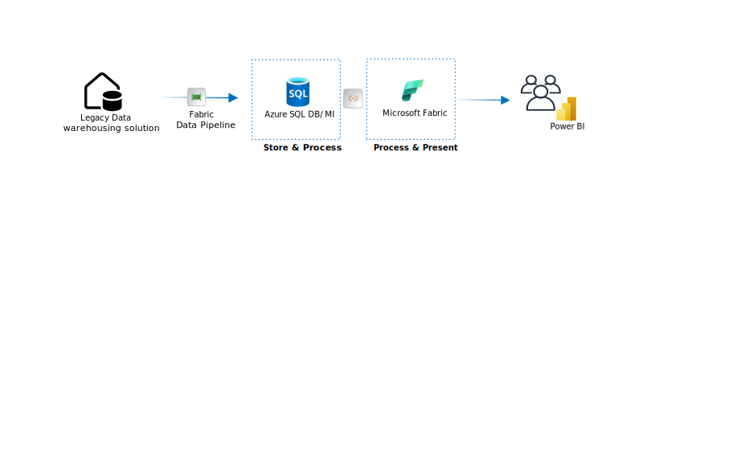
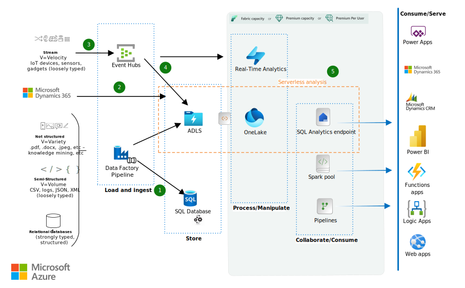

This example workload shows several ways that small businesses (SMBs) can modernize legacy data stores and explore big data tools and capabilities, without overextending current budgets and skillsets. These end-to-end data warehousing solutions integrate easily with tools like Azure Machine Learning, Azure AI Services, Power Platform, Microsoft Dynamics, and other Microsoft technologies, but offer an easy entry point to the fully managed SaaS data platfrom on Microsoft Fabric that can be expanded at a later stage. 

## Who may benefit from this architecture

Most small-medium business customers who would benefit from implementing this pattern are on-premises SQL Server users with a Data Warehousing solution under half a terabyte. They currently use a mix of tools like SSIS, SSAS, and SSRS, along with common SQL stored procedures, external ETL/ELT tools, SQL replication/snapshotting, and SQL Agent jobs for data ingestion into their data warehousing solution. Data synchronization operations are typically snapshot-based and performed once a day, with no real-time reporting requirements.

## Simplified Architecture

Conceptual modernization opportunity is to move legacy Data Warehousing solution into a combination of Azure SQL Database/Managed Instance and Microsoft Fabric. This approach ensures broad compatibility with traditional SQL Server and SQL client tools like SQL Server Management Studio (SSMS), provides appealing lift-and-shift options for existing processes, and requires minimal upskilling for the support team. This solution can serve as an initial step towards full-flegded modernization, enabling the organization to fully adopt a lakehouse approach as the data warehouse grows and the team's skillset expands. See the comparisons [Article Lakehouse, greenfield, scenario 5]

## Architecture

//todo
*Download a [Visio file](https://arch-center.azureedge.net/modern-data-warehouse-small-business.vsdx) of this architecture.*

Legacy SMB data warehouses might contain several types of data:
- Unstructured data, like documents and graphics
- Semi-structured data, such as logs, CSVs, JSON, and XML files
- Structured relational data, including databases that use stored procedures for extract-transform-load/extract-load-transform (ETL/ELT) activities

### Dataflow

The following dataflow demonstrates the ingestion of your chosen data type:

1. Microsoft Fabric Data pipelines or Data Factory Pipelines orchestrate the ingestion of transactional data into the Data Warehousing solution.

   - The pipelines orchestrate the flow of migrated or partially refactored legacy databases and SSIS packages into Azure SQL Database/Managed Instance. This lift-and-shift approach is fastest to implement, and offers a smooth transition from an on-premises SQL solution to an eventual Microsoft Fabric software-as-a-service (SaaS). You can modernize databases incrementally after the lift and shift.

   - The pipelines can also pass unstructured, semi-structured, and structured data into Azure Data Lake Storage for centralized storage and analysis with other sources. Use this approach when fusing data provides more business benefit than simply replatforming the data.

1. Microsoft Dynamics data sources can be used to build centralized BI dashboards on augmented datasets using Fabric Serverless analysis tools. You can bring the fused, processed data back into Dynamics and use it for further analysis within Microsoft Fabric.

3. Real-time data from streaming sources can also enter the system via Azure Event Hubs or other streaming solutions. For customers with real-time dashboard requirements, Fabric Real-Time Analytics can analyze this data immediately.

1. The data can also be ingested into the centralized Fabric OneLake for further analysis, storage, and reporting using ADLS (Azure Data Lake Storage) shortcuts. This enables in-place analysis and facilitates downstream consumption.

5. Serverless analysis tools (SQL Analytics endpoint and Fabric Spark capabilities) are available inside Microsoft Fabric on demand and do not require any provisioned resources.

   Serverless analysis tools are ideal for:
   - ETL/ELT on OneLake data.
   - Serving gold layer of medallion architecture to PBI reports via DirectLake capability.
   - Ad hoc data science explorations in T-SQL format or Python.
   - Early prototyping for data warehouse entities.

Microsoft Fabric is tightly integrated with potential consumers of your mutli-source datasets, such as Power BI frond-end reports, Azure Machine Learning, Power Apps, Azure Logic Apps, Azure Functions, and Azure App Service web apps.

### Components

- [Microsoft Fabric](/fabric/get-started/microsoft-fabric-overview) is an analytics service that combines capabilities of data engineering, data warehousing, data science, real-time and business intelligence. In this solution:

  - [Fabric data engineering capabilities](/fabric/data-engineering/data-engineering-overview) provide collaborative platform for data engineers, data scientists, data analysts, and business intelligence (BI) professionals to do their job. Powered by serverless compute engines, this is the key component that brings business value producing insights that are destributed to end consumers. 

- [Azure SQL Database](/azure/azure-sql/azure-sql-iaas-vs-paas-what-is-overview)/[Managed Instance](/azure/azure-sql/managed-instance/sql-managed-instance-paas) is a relational database service built for the cloud. In this solution, it holds the enterprise data warehouse and performs ETL/ELT activities that use stored procedures or externals packages. 

- [Azure Event Hubs](https://azure.microsoft.com/services/event-hubs) is a real-time data streaming platform and event ingestion service. Event Hubs can ingest data from anywhere, and seamlessly integrates with Azure data services.

### Alternatives

- [Azure IoT Hub](https://azure.microsoft.com/services/iot-hub) could replace or complement Event Hubs. The solution you choose depends on the source of your streaming data, and whether you need cloning and bidirectional communication with the reporting devices.

- You can use [Fabric Data Pipeline](/fabric/data-factory/activity-overview) for data integration instead of Data Factory pipelines. The choice depends on several factors. Full list of considerations can be found [here](/fabric/data-factory/compare-fabric-data-factory-and-azure-data-factory). 

- You can use [Fabric Warehouse](/fabric/data-warehouse/data-warehousing) for storing enterprise data, instead of using Azure SQL Database/Managed Instance. This article prioritizes time to market for customer who want to modernize, so ASQLDB/MI was offered. Please see data store options for Fabric described [here](/fabric/get-started/decision-guide-data-store) and check articles for [TODO: link to datalake greenhouse]

## Scenario details

Small and medium businesses (SMBs) face a choice when modernizing their on-premises data warehouses for the cloud. They can adopt big data tools for future extensibility, or keep traditional, SQL-based solutions for cost efficiency, ease of maintenance, and smooth transition.

However, a hybrid approach offers the best of both worlds, allowing easy migration of existing data estates while leveraging modern tools and AI capabilities. SQL-based data sources can continue to operate in the cloud and modernize as needed.

This example workload illustrates several strategies for SMBs to modernize legacy data stores and explore big data tools and capabilities without stretching current budgets and skill sets. These comprehensive Azure data warehousing solutions seamlessly integrate with Azure and Microsoft services, including Azure AI Services, Microsoft Dynamics, and Power Platform. 

### Potential use cases 

Several scenarios can benefit from this workload:

- Migrating a traditional on-premises relational data warehouse under 1 TB, extensively utilizing SQL Server Integration Services (SSIS) packages to orchestrate stored procedures.

- Meshing existing Dynamics or Power Platform [Dataverse](https://powerplatform.microsoft.com/dataverse) data with batched and real-time [Azure Data Lake](https://azure.microsoft.com/solutions/data-lake) sources.

- Using innovative techniques to interact with centralized Data Lake Storage Gen2 data. Techniques include serverless analysis, knowledge mining, data fusion between domains, and end-user data exploration, including Fabric Copilot.

- Setting up eCommerce companies to adopt a data warehouse to optimize their operations.

This solution isn't recommended for:

- [Greenfield](https://wikipedia.org/wiki/Greenfield_project) deployment of data warehouses.

- Migrating on-premises data warehouses that are larger than 1 TB or are projected to reach that size within a year.

## Considerations

These considerations implement the pillars of the Azure Well-Architected Framework, which is a set of guiding tenets designed to improve the quality of a workload. For more information, see [Microsoft Azure Well-Architected Framework](/azure/well-architected/).

The following considerations apply to this scenario.

### Availability

SQL Database and SQL Managed Instance are PaaS services that can meet your high availability (HA) and disaster recovery (DR) requirements. Be sure to pick the SKU that meets your requirements. For guidance, see [High availability for Azure SQL Database](/azure/azure-sql/database/high-availability-sla) and [High availability for Azure SQL Managed Instance](/azure/azure-sql/managed-instance/business-continuity-high-availability-disaster-recover-hadr-overview?view=azuresql)

### Operations

SQL Database and Managed Instance use [SQL Server Management Studio (SSMS)](/sql/ssms/sql-server-management-studio-ssms) to develop and maintain legacy artifacts like stored procedures.

### Cost optimization

Cost optimization is about looking at ways to reduce unnecessary expenses and improve operational efficiencies. For more information, see [Overview of the cost optimization pillar](/azure/architecture/framework/cost/overview).

See a [pricing sample for a SMB data warehousing scenario](https://azure.com/e/c0af42b09987434abec93f0131079984) in the Azure pricing calculator. Adjust the values to see how your requirements affect the costs.

- [SQL Database](https://azure.microsoft.com/pricing/details/azure-sql-database/single) bases costs on the selected Compute and Service tiers, and the number of vCores and Database Transaction Units (DTUs). The example shows a single database with provisioned Compute and eight vCores, based on the assumption that you need to run stored procedures in SQL Database.

- [Data Lake Storage Gen2](https://azure.microsoft.com/pricing/details/storage/data-lake/) pricing depends on the amount of data you store and how often you use the data. The sample pricing includes 1 TB of data stored, with further transactional assumptions. The 1 TB refers to the size of the data lake, not the original legacy database size.

- [Microsoft Fabric](https://azure.microsoft.com/pricing/details/microsoft-fabric/) pricing is based on Fabric F capacity price or Premium Per Person price. Serverless capabilities would consume CPU and memory from dedicated capacity that was purchased. 

- [Event Hubs](https://azure.microsoft.com/pricing/details/event-hubs/) bills based on tier, throughput units provisioned, and ingress traffic received. The example assumes one throughput unit in Standard tier over one million events for a month.

## Contributors

*This article is being updated and maintained by Microsoft. It was originally written by the following contributors.*

Principal author:

- Galina Polyakova | Senior Cloud Solution Architect

## Next steps

- For training content and labs, see the [Data Engineer Learning Paths](/training/roles/data-engineer).
- [Microsoft Fabric - Get Started MSLearn Path](/training/fabric/)
- [Microsoft Fabric - MSLearn modules](/training/browse/?products=fabric&resource_type=module)
- [Create a single database - Azure SQL Database](/azure/azure-sql/database/single-database-create-quickstart)
- [Create an instance - Azure SQL MI](/azure/azure-sql/managed-instance/instance-create-quickstart?view=azuresql&tabs=azure-portal)
- [Create a storage account for Azure Data Lake Storage Gen2](/azure/storage/blobs/create-data-lake-storage-account)
- [Azure Event Hubs Quickstart - Create an event hub using the Azure portal](/azure/event-hubs/event-hubs-create)

## Related resources

- Learn more about:
  - [Data lakes](../../data-guide/scenarios/data-lake.md)
  - [Data warehousing and analytics](data-warehouse.yml)  
  - [Enterprise business intelligence](/azure/architecture/example-scenario/analytics/enterprise-bi-synapse)
 <!--TODO: links to Fabric lakehouse greenfield
  - TODO: link to Fabric enterprise with DW* -->
