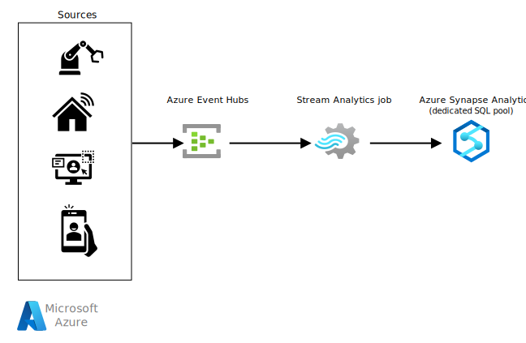

This solution uses Azure Stream Analytics to ingest data to an Azure Synapse dedicated SQL pool in high throughput scenarios.

## Architecture

*Download a [Visio file](https://arch-center.azureedge.net/stream-synapse.vsdx) of this architecture.*

The architecture shows the components of the stream data ingestion pipeline. Data flows through the architecture as follows:

1. The source systems generate data and send it to an [Azure Event Hubs](https://azure.microsoft.com/services/event-hubs) instance. Event Hubs is a big data streaming platform and event ingestion service that can receive millions of events per second.

1. Next, a Stream Analytics job processes the data stream from the Event Hubs instance. Stream Analytics has first-class integration with Event Hubs to consume data streams.

1. The Stream Analytics job has an output configured to sink the data to a Synapse Analytics dedicated SQL pool. Apart from doing a simple passthrough of the data stream to target, the Stream Analytics job can perform standard stream processing tasks, such as JOINs, temporal aggregations, filtering, anomaly detection, and so on.

1. The Stream Analytics job writes the data in a Synapse Analytics dedicated SQL pool table.

### Components

- [Azure Synapse Analytics](https://azure.microsoft.com/services/synapse-analytics) is an analytics service that combines data integration, enterprise data warehousing, and big data analytics. In this solution:

  - The [Dedicated SQL Pool](/azure/synapse-analytics/sql-data-warehouse/sql-data-warehouse-overview-what-is) refers to the enterprise data warehousing features that are available in Azure Synapse Analytics. A dedicated SQL pool represents a collection of analytic resources that are provisioned when you use Synapse Analytics.

- [Azure Event Hubs](https://azure.microsoft.com/services/event-hubs) is a real-time data streaming platform and event ingestion service. Event Hubs can ingest data from anywhere, and it seamlessly integrates with Azure data services.

- [Azure Stream Analytics](https://azure.microsoft.com/services/stream-analytics) is a real-time, serverless analytics service for streaming data. Stream Analytics offers rapid, elastic scalability, enterprise-grade reliability and recovery, and built-in machine learning capabilities.

### Alternatives

- [Azure IoT Hub](https://azure.microsoft.com/services/iot-hub) could replace or complement Event Hubs. The solution you choose depends on the source of your streaming data, and whether you need cloning and bidirectional communication with the reporting devices.

- [Azure Synapse serverless Apache Spark pools](/azure/synapse-analytics/get-started-analyze-spark) can replace Azure Stream Analytics by using Spark Structured Streaming. But the solution will be more complex to develop and maintain.

## Scenario details

Traditional data warehouses work well when dealing with batch jobs to load data. But in today's world, we see many use cases where the customers can't wait for a batch job to complete for our data scientists, analysts, or dashboards to access the data. Today, more customers require real-time representations of their business in their data warehouse. This requirement goes beyond traditional batch jobs and requires support from stream ingestion for their data warehouses.

Azure Synapse Analytics seamlessly supports both enterprise data warehousing and big data analytics workloads. Azure Stream Analytics is a serverless stream processing PaaS service that can scale with customer's needs. This example architecture will show how you can use an Azure Stream Analytics job to ingest stream to an Azure Synapse Analytics dedicated SQL pool.

### Potential use cases

Several scenarios can benefit from this architecture:

- Ingest data from a stream to a data warehouse in near real-time.

- Apply different stream processing techniques (JOINs, temporal aggregations, filtering, anomaly detection, and so on) to transform the data. Then, store the result in the data warehouse.

## Considerations

These considerations implement the pillars of the Azure Well-Architected Framework, which is a set of guiding tenets that can be used to improve the quality of a workload. For more information, see [Microsoft Azure Well-Architected Framework](/azure/architecture/framework).

### Performance efficiency

Performance efficiency is the ability of your workload to scale to meet the demands placed on it by users in an efficient manner. For more information, see [Performance efficiency pillar overview](/azure/architecture/framework/scalability/overview).

To achieve high throughput, there are a few key points that need to be considered while implementing the solution:

- Apply partitioning in the Event Hubs instance to maximize raw I/O throughput and to parallelize the consumers' processing. Partitions don't cost money. The cost of Event Hubs depends on the throughput unit (TU). To avoid starving consumers, use at least as many partitions as consumers. Use more keys than partitions to avoid unbalanced partition loads. For detailed best practices on partitioning, see [Partitioning in Event Hubs and Kafka](/azure/architecture/reference-architectures/event-hubs/partitioning-in-event-hubs-and-kafka).

- An Azure Stream Analytics job can connect to Azure Synapse using both the [Azure Synapse Analytics](/azure/stream-analytics/azure-synapse-analytics-output) connector and the [SQL Database](/azure/stream-analytics/sql-database-output) connector. Use the Azure Synapse Analytics connector, because it can achieve a throughput of 200 MB/s. The maximum throughput for the SQL Database connector is 15 MB/s.

- Use hash or round robin distribution for the Synapse dedicated SQL pool table. Don't use a replicated table.

- Stream Analytics will parallelize the job, based on the number of partitions, and it creates separate connections to Synapse Analytics for each parallel process. The total number of connections is equal to the number of partitions multiplied by the number of jobs (connections = partitions x jobs). Synapse Analytics can have a maximum of 1024 connections. Partition wisely, to avoid more than 1024 connections. Otherwise, Synapse Analytics will start throttling the connections.

### Cost optimization

Cost optimization is about looking at ways to reduce unnecessary expenses and improve operational efficiencies. For more information, see [Overview of the cost optimization pillar](/azure/architecture/framework/cost/overview).

- The [Azure Event Hubs](https://azure.microsoft.com/pricing/details/event-hubs) bill is based on tier, throughput units provisioned, and ingress traffic received.

- [Azure Stream Analytics](https://azure.microsoft.com/pricing/details/stream-analytics) bases costs on the number of provisioned streaming units.

- [Azure Synapse Analytics](https://azure.microsoft.com/pricing/details/synapse-analytics) Dedicated SQL pool compute is separate from storage, which enables you to scale compute independently of the data in your system. You can purchase reserved capacity for your Dedicated SQL pool resource, to save up to 65 percent, compared to pay-as-you-go rates.

## Contributors

*This article is being updated and maintained by Microsoft. It was originally written by the following contributors.*

Principal author:

* [Raihan Alam](https://au.linkedin.com/in/raihanalam) | Senior Software Engineer

*To see non-public LinkedIn profiles, sign in to LinkedIn.*

## Next steps

- [Tutorial: Get started with Azure Synapse Analytics](/azure/synapse-analytics/get-started)
- [Azure Event Hubs Quickstart - Create an event hub using the Azure portal](/azure/event-hubs/event-hubs-create)
- [Quickstart - Create a Stream Analytics job by using the Azure portal](/azure/stream-analytics/stream-analytics-quick-create-portal)

## Related resources

- [Analytics architecture design](/azure/architecture/solution-ideas/articles/analytics-start-here)
- [Choose an analytical data store in Azure](/azure/architecture/data-guide/technology-choices/analytical-data-stores)
- [Analytics end-to-end with Azure Synapse](/azure/architecture/example-scenario/dataplate2e/data-platform-end-to-end)
- [Big data analytics with enterprise-grade security using Azure Synapse](/azure/architecture/solution-ideas/articles/big-data-analytics-enterprise-grade-security)
- [Stream processing with Azure Stream Analytics](/azure/architecture/reference-architectures/data/stream-processing-stream-analytics)
