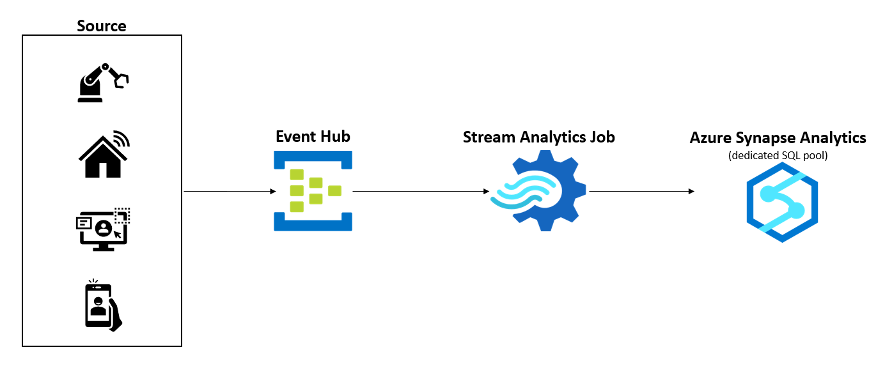

Traditional data warehouses work very well when we are dealing with batch jobs to load data. But in today's world, we see many use cases where the customers can't wait for a batch job to complete for our data scientists, analysts or dashboards to access the data. More and more customers require real-time representations of their business in their data warehouse. This requirement goes beyond traditional batch jobs and needs the support for stream ingestion to their data warehouses.

Azure Synapse Analytics seamlessly supports both enterprise data warehousing and Big Data analytics workloads. Azure Stream Analytics is a serverless stream processing PaaS service that can scale with customer's needs. This example architecture will show how we can use an Azure Stream Analytics job to ingest stream to Azure Synapse Analytics dedicated SQL pool.

## Potential use cases

Several scenarios can benefit from this architecture:

- Ingest data from a stream to a data warehouse in near real-time

- Apply different stream processing techniques (JOINs, temporal aggregations, filtering, anomaly detection etc.) to transform data and store the result in the data warehouse.

## Architecture

The architecture shows the components of the stream data ingestion pipeline. Data flows through the architecture as follows:

1. The source systems generate data and send it to [Azure Event Hubs](https://azure.microsoft.com/services/event-hubs) instance. Event Hubs is a big data streaming platform and event ingestion service that can receive millions of events per second.

2. Next step is a Stream Analytics job which will process the data stream from the Event Hubs instance. Stream Analytics has first-class integration with Event Hubs to consume data streams.

3. The Stream Analytics job has an output configured to sink the data to Synapse Analytics dedicated SQL pool. Apart from doing a simple passthrough of the data stream to target, the Stream Analytics job can perform standard stream processing tasks, such as - JOINs, temporal aggregations, filtering, anomaly detection etc.

4. The Stream Analytics job writes the data in Synapse Analytics dedicated SQL pool table.

### Components

- [Azure Synapse Analytics](https://azure.microsoft.com/services/synapse-analytics) is an analytics service that combines data integration, enterprise data warehousing, and big data analytics. In this solution:

  - The [Dedicated SQL Pool](https://docs.microsoft.com/en-us/azure/synapse-analytics/sql-data-warehouse/sql-data-warehouse-overview-what-is) refers to the enterprise data warehousing features that are available in Azure Synapse Analytics. Dedicated SQL pool represents a collection of analytic resources that are provisioned when using Synapse Analytics.

- [Azure Event Hubs](https://azure.microsoft.com/services/event-hubs) is a real-time data streaming platform and event ingestion service. Event Hubs can ingest data from anywhere, and seamlessly integrates with Azure data services.

- [Azure Stream Analytics](https://azure.microsoft.com/services/stream-analytics) is a real-time, serverless analytics service for streaming data. Stream Analytics offers rapid, elastic scalability, enterprise-grade reliability and recovery, and built-in machine learning capabilities.

### Alternatives

- [Azure IoT Hub](https://azure.microsoft.com/services/iot-hub) could replace or complement Event Hubs. The solution you choose depends on the source of your streaming data, and whether you need cloning and bidirectional communication with the reporting devices.

- [Azure Synapse serverless Apache Spark pools](/azure/synapse-analytics/get-started-analyze-spark) can replace Azure Stream Analytics by using Spark Structured Streaming. But the solution will be more complex to develop and maintain.

## Considerations

### Performance

To achieve high throughput, there are few key points that needs to be considered while implementing the solution.  

- Apply partitioning in the Event Hubs instance to maximize raw I/O throughput and to parallelize the consumers' processing. Partition doesn't cost money, Event Hubs cost depends on Throughput Unit (TU). To avoid starving consumers, use at least as many partitions as consumers. Use more keys than partitions to avoid unbalanced partition loads. For the detail best practices on partitioning, see [Partitioning in Event Hubs and Kafka](https://docs.microsoft.com/en-us/azure/architecture/reference-architectures/event-hubs/partitioning-in-event-hubs-and-kafka).

- Azure Stream Analytics job can connect to Azure Synapse using both [Azure Synapse Analytics](https://docs.microsoft.com/en-us/azure/stream-analytics/azure-synapse-analytics-output) connector and [SQL Database](https://docs.microsoft.com/en-us/azure/stream-analytics/sql-database-output) connector. Use Azure Synapse Analytics connector as it can achieve throughput of 200 MB/s. The maximum throughput for the SQL Database connector is 15 MB/s.

- Use hash or round robin distribution for the Synapse dedicated SQL pool table. Don't use replicated table.

- Stream Analytics will parallelize the job based on the number of partitions and create separate connections to Synapse Analytics for each parallel process. Total number of connections = Number of partitions * Number of jobs. Synapse Analytics can have a maximum of 1024 connections. Partition wisely to avoid more than 1024 connections, otherwise, Synapse Analytics will start throttling the connections.

## Pricing

- [Azure Event Hubs](https://azure.microsoft.com/pricing/details/event-hubs/) bill is based on tier, throughput units provisioned, and ingress traffic received.

- [Azure Stream Analytics](https://azure.microsoft.com/pricing/details/stream-analytics/) bases costs on the number of provisioned streaming units.

- [Azure Synapse Analytics](https://azure.microsoft.com/en-us/pricing/details/synapse-analytics/) Dedicated SQL pool compute is separate from storage, which enables you to scale compute independently of the data in your system. You can purchase reserved capacity for your Dedicated SQL pool resource to save up to 65 percent compared to pay-as-you-go rates.

## Next steps

- [Tutorial: Get started with Azure Synapse Analytics](/azure/synapse-analytics/get-started)
- [Azure Event Hubs Quickstart - Create an event hub using the Azure portal](/azure/event-hubs/event-hubs-create)
- [Quickstart - Create a Stream Analytics job by using the Azure portal](/azure/stream-analytics/stream-analytics-quick-create-portal)