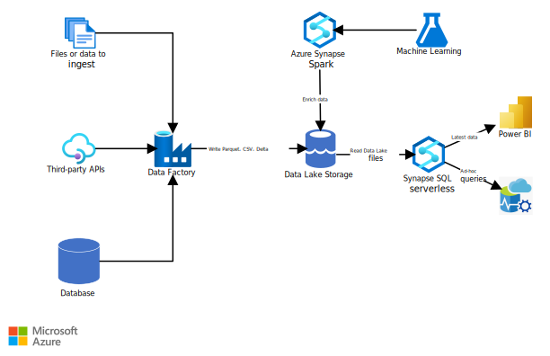
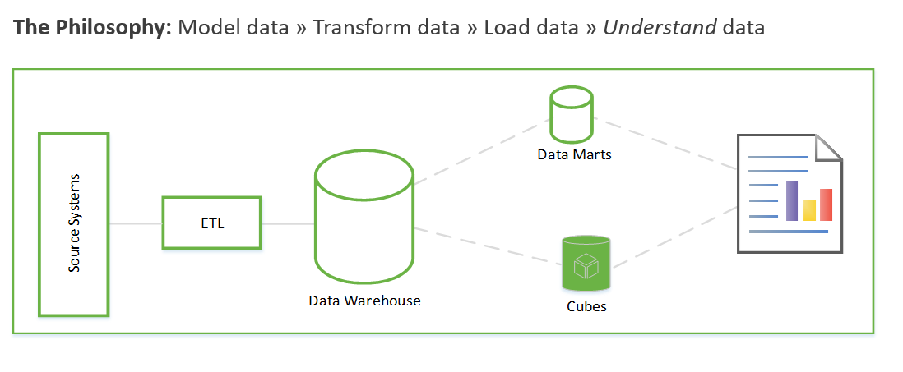
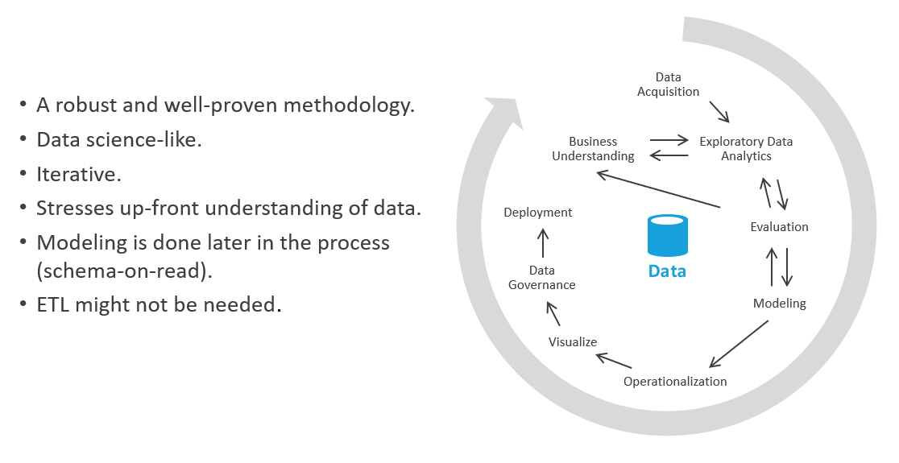

This article describes an alternative approach to data warehouse projects that's called *exploratory data analysis (EDA)*. This approach can reduce the challenges of extract, transform, load (ETL) operations. It focuses first on generating business insights and then turns to solving the modeling and ETL tasks.

## Architecture

*Download a [Visio file](https://arch-center.azureedge.net/exploratory-data-analytics.vsdx) of this architecture.*

For EDA, you're concerned only with the right side of the diagram. Azure Synapse SQL serverless is used as the compute engine over the data lake files. 

To accomplish EDA:

- T-SQL queries run directly in Azure Synapse SQL serverless or Azure Synapse Spark.
- Queries run from a graphical query tool like Power BI or Azure Data Studio.  

We recommend that you persist all lakehouse data by using Parquet or Delta.  

You can implement the left side of the diagram (data ingestion) by using any extract, load, transform (ELT) tool. It has no effect on EDA.  

### Components

- [Azure Synapse Analytics](https://azure.microsoft.com/services/synapse-analytics) combines data integration, enterprise data warehousing, and big data analytics over lakehouse data. In this solution:

  - An [Azure Synapse workspace](/azure/synapse-analytics/quickstart-create-workspace) promotes collaboration among data engineers, data scientists, data analysts, and business intelligence (BI) professionals for EDA tasks.
  - [Azure Synapse serverless SQL pools](/azure/synapse-analytics/get-started-analyze-sql-on-demand) analyze unstructured and semi-structured data in Azure Data Lake Storage by using standard T-SQL.  
  - [Azure Synapse serverless Apache Spark pools](/azure/synapse-analytics/get-started-analyze-spark) do code-first explorations in Data Lake Storage by using Spark languages like Spark SQL, PySpark, and Scala.
- [Azure Data Lake Storage](https://azure.microsoft.com/services/storage/data-lake-storage) provides storage for data that is then analyzed by Azure Synapse serverless SQL pools.
- [Azure Machine Learning](https://azure.microsoft.com/services/machine-learning) provides data to Azure Synapse Spark.  
- [Power BI](https://azure.microsoft.com/services/power-bi-embedded) is used in this solution to query data to accomplish EDA. 

### Alternatives

- You can replace or complement Synapse SQL serverless pools with [Azure Databricks](https://azure.microsoft.com/services/databricks).

- Instead of using a lakehouse model with Synapse SQL serverless pools, you can use [Azure Synapse dedicated SQL pools](/azure/synapse-analytics/sql-data-warehouse/sql-data-warehouse-overview-what-is) to store enterprise data. Review the use cases and considerations in this article and related resources to decide which technology to use.

## Scenario details

This solution shows an implementation of the EDA approach to data warehouse projects. This approach can reduce the challenges of ETL operations. It focuses first on generating business insights and then turns to solving modeling and ETL tasks.

### Potential use cases

Other scenarios that can benefit from this analytics pattern:

- **Prescriptive analytics**. Ask questions of your data, like _Next Best Action_, or _what do we do next?_ Use data to be more _data-driven_ and less _gut-driven_. The data might be unstructured and from many external sources of varying quality. You might want to use the data as fast as possible to evaluate your business strategy without actually loading the data into a data warehouse. You might dispose of the data after you answer your questions.  

- **Self-service ETL**. Do ETL/ELT when you do your data sandboxing (EDA) activities. Transform data and make it valuable. Doing so can improve the scale of your ETL developers.  

### About exploratory data analysis

Before we look more closely at how EDA works, it's worth summarizing the traditional approach to data warehouse projects. The traditional approach looks like this:

- **Requirements gathering**. Document what to do with the data.  

- **Data modeling**. Determine how to model the numeric and attribute data into fact and dimension tables. Traditionally, you do this step before you acquire the new data.

- **ETL**. Acquire the data and massage it into the data warehouse's data model.  

These steps can take weeks or even months. Only then can you begin to query the data and solve the business problem. The user sees value only after the reports are created. The solution architecture usually looks something like this one:  

You can do this in another way that focuses first on generating business insights and then turns to solving the modeling and ETL tasks. The process is similar to data science processes. It looks something like this:

In the industry, this process is called *EDA*, or _exploratory data analysis_.  

Here are the steps:

- **Data acquisition**. First, you need to determine what data sources you need to ingest into your data lake / sandbox. You then need to bring that data into the landing area of your lake. Azure provides tools like Azure Data Factory and Azure Logic Apps that can ingest data quickly.  

- **Data sandboxing**. Initially, a business analyst and an engineer who's skilled in exploratory data analysis via Azure Synapse Analytics serverless or basic SQL work together. During this phase, they're trying to uncover the _business insight_ by using the new data. EDA is an iterative process. You might need to ingest more data, talk with SMEs, ask more questions, or generate visualizations.  

- **Evaluation**. After you find the business insight, you need to evaluate what to do with the data. You might want to persist the data into the data warehouse (so you move to the modeling phase). In other cases, you might decide to keep the data in the data lake / lakehouse and use it for predictive analytics (machine learning algorithms). In still other cases, you might decide to backfill your systems of record with the new insights. Based on these decisions, you can gain a better understanding of what you need to do next. You might not need to do ETL.

These methods are the core of true _self-service analytics_. By using the data lake and a query tool like Azure Synapse serverless that understands data lake query patterns, you can put your data assets into the hands of business people who understand a modicum of SQL. You can radically shorten the time-to-value by using this method and remove some of the risk associated with corporate data initiatives.

## Considerations

These considerations implement the pillars of the Azure Well-Architected Framework, which is a set of guiding tenets that can be used to improve the quality of a workload. For more information, see [Microsoft Azure Well-Architected Framework](/azure/architecture/framework).

### Availability

Azure Synapse SQL serverless pools is a platform as a service (PaaS) feature that can meet your high availability (HA) and disaster recovery (DR) requirements.

Serverless pools are available on-demand. They don't require scaling up, down, in, or out or administration of any kind. They use a pay-per-query model, so there's no unused capacity at any time. Serverless pools are ideal for:

- Ad-hoc data-science explorations in T-SQL.
- Early prototyping for data warehouse entities.
- Defining views that consumers can use, for example in Power BI, for scenarios that can tolerate performance lag.
- Exploratory data analysis.

### Operations

Synapse SQL serverless uses standard T-SQL for querying and operations. You could use Synapse workspace UI, Azure Data Studio, or SQL Server Management Studio as the T-SQL tool.  

### Cost optimization

Cost optimization is about looking at ways to reduce unnecessary expenses and improve operational efficiencies. For more information, see [Overview of the cost optimization pillar](/azure/architecture/framework/cost/overview).

- [Data Lake Storage](https://azure.microsoft.com/pricing/details/storage/data-lake) pricing depends on the amount of data you store and how often you use the data. The sample pricing includes one TB of data stored, with further transactional assumptions. The one TB refers to the size of the data lake, not the size of the original legacy database.

- [Azure Synapse Spark pool](https://azure.microsoft.com/pricing/details/synapse-analytics/#overview) bases pricing on node size, number of instances, and uptime. The example assumes one small compute node with utilization between five hours per week and 40 hours per month.

- [Azure Synapse serverless SQL pool](https://azure.microsoft.com/pricing/details/synapse-analytics/#overview) bases pricing on TBs of data processed. The sample assumes 50 TBs processed per month. This figure refers to the size of the data lake, not the size of the original legacy database.

## Contributors

*This article is being updated and maintained by Microsoft. It was originally written by the following contributors.*

Principal authors:

- [Dave Wentzel](https://www.linkedin.com/in/dwentzel) | Principal MTC Technical Architect

## Next steps

- [Data Engineer learning paths](/training/roles/data-engineer)
- [Tutorial: Get started with Azure Synapse Analytics](/azure/synapse-analytics/get-started)
- [Create a single database - Azure SQL Database](/azure/azure-sql/database/single-database-create-quickstart)
- [Azure Synapse SQL architecture](/azure/synapse-analytics/sql/overview-architecture)
- [Create a storage account for Azure Data Lake Storage](/azure/storage/blobs/create-data-lake-storage-account)
- [Azure Event Hubs Quickstart - Create an event hub by using the Azure portal](/azure/event-hubs/event-hubs-create)
- [Quickstart - Create a Stream Analytics job by using the Azure portal](/azure/stream-analytics/stream-analytics-quick-create-portal)
- [Quickstart: Get started with Azure Machine Learning](/azure/machine-learning/quickstart-create-resources)

## Related resources

- For comprehensive architectural guidance on data pipelines, data warehousing, online analytical processing (OLAP), and big data, see the [Azure Data Architecture Guide](../../data-guide/index.md).
- Learn more about:
  - [Data lakes](../../data-guide/scenarios/data-lake.md)
  - [Data warehousing and analytics](data-warehouse.yml)
  - [Analytics end-to-end with Azure Synapse](../dataplate2e/data-platform-end-to-end.yml)
  - [Big data analytics with enterprise-grade security by using Azure Synapse](../../solution-ideas/articles/big-data-analytics-enterprise-grade-security.yml)
  - [Enterprise business intelligence](/azure/architecture/example-scenario/analytics/enterprise-bi-synapse)
