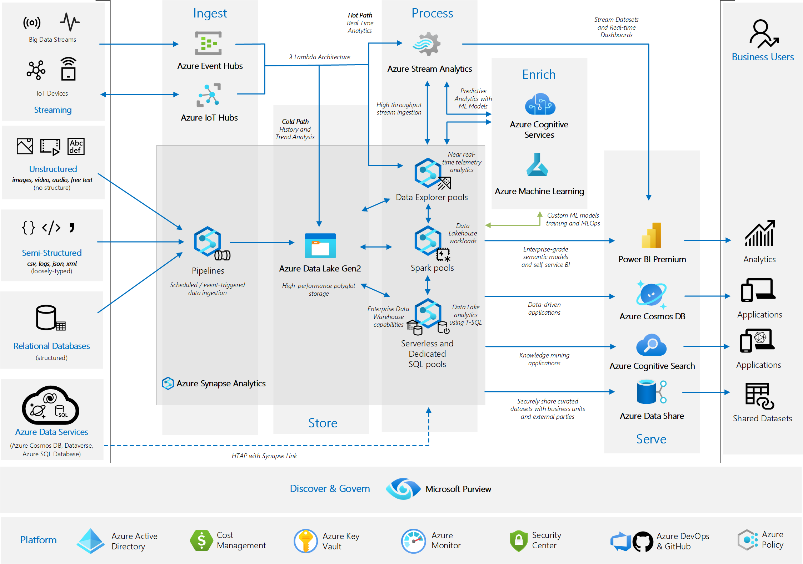

<!-- cSpell:ignore fabraga -->

This example scenario demonstrates how to use the extensive family of Azure Data Services to build a modern data platform capable of handling the most common data challenges in an organization.

The solution described in this article combines a range of Azure services that will ingest, store, process, enrich, and serve data and insights from different sources (structured, semi-structured, unstructured, and streaming).

## Relevant use cases

This approach can also be used to:

- Establish an enterprise-wide data hub, consisting of a data warehouse for structured data and a data lake for semi-structured and unstructured data. This data hub becomes the single source of truth for your reporting data.
- Integrate relational data sources with other unstructured datasets, with the use of big data processing technologies.
- Use semantic modeling and powerful visualization tools for simpler data analysis.
- Share datasets within the organization or with trusted external partners.

## Architecture

> [!NOTE]
>
>- The services covered by this architecture are only a subset of a much larger family of Azure services. Similar outcomes can be achieved by using other services or features that are not covered by this design.
>- Specific business requirements for your analytics use case may also ask for the use of different services or features that are not considered in this design.

## Analytics Use Cases

The analytics use cases covered by the architecture are illustrated by the different data sources on the left-hand side of the diagram. Data flows through the solution from the bottom up as follows:

### Azure Data Services, cloud native HTAP with Cosmos DB

1. [Azure Synapse Link for Azure Cosmos DB](/azure/cosmos-db/synapse-link) enables you to run near real-time analytics over operational data in Azure Cosmos DB, by using the two analytics engines available from your Azure Synapse workspace: [SQL Serverless](/azure/synapse-analytics/sql/on-demand-workspace-overview) and [Spark Pools](/azure/synapse-analytics/spark/apache-spark-overview).

1. Using either a [SQL Serverless query](/azure/synapse-analytics/sql/query-cosmos-db-analytical-store?tabs=openrowset-key) or a [Spark Pool notebook](/azure/synapse-analytics/synapse-link/how-to-query-analytical-store-spark), you can access the [Cosmos DB analytical store](/azure/cosmos-db/analytical-store-introduction) and then combine datasets from your near real-time operational data with data from your data lake or from your data warehouse.

1. The resulting datasets from your [SQL Serverless queries](/azure/synapse-analytics/sql/create-external-table-as-select) can be persisted in your data lake.  If you are using [Spark notebooks](/azure/synapse-analytics/spark/synapse-spark-sql-pool-import-export), the resulting datasets can be persisted in your data lake or data warehouse (SQL pool).

1. Load relevant data from the Azure Synapse SQL pool or data lake into [Power BI datasets](https://techcommunity.microsoft.com/t5/azure-synapse-analytics/integrate-power-bi-with-azure-synapse-analytics/ba-p/2003057) for data visualization. [Power BI models](/learn/modules/design-model-power-bi/) implement a semantic model to simplify the analysis of business data and relationships.

1. Business analysts use [Power BI](/power-bi/admin/service-premium-what-is) reports and dashboards to analyze data and derive business insights.

1. Data can also be securely shared to other business units or external trusted partners using [Azure Data Share](/azure/data-share/share-your-data).

### Relational databases

1. Use [Azure Synapse pipelines](/azure/data-factory/concepts-pipelines-activities) to pull data from a wide variety of databases, both on-premises and in the cloud. Pipelines can be triggered based on a pre-defined schedule, in response to an event, or can be explicitly called via REST APIs.

1. From the Azure Synapse pipeline, use a [Copy Data activity](/azure/data-factory/copy-activity-overview) to stage the data copied from the relational databases into the [Raw zone](https://techcommunity.microsoft.com/t5/data-architecture-blog/how-to-organize-your-data-lake/ba-p/1182562) of your [Azure Data Lake Store Gen 2](/azure/storage/blobs/data-lake-storage-introduction) data lake. You can save the data in delimited text format or compressed as Parquet files.

1. Use either [Data Flows](/azure/data-factory/concepts-data-flow-overview), [SQL Serverless queries](/learn/modules/use-azure-synapse-serverless-sql-pools-for-transforming-data-lake/), or [Spark notebooks](/learn/modules/transform-data-with-dataframes-apache-spark-pools-azure-synapse-analytics/) to validate, transform, and move the datasets into your Curated zone in your data lake.

    1. As part of your data transformations, you can invoke machine learning models from your [SQL pools using standard T-SQL](/azure/synapse-analytics/sql-data-warehouse/sql-data-warehouse-predict) or Spark notebooks. These ML models can be used to enrich your datasets and generate further business insights. These machine learning models can be consumed from [Azure Cognitive Services](/azure/synapse-analytics/machine-learning/tutorial-cognitive-services-sentiment) or [custom ML models from Azure ML](/azure/synapse-analytics/machine-learning/tutorial-sql-pool-model-scoring-wizard).

1. You can serve your final dataset directly from the data lake Curated zone or you can use Copy Data activity to ingest the final dataset into your SQL pool tables using the [COPY command](/sql/t-sql/statements/copy-into-transact-sql) for fast ingestion.

1. Load relevant data from the Azure Synapse SQL pool or data lake into [Power BI datasets](https://techcommunity.microsoft.com/t5/azure-synapse-analytics/integrate-power-bi-with-azure-synapse-analytics/ba-p/2003057) for data visualization. [Power BI models](/learn/modules/design-model-power-bi/) implement a semantic model to simplify the analysis of business data and relationships.

1. Business analysts use [Power BI](/power-bi/admin/service-premium-what-is) reports and dashboards to analyze data and derive business insights.

1. Data can also be securely shared to other business units or external trusted partners using [Azure Data Share](/azure/data-share/share-your-data).

### Semi-structured data sources

1. Use [Azure Synapse pipelines](/azure/data-factory/concepts-pipelines-activities) to pull data from a wide variety of semi-structured data sources, both on-premises and in the cloud. For example:

    - Ingest data from file-based sources containing CSV or JSON files. 
    - Connect to No-SQL databases such as Cosmos DB or Mongo DB. 
    - Call REST APIs provided by SaaS applications that will function as your data source for the pipeline.

1. From the Azure Synapse pipeline, use a [Copy Data activity](/azure/data-factory/copy-activity-overview) to stage the data copied from the semi-structured data sources into the [Raw zone](https://techcommunity.microsoft.com/t5/data-architecture-blog/how-to-organize-your-data-lake/ba-p/1182562) of your [Azure Data Lake Store Gen 2](/azure/storage/blobs/data-lake-storage-introduction) data lake. You should save data preserving the original format as acquired from the data sources.

1. Use either [Data Flows](/azure/data-factory/concepts-data-flow-overview), [SQL Serverless queries](/learn/modules/use-azure-synapse-serverless-sql-pools-for-transforming-data-lake/) or [Spark notebooks](/learn/modules/transform-data-with-dataframes-apache-spark-pools-azure-synapse-analytics/) to validate, transform and move the your datasets into your Curated zone in your data lake. SQL Serverless queries expose underlying [CSV](/azure/synapse-analytics/sql/query-single-csv-file), [Parquet](/azure/synapse-analytics/sql/query-parquet-files) or [JSON](/azure/synapse-analytics/sql/query-json-files) files as external tables so they can be queried using T-SQL.

    1. As part of your data transformations, you can invoke machine learning models from your [SQL pools using standard T-SQL](/azure/synapse-analytics/sql-data-warehouse/sql-data-warehouse-predict) or Spark notebooks. These ML models can be used to enrich your datasets and generate further business insights. These machine learning models can be consumed from [Azure Cognitive Services](/azure/synapse-analytics/machine-learning/tutorial-cognitive-services-sentiment) or [custom ML models from Azure ML](/azure/synapse-analytics/machine-learning/tutorial-sql-pool-model-scoring-wizard).

1. You can serve your final dataset directly from the data lake Curated zone or you can use Copy Data activity to ingest the final dataset into your SQL pool tables using the [COPY command](/sql/t-sql/statements/copy-into-transact-sql) for fast ingestion.

1. Load relevant data from the Azure Synapse SQL pool or data lake into [Power BI datasets](https://techcommunity.microsoft.com/t5/azure-synapse-analytics/integrate-power-bi-with-azure-synapse-analytics/ba-p/2003057) for data visualization. [Power BI models](/learn/modules/design-model-power-bi/) implement a semantic model to simplify the analysis of business data and relationships.

1. Business analysts use [Power BI](/power-bi/admin/service-premium-what-is) reports and dashboards to analyze data and derive business insights.

1. Data can also be securely shared to other business units or external trusted partners using [Azure Data Share](/azure/data-share/share-your-data).

### Non-structured data sources

1. Use [Azure Synapse pipelines](/azure/data-factory/concepts-pipelines-activities) to pull data from a wide variety of non-structured  data sources, both on-premises and in the cloud. For example:

    - Ingest video, image, audio, or free text from file-based sources containing the source files. 
    - Call REST APIs provided by SaaS applications that will function as your data source for the pipeline.

1. From the Azure Synapse pipeline, use a [Copy Data activity](/azure/data-factory/copy-activity-overview) to stage the data copied from the non-structured data sources into the [Raw zone](https://techcommunity.microsoft.com/t5/data-architecture-blog/how-to-organize-your-data-lake/ba-p/1182562) of your [Azure Data Lake Store Gen 2](/azure/storage/blobs/data-lake-storage-introduction) data lake. You should save data preserving the original format as acquired from the data sources.

1. Use [Spark notebooks](/learn/modules/transform-data-with-dataframes-apache-spark-pools-azure-synapse-analytics/) to validate, transform, enrich and move the your datasets into your Curated zone in your data lake.

    1. As part of your data transformations, you can invoke machine learning models from your [SQL pools using standard T-SQL](/azure/synapse-analytics/sql-data-warehouse/sql-data-warehouse-predict) or Spark notebooks. These ML models can be used to enrich your datasets and generate further business insights. These machine learning models can be consumed from [Azure Cognitive Services](/azure/synapse-analytics/machine-learning/tutorial-cognitive-services-sentiment) or [custom ML models from Azure ML](/azure/synapse-analytics/machine-learning/tutorial-sql-pool-model-scoring-wizard).

1. You can serve your final dataset directly from the data lake Curated zone or you can use Copy Data activity to ingest the final dataset into your data warehouse tables using the [COPY command](/sql/t-sql/statements/copy-into-transact-sql) for fast ingestion.

1. Load relevant data from the Azure Synapse SQL pool or data lake into [Power BI datasets](https://techcommunity.microsoft.com/t5/azure-synapse-analytics/integrate-power-bi-with-azure-synapse-analytics/ba-p/2003057) for data visualization. [Power BI models](/learn/modules/design-model-power-bi/) implement a semantic model to simplify the analysis of business data and relationships.

1. Business analysts use [Power BI](/power-bi/admin/service-premium-what-is) reports and dashboards to analyze data and derive business insights.

1. Data can also be securely shared to other business units or external trusted partners using [Azure Data Share](/azure/data-share/share-your-data).

### Streaming

1. Use [Azure Event Hubs or Azure IoT Hubs](/azure/iot-hub/iot-hub-compare-event-hubs) to ingest data streams generated by client applications or IoT devices. Event Hub or IoT Hub will then ingest and store streaming data preserving the sequence of events received. Consumers can then connect to Event Hub or IoT Hub endpoints and retrieve messages for processing.

1. Configure [Event Hub Capture](/azure/event-hubs/event-hubs-capture-overview) or [IoT Hub Storage Endpoints](/azure/iot-hub/iot-hub-devguide-messages-d2c#azure-blob-storage) to save a copy of the events into the [Raw zone](https://techcommunity.microsoft.com/t5/data-architecture-blog/how-to-organize-your-data-lake/ba-p/1182562) of your [Azure Data Lake Store Gen 2](/azure/storage/blobs/data-lake-storage-introduction) data lake. This feature implements the "Cold Path" of the [Lambda architecture pattern](../../data-guide/big-data/index.md#lambda-architecture) and allows you to perform historical and trend analysis on the stream data saved in your data lake using [SQL Serverless queries](/azure/synapse-analytics/sql/on-demand-workspace-overview) or [Spark notebooks](/azure/synapse-analytics/spark/apache-spark-development-using-notebooks?tabs=classical) following the pattern for semi-structured data sources described above.

1. Use a [Stream Analytics job](/azure/stream-analytics/stream-analytics-introduction) to implement the "Hot Path" of the [Lambda architecture pattern](../../data-guide/big-data/index.md#lambda-architecture) and derive insights from the stream data in transit. Define at least one input for the data stream coming from your Event Hub or IoT Hub, one query to process the input data stream and one Power BI output to where the query results will be sent to.

    1. As part of your data processing with Stream Analytics, you can invoke machine learning models to enrich your stream datasets and drive business decisions based on the predictions generated. These machine learning models can be consumed from Azure Cognitive Services or from [custom ML models in Azure Machine learning](/azure/stream-analytics/machine-learning-udf).

1. Business analysts then use [Power BI real-time datasets and dashboard](/power-bi/connect-data/service-real-time-streaming) capabilities for to visualize the fast changing insights generated by your Stream Analytics query.

## Discover and Govern

Data governance is a common challenge in large enterprise environments. On one hand, business analysts need to be able to discover and understand data assets that can help them solve business problems. On the other hand, Chief Data Officers want insights on privacy and security of business data. 

### Azure Purview

1. Use [Azure Purview](/azure/purview/overview) for [data discovery](/azure/purview/how-to-browse-catalog) and governance insights on your [data assets](/azure/purview/asset-insights), [data classification](/azure/purview/classification-insights) and [sensitivity](/azure/purview/sensitivity-insights) covering the entire organizational data landscape.

1. Azure Purview can help you maintain a [business glossary](/azure/purview/concept-business-glossary) with the specific business terminology required for users to understand the semantics of what datasets mean and how they are meant to be used across the organization.

1. You can [register all your data sources](/azure/purview/manage-data-sources) and setup [regular scans](/azure/purview/create-a-scan-rule-set) to automatically catalog and update relevant metadata about data assets in the organization. Azure Purview can also automatically add [data lineage](/azure/purview/catalog-lineage-user-guide) information based on information from Azure Data Factory or Azure Synapse pipelines.

1. [Data Classification](/azure/purview/apply-classifications) and [Data Sensitivity](/azure/purview/create-sensitivity-label) labels can be added automatically to your data assets based on pre-configured or customs rules applied during the regular scans.

1. Data governance professionals can use the reports and insights generated by Azure Purview to keep control over the entire data landscape and protect the organization against any security and privacy issues.

## Platform Services

In order to improve the quality of your Azure solutions, follow the recommendations and guidelines defined in the [Azure Well-Architected Framework](../../framework/index.md) five pillars of architecture excellence: Cost Optimization, Operational Excellence, Performance Efficiency, Reliability, and Security.

Following these recommendations, the services below should be considered as part of the design:

1. [Azure Active Directory](https://azure.microsoft.com/services/active-directory/): identity services, single sign-on and multi-factor authentication across Azure workloads.
1. [Azure Cost Management](https://azure.microsoft.com/services/cost-management/): financial governance over your Azure workloads.
1. [Azure Key Vault](https://azure.microsoft.com/services/key-vault/): secure credential and certificate management. For example, [Azure Synapse Pipelines](/azure/data-factory/how-to-use-azure-key-vault-secrets-pipeline-activities), [Azure Synapse Spark Pools](/azure/synapse-analytics/spark/apache-spark-secure-credentials-with-tokenlibrary) and [Azure ML](/azure/machine-learning/how-to-use-secrets-in-runs) can retrieve credentials and certificates from Azure Key Vault used to securely access data stores.
1. [Azure Monitor](https://azure.microsoft.com/services/monitor/): collect, analyze, and act on telemetry information of your Azure resources to proactively identify problems and maximize performance and reliability.
1. [Azure Security Center](https://azure.microsoft.com/services/security-center/): strengthen and monitor the security posture of your Azure workloads.  
1. [Azure DevOps](https://azure.microsoft.com/solutions/devops/) & [GitHub](https://azure.microsoft.com/products/github/): implement DevOps practices to enforce automation and compliance to your workload development and deployment pipelines for Azure Synapse and Azure ML.
1. [Azure Policy](/azure/governance/policy/): implement organizational standards and governance for resource consistency, regulatory compliance, security, cost, and management.

## Architecture components

The following Azure services have been used in the architecture:

- Azure Synapse Analytics
- Azure Data Lake Gen2
- Azure Cosmos DB
- Azure Cognitive Services
- Azure Machine Learning
- Azure Event Hubs
- Azure IoT Hub
- Azure Stream Analytics
- Azure Purview
- Azure Data Share
- Microsoft Power BI
- Azure Active Directory
- Azure Cost Management
- Azure Key Vault
- Azure Monitor
- Azure Security Center
- Azure DevOps
- Azure Policy
- GitHub

### Alternatives

- In the architecture above, Azure Synapse pipelines are responsible for data pipeline orchestration. [Azure Data Factory](https://azure.microsoft.com/services/data-factory/) pipelines also provide the same capabilities as described in this article.

- [Azure Databricks](https://azure.microsoft.com/services/databricks/) can also be used as the compute engine used to process structured and unstructured data directly on the data lake.

- In the architecture above, Azure Stream Analytics is the service responsible for processing streaming data. Azure Synapse Spark pools and Azure Databricks can also be used to perform the same role through the execution of notebooks.

- [Azure HDInsight Kafka](https://azure.microsoft.com/services/hdinsight/) clusters can also be used to ingest streaming data and provide the right level of performance and scalability required by large streaming workloads.

- You also can make use of [Azure Functions](https://azure.microsoft.com/services/functions/) to invoke Azure Cognitive Services or Azure Machine Learning custom ML models from an Azure Synapse pipeline.

- For comparisons of other alternatives, see:

  - [Choosing a data pipeline orchestration technology in Azure](../../data-guide/technology-choices/pipeline-orchestration-data-movement.md)
  - [Choosing a batch processing technology in Azure](../../data-guide/technology-choices/batch-processing.md)
  - [Choosing an analytical data store in Azure](../../data-guide/technology-choices/analytical-data-stores.md)
  - [Choosing a data analytics technology in Azure](../../data-guide/technology-choices/analysis-visualizations-reporting.md)
  - [Choosing a stream processing technology in Azure](../../data-guide/technology-choices/stream-processing.md)

## Considerations

The technologies in this architecture were chosen because each of them provides the necessary functionality to handle the most common data challenges in an organization. These services meet the requirements for scalability and availability, while helping them control costs.
The services covered by this architecture are only a subset of a much larger family of Azure services. Similar outcomes can be achieved by using other services or features not covered by this design.

Specific business requirements for your analytics use cases may also ask for the use of different services or features not considered in this design.

Similar architecture can also be implemented for pre-production environments where you can develop and test your workloads. Consider the specific requirements for your workloads and the capabilities of each service for a cost-effective pre-production environment.

## Pricing

In general, use the [Azure pricing calculator](https://azure.microsoft.com/pricing/calculator) to estimate costs. The ideal individual pricing tier and the total overall cost of each service included in the architecture is dependent on the amount of data to be processed and stored and the acceptable performance level expected. Use the guide below to learn more about how each service is priced:

- [Azure Synapse Analytics](https://azure.microsoft.com/pricing/details/synapse-analytics/) serverless architecture allows you to scale your compute and storage levels independently. Compute resources are charged based on usage, and you can scale or pause these resources on demand. Storage resources are billed per terabyte, so your costs will increase as you ingest more data.

- [Azure Data Lake Gen 2](https://azure.microsoft.com/pricing/details/storage/data-lake/) is charged based on the amount of data stored and based on the number of transactions to read and write data.

- [Azure Event Hubs](https://azure.microsoft.com/pricing/details/event-hubs/) and [Azure IoT Hubs](https://azure.microsoft.com/pricing/details/iot-hub/) are charged based on the amount of compute resources required to process your message streams.

- [Azure Machine Learning](https://azure.microsoft.com/pricing/details/machine-learning) charges come from the amount of compute resources used to train and deploy your machine learning models.

- [Cognitive Services](https://azure.microsoft.com/pricing/details/cognitive-services/) is charged based on the number of call you make to the service APIs.

- [Azure Purview](https://azure.microsoft.com/pricing/details/azure-purview) is priced based on the number of data assets in the catalog and the amount of compute power required to scan them.

- [Azure Stream Analytics](https://azure.microsoft.com/pricing/details/stream-analytics/) is charged based on the amount of compute power required to process your stream queries.

- [Power BI](https://powerbi.microsoft.com/pricing) has different product options for different requirements. [Power BI Embedded](https://azure.microsoft.com/pricing/details/power-bi-embedded) provides an Azure-based option for embedding Power BI functionality inside your applications. A Power BI Embedded instance is included in the pricing sample 
above.

- [Azure CosmosDB](https://azure.microsoft.com/pricing/details/cosmos-db/) is priced based on the amount of storage and compute resources required by your databases.

## Next steps

- Find comprehensive architectural guidance on data pipelines, data warehousing, online analytical processing (OLAP), and big data in the [Azure Data Architecture Guide](../../data-guide/index.md).

- Explore the [Data Engineer Learning Paths at Microsoft learn](/learn/roles/data-engineer) for further training content and labs on the services involved in this reference architecture.