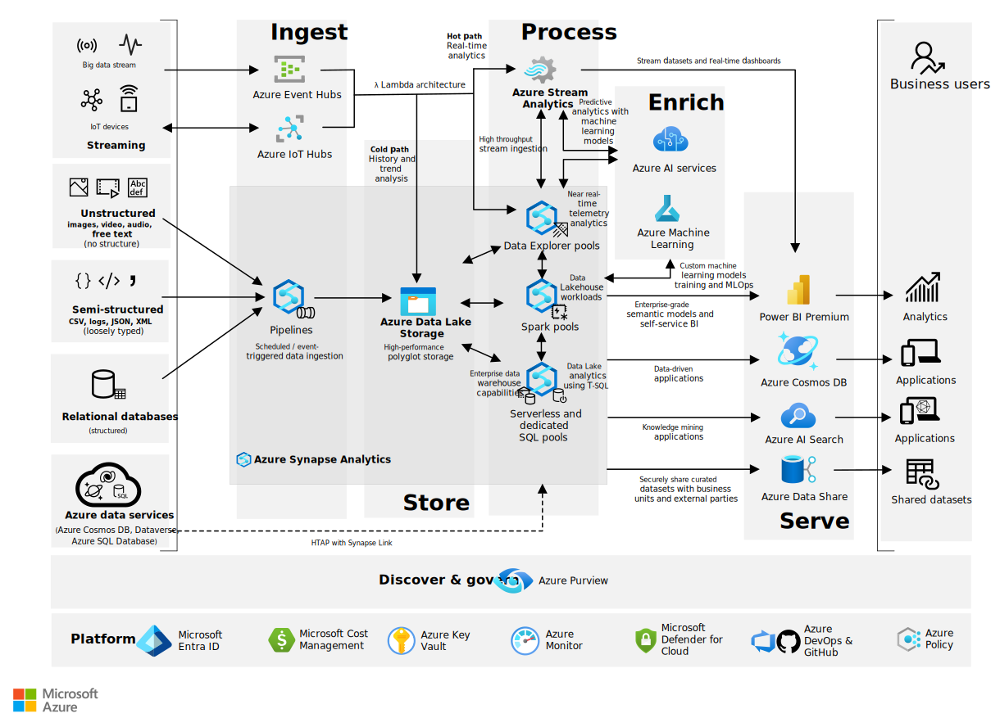

<!-- cSpell:ignore fabraga -->

The solution described in this article combines a range of Azure services that ingest, store, process, enrich, and serve data and insights from different sources (structured, semi-structured, unstructured, and streaming).

## Architecture

*Download a [Visio file](https://arch-center.azureedge.net/analytics-with-azuresynapse-updated.vsdx) of this architecture*.

> [!NOTE]
>
> - The services covered by this architecture are only a subset of a much larger family of Azure services. Similar outcomes can be achieved by using other services or features that are not covered by this design.
> - Specific business requirements for your analytics use case could require the use of different services or features that are not considered in this design.

### Dataflow

The analytics use cases covered by the architecture are illustrated by the different data sources on the left-hand side of the diagram. Data flows through the solution from the bottom up as follows:

> [!NOTE]
> In the following sections, Azure Data Lake Storage is used as the home for data throughout the various stages of the data lifecycle. Data Lake Storage is organized by different layers and containers as follows:
>
> - The Raw layer is the landing area for data coming in from source systems. As the name implies, data in this layer is in raw, unfiltered, and unpurified form.
> - In the next stage of the lifecycle, data moves to the Enriched layer where data is cleaned, filtered, and possibly transformed.
> - Data then moves to the Curated layer, which is where consumer-ready data is maintained.
>
> Please refer to the [Data lake zones and containers](/azure/cloud-adoption-framework/scenarios/cloud-scale-analytics/best-practices/data-lake-zones) documentation for a full review of Data Lake Storage layers and containers and their uses.

#### Azure data services, cloud native HTAP with Azure Cosmos DB and Dataverse

##### Process

1. [Azure Synapse Link for Azure Cosmos DB](/azure/cosmos-db/synapse-link) and [Azure Synapse Link for Dataverse](/powerapps/maker/data-platform/export-to-data-lake) enable you to run near real-time analytics over operational and business application data, by using the analytics engines that are available from your Azure Synapse workspace: [SQL Serverless](/azure/synapse-analytics/sql/on-demand-workspace-overview) and [Spark Pools](/azure/synapse-analytics/spark/apache-spark-overview).

1. When using Azure Synapse Link for Azure Cosmos DB, use either a [SQL Serverless query](/azure/synapse-analytics/sql/query-cosmos-db-analytical-store?tabs=openrowset-key) or a [Spark Pool notebook](/azure/synapse-analytics/synapse-link/how-to-query-analytical-store-spark). You can access the [Azure Cosmos DB analytical store](/azure/cosmos-db/analytical-store-introduction) and then combine datasets from your near real-time operational data with data from your data lake or from your data warehouse.

1. When using Azure Synapse Link for Dataverse, use either a [SQL Serverless query](/powerapps/maker/data-platform/azure-synapse-link-serverless) or a [Spark Pool notebook](/powerapps/maker/data-platform/azure-synapse-link-spark). You can access the selected Dataverse tables and then combine datasets from your near real-time business applications data with data from your data lake or from your data warehouse.

##### Store

1. The resulting datasets from your [SQL Serverless queries](/azure/synapse-analytics/sql/create-external-table-as-select) can be persisted in your data lake. If you are using [Spark notebooks](/azure/synapse-analytics/spark/synapse-spark-sql-pool-import-export), the resulting datasets can be persisted either in your data lake or data warehouse (SQL pool).

##### Serve

1. Load relevant data from the Azure Synapse SQL pool or data lake into [Power BI datasets](https://techcommunity.microsoft.com/t5/azure-synapse-analytics/integrate-power-bi-with-azure-synapse-analytics/ba-p/2003057) for data visualization and exploration. [Power BI models](/training/modules/design-model-power-bi) implement a semantic model to simplify the analysis of business data and relationships. Business analysts use [Power BI](/power-bi/admin/service-premium-what-is) reports and dashboards to analyze data and derive business insights.

1. Data can also be securely shared to other business units or external trusted partners using [Azure Data Share](/azure/data-share/share-your-data). Data consumers have the freedom to choose what data format they want to use and also what compute engine is best to process the shared datasets.

1. Structured and unstructured data stored in your Synapse workspace can also be used to build [knowledge mining solutions](https://azure.microsoft.com/solutions/knowledge-mining) and use AI to uncover valuable business insights across different document types and formats including from Office documents, PDFs, images, audio, forms, and web pages.

#### Relational databases

##### Ingest

1. Use [Azure Synapse pipelines](/azure/data-factory/concepts-pipelines-activities) to pull data from a wide range of databases, both on-premises and in the cloud. Pipelines can be triggered based on a pre-defined schedule, in response to an event, or can be explicitly called via REST APIs.

##### Store

1. Within the Raw data lake layer, [organize your data lake](/azure/cloud-adoption-framework/scenarios/data-management/best-practices/data-lake-services) following the best practices around which layers to create, what folder structures to use in each layer and what files format to use for each analytics scenario.

1. From the Azure Synapse pipeline, use a [Copy data activity](/azure/data-factory/copy-activity-overview) to stage the data copied from the relational databases into the [raw layer](https://techcommunity.microsoft.com/t5/data-architecture-blog/how-to-organize-your-data-lake/ba-p/1182562) of your [Data Lake Storage](/azure/storage/blobs/data-lake-storage-introduction) data lake. You can save the data in delimited text format or compressed as Parquet files.

##### Process

1. Use either [data flows](/azure/data-factory/concepts-data-flow-overview), [SQL serverless queries](/training/modules/use-azure-synapse-serverless-sql-pools-for-transforming-data-lake), or [Spark notebooks](/training/modules/transform-data-with-dataframes-apache-spark-pools-azure-synapse-analytics) to validate, transform, and move the datasets from the Raw layer, through the Enriched layer and into your Curated layer in your data lake.

   1. As part of your data transformations, you can invoke machine-training models from your [SQL pools using standard T-SQL](/azure/synapse-analytics/sql-data-warehouse/sql-data-warehouse-predict) or Spark notebooks. These ML models can be used to enrich your datasets and generate further business insights. These machine-learning models can be consumed from [Azure AI services](/azure/synapse-analytics/machine-learning/tutorial-cognitive-services-sentiment) or [custom ML models from Azure Machine Learning](/azure/synapse-analytics/machine-learning/tutorial-sql-pool-model-scoring-wizard).

##### Serve

1. You can serve your final dataset directly from the data lake Curated layer or you can use Copy Data activity to ingest the final dataset into your SQL pool tables using the [COPY command](/sql/t-sql/statements/copy-into-transact-sql) for fast ingestion.

1. Load relevant data from the Azure Synapse SQL pool or data lake into [Power BI datasets](https://techcommunity.microsoft.com/t5/azure-synapse-analytics/integrate-power-bi-with-azure-synapse-analytics/ba-p/2003057) for data visualization. [Power BI models](/training/modules/design-model-power-bi) implement a semantic model to simplify the analysis of business data and relationships. Business analysts use [Power BI](/power-bi/admin/service-premium-what-is) reports and dashboards to analyze data and derive business insights.

1. Data can also be securely shared to other business units or external trusted partners using [Azure Data Share](/azure/data-share/share-your-data). Data consumers have the freedom to choose what data format they want to use and also what compute engine is best to process the shared datasets.

1. Structured and unstructured data stored in your Synapse workspace can also be used to build [knowledge mining solutions](https://azure.microsoft.com/solutions/knowledge-mining) and use AI to uncover valuable business insights across different document types and formats including from Office documents, PDFs, images, audio, forms, and web pages.

#### Semi-structured data sources

##### Ingest

1. Use [Azure Synapse pipelines](/azure/data-factory/concepts-pipelines-activities) to pull data from a wide range of semi-structured data sources, both on-premises and in the cloud. For example, pipelines can do the following operations:

    - Ingest data from file-based sources containing CSV or JSON files.
    - Connect to No-SQL databases such as Azure Cosmos DB or MongoDB.
    - Call REST APIs provided by SaaS applications that function as your data source for the pipeline.

##### Store

1. Within the Raw data lake layer, [organize your data lake](/azure/cloud-adoption-framework/scenarios/data-management/best-practices/data-lake-services) following the best practices around which layers to create, what folder structures to use in each layer and what files format to use for each analytics scenario.

1. From the Azure Synapse pipeline, use a [Copy data activity](/azure/data-factory/copy-activity-overview) to stage the data copied from the semi-structured data sources into the [raw layer](https://techcommunity.microsoft.com/t5/data-architecture-blog/how-to-organize-your-data-lake/ba-p/1182562) of your [Data Lake Storage](/azure/storage/blobs/data-lake-storage-introduction) data lake. Save data to preserve the original format, as acquired from the data sources.

##### Process

1. For batch/micro-batch pipelines, use either [data flows](/azure/data-factory/concepts-data-flow-overview), [SQL serverless queries](/training/modules/use-azure-synapse-serverless-sql-pools-for-transforming-data-lake) or [Spark notebooks](/training/modules/transform-data-with-dataframes-apache-spark-pools-azure-synapse-analytics) to validate, transform, and move your datasets into your Curated layer in your data lake. SQL Serverless queries expose underlying [CSV](/azure/synapse-analytics/sql/query-single-csv-file), [Parquet](/azure/synapse-analytics/sql/query-parquet-files), or [JSON](/azure/synapse-analytics/sql/query-json-files) files as external tables, so that they can be queried using T-SQL.

   1. As part of your data transformations, you can invoke machine-learning models from your [SQL pools using standard T-SQL](/azure/synapse-analytics/sql-data-warehouse/sql-data-warehouse-predict) or Spark notebooks. These ML models can be used to enrich your datasets and generate further business insights. These machine-learning models can be consumed from [Azure AI services](/azure/synapse-analytics/machine-learning/tutorial-cognitive-services-sentiment) or [custom ML models from Azure Machine Learning](/azure/synapse-analytics/machine-learning/tutorial-sql-pool-model-scoring-wizard).

1. For near real-time telemetry and time-series analytics scenarios, use [Data Explorer pools](/azure/synapse-analytics/data-explorer/data-explorer-overview) to easily [ingest](/azure/synapse-analytics/data-explorer/ingest-data/data-explorer-ingest-data-overview), consolidate, and correlate logs and IoT events data across multiple data sources. With Data Explorer pools, you can use [Kusto queries (KQL)](/azure/data-explorer/kusto/query/tutorial?pivots=azuredataexplorer) to perform [time-series analysis](/azure/data-explorer/kusto/query/machine-learning-and-tsa), [geospatial clustering](/azure/data-explorer/kusto/query/geospatial-grid-systems), and machine learning enrichment.

##### Serve

1. You can serve your final dataset directly from the data lake Curated layer or you can use Copy Data activity to ingest the final dataset into your SQL pool tables using the [COPY command](/sql/t-sql/statements/copy-into-transact-sql) for fast ingestion.

1. Load relevant data from the Azure Synapse [SQL pools](/azure/synapse-analytics/get-started-visualize-power-bi), [Data Explorer pools](/azure/data-explorer/visualize-power-bi), or a [data lake](/power-query/connectors/datalakestorage) into [Power BI datasets](https://techcommunity.microsoft.com/t5/azure-synapse-analytics/integrate-power-bi-with-azure-synapse-analytics/ba-p/2003057) for data visualization. [Power BI models](/training/modules/design-model-power-bi) implement a semantic model to simplify the analysis of business data and relationships. Business analysts use [Power BI](/power-bi/admin/service-premium-what-is) reports and dashboards to analyze data and derive business insights.

1. Data can also be securely shared to other business units or external trusted partners using [Azure Data Share](/azure/data-share/share-your-data). Data consumers have the freedom to choose what data format they want to use and also what compute engine is best to process the shared datasets.

1. Structured and unstructured data stored in your Synapse workspace can also be used to build [knowledge mining solutions](https://azure.microsoft.com/solutions/knowledge-mining) and use AI to uncover valuable business insights across different document types and formats including from Office documents, PDFs, images, audio, forms, and web pages.

#### Non-structured data sources

##### Ingest

1. Use [Azure Synapse pipelines](/azure/data-factory/concepts-pipelines-activities) to pull data from a wide range of non-structured  data sources, both on-premises and in the cloud. For example:

   - Ingest video, image, audio, or free text from file-based sources that contain the source files.
   - Call REST APIs provided by SaaS applications that function as your data source for the pipeline.

##### Store

1. Within the Raw data lake layer, [organize your data lake](/azure/cloud-adoption-framework/scenarios/data-management/best-practices/data-lake-services) by following the best practices about which layers to create, what folder structures to use in each layer, and what files format to use for each analytics scenario.

1. From the Azure Synapse pipeline, use a [Copy data activity](/azure/data-factory/copy-activity-overview) to stage the data copied from the non-structured data sources into the [raw layer](https://techcommunity.microsoft.com/t5/data-architecture-blog/how-to-organize-your-data-lake/ba-p/1182562) of your [Data Lake Storage](/azure/storage/blobs/data-lake-storage-introduction) data lake. Save data by preserving the original format, as acquired from the data sources.

##### Process

1. Use [Spark notebooks](/training/modules/transform-data-with-dataframes-apache-spark-pools-azure-synapse-analytics) to validate, transform, enrich, and move your datasets from the Raw layer, through the Enriched layer and  into your Curated layer in your data lake.

   1. As part of your data transformations, you can invoke machine-learning models from your [SQL pools using standard T-SQL](/azure/synapse-analytics/sql-data-warehouse/sql-data-warehouse-predict) or Spark notebooks. These ML models can be used to enrich your datasets and generate further business insights. These machine-learning models can be consumed from [Azure AI services](/azure/synapse-analytics/machine-learning/tutorial-cognitive-services-sentiment) or [custom ML models from Azure Machine Learning](/azure/synapse-analytics/machine-learning/tutorial-sql-pool-model-scoring-wizard).

##### Serve

1. You can serve your final dataset directly from the data lake Curated layer or you can use Copy Data activity to ingest the final dataset into your data warehouse tables using the [COPY command](/sql/t-sql/statements/copy-into-transact-sql) for fast ingestion.

1. Load relevant data from the Azure Synapse SQL pool or data lake into [Power BI datasets](https://techcommunity.microsoft.com/t5/azure-synapse-analytics/integrate-power-bi-with-azure-synapse-analytics/ba-p/2003057) for data visualization. [Power BI models](/training/modules/design-model-power-bi) implement a semantic model to simplify the analysis of business data and relationships.

1. Business analysts use [Power BI](/power-bi/admin/service-premium-what-is) reports and dashboards to analyze data and derive business insights.

1. Data can also be securely shared to other business units or external trusted partners using [Azure Data Share](/azure/data-share/share-your-data). Data consumers have the freedom to choose what data format they want to use and also what compute engine is best to process the shared datasets.

1. Structured and unstructured data stored in your Synapse workspace can also be used to build [knowledge mining solutions](https://azure.microsoft.com/solutions/knowledge-mining) and use AI to uncover valuable business insights across different document types and formats including from Office documents, PDFs, images, audio, forms, and web pages.

#### Streaming

##### Ingest

1. Use [Azure Event Hubs or Azure IoT Hub](/azure/iot-hub/iot-hub-compare-event-hubs) to ingest data streams generated by client applications or IoT devices. Event Hubs or IoT Hub then ingests and stores streaming data preserving the sequence of events received. Consumers can then connect to Event Hubs or IoT Hub endpoints and retrieve messages for processing.

##### Store

1. Within the Raw data lake layer, [organize your data lake](/azure/cloud-adoption-framework/scenarios/data-management/best-practices/data-lake-services) following the best practices around which layers to create, what folder structures to use in each layer and what files format to use for each analytics scenario.

1. Configure [Event Hubs Capture](/azure/event-hubs/event-hubs-capture-overview) or [IoT Hub Storage Endpoints](/azure/iot-hub/iot-hub-devguide-messages-d2c#azure-blob-storage) to save a copy of the events into the [Raw layer](https://techcommunity.microsoft.com/t5/data-architecture-blog/how-to-organize-your-data-lake/ba-p/1182562) of your [Data Lake Storage](/azure/storage/blobs/data-lake-storage-introduction) data lake. This feature implements the "Cold Path" of the [Lambda architecture pattern](/azure/architecture/data-guide/big-data/#lambda-architecture) and allows you to perform historical and trend analysis on the stream data saved in your data lake using [SQL Serverless queries](/azure/synapse-analytics/sql/on-demand-workspace-overview) or [Spark notebooks](/azure/synapse-analytics/spark/apache-spark-development-using-notebooks?tabs=classical) following the pattern for semi-structured data sources described above.

##### Process

1. For real-time insights, use a [Stream Analytics job](/azure/stream-analytics/stream-analytics-introduction) to implement the "Hot Path" of the [Lambda architecture pattern](/azure/architecture/data-guide/big-data/#lambda-architecture) and derive insights from the stream data in transit. Define at least one input for the data stream coming from your [Event Hubs](/azure/event-hubs/process-data-azure-stream-analytics) or [IoT Hub](/azure/iot-hub/iot-hub-live-data-visualization-in-power-bi), one query to process the input data stream, and one Power BI output to where the query results are sent.

   1. As part of your data processing with Stream Analytics, you can invoke machine-learning models to enrich your stream datasets and drive business decisions based on the predictions generated. These machine-learning models can be consumed from Azure AI services or from [custom ML models in Azure Machine Learning](/azure/stream-analytics/machine-learning-udf).

1. Use other Stream Analytics job outputs to send processed events to Azure Synapse [SQL pools](/azure/synapse-analytics/sql-data-warehouse/sql-data-warehouse-integrate-azure-stream-analytics) or [Data Explorer pools](https://techcommunity.microsoft.com/t5/azure-data-explorer-blog/adx-is-now-supported-as-output-for-azure-stream-analytics-job/ba-p/2923654) for further analytics use cases.

1. For near real-time telemetry and time-series analytics scenarios, use [Data Explorer pools](/azure/synapse-analytics/data-explorer/data-explorer-overview) to easily ingest IoT events directly from [Event Hubs](/azure/data-explorer/ingest-data-event-hub) or [IoT Hubs](/azure/data-explorer/ingest-data-iot-hub). With Data Explorer pools, you can use [Kusto queries (KQL)](/azure/data-explorer/kusto/query/tutorial?pivots=azuredataexplorer) to perform [time-series analysis](/azure/data-explorer/kusto/query/machine-learning-and-tsa), [geospatial clustering](/azure/data-explorer/kusto/query/geospatial-grid-systems), and machine learning enrichment.

##### Serve

1. Business analysts then use [Power BI real-time datasets and dashboard](/power-bi/connect-data/service-real-time-streaming) capabilities to visualize the fast changing insights generated by your Stream Analytics query.

1. Data can also be securely shared to other business units or external trusted partners using [Azure Data Share](/azure/data-share/share-your-data). Data consumers have the freedom to choose what data format they want to use and also what compute engine is best to process the shared datasets.

1. Structured and unstructured data stored in your Synapse workspace can also be used to build [knowledge mining solutions](https://azure.microsoft.com/solutions/knowledge-mining) and use AI to uncover valuable business insights across different document types and formats including from Office documents, PDFs, images, audio, forms and web pages.

### Components

- [Azure AI services](/azure/cognitive-services/) is a suite of cloud-based artificial intelligence tools that enable developers and organizations to build intelligent applications without requiring extensive AI or data science expertise. Azure AI Services provides prebuilt models for vision, language, and decision-making tasks. In this architecture, they enrich datasets during processing through integration with Synapse pipelines and Stream Analytics.

- [Azure Cosmos DB](/azure/well-architected/service-guides/cosmos-db) is a globally distributed NoSQL database. In this architecture, it stores operational data and uses Synapse Link to enable near real-time analytics without affecting operational workloads.

- [Data Lake Storage](/azure/storage/blobs/data-lake-storage-introduction) is a scalable data lake built on Azure Blob Storage. In this architecture, it serves as the central repository organized into Raw, Enriched, and Curated layers for all data types across batch and streaming scenarios.

- [Azure Data Share](/azure/data-share/overview) is a managed data exchange service that enables secure, governed sharing of data between Azure tenants. In this architecture, it distributes curated datasets from the data lake or Synapse to internal teams or external partners.

- [Azure IoT Hub](/azure/well-architected/service-guides/azure-iot-hub) is a cloud gateway for IoT devices. In this architecture, it ingests telemetry data and routes it to Event Hubs for stream processing or directly to the data lake for storage.

- [Azure Key Vault](/azure/key-vault/general/overview) is a cloud-based service for securely storing and managing sensitive information like secrets, keys, and certificates. In this architecture, it manages credentials used in Synapse pipelines and in Azure Machine Learning.

- [Azure Machine Learning](/azure/well-architected/service-guides/azure-machine-learning) is a platform for building and deploying machine learning models. In this architecture, it provides custom models that integrate with Synapse pipelines and Stream Analytics for data enrichment.

- [Azure Monitor](/azure/azure-monitor/overview) is a cloud-native monitoring system built into Azure that collects and analyzes telemetry data from your applications, infrastructure, and services. In this architecture, it monitors performance, reliability, and usage across all data platform components.

- [Azure Policy](/azure/governance/policy/overview) is a governance tool that enforces governance rules across Azure resources. In this architecture, it ensures compliance, data governance, and cost control across the data platform.

- [Azure Stream Analytics](/azure/stream-analytics/stream-analytics-introduction) is a real-time streaming data processing service in Azure. In this architecture, it implements the "Hot Path" for Lambda architecture, and processes data from Event Hubs and IoT Hub.

- [Azure Synapse Analytics](/azure/synapse-analytics/overview-what-is) is an integrated analytics platform. In this architecture, it orchestrates data pipelines, provides SQL Serverless and Spark compute for transformations, and serves as the data warehouse through SQL pools.

- [Event Hubs](/azure/well-architected/service-guides/event-hubs) is a high-throughput, real-time event ingestion service. In this architecture, it receives streaming data from applications and IoT devices, with capture capabilities for cold path storage in the data lake.

- [Microsoft Power BI](/power-bi/fundamentals/power-bi-overview) is a business intelligence and data visualization platform that provides business intelligence and visualization. In this architecture, it connects to Synapse SQL pools, Data Explorer pools, and the data lake to create dashboards and reports.

- [Microsoft Purview](/azure/purview/overview) is a unified platform for data governance, security, and compliance. In this architecture, it catalogs data assets, tracks lineage from Synapse pipelines.

### Alternatives

- In the architecture above, Azure Synapse pipelines are responsible for data pipeline orchestration. [Azure Data Factory](https://azure.microsoft.com/services/data-factory) pipelines also provide the same capabilities as described in this article.

- [Azure Databricks](https://azure.microsoft.com/services/databricks) can also be used as the compute engine used to process structured and unstructured data directly on the data lake.

  When using Azure Databricks, you can connect your Power Apps serving layer directly to Delta Lake tables in Azure Databricks without exporting data. Consider this path when business teams need near real-time reads from curated lakehouse tables.

- In the architecture above, Azure Stream Analytics is the service responsible for processing streaming data. Azure Synapse Spark pools and Azure Databricks can also be used to perform the same role through the execution of notebooks.

- [Azure HDInsight Kafka](https://azure.microsoft.com/services/hdinsight) clusters can also be used to ingest streaming data and provide the right level of performance and scalability required by large streaming workloads.

- You also can make use of [Azure Functions](https://azure.microsoft.com/services/functions) to invoke Azure AI services or Azure Machine Learning custom ML models from an Azure Synapse pipeline.

- The technologies in this architecture were chosen because each of them provides the necessary functionality to handle the most common data challenges in an organization. These services meet the requirements for scalability and availability, while helping them control costs. The services covered by this architecture are only a subset of a much larger family of Azure services. Similar outcomes can be achieved by using other services or features not covered by this design.

- Specific business requirements for your analytics use cases might ask for the use of different services or features not considered in this design.

- For comparisons of other alternatives, see:

  - [Choosing a data pipeline orchestration technology in Azure](../../data-guide/technology-choices/pipeline-orchestration-data-movement.md)
  - [Choosing a batch processing technology in Azure](../../data-guide/technology-choices/batch-processing.md)
  - [Choosing an analytical data store in Azure](../../data-guide/technology-choices/analytical-data-stores.md)
  - [Choosing a data analytics technology in Azure](../../data-guide/technology-choices/analysis-visualizations-reporting.md)
  - [Choosing a stream processing technology in Azure](../../data-guide/technology-choices/stream-processing.md)

## Scenario details

This example scenario demonstrates how to use Azure Synapse Analytics with the extensive family of Azure Data Services to build a modern data platform that's capable of handling the most common data challenges in an organization.

### Potential use cases

This approach can also be used to:

- Establish a [data product](/azure/cloud-adoption-framework/scenarios/data-management/architectures/data-landing-zone-data-products) architecture, which consists of a data warehouse for structured data and a data lake for semi-structured and unstructured data. You can choose to deploy a single data product for centralized environments or multiple data products for distributed environments such as Data Mesh. See more information about [Data Management and Data Landing Zones](/azure/cloud-adoption-framework/scenarios/data-management/enterprise-scale-landing-zone).
- Integrate relational data sources with other unstructured datasets, with the use of big data processing technologies.
- Use semantic modeling and powerful visualization tools for simpler data analysis.
- Share datasets within the organization or with trusted external partners.
- Implement knowledge mining solutions to extract valuable business information hidden in images, PDFs, documents, and so on.

## Recommendations

### Discover and govern

Data governance is a common challenge in large enterprise environments. On one hand, business analysts need to be able to discover and understand data assets that can help them solve business problems. On the other hand, Chief Data Officers want insights on privacy and security of business data.

#### Microsoft Purview

1. Use [Microsoft Purview](/azure/purview/overview) for [data discovery](/azure/purview/how-to-browse-catalog) and insights on your [data assets](/azure/purview/asset-insights), [data classification](/azure/purview/classification-insights), and [sensitivity](/azure/purview/sensitivity-insights), which covers the entire organizational data landscape.

1. Microsoft Purview can help you maintain a [business glossary](/azure/purview/concept-business-glossary) with the specific business terminology required for users to understand the semantics of what datasets mean and how they are meant to be used across the organization.

1. You can [register all your data sources](/azure/purview/manage-data-sources) and organize them into [Collections](/azure/purview/concept-best-practices-collections), which also serves as a security boundary for your metadata.

1. Setup [regular scans](/azure/purview/create-a-scan-rule-set) to automatically catalog and update relevant metadata about data assets in the organization. Microsoft Purview can also automatically add [data lineage](/azure/purview/catalog-lineage-user-guide) information based on information from Azure Data Factory or Azure Synapse pipelines.

1. [Data classification](/azure/purview/apply-classifications) and [data sensitivity](/azure/purview/create-sensitivity-label) labels can be added automatically to your data assets based on pre-configured or customs rules applied during the regular scans.

1. Data governance professionals can use the reports and [insights](/azure/purview/concept-insights) generated by Microsoft Purview to keep control over the entire data landscape and protect the organization against any security and privacy issues.

### Platform services

In order to improve the quality of your Azure solutions, follow the recommendations and guidelines defined in the [Azure Well-Architected Framework](/azure/well-architected/) five pillars of architecture excellence: Cost Optimization, Operational Excellence, Performance Efficiency, Reliability, and Security.

Following these recommendations, the services below should be considered as part of the design:

1. [Microsoft Entra ID](https://azure.microsoft.com/services/active-directory): identity services, single sign-on and multifactor authentication across Azure workloads.
1. [Microsoft Cost Management](https://azure.microsoft.com/services/cost-management): financial governance over your Azure workloads.
1. [Azure Key Vault](https://azure.microsoft.com/services/key-vault): secure credential and certificate management. For example, [Azure Synapse Pipelines](/azure/data-factory/how-to-use-azure-key-vault-secrets-pipeline-activities), [Azure Synapse Spark Pools](/azure/synapse-analytics/spark/apache-spark-secure-credentials-with-tokenlibrary) and [Azure Machine Learning](/azure/machine-learning/how-to-use-secrets-in-runs) can retrieve credentials and certificates from Azure Key Vault used to securely access data stores.
1. [Azure Monitor](https://azure.microsoft.com/services/monitor): collect, analyze, and act on telemetry information of your Azure resources to proactively identify problems and maximize performance and reliability.
1. [Microsoft Defender for Cloud](https://azure.microsoft.com/services/security-center): strengthen and monitor the security posture of your Azure workloads.
1. [Azure DevOps](https://azure.microsoft.com/solutions/devops) & [GitHub](https://azure.microsoft.com/products/github): implement DevOps practices to enforce automation and compliance to your workload development and deployment pipelines for Azure Synapse and Azure Machine Learning.
1. [Azure Policy](/azure/governance/policy): implement organizational standards and governance for resource consistency, regulatory compliance, security, cost, and management.

## Considerations

These considerations implement the pillars of the Azure Well-Architected Framework, which is a set of guiding tenets that you can use to improve the quality of a workload. For more information, see [Well-Architected Framework](/azure/well-architected/).

### Cost Optimization

Cost Optimization focuses on ways to reduce unnecessary expenses and improve operational efficiencies. For more information, see [Design review checklist for Cost Optimization](/azure/well-architected/cost-optimization/checklist).

In general, use the [Azure pricing calculator](https://azure.microsoft.com/pricing/calculator) to estimate costs. The ideal individual pricing tier and the total overall cost of each service included in the architecture is dependent on the amount of data to be processed and stored and the acceptable performance level expected. Use the guide below to learn more about how each service is priced:

- [Azure Synapse Analytics](https://azure.microsoft.com/pricing/details/synapse-analytics) serverless architecture allows you to scale your compute and storage levels independently. Compute resources are charged based on usage, and you can scale or pause these resources on demand. Storage resources are billed per terabyte, so your costs increase as you ingest more data.

- [Data Lake Storage](https://azure.microsoft.com/pricing/details/storage/data-lake) is charged based on the amount of data stored and based on the number of transactions to read and write data.

- [Azure Event Hubs](https://azure.microsoft.com/pricing/details/event-hubs) and [IoT Hub](https://azure.microsoft.com/pricing/details/iot-hub) are charged based on the amount of compute resources required to process your message streams.

- [Azure Machine Learning](https://azure.microsoft.com/pricing/details/machine-learning) charges come from the amount of compute resources used to train and deploy your machine-learning models.

- [AI services](https://azure.microsoft.com/pricing/details/cognitive-services) is charged based on the number of call you make to the service APIs.

- [Microsoft Purview](https://azure.microsoft.com/pricing/details/azure-purview) is priced based on the number of data assets in the catalog and the amount of compute power required to scan them.

- [Azure Stream Analytics](https://azure.microsoft.com/pricing/details/stream-analytics) is charged based on the amount of compute power required to process your stream queries.

- [Power BI](https://powerbi.microsoft.com/pricing) has different product options for different requirements. [Power BI Embedded](https://azure.microsoft.com/pricing/details/power-bi-embedded) provides an Azure-based option for embedding Power BI functionality inside your applications. A Power BI Embedded instance is included in the pricing sample above.

- [Azure Cosmos DB](https://azure.microsoft.com/pricing/details/cosmos-db) is priced based on the amount of storage and compute resources required by your databases.

Similar architecture can also be implemented for pre-production environments where you can develop and test your workloads. Consider the specific requirements for your workloads and the capabilities of each service for a cost-effective pre-production environment.

## Deploy this scenario

This article has a companion repository available in GitHub that shows how you automate the deployment of the services covered in this architecture. Follow the [Azure analytics end-to-end with Azure Synapse deployment guide](https://github.com/Azure/azure-synapse-analytics-end2end) to deploy this architecture to your subscription. That deployment guide has detailed instructions and multiple deployment options.

## Contributors

*This article is being updated and maintained by Microsoft. It was originally written by the following contributors.*

Principal author:

- [Fabio Braga](https://www.linkedin.com/in/fabiohemylio/) | Principal MTC Technical Architect

*To see non-public LinkedIn profiles, sign in to LinkedIn.*

## Next steps

- Review the guidelines defined in the [Azure data management and analytics scenario](/azure/cloud-adoption-framework/scenarios/data-management) for scalable analytics environment in Azure.

- Explore the [Data Engineer Learning Paths at Microsoft learn](/training/roles/data-engineer) for further training content and labs on the services involved in this reference architecture.

- Review the documentation and deploy the reference architecture using the [deployment guidance available on GitHub](https://github.com/Azure/azure-synapse-analytics-end2end).
