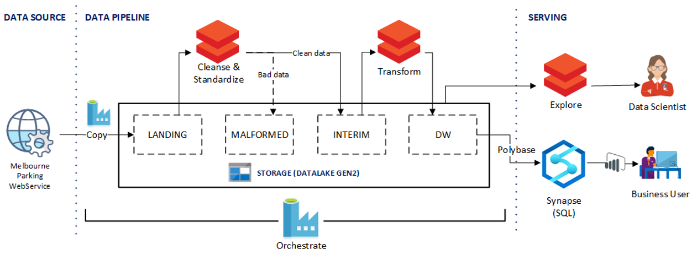

# DataOps for the modern data warehouse

A modern data warehouse (MDW) lets you bring together all your data at any scale easily, whether they be structured, unstructured, or semi-structured data (logs, files, and media). It provides insights through analytical dashboards, operational reports, or advanced analytics for all your users.

Setting up an MDW environment both for development (dev) and production (prod) environments is complex. That is why automating the process is key. It helps increase productivity while minimizing the risk of errors.

In this document, we will describe how a fictional city planning office could use this solution—which provides an end-to-end data pipeline that follows the MDW architectural pattern, along with a corresponding DevOps / DataOps processes, to assess parking utilization and make more informed business decisions.

## Potential use cases

This article uses the fictional city of Contoso to describe the use case scenario. In the narrative, Contoso owns and manages parking sensors for the city and the APIs that enable them to connect to and get data from the sensors. They need a platform that will collect data from a variety of sources and then validate, cleanse, and transform the data to a known schema. Contoso city planners can then explore and assess report data on parking utilization with data visualization tools like Power BI to determine whether they need more parking or related resources.

### Solution requirements

* Ability to collect data from different sources or systems

* Infrastructure as Code: deploy new environments to dev and staging (stg) in an automated manner

* Deploy application changes across different environments in an automated manner:

  * Implementation of Continuous Integration/Continuous Delivery (CI/CD) pipelines

  * Use deployment gates for manual approvals

* Pipeline as Code: ensure the CI/CD pipeline definitions are source control (YAML)

* Perform integration tests on changes using a sample data set

* Run pipelines on a scheduled basis

* Support future agile development, including the enablement of data science workloads

* Support for both row-level and object-level security:  can be done through SQL Database, but is also available in SQL Data Warehouse (SQLDW), Azure Analysis Services (AAS) and Power BI

* Support for 10 concurrent dashboard users and 20 concurrent power users

* The data pipeline should perform data validation and filter out malformed records to a specified store

* Support for monitoring

* Centralized configuration in a secure storage (such as KeyVault)

### Technical solution overview

This solution builds on top of another system that Contoso owns. That system collects data from the sensors underneath parking spots and exposes an API for consuming applications and systems. Our system pulls the near real-time parking data by calling that API and then saves it to Azure Data Lake Storage. It then validates, cleanses, and transforms the data to a known schema using Azure Databricks. A second Azure Databricks job then transforms the schema into a Star Schema, which is then loaded into Azure Synapse Analytics (formerly SQLDW) using Polybase. The entire pipeline is orchestrated with Azure Data Factory.

## Architecture

The following diagram shows the overall architecture of the solution.

This dataflow is orchestrated using Azure Data Factory (ADF) and the data is stored in Azure Data Lake Gen2:

1. The Contoso city parking web service API is available to transfer data from the parking spots.

1. There is an ADF copy job that transfers the data into the Landing schema.

1. Next, Azure Databricks cleanses and standardizes the data. It takes the raw data and conditions it so data scientists can use it.
1. If there is any bad data it gets dumped into the Malformed schema.

1. There is a second Azure Databricks transform step that converts the data into a format that can be stored in the data warehouse.

1. Finally the data is served in two different ways:

    1. Databricks makes the data available to the data scientist so they can train models.

    1. Polybase moves the data from the data lake to SQL Data Warehouse and Power BI accesses the data and presents it to the business user.

## Components

The solution is comprised of the following Azure services:

* [Azure Data Factory (ADF)](https://azure.microsoft.com/services/data-factory/)
* [Azure Databricks](https://azure.microsoft.com/services/databricks/)
* [Azure Data Lake Storage Gen2 (ADLS)](https://docs.microsoft.com/azure/storage/blobs/data-lake-storage-introduction)
* [Azure Synapse Analytics (formerly SQLDW)](https://azure.microsoft.com/services/synapse-analytics/)
* [Azure DevOps](https://azure.microsoft.com/services/devops/)
* [Power BI](https://powerbi.microsoft.com/)

## Deploy the solution

The following list contains the high-level steps required to set up the Parking Sensors solution with corresponding Build and Release Pipelines. Detailed setup steps and prerequisites can be found in [this Azure Samples repository](https://github.com/Azure-Samples/modern-data-warehouse-dataops/tree/master/e2e_samples/parking_sensors#how-to-use-the-sample).

### Setup and Deployment

1. **Initial setup**: Ensure all software pre-requisites are installed, importing the Azure Samples GitHub repository into your own repository, and setting required environment variables.
1. **Deploy Azure resources**: The solution comes with an automated deployment script, which deploys all necessary Azure resources and AAD service principals per environment, along with Azure DevOps pipelines, variable groups, and service connections.
1. **Set up git integration in dev Data Factory**: Wire-up git integration with the imported GitHub repository from the previous step.
1. **Perform an initial Build and Release**: This includes creating a sample change in Data Factory (for example, enabling schedule trigger) then seeing the change automatically get deployed across environments.

### Deployed Resources

If deployment is successful, there should be three resources groups in Azure representing three environments: dev, stg, and prod. There should also be an end-to-end Build and Release pipelines in Azure DevOps that can deploy changes across these three environments in an automated fashion.

For a detailed list of all resources, see this [Deployed Resources](https://github.com/Azure-Samples/modern-data-warehouse-dataops/tree/master/e2e_samples/parking_sensors#deployed-resources) section.

### Continuous Integration and Continuous Delivery (CI/CD)

The diagram below demonstrates the CI/CD process and sequence for the build and release pipeline.

1. Developers develop in their own sandbox environments within the dev resource group and commit changes into their own short-lived git branches. For example, `<developer_name>/<branch_name>`.

1. When changes are complete, developers raise a pull request (PR) to the master branch for review. Doing so automatically kicks-off the PR validation pipeline, which runs the unit tests, linting, and data-tier application package (DACPAC) builds.

1. On completion of the PR validation, the commit to master will trigger a Build pipeline that publishes all necessary build artifacts.

1. The completion of a successful Build pipeline will trigger the first stage of the Release pipeline. Doing so deploys the publish build artifacts into the dev environment, except for Azure Data Factory.

    Developers manually publish to the dev ADF from the collaboration branch (master). This updates the Azure Resource Manager (ARM) templates in the `adf_publish` branch.

1. The successful completion of the first stage triggers a Manual Approval Gate.

    On Approval, the release pipeline continues with the second stage, deploying changes to the stg environment.

1. Integration tests are run to test changes in the stg environment.

1. Upon successful completion of the second stage, a second Manual Approval Gate is triggered.

    On Approval, the release pipeline continues with the third stage, deploying changes to the Production environment.

For more information, read the [Build and Release Pipeline](https://github.com/Azure-Samples/modern-data-warehouse-dataops/tree/master/e2e_samples/parking_sensors#build-and-release-pipeline) section of the docs for the parking sensor solution example on GitHub.

### Testing

The solution includes support for both unit testing and integration testing. It uses pytest-adf and the Nutter Testing Framework. For more details, see the [Testing](https://github.com/Azure-Samples/modern-data-warehouse-dataops/tree/master/e2e_samples/parking_sensors#testing) section of the docs for the parking sensor solution example.

### Observability and Monitoring

The solution support Observability and Monitoring for Databricks and Data Factory. For more details, see the [Observability/Monitoring](https://github.com/Azure-Samples/modern-data-warehouse-dataops/tree/master/e2e_samples/parking_sensors#observability--monitoring) section of the docs.

## Considerations

The following list summarizes key learnings and best practices demonstrated by this sample solution:

> [!NOTE]
> Each item in the list below links out to the related **Key Learnings** section in the docs for the parking sensor solution example on GitHub.

* [Use Data Tiering in your Data Lake](https://github.com/Azure-Samples/modern-data-warehouse-dataops/tree/master/e2e_samples/parking_sensors#1-use-data-tiering-in-your-data-lake)

* [Validate data early in your pipeline](https://github.com/Azure-Samples/modern-data-warehouse-dataops/tree/master/e2e_samples/parking_sensors#2-validate-data-early-in-your-pipeline)

* [Make your data pipelines replayable and idempotent](https://github.com/Azure-Samples/modern-data-warehouse-dataops/tree/master/e2e_samples/parking_sensors#3-make-your-data-pipelines-replayable-and-idempotent)

* [Ensure data transformation code is testable](https://github.com/Azure-Samples/modern-data-warehouse-dataops/tree/master/e2e_samples/parking_sensors#4-ensure-data-transformation-code-is-testable)

* [Have a CI/CD pipeline](https://github.com/Azure-Samples/modern-data-warehouse-dataops/tree/master/e2e_samples/parking_sensors#5-have-a-cicd-pipeline)

* [Secure and centralize configuration](https://github.com/Azure-Samples/modern-data-warehouse-dataops/tree/master/e2e_samples/parking_sensors#6-secure-and-centralize-configuration)

* [Monitor infrastructure, pipelines, and data](https://github.com/Azure-Samples/modern-data-warehouse-dataops/tree/master/e2e_samples/parking_sensors#7-monitor-infrastructure-pipelines-and-data)

## Related resources

### Solution Code Samples on GitHub

* [Visit the project page on GitHub](https://github.com/Azure-Samples/modern-data-warehouse-dataops)

### Observability and Monitoring

Azure Databricks

* [Monitoring Azure Databricks with Azure Monitor](/azure/architecture/databricks-monitoring/)
* [Monitoring Azure Databricks Jobs with Application Insights](https://msdn.microsoft.com/magazine/mt846727.aspx)

Data Factory

* [Monitor Azure Data Factory with Azure Monitor](/azure/data-factory/monitor-using-azure-monitor)
* [Alerting in Azure Data Factory](https://azure.microsoft.com/blog/create-alerts-to-proactively-monitor-your-data-factory-pipelines/)

Synapse Analytics

* [Monitoring resource utilization and query activity in Azure Synapse Analytics](/azure/synapse-analytics/sql-data-warehouse/sql-data-warehouse-concept-resource-utilization-query-activity)
* [Monitor your Azure Synapse Analytics SQL pool workload using DMVs](/azure/synapse-analytics/sql-data-warehouse/sql-data-warehouse-manage-monitor)

Azure Storage

* [Monitor Azure Storage](/azure/storage/common/monitor-storage?tabs=azure-powershell)

### Resiliency and Disaster Recovery

Azure Databricks

* [Regional disaster recovery for Azure Databricks clusters](/azure/azure-databricks/howto-regional-disaster-recovery)

Data Factory

* [Create and configure a self-hosted integration runtime - High availability and scalability](/azure/data-factory/create-self-hosted-integration-runtime#high-availability-and-scalability)

Synapse Analytics

* [Geo-backups and Disaster Recovery](/azure/synapse-analytics/sql-data-warehouse/backup-and-restore#geo-backups-and-disaster-recovery)
* [Geo-restore for SQL Pool](/azure/synapse-analytics/sql-data-warehouse/sql-data-warehouse-restore-from-geo-backup)

Azure Storage

* [Disaster recovery and storage account failover](/azure/storage/common/storage-disaster-recovery-guidance?toc=/azure/storage/blobs/toc.json)
* [Best practices for using Azure Data Lake Storage Gen2 – High availability and Disaster Recovery](/azure/storage/blobs/data-lake-storage-best-practices#high-availability-and-disaster-recovery)
* [Azure Storage Redundancy](/azure/storage/common/storage-redundancy)

### Videos

For a detailed walk-through of the solution and key concepts, watch the following video recording: [DataDevOps for the Modern Data Warehouse on Microsoft Azure](https://www.youtube.com/watch?v=Xs1-OU5cmsw%22)
