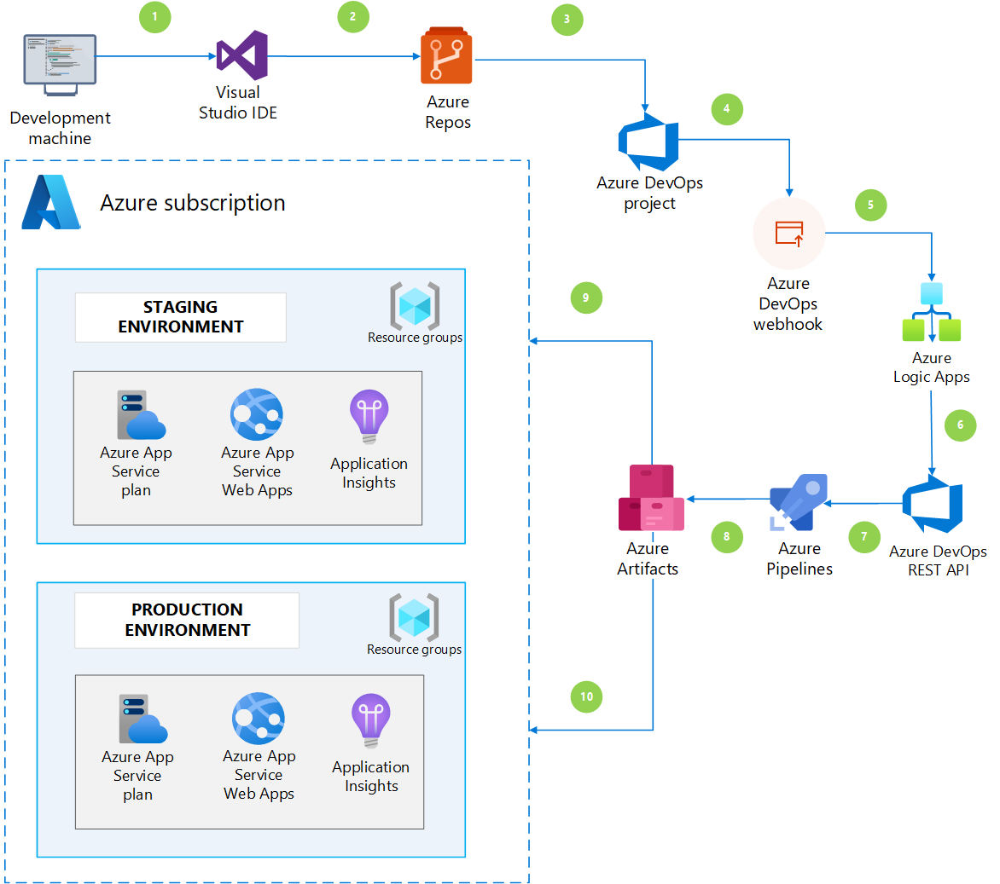
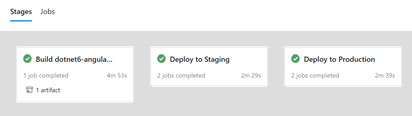

Engineering teams experience challenges when they set up Azure Pipelines for continuous deployment. The setup process involves build definitions, release definitions, branch policies, control gates, Azure Resource Manager (ARM) templates, and more. Furthermore, the setup for apps can take days with constant repetition. You can automate this part of the development.

This article shows you how to take advantage of Azure DevOps REST APIs to build continuous integration and continuous deployment (CI/CD) pipelines. Depending on the workload, the build steps in pipelines can vary. Every team has a preferred number of environments within their Azure subscriptions, that depend on their internal systems and business scenarios.

For example, an event like the first push into the repository sets off a series of steps and constructs the total development path for the repository. Developers can see their changes in minutes, and they no longer need to repeatedly set up Azure Pipelines to create developer, test, and production environments in Azure.

By using the solution described in this article, your engineering team can focus on projects that create value for your customers.

The following services are used in this solution:

- Azure DevOps REST APIs
- Azure Logic Apps
- Azure Pipelines

Here's a list of the real-world benefits of using this solution:

- Save time and costs by eliminating repetitive tasks.
- Teams can focus on their core priorities.
- Operational efforts are reduced.
- Teams can easily replicate pipelines.
- Accelerate your products time to market.

## Potential use cases

This architecture is industry agnostic and can be applied to any team-building software. The typical use cases for this architecture involve:

- Microservices design patterns
- Repeatable workload deployment
- Platform and product development

## Architecture

*Download a [PowerPoint file](https://arch-center.azureedge.net/automate-azure-pipelines.pptx) of this architecture.*

### Dataflow

- **Step 1** - The developer creates a starter project using one of the preloaded templates in Visual Studio, like a .NET Angular workload. This example uses an Azure Resource Manager (ARM) template that can provision an AppService Plan, App Service, and Application Insights.
- **Step 2** -The repository also contains a multistage YAML pipeline file. The multistage YAML pipeline has precise steps on how the solution needs to be built and published. We recommended you add an Azure resource group project to the same Visual Studio solution.
- **Steps 3-5** - Once the developer submits a `git push` into an Azure DevOps repository, a webhook is dispatched from Azure DevOps to a logic app.
- **Step 6** - When the HTTP trigger of the logic app is invoked, the logic app determines whether the push is made in the main or feature branches. Once the commit is detected in the main branch of the repository, the logic app looks for existing pipelines corresponding to the repository.
- **Step 7** - If the pipeline meant for this repository already exists in Azure DevOps, the logic app updates the pipeline through Azure DevOps REST APIs. If the pipeline doesn't exist, a new pipeline is provisioned.
- **Step 8** - The multistage pipeline is authored to build, publish, and deploy the artifact to Azure resources. The published artifact has a .NET Angular zip folder that can be deployed to the app service. The artifact also contains ARM templates and parameter files that are used to provision the Azure infrastructure.
- **Steps 9-10** - In this architecture, the multistage pipeline will build and publish into staging and production Azure environments. See the following image:

This architecture reduces labor by automatically provisioning pipelines in Azure DevOps, which in turn provisions the infrastructure in Azure and deploys the artifact automatically. Within minutes, developers can see their changes in production. The feedback loop from code to customer is also reduced.

### Components

- [Application Insights](/azure/azure-monitor/app/app-insights-overview) is a part of the Azure Monitor solution. Application Insights gathers telemetry data from a .NET Angular app.
- [Azure App Service](https://azure.microsoft.com/services/app-service) deploys .NET Angular workloads.
- [Azure DevOps REST APIs](/rest/api/azure/devops) automatically provisions Azure Pipelines for the repository with Logic Apps.
- [Azure Logic Apps](https://azure.microsoft.com/services/logic-apps) is a cloud-based platform for creating and running automated workflows that integrate your apps, data, services, and systems.
- [Azure Monitor](https://azure.microsoft.com/services/monitor) shows the availability, performance, and usage of your web applications.
- [Azure Pipelines](https://azure.microsoft.com/services/devops/pipelines) builds multistage pipelines.

### Alternatives

An alternative to the proposed architecture is Azure DevOps Starter service. Azure App Service also supports Deployment Center. However, this alternative requires you to provision the infrastructure first. The alternative provides an architecture that is code first, which provisions the infrastructure through code. This gives you the flexibility to use any kind of Azure workload.  For more information, see [DevOps Starter](/azure/devops-project/overview) and [Deployment Center](/azure/app-service/deploy-continuous-deployment).

## Considerations

This section covers the considerations when automating multistage pipelines with Azure Pipelines.

### Availability

This architecture uses Logic Apps and Azure DevOps REST API, which makes these Azure services compliant with most solution requirements.

### Security

Some features, like approval gates for Azure DevOps environments, cannot be directly modified in YAML templates and needs to be manually configured. Also, use variable groups to configure sensitive parameters in multistage pipeline YAML templates.

## Pricing

The core services used in this architecture include Azure DevOps REST APIs and Logic Apps. The Azure DevOps REST API isn't billed separately. These services are included as part of the Azure DevOps platform.

The logic apps that are invoked with `git commit` can run on any of the available plans, and doesn't use a standard HTTP connector. The base pricing of the logic app depends on the type of plan the logic app is provisioned. For this solution, we suggest running the logic app on a standard plan.  For more information on pricing, see [Logic Apps pricing](https://azure.microsoft.com/pricing/details/logic-apps/).

## Next steps

- Besides .NET Angular workloads, there are several other types of workloads that can be deployed based on similar principles. Read how chatbots can be deployed using ARM templates and CI/CD pipelines. For more information, see [Build a CI/CD pipeline for chatbots with ARM templates](../apps/devops-cicd-chatbot.yml).
- Deploying a two tier .NET application using Azure DevOps CI/CD pipelines. For more information, see [Design a CI/CD pipeline using Azure DevOps](../apps/devops-dotnet-webapp.yml).
- Read about the [DevOps journey at Microsoft](https://azure.microsoft.com/solutions/devops/devops-at-microsoft/).

## Related resources

- [CI/CD pipeline for container-based workloads](../apps/devops-with-aks.yml)
- [DevTest and DevOps for microservice solutions](../../solution-ideas/articles/dev-test-microservice.yml)
- [DevTest and DevOps for IaaS solutions](../../solution-ideas/articles/dev-test-iaas.yml)
- [DevTest and DevOps for PaaS solutions](../../solution-ideas/articles/dev-test-paas.yml)
- [Gridwich Azure DevOps setup](../../reference-architectures/media-services/set-up-azure-devops.yml)
