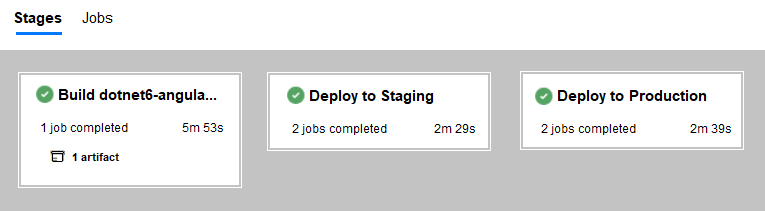

This article explains how to automate the process of creating developer, test, and production environments for continuous deployment. Key automation components include Azure Logic Apps and Azure Pipelines.

## Architecture

*Download a [PowerPoint file](https://arch-center.azureedge.net/automate-azure-pipelines.pptx) of this architecture.*

### Dataflow

1. A developer creates a starter project in Visual Studio by using a preloaded template, such as a .NET Angular workload. In that same Visual Studio solution, the developer creates a project for an Azure resource group. That project uses an Azure Resource Manager (ARM) template to provision an Azure App Service plan, an App Service instance, and Application Insights.
1. The developer's repository contains a multistage YAML pipeline file that specifies how to build and publish the solution.
1. The developer uses `git push` to copy the solution to an Azure DevOps repository.
1. In response to the Git command, Azure DevOps dispatches a notification via a webhook.
1. The webhook triggers a logic app.
1. The logic app determines whether the push command was in the main branch or a feature branch of the repository. If the logic app detects a commit in the main branch, it searches for pipelines that correspond to the repository.
1. If a pipeline for the repository already exists in Azure DevOps, the logic app uses Azure DevOps REST APIs to update the pipeline. If no pipeline exists, the logic app provisions a new one.
1. The multistage pipeline builds, publishes, and deploys an artifact to Azure resources. The published artifact has a .NET Angular zip folder that can be deployed to the app service. The artifact also contains ARM templates and parameter files that provision the Azure infrastructure.
1. The multistage pipeline deploys the artifact to an Azure staging environment.
1. The multistage pipeline deploys the artifact to an Azure production environment.

The solution reduces labor by automatically provisioning pipelines in Azure DevOps. Those pipelines provision infrastructure in Azure and automatically deploy artifacts. The solution also reduces the feedback loop from code to customer. As the following screenshot shows, within minutes, developers see their changes in production.

### Components

- [Application Insights](/azure/azure-monitor/app/app-insights-overview) is a part of the Azure Monitor solution. Application Insights gathers telemetry data from a .NET Angular app.
- [Azure App Service](https://azure.microsoft.com/services/app-service) deploys .NET Angular workloads.
- [Azure DevOps REST APIs](/rest/api/azure/devops) automatically provisions Azure Pipelines for the repository with Logic Apps.
- [Azure Logic Apps](https://azure.microsoft.com/services/logic-apps) is a cloud-based platform for creating and running automated workflows that integrate your apps, data, services, and systems.
- [Azure Monitor](https://azure.microsoft.com/services/monitor) shows the availability, performance, and usage of your web applications.
- [Azure Pipelines](https://azure.microsoft.com/services/devops/pipelines) builds multistage pipelines.

### Alternatives

An alternative to the proposed architecture is Azure DevOps Starter service. Azure App Service also supports Deployment Center. However, this alternative requires you to provision the infrastructure first. The proposed solution in this architecture is code first, which provisions the infrastructure through code. This gives you the flexibility to use any kind of Azure workload.  For more information, see [DevOps Starter](/azure/devops-project/overview) and [Deployment Center](/azure/app-service/deploy-continuous-deployment).

## Scenario details

The process of setting up Azure pipelines for continuous deployment can involve numerous tedious steps. Common tasks include setting up build definitions, release definitions, branch policies, control gates, and Azure Resource Manager (ARM) templates. When developers repeat these steps for every app they build, the effort can take them days and involve considerable effort.

To reduce developer toil, you can automate ... The solution in this article uses Azure DevOps REST APIs to build continuous integration and continuous deployment (CI/CD) pipelines.

Depending on the workload, the build steps in pipelines can vary. Every team has a preferred number of environments within their Azure subscriptions that depend on their internal systems and business scenarios. These decisions will influence the number of stages in the Azure pipelines.

By using Azure DevOps service hooks and REST APIs, an event (such as the first push into the repository) can set off a series of steps and can construct the total development path for the repository. Developers can see their changes in minutes, and they no longer need to repeatedly set up Azure pipelines to create developer, test, and production environments in Azure. Instead, your engineering team can focus on projects that create value for your customers.

This solution offers many benefits. Teams that use the solution:

- Save time and money by eliminating repetitive tasks.
- Can focus on core priorities.
- Reduce operational efforts.
- Can easily replicate pipelines.
- Accelerate their products' time to market.

## Potential use cases

This architecture is industry agnostic and can be applied to any team-building software. The typical use cases for this architecture involve:

- Microservices design patterns
- Repeatable workload deployment
- Platform and product development

## Considerations

This section covers the considerations when automating multistage pipelines with Azure Pipelines.

### Availability

This architecture uses Logic Apps and Azure DevOps REST API, which makes these Azure services compliant with most solution requirements.

### Security

Some features, like approval gates for Azure DevOps environments, cannot be directly modified in YAML templates and needs to be manually configured. Also, use variable groups to configure sensitive parameters in multistage pipeline YAML templates.

## Pricing

The core services used in this architecture include Azure DevOps REST APIs and Logic Apps. The Azure DevOps REST API isn't billed separately. These services are included as part of the Azure DevOps platform.

The logic apps that are invoked with `git commit` can run on any of the available plans, and doesn't use a standard HTTP connector. The base pricing of the logic app depends on the type of plan the logic app is provisioned. For this solution, we suggest running the logic app on a standard plan.  For more information on pricing, see [Logic Apps pricing](https://azure.microsoft.com/pricing/details/logic-apps/).

## Deploy this scenario

You can find the source code, deployment files, and instructions to test this scenario on GitHub: 

- [Deploy an orchestrator logic app in Azure](https://github.com/mspnp/multi-stage-azure-pipeline-automation)
- [Deploy a .NET Angular workload](https://github.com/mspnp/multi-stage-azure-pipeline-automation-app)

## Next steps

- Besides .NET Angular workloads, there are several other types of workloads that can be deployed based on similar principles. Read how chatbots can be deployed using ARM templates and CI/CD pipelines. For more information, see [Build a CI/CD pipeline for chatbots with ARM templates](../apps/devops-cicd-chatbot.yml).
- Deploying an application using Azure DevOps CI/CD pipelines. For more information, see [Design a CI/CD pipeline using Azure DevOps](../apps/devops-dotnet-baseline.yml).
- Read about the [DevOps journey at Microsoft](https://azure.microsoft.com/solutions/devops/devops-at-microsoft/).

## Related resources

- [CI/CD pipeline for container-based workloads](../apps/devops-with-aks.yml)
- [DevTest and DevOps for microservice solutions](../../solution-ideas/articles/dev-test-microservice.yml)
- [DevTest and DevOps for IaaS solutions](../../solution-ideas/articles/dev-test-iaas.yml)
- [DevTest and DevOps for PaaS solutions](../../solution-ideas/articles/dev-test-paas.yml)
- [Gridwich Azure DevOps setup](../../reference-architectures/media-services/set-up-azure-devops.yml)
