This article describes how to automate Microsoft Sentinel integration and deployment operations with Azure DevOps. You implement Azure DevOps by using Microsoft Sentinel capabilities to help secure your deployment. You then use a DevSecOps framework to manage and deploy Microsoft Sentinel artifacts at scale.

## Architecture

The following diagram shows an Azure DevOps and Microsoft Sentinel IaC setup.

:::image type="content" border="false" source="./media/automate-sentinel-architecture.svg" alt-text="Diagram showing the architecture for automating a Microsoft Sentinel infrastructure as code pipeline." lightbox="./media/automate-sentinel-architecture.svg":::

*Download a [Visio file](https://arch-center.azureedge.net/US-1902821-automate-sentinel-integration-architecture.vsdx) of this architecture.*

### Dataflow

1. The scrum master and product management use Azure DevOps to define epics, user stories, and product backlog items as part of the project backlog.
   * The scrum master and product management use Azure Boards to create the backlog, schedule work in sprints, review the project board, create the repository structure, and set security rules like approval workflows and branches.
   * The Azure Git repository stores the scripts and the permits to manage Microsoft Sentinel artifacts in the infrastructure as code.
   * Artifacts and source control maintain the extensions and update packages or components of the DevSecOps workflow that are used in the solution, such as Azure Resource Manager Template Toolkit and PowerShell Pester.
2. Microsoft Sentinel artifacts:
   * Policies. SIEM engineers use Azure policies in the reference architecture, to configure and scale the diagnostic settings of the Azure services. The policies help automate deployment of the Microsoft Sentinel data connectors, such as Azure Key Vault. The policies are dependent on the OMSIntegration API.
   * Connectors. Microsoft Sentinel uses logical connectors, the Azure Data Connectors, to ingest security data, as in audits or metrics, from supported data sources, such as Azure Active Directory (Azure AD), Azure resources, Microsoft Defender, or third-party solutions. The main list of data connectors is managed by the SecurityInsights API. Others rely on the OMSIntegration API and are managed with the Azure Policy diagnostic settings.
   * Managed identity. Microsoft Sentinel uses managed identity to act on behalf of the Managed service identity (MSI) while interacting with playbooks, logic apps, or automation runbooks and the key vault.
   * Automation. SOC teams use automation during investigations. SOC teams run digital forensics data acquisition procedures with Azure Automation, such as Azure virtual machine (VM) chain of custody or eDiscovery (Premium) for Microsoft Defender.
   * Analytics. SOC analysts or threat hunters use built-in or custom analytics rules to analyze and correlate data in Microsoft Sentinel or to trigger playbooks if a threat and incident are identified.
   * Playbooks. Logic apps run the SecOps repeatable actions, such as assigning an incident, updating an incident, or taking remediation actions, like isolating or containing a VM, revoking a token, or resetting a user password.
   * Threat hunting. Threat hunters use proactive threat hunting capabilities that can be coupled with Jupyter notebooks for advanced use cases, such as data processing, data manipulation, data visualization, machine learning, or deep learning.
   * Workbooks. SIEM engineers use Workbooks dashboards to visualize trends and statistics and to view the status of a Microsoft Sentinel instance and its subcomponents.
   * Threat intelligence. A specific data connector that fuses threat intelligence platforms feeds into Microsoft Sentinel. Two connectivity methods are supported: TAXII and Graph API. Both methods serve as *tiIndicators*, or threat intelligence indicators, in security APIs.
3. Azure AD. Identity and access management capabilities are delivered to components that are used in the reference architecture, such as managed identities, service principals, Azure role-based access controls (RBACs) for Microsoft Sentinel, logic apps, and automation runbooks.
4. Azure Pipelines. DevOps engineers use pipelines to create service connections for managing the different Azure subscriptions like the sandbox and production environments with continuous integration and continuous delivery (CI/CD) pipelines. We recommend using approval workflows to prevent unexpected deployments and separated service principals if you target multiple subscriptions per Azure environment.
5. Azure Key Vault. SOC engineers use the key vault to securely store service principal secrets and certificates. This component of the architecture helps enforce the DevSecOps principle of _no secrets in code_ when used by Azure Pipeline service connections.
6. Azure subscription. The SOC teams use two instances of Microsoft Sentinel in this reference architecture, separated within two logical Azure subscriptions to simulate production and sandbox environments. You can scale for your needs with other environments, such as testing, dev, preproduction, and so on.

#### Dataflow example

1. An administrator adds, updates, or deletes an entry in their fork of the Microsoft 365 configuration file.
2. The administrator commits and syncs the changes to their forked repository.
3. The administrator then creates a pull request (PR) to merge the changes to the main repository.
4. The build pipeline runs on the PR.

### Components

* [Azure Active Directory](https://azure.microsoft.com/services/active-directory) is a multi-tenant, cloud-based service to manage your identity and access controls.
* [Azure DevOps](https://azure.microsoft.com/services/devops) is a cloud service to collaborate on code, build and deploy apps, or plan and track your work.
* [Azure Key Vault](https://azure.microsoft.com/services/key-vault) is a cloud service for securely storing and accessing secrets. A secret is anything that you want to tightly control access to, such as API keys, passwords, certificates, or cryptographic keys.
* [Azure Policy](https://azure.microsoft.com/services/azure-policy) is a service to create, assign, and manage policy definitions in your Azure environment.
* [Microsoft Sentinel](https://azure.microsoft.com/services/azure-sentinel) is a scalable, cloud-native, SIEM and security orchestration, automation, and response (SOAR) solution.
* [Azure Automation](https://azure.microsoft.com/services/automation) is a service for simplifying cloud management through process automation. Use Azure Automation to automate long-running, manual, error-prone, and frequently repeated tasks. Automation helps improve reliability, efficiency, and time to value for your company.

## Scenario details

Security operations center (SOC) teams sometimes experience challenges when they integrate Microsoft Sentinel with Azure DevOps. The process involves many steps, and the setup can take days and involve repetition. You can automate this part of the development.

To modernize for the cloud, engineers must constantly learn new skills and techniques for securing and protecting vital business assets. Engineers must build robust and scalable solutions that keep pace with the changing security landscape and with business needs. A security solution must be flexible, agile, and carefully planned from the earliest stages of development. This early-planning methodology is known as *shift-left*.

This article describes how to automate Microsoft Sentinel integration and deployment operations with Azure DevOps. You can expand the solution for complex organizations that have multiple entities, subscriptions, and various operating models. Some of the operating models supported by this solution include local SOC, global SOC, cloud service provider (CSP), and managed security service provider (MSSP).

This article is intended for the following audiences:

* SOC specialists, like analysts and threat hunters
* Security information and event management (SIEM) engineers
* Cybersecurity architects
* Developers

### Potential use cases

Following are the typical use cases for this architecture:

* Rapid prototyping and proof of concept. This solution is ideal for security organizations and SOC teams that want to improve cloud threat coverage or modernize their SIEM infrastructure with infrastructure as code (IaC) and Microsoft Sentinel.
* Microsoft Sentinel as a service. This development framework integrates service lifecycle management principles. These principles suit simple or complex teams like MSSPs who run repeatable, standardized actions across multiple customer tenants while combining the power of Azure DevOps and Azure Lighthouse. For example, a team that needs to publish Microsoft Sentinel use cases for a new threat actor or ongoing campaign could use this solution.
* Building SOC use cases for threat detection. Many groups and threat intelligence platforms rely on MITRE Att&ck content and taxonomy to analyze their security posture against advanced tradecraft or techniques and tactics procedures. The solution defines a structured approach for developing threat detection engineering practices by incorporating MITRE Att&ck terminology within Microsoft Sentinel artifacts development.

The following illustration shows a MITRE Att&ck cloud scenario.

:::image type="content" border="false" source="./media/mitre-attack-in-sentinel-artifacts-dev.svg" alt-text="Diagram of a MITRE Att&ck cloud scenario." lightbox="./media/mitre-attack-in-sentinel-artifacts-dev.svg":::

*Download a [Visio file](https://arch-center.azureedge.net/US-1902821-automate-sentinel-integration-architecture.vsdx) of this architecture.*

## Threat definition attack scenarios based on MITRE

This table shows you the terms, definitions, and details of important aspects of attack scenarios.

| Data item | Description | Microsoft Sentinel artifacts |
| -- | --- | --- |
| Title | Descriptive name for the attack scenario, based on attack vector characteristics or technique descriptions. | MITRE manifest |
| MITRE ATT&CK tactics | MITRE ATT&CK tactics related to attack scenario | MITRE manifest |
| MITRE ATT&CK techniques | MITRE ATT&CK techniques, including the technique or sub-technique ID, related to the attack scenario. | MITRE manifest |
| Data connector sources | Source of information collected by a sensor or logging system that might be used to collect information relevant to identifying the action being performed, sequence of actions, or the results of those actions by an adversary. | [Microsoft Sentinel data connector](/azure/sentinel/connect-data-sources) or [Custom log source](/azure/sentinel/connect-custom-logs?tabs=DCG)|
| Description | Information about the technique, what it is, what it's typically used for, how an adversary can take advantage of it, and variations on how it could be used. Includes references to authoritative articles describing technical information related to the technique as well as in the wild use references as appropriate. |
| Detection | High-level analytic process, sensors, data, and detection strategies useful in identifying a technique that's been used by an adversary. This section informs those responsible for detecting adversary behavior, such as network defenders, so they can take an action such as writing an analytic or deploying a sensor. There should be enough information and references to point toward useful defensive methodologies. Detection might not always be possible for a certain technique and should be documented as such. | Analytics threat hunting |
| Mitigation | Configurations, tools, or processes that prevent a technique from working or having the desired outcome for an adversary. This section informs those responsible for mitigating against adversaries, such as network defenders or policymakers, to let them take an action such as changing a policy or deploying a tool. Mitigation might not always be possible for a given technique and should be documented as such. |
| Mitigation | Configurations, tools, or processes that prevent a technique from working or having the desired outcome for an adversary. This section describes how to lessen the effects of adversary attacks for network defenders or policymakers. It covers steps for changing a policy or deploying a tool. Mitigation might not always be possible for a certain technique and should be documented as such. | Playbooks, automation runbooks |

## Considerations

These considerations implement the pillars of the Azure Well-Architected Framework, a set of guiding tenets that you can use to improve the quality of a workload. For more information, see [Microsoft Azure Well-Architected Framework](/azure/architecture/framework).

### Security

Security provides assurances against deliberate attacks and the abuse of your valuable data and systems. For more information, see [Overview of the security pillar](/azure/architecture/framework/security/overview).

With security, in general terms, automation increases operations efficiency while saving time for more complex use cases, such as threat detection engineering, threat intelligence, SOC, and SOAR use cases. DevOps teams need to know where they can use IaC securely in the context of Microsoft Sentinel CI/CD. This process introduces the use of specific identities that are used by non-human accounts in Azure AD called [service principals](/azure/active-directory/develop/app-objects-and-service-principals) and [managed identities](/azure/active-directory/managed-identities-azure-resources/overview).

The following table summarizes security considerations for service principals and the main use cases that are covered by Microsoft Sentinel and Azure DevOps release pipelines.

| Use case | Requirements (least privilege) | Role assignment duration | Permission scope | Trustee| Security considerations |
| -- | --- | --- | --- | --- | ---------- |
| Enable Microsoft Sentinel connectors | Security administrator** <br><br> Owner* <br><br> Microsoft Sentinel contributor <br><br> Reader | JIT (one-time activation) <br><br> On purpose (every time a new subscription and connector deploys) | Tenant | SPN | Use the key vault to store service principal name (SPN) secrets and certificate. <br><br> Enable SPN auditing. <br><br> Periodically, review the permission assignment (Azure Privileged Identity Management for SPN) or suspicious activity for SPN. <br><br>Use Azure AD certificate authorities and multifactor authentication (when supported) for privileged accounts. <br><br> Use Azure AD Custom Roles for more granularity. |
| Deploy Microsoft Sentinel artifacts, such as workbooks, analytics, rules, threat hunting queries, notebooks, and playbooks | Microsoft Sentinel Contributor <br> Logic Apps contributor  | Permanent | Microsoft Sentinel's Workspace or Resource Group | SPN | Use Azure DevOps (ADO) workflow approval and checks to secure pipeline deployment with this SPN. |
| Assign a policy to configure log streaming features to Microsoft Sentinel|  Resource Policy Contributor ** | On purpose (every time a new subscription and connector deploys) | All subscriptions to be monitored| SPN | Use Microsoft Azure Active Directory (Azure AD), CA, and MFA, when supported, for privileged accounts. |

\* Only concerns Azure AD diagnostics settings. <br>
\** Specific connectors need additional permissions like "security administrator" or "resource policy contributor" to allow streaming data to Microsoft Sentinel workspace, Azure AD, Microsoft 365 or Microsoft Defender, and Platform as a service (PaaS) resources like Azure Key Vault.

#### Privileged access model

We recommend adopting a privileged access model strategy to rapidly lower the risks to your company from high-impact and high-likelihood attacks on privileged access. In the case of automatic processes in a DevOps model, base the identity on [service principal](/azure/active-directory/develop/app-objects-and-service-principals) identities.

Privileged access should be the top security priority at every company. Any compromise of these identities creates highly negative impacts. Privileged identities have access to business-critical assets, which nearly always causes major impacts when attackers compromise these accounts.

Security of privileged access is critically important because it's foundational to all other security assurances. An attacker in control of your privileged accounts can undermine all other security assurances.  

For that reason, we recommend logically spreading the service principals into different levels or tiers by following a minimum privilege principle. The following illustration shows how to classify the service principals, depending on the type of access and where the access is required.

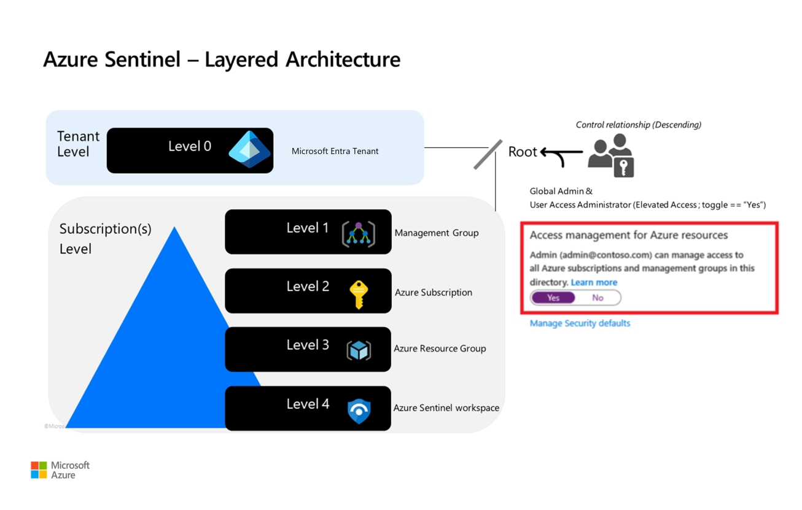

*Download a [PowerPoint file](https://arch-center.azureedge.net/US-1902821-automate-sentinel-integration-architecture.pptx) of this architecture.*

##### Level 0 service principals

Level 0 service principals have the highest level of permissions. These service principals entitle someone to perform tenant-wide or root management group administration tasks as a global administrator.

For security reasons and manageability, we recommend that you have only one service principal for this level. The permissions for this service principal persist, so we recommend that you grant only the minimum permissions that are required and keep the account monitored and secured.

Store the secret or certificate for this account securely in Azure Key Vault. We strongly recommended that you locate the key vault in a dedicated administrative subscription if possible.

##### Level 1 service principals

Level 1 service principals are elevated permissions that are limited and scoped to management groups at the business organization level. These service principals entitle someone to create subscriptions under the management group that's in scope.

For security reasons and manageability, we recommend that you have only one service principal for this level. The permissions for this service principal persist, so we highly recommended that you grant only the minimum permissions that are required and keep the account monitored and secured.

Store the secret or certificate for this account securely in Azure Key Vault. We strongly recommended that you locate the key vault in a dedicated administrative subscription if possible.

##### Level 2 service principals

Level 2 service principals are limited to the subscription level. These service principals entitle someone to perform administrative tasks under a subscription, acting as the subscription owner.  

For security reasons and manageability, we recommend that you have only one service principal for this level. The permissions for this service principal persist, so we highly recommend that you grant only the minimum permissions that are required and keep the account monitored and secured.

Store the secret or certificate for this account securely in Azure Key Vault. We strongly recommended that you locate the key vault in a dedicated administrative resource group.

##### Level 3 service principals

Level 3 service principals are limited to the Workload Administrator. In a typical scenario, every workload is contained inside the same resource group. This structure limits the service principal permissions to just this resource group.

For security reasons and manageability, we recommend that you have only one service principal per workload. The permissions for this service principal persist, so we highly recommend that you grant only the minimum permissions that are required and keep the account monitored and secured.

Store the secret or certificate for this account securely in Azure Key Vault. We strongly recommended that you locate the key vault in a dedicated administrative resource group.

##### Level 4 service principals

Level 4 service principals have the most limited permissions. These service principals entitle someone to perform administrative tasks that are limited to one resource.

We recommended using managed identities where possible. In the case of non-managed identities, store the secret or certificate securely in Azure Key Vault where Level 3 secrets are stored.

### Operational excellence

Operational excellence covers the operations processes that deploy an application and keep it running in production. For more information, see [Overview of the operational excellence pillar](/azure/architecture/framework/devops/overview).

Microsoft Sentinel solutions are composed of three blocks, which ensure complete and successful operations.  

The first block is the environment definition, which makes up the essential architecture elements. Your main concern with this block is to consider the number of production and non-production environments to be deployed, and then ensure the setup is homogeneous in all cases.

The second block is the Microsoft Sentinel connector deployment, where you consider the kind of connectors that are required by your team and the security requirements to enable them.

The third block is the Microsoft Sentinel artifacts lifecycle management, which covers coding, deployment, and use or destruction of the components. For example, this block contains the analytic rules, playbooks, workbooks, threat hunting, and so on.

Consider these dependencies between artifacts:

* Automation rules that are defined in an analytics rule
* Workbooks or analytics that require a new data source or connector
* Managing the updates of existing components
  * How to version your artifacts
  * How to identify, test, and deploy an updated or entirely new analytics rule

### Build, test, and deploy infrastructure

In managing Microsoft Sentinel solutions and DevOps, it's important to consider the connectivity and security aspects of your enterprise architecture.

Azure DevOps can use Microsoft-hosted agents or self-hosted agents for build, test, and deploy activities.
Depending on your company's requirements, you can use Microsoft-hosted, self-hosted, or a combination of both models.

* Microsoft-hosted agents. This option is the fastest way to work with Azure DevOps agents, because it's a shared infrastructure for your entire organization. For more information on using Microsoft-hosted agents in your pipeline, see [Microsoft-hosted agents](/azure/devops/pipelines/agents/hosted?tabs=yaml). Microsoft-hosted agents can work in hybrid-networking environments, granting access for the IP ranges. To download the IP ranges that these agents grant access to, see [Azure IP Ranges and Service Tags – Public Cloud](https://www.microsoft.com/download/details.aspx?id=56519).
* Self-hosted agents. This option gives you dedicated resources and more control when installing dependent software for your builds and deployments. Self-hosted agents can work over VMs, scale sets, and containers on Azure. For more information on self-hosted agents, see [Azure Pipelines agents](/azure/devops/pipelines/agents/agents?tabs=browser#install).

#### GitHub runners

GitHub can use GitHub-hosted runners or self-hosted runners for activities that are related to building, testing, and deploying. Depending on your company's needs, you can use GitHub-hosted, self-hosted, or a combination of both models.

**GitHub-hosted runners**

This option is the fastest way to work with GitHub workflows, since it's a shared infrastructure for an entire organization. For more information, see [About GitHub-hosted runners](https://docs.github.com/actions/using-github-hosted-runners/about-github-hosted-runners). GitHub-hosted agents work in hybrid-networking environments, according to certain network requirements. For more information on the network requirements, see [Supported runners and hardware resources](https://docs.github.com/actions/using-github-hosted-runners/about-github-hosted-runners#ip-addresses).
  
**Self-hosted runners**

This option gives your company a dedicated resources infrastructure. Self-hosted runners work over VMs and containers on Azure and support auto-scaling.

**Considerations for choosing runners**

When choosing options for the agents and runners in your Microsoft Sentinel solution, consider the following needs:

* Does your company need dedicated resources for running processes on your Microsoft Sentinel environments?
* Do you want to isolate resources for production environment DevOps activities from the rest of the environments?
* Do you need to test certain cases that require access to critical resources or resources that are available only on an internal network?

### Orchestration and automation of release processes

You can set up the deployment process with Azure DevOps or GitHub. Azure DevOps supports using a YAML pipeline or a release pipeline. For more information on using a YAML pipeline in Azure DevOps, see [Use Azure Pipelines](/azure/devops/pipelines/get-started/pipelines-get-started). For more information on using a release pipeline in Azure DevOps, see [Release pipelines](/azure/devops/pipelines/release/). For more information on using GitHub with GitHub Actions, see [Understanding GitHub Actions](https://docs.github.com/actions/learn-github-actions/understanding-github-actions).

#### Azure DevOps

You can do the following deployment activities in an Azure DevOps deployment.

* Use a YAML pipeline to automatically trigger PR approvals or run on demand.  
* Manage service connections for different environments by using Azure DevOps groups.
* On your critical environments, set up deployment approvals by using the service connection feature and Azure DevOps groups to assign specific user permissions in your team.

#### GitHub

You can do the following deployment activities in a GitHub deployment.

* Use GitHub to create PRs or deployment activities.  
* Manage service principal credentials by using GitHub Secrets.
* Integrate deployment approval through the workflow that's associated with GitHub.

### Automatic deployment with Microsoft Sentinel infrastructure

You can deploy one or more Microsoft Sentinel environments, depending on your enterprise architecture:

* Organizations that need multiple instances on their production environment can set up different subscriptions on the same tenant for each geographical location.  
* A centralized instance on the production environment provides access to one or more organizations on the same tenant.
* Groups that need multiple environments like production, preproduction, integration, and so on can create and destroy them as needed.

#### Physical versus logical environment definitions

You have two choices in setting up your environment definitions, physical or logical. Both have different options and advantages:

* Physical definition - The elements of the Microsoft Sentinel architecture are defined with the following options for infrastructure as code (IaC):
  * Bicep templates
  * Azure Resource Manager templates (ARM templates)
  * Terraform
* Logical definition - This acts as an abstraction layer for setting up different teams in the group and defining their environments. The definition is set in the deployment pipeline and workflows as input for the build environment by using the physical infrastructure layer.

Consider these points when you define your logical environments:

* Naming conventions
* Environment identifications
* Connectors and configurations

#### Code repository

Given the environment approaches that are shown in the previous section, consider the following GitHub code repository organization.

Physical definition - Based on IaC options, think about an approach that uses individual module definitions that are linked in the main deployment definition.

The following example shows how your code might be organized.

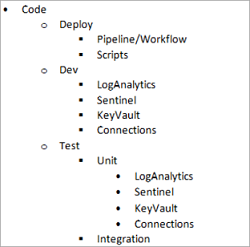

Restrict access to this repository to the team that defines the architecture at the physical level, ensuring a homogeneous definition in the enterprise architecture.

You can adapt the branching and merging strategy to the deployment strategy for each organization. If your team needs to start with the definition, see [Adopt a Git branching strategy](/azure/devops/repos/git/git-branching-guidance).

For more information on ARM templates, see [Using linked and nested templates when deploying Azure resources](/azure/azure-resource-manager/templates/linked-templates?tabs=azure-powershell#linked-template).

For more information on setting up Bicep environments, see [Install Bicep tools](/azure/azure-resource-manager/bicep/install). For more information on GitHub, see [GitHub flow](https://docs.github.com/get-started/quickstart/github-flow).

Logical definitions define a company's environments. The Git repository gathers the different definitions for a company.

The following example shows how your code might be organized.

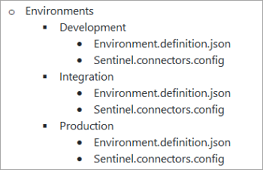

The repository reflects the PR actions that are made by different teams. Multiple environments are defined by different teams and approved by the company's owners or approvers.

The privilege level for running an environment deployment is Level 2. This level ensures that the resource group and the resources are created for the environment with the necessary security and privacy. This level also sets the user permissions on allowed actions in the production environments, production and preproduction.  

Organizations that want environments on demand for testing and development and the ability to then destroy the environments after finishing their testing, can implement an Azure DevOps pipeline or GitHub actions. They can set scheduled triggers to destroy the environments as needed by using Azure DevOps events or GitHub actions.

#### Microsoft Sentinel connectors automatic configuration  

Microsoft Sentinel connectors are an essential part of the solution that supports connecting with different elements in the enterprise architecture landscape, like Azure AD, Microsoft 365, Microsoft Defender, threat intelligence platform solutions, and so on.  

When you define an environment, you can use the connectors configuration to set up environments with homogeneous configurations.

Enabling connectors as part of the DevOps model must be supported by the service principal level model. This focus ensures the right level of permissions as shown in the following table.

| Connector scenario | Privilege access model level | Azure least privilege | Requires workflow approval  |
| ---- | --- | --- | --- |
| Azure AD | Level 0 | global admin or security admin | Recommended |
| Azure AD identity protection | Level 0 | global admin or security admin | Recommended |
| Microsoft Defender for Identity | Level 0 | global Admin or security admin | Recommended |
| Microsoft Office 365 | Level 0 | global admin or security admin | Recommended |
| Microsoft Cloud App Security | Level 0 | global admin or security admin | Recommended |
| Microsoft 365 Defender | Level 0 | global admin or security admin | Recommended |
| Microsoft Defender for IOT | Level 2 | Contributor | Recommended |
| Microsoft Defender for Cloud | Level 2 | Security Reader | Optional |
| Azure Activity | Level 2 | Subscription Reader | Optional |
| Threat Intelligence Platforms | Level 0 | global admin or security admin | Recommended |
| Security Events | Level 4 | None | Optional |
| Syslog | Level 4 | None | Optional |
| DNS (preview) | Level 4 | None | Optional |
| Windows Firewall | Level 4 | None | Optional |
| Windows Security Events via AMA | Level 4 | None | Optional |

### Microsoft Sentinel artifacts deployment  

In the implementation of Microsoft Sentinel artifacts, DevOps gains greater relevance, because each company creates multiple artifacts for preventing and remediating attacks.

Implementing the artifacts can be the responsibility of one team or multiple teams. Automatic build and artifacts deployment is often the most common process requirement and determines the approach and conditions for your agents and runners.

Deploying and managing Microsoft Sentinel artifacts requires using the Microsoft Sentinel REST API. For more information, see [Microsoft Sentinel REST API](/rest/api/securityinsights). The following diagram shows an Azure DevOps pipeline on an Azure REST API stack.

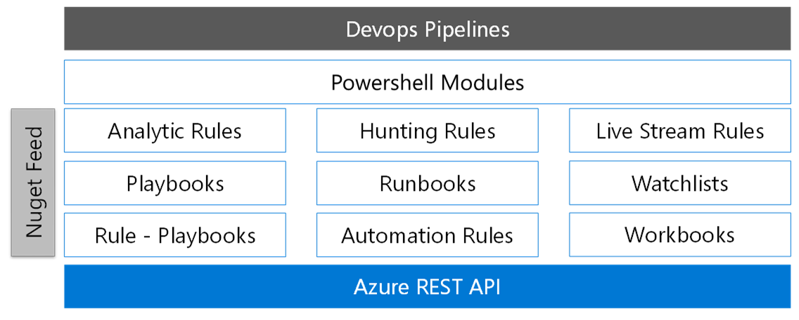

You can also implement your repository by using PowerShell.

If your team uses MITRE, consider classifying the different artifacts and specifying the tactics and techniques for each one. Be sure you include a corresponding metadata file for each artifact type.

For example, if you're creating a new playbook by using an Azure ARM template and the file name is _Playbook.arm.json_, you add a JSON file named _Playbook.arm.mitre.json_. The metadata for this file then includes the CSV, JSON, or YAML formats that correspond to the MITRE tactics or techniques that you're using.

By following this practice, your team can evaluate your MITRE coverage based on the jobs that are done during setup for the different artifact types that you use.

#### Build artifacts

The objective of your build process is to ensure that you generate the highest quality artifacts. The following diagram shows some of the build process actions that you can take.

:::image type="content" source="./media/build-artifact-process-lightbox.svg" alt-text="Diagram showing Microsoft Sentinel build process." lightbox="./media/build-artifact-process-lightbox.svg":::

*Download a [Visio file](https://arch-center.azureedge.net/US-1902821-automate-sentinel-integration-architecture.vsdx) of this architecture.*

* You can base your artifact definition on a descriptive schema in JSON or YAML format and then validate the schema to avoid syntax errors.  
  * Validate your ARM templates by using [ARM template test toolkit](/azure/azure-resource-manager/templates/test-toolkit).
  * Validate your YAML and JSON files for custom models by using PowerShell.
* Validate your watchlist settings and be sure that the classless inter-domain routing (CIDR) records that you define follow the correct schema, for example, 10.1.0.0/16.  
* Use keyword query language (KQL) queries, which you can validate at the level of the syntax, for analytic rules, hunting rules, and live stream rules, which you can validate at the level of the syntax.
* Make the [KQL local validation](https://github.com/Azure/Azure-Sentinel#run-kql-validation-locally) one option.
* Integrate the [KQL inline validation](https://github.com/Azure/Azure-Sentinel/blob/master/.azure-pipelines/kqlValidations.yaml) tool in the DevOps pipeline.
* If you're implementing logic that's based on PowerShell for Azure Automation, you can include syntax validation and unit testing by using the following elements:
  * [Pester](https://devblogs.microsoft.com/scripting/what-is-pester-and-why-should-i-care)
  * [PSScriptAnalyzer](/powershell/module/psscriptanalyzer/?view=ps-modules)  
* Generate the MITRE manifest metadata report based on the metadata files that are included with the artifacts.

#### Export artifacts

Usually, multiple teams work over several Microsoft Sentinel instances to generate necessary artifacts and validate them. With the goal of reusing existing artifacts, your company can set up automatic processes for getting the artifact definitions from existing environments. Automation can also supply information on any artifacts that are created by different development teams during setup.

The following diagram shows an example artifact extraction process.

:::image type="content" source="./media/artifact-extraction-process-lightbox.svg" alt-text="Diagram showing Microsoft Sentinel artifact extraction process." lightbox="./media/artifact-extraction-process-lightbox.svg":::

*Download a [Visio file](https://arch-center.azureedge.net/US-1902821-automate-sentinel-integration-architecture.vsdx) of this architecture.*

#### Deploy artifacts

The objectives of your deployment process are to:

* Reduce time to market.
* Increase performance across the multiple teams that are involved with setting up and managing your solution.
* Set up integration testing to evaluate the health of the environment.

Development teams use the process to ensure they can deploy, test, and validate artifact use cases that are under development. The architecture and SOC teams validate the pipeline quality on QA environments and work with the integration tests for attack scenarios. On the test cases, a team usually combines different artifacts as analytic rules, remediation playbooks, watchlists, and so on. A part of each use case includes simulating attacks where the entire chain is evaluated from ingestion, detection, and remediation.

The following diagram shows the deployment process sequence that ensures your artifacts are deployed in the right order.

:::image type="content" source="./media/artifact-deployment-process-lightbox.svg" alt-text="Diagram showing Microsoft Sentinel artifact deployment process." lightbox="./media/artifact-deployment-process-lightbox.svg":::

*Download a [Visio file](https://arch-center.azureedge.net/US-1902821-automate-sentinel-integration-architecture.vsdx) of this architecture.*

Managing Sentinel artifacts as code offers you flexible ways to maintain your operations and automate the deployment in a CI/CD DevOps pipeline.

Microsoft solutions provide automation workflows for the following artifacts.

| Artifact | Automation workflows |
| ---- | --- |
| Watchlists | Code review <br>Schema validation <br><br>[Deployment](/rest/api/securityinsights/preview/watchlists)<br>Create, update, delete watchlists and [items](/rest/api/securityinsights/preview/watchlist-items)|
| Analytics rules fusion<br>Microsoft Security<br>ML behavioral analytics<br>Anomaly<br>Scheduled | [Code review](/azure/security/develop/security-code-analysis-overview)<br>KQL Syntax validation<br>Schema validation<br>Pester<br><br>[Deployment](/rest/api/securityinsights/stable/alert-rules)<br>Create, Enable, Update, Delete, Export<br>[Alert templates support](/rest/api/securityinsights/stable/alert-rule-templates) |
| Automation rules | [Code review](/azure/security/develop/security-code-analysis-overview) <br>Schema validation<br><br>[Deployment](/rest/api/securityinsights/stable/alert-rules)<br>Create, enable, update, delete, export |
| Connectors | [Code review](/azure/security/develop/security-code-analysis-overview)<br>Schema validation<br><br>[Deployment](/rest/api/securityinsights/stable/data-connectors)<br>Actions: enable, delete (disable), update |
| Hunting rules | [Code review](/azure/security/develop/security-code-analysis-overview)<br>KQL Syntax validation<br>Schema validation<br>Pester<br><br>[Deployment](/azure/sentinel/hunting-with-rest-api)<br>Actions: create, enable, update, delete, export |
| Playbooks | [Code review](/azure/security/develop/security-code-analysis-overview)<br>TTK <br><br>[Deployment](/azure/logic-apps/logic-apps-azure-resource-manager-templates-overview) <br>Actions: create, enable, update, delete, export |
| Workbooks | [Deployment](/azure/azure-monitor/visualize/workbooks-automate)<br>Actions: create, update, delete |
| Runbooks | [Code review](/azure/security/develop/security-code-analysis-overview)<br>PowerShell syntax validation<br>Pester<br><br>[Deployment](/azure/automation/automation-deploy-template-runbook)<br>Actions: create, enable, update, delete, export |

Depending on the automation language you choose, some automation capabilities might not be supported. The following diagram shows which automation capabilities are supported by language.

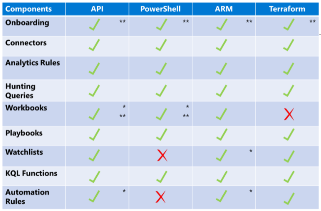

\* Features in development that are not yet documented<br>
\** Automation methods that are supported by [Microsoft Operational Insights](/rest/api/loganalytics/workspaces) or [Microsoft Insights Resource Provider APIs](/azure/templates/microsoft.insights/workbooks?tabs=bicep)

#### Azure Automation

The following diagram shows the components of simplifying Microsoft Sentinel access with managed service identity.

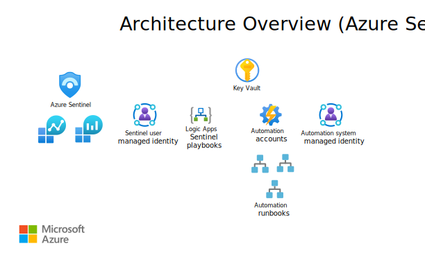

*Download a [Visio file](https://arch-center.azureedge.net/US-1902821-automate-sentinel-integration-architecture.vsdx) of this architecture.*

If you need to grant access to other resources, use managed identity, which ensures a unique identity for all critical operations.

Use Azure Automation for setting up playbooks. Use PowerShell scripts for the following complex tasks and automation features:

* Integrating with third-party solutions, where different levels of credentials are required and based on Azure AD or custom credentials:
  * Azure AD user credentials
  * Azure AD service principal credentials
  * Certificate authentication
  * Custom credentials
  * Managed identity
* Implementing a solution that reuses organizational scripts, or solutions that require the use of PowerShell commands to avoid complex translation to playbooks:
  * PowerShell-based solutions
  * Python-based solutions
* Implementing solutions in hybrid scenarios, where remediation actions can affect your cloud and on-premises resources.

#### Microsoft Sentinel repositories

Experienced DevOps teams might consider managing Microsoft Sentinel in infrastructure as code (IaC) with CI/CD pipelines that are built in Azure DevOps. Product groups understand the challenges that customers and partners face in building Azure DevOps security architecture, so the following two initiatives can help:  

* Documenting the reference architecture
* Developing a new solution, announced at Ignite 2021, that's called "Microsoft Sentinel Repositories"

To support choosing the solution that fits your team's needs, the following table compares the functional and technical criteria.

| Use case and features | Azure DevOps and GitHub custom approach | Microsoft Sentinel repositories |
| ---- | --- | --- |
| We want to quickly start deploying Microsoft Sentinel artifacts without spending time defining Azure DevOps architecture components, such as agents, pipelines, Git, dashboards, a wiki, service principals, RBACs, auditing, and so on. | Not recommended | Recommended |
| We have small teams and low skill sets to manage the CI/CD pipelines. | Not recommended | Recommended |
| We want to control and manage all security aspects of the CI/CD pipelines. |  Supported | Not supported |
| We need to integrate gates and branching for supervising integration, before allowing developers to trigger deployment pipelines, such as source control, coding review, rollback, workflow approval, and so on. | Supported | Partially supported |
| We have a customized Git or repository structure. | Supported | Supported |
| We don't use Resource Manager or Bicep IaC languages to build artifacts. | Supported | Not supported |
| We want to centrally manage the deployment of artifacts to multiple Microsoft Sentinel workspaces in a single Azure AD tenant. | Supported | Supported |
| We want to integrate or extend CI/CD pipelines across multiple Azure AD tenants. | Supported | Supported |
| We have playbooks with different parameterization depending on subscription, location, environment, and so on. | Supported | TBD, guidelines to be documented |
| We want to integrate different artifacts on the same repository to compose use cases. | Supported | Supported |
| We want the ability to bulk remove artifacts. | Supported | Not Supported |

### Availability, performance, and scalability

When choosing the architecture for the Azure DevOps agents in your company for Microsoft Sentinel scenarios, consider the following needs:

* The production environment might require a dedicated agents pool for operations over the Microsoft Sentinel environment.
* Non-production environments might share the agent pool with a large number of instances for handling the different demands from the teams, in particular, for CI/CD practices.
  * Attack simulation scenarios are a special case where dedicated agents can be required. Consider whether a dedicated pool is necessary for your testing needs.
* Organizations that work on hybrid networking scenarios might consider integrating the agents inside the network.

Organizations can create their own images for agents based on containers. For more information, see [Run a self-hosted agent in Docker](/azure/devops/pipelines/agents/docker#create-and-build-the-dockerfile-1).  

#### Microsoft Sentinel cross-tenant management with Azure DevOps

As a global SOC or MSSP, you might have to manage multiple tenants. Azure Lighthouse supports scaled operations across several Azure AD tenants at the same time, making your management tasks more efficient. For more information, see [Azure Lighthouse Overview](/azure/lighthouse/overview).

Cross-tenant management is especially effective in the following scenarios:

* Manage Microsoft Sentinel resources [in customer tenants](/azure/sentinel/multiple-tenants-service-providers).
* [Track attacks and view security alerts across multiple tenants](https://techcommunity.microsoft.com/t5/azure-sentinel/using-azure-lighthouse-and-azure-sentinel-to-monitor-across/ba-p/1043899).
* [View incidents](/azure/sentinel/multiple-workspace-view) across multiple Microsoft Sentinel workspaces that are spread across tenants.

#### Methods to onboard customers

You have two options to onboard customers, a managed service offer and an ARM template.

##### Manual onboarding using an ARM template

If you don't want to publish an offer to Azure Marketplace as a service provider, or you don't meet all the requirements, you can onboard customers manually by using ARM templates. This is the most likely option in an enterprise scenario, where the same enterprise has multiple tenants.

The following table compares the onboarding methods.

| Consideration | Managed service offer | ARM templates |
| ---- | --- | --- |
| Requires a [Partner Center account](/azure/marketplace/partner-center-portal/create-account) | Yes | No |
| Requires [Silver or Gold cloud platform competency level](/partner-center/learn-about-competencies) or [Azure Expert Managed Services Provider (MSP)](https://partner.microsoft.com/membership/azure-expert-msp) status | Yes | No |
| Available to new customers through Azure Marketplace | Yes | No |
| Can limit offer to specific customers | Yes (only with private offers, which can't be used with subscriptions that are established through a reseller of the CSP program) | Yes |
| Requires customer acceptance in Azure portal | Yes | No |
| Can use automation to onboard multiple subscriptions, resource groups, or customers | No | Yes |
| Provides immediate access to new built-in roles and Azure Lighthouse features | Not always (generally available after some delay) | Yes |

For more information on publishing managed service offers, see [Publish a managed service offer to Azure Marketplace](/azure/lighthouse/how-to/publish-managed-services-offers).

For more information on how to create an ARM template, see [Create and deploy ARM templates](/training/modules/create-deploy-azure-resource-manager-templates).

The following diagram shows the high-level architecture integration between an MSSP tenant and a customer's resource provider tenants with Azure Lighthouse and Microsoft Sentinel.

:::image type="content" source="./media/azure-lighthouse-for-microsoft-sentinel-architecture.svg" alt-text="Diagram showing a Microsoft Sentinel managed service identity architecture." lightbox="./media/azure-lighthouse-for-microsoft-sentinel-architecture.svg":::

1. An MSP offering is integrated through an ARM template or an Azure Marketplace service offering.
1. Azure delegated resource management checks that the request is from a partner tenant and calls a managed service resource provider.
1. The managed service resource provider uses RBAC to control the MSP's access.
1. The MSP completes SecOps actions on a customer resource.
1. The billing process treats expenses as customer charges. Split billing is possible if customer entities have separate workspaces in the same Azure AD tenant.
1. The security and sovereignty of the data is dependent on the customer's tenant boundary.

###### Identity across multiple tenants

To manage Microsoft Sentinel with Azure DevOps, evaluate the following design decisions for the components.

| Use case | Pros |
| ---- | --- |
| Global identity for managing DevOps actions, single service principal | This case applies to global deployment processes, which involve all tenants.<br><br>Using unified identity facilitates the access for the different tenants but could make the process of managing approval actions for specific tenants complex.<br><br> The protection mechanism and authorization model for this kind of identity is also very important, to avoid non-authorized usage that's due to the related global impact. |  
| Dedicated identity for managing DevOps actions, multiple service principals | This case applies when deployment processes are dedicated for each tenant or tenant actions require approval. <br><br>In this case, the recommendation for protecting and authorizing this identity usage is the same as in the global case, even when the impact is reduced. |

###### Code repository organization

| Use case | Pros |
| ---- | --- |
| Unified repository with a single version of code for all tenants | This case facilitates having unified versions for the code in the repository.<br><br>In this case, a unified version of the code managing a specific version for tenants could require support over branches for each case. |
| Unified repository with specific code folders by tenant | This case complements the single-repository case. Here, a folder structure can split dedicated artifacts by tenant. |
| Dedicated repository by tenant | This approach provides isolation when managing code artifacts. It makes the evolution easier between tenants with different teams or requirements.<br><br>Consolidating changes requires establishing a process between repositories, which might require effort to maintain. |

###### Build and deployment processes

| Use case | Pros |
| ---- | --- |
| Single build process for all tenants | When all tenants work with the same version of the artifacts, this is the most straightforward option for implementing the generation and package.|
| Build process by Tenant | A different version of the code is deployed to each tenant. |
| Global deployment process for all Tenants | New deployments and updates to deployments apply to all tenants. The steps of the deployment and update processes are used for all tenants. |
| Global deployment process tenant by tenant | New deployments and updates to deployments apply to one or more tenants. |
| Dedicated deployment process by tenant | The deployment process is adapted for each tenant. |

### Cost optimization 

Cost optimization is about reducing unnecessary expenses and improving operational efficiencies. For more information, see [Overview of the cost optimization pillar](/azure/architecture/framework/cost/overview).

The cost of the solution depends on the following factors:

* The volume of data that your company feeds into the Microsoft Sentinel Log Analytics workspace monthly
* The commitment tier or billing method that you choose, like pay as you go (PAYG)
* The retention rate of the data policies at a table or global level

For more information, see [Azure data type retention](https://techcommunity.microsoft.com/t5/azure-sentinel/new-per-data-type-retention-is-now-available-for-azure-sentinel/ba-p/917316).

To calculate pricing, see the [Microsoft Sentinel pricing calculator](https://azure.microsoft.com/pricing/details/microsoft-sentinel). For more information on the advanced pricing considerations and examples, see [Plan costs for Microsoft Sentinel.](/azure/sentinel/billing).  

You can incur additional costs if you extend your solution with the following components:
  
* Playbooks - runtimes for Azure Logic Apps and Azure Functions. For more information, see [Pricing details](https://azure.microsoft.com/pricing/details/logic-apps).  
* Exporting to external storage like Azure Data Explorer, Event Hubs, or an Azure Storage account.
* A machine learning workspace and the compute that a Jupyter Notebook component uses.

## Deploy this scenario

The following section describes the steps for deploying this scenario in the form of a sample use case covering the various DevOps processes.

### Build and release the Microsoft Sentinel framework

First, set up the necessary NuGet components in a dedicated repository where different processes can consume the releases that you generate.

If you're working with Azure DevOps, you can create a component feed to host the different NuGet packages from the Microsoft Sentinel framework for PowerShell. For more information, see [Get started with NuGet packages](/azure/devops/artifacts/get-started-nuget?tabs=windows).

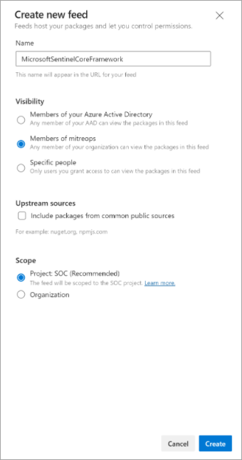

If your team chooses a GitHub registry, you can connect it as a NuGet repository, because it's compatible with the feed protocol. For more information, see [Introduction to GitHub packages](https://docs.github.com/packages/learn-github-packages/introduction-to-github-packages).

When you have an available NuGet repository, the pipeline contains a service connection for NuGet. These screenshots show the configuration for the new service connection that's named Microsoft Sentinel NuGet Framework Connection.

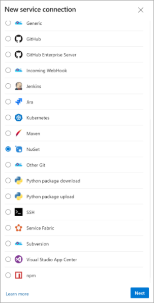

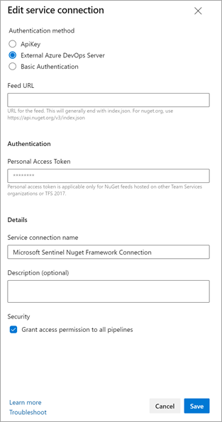

After configuring the feed, you can import the pipeline for building the PowerShell framework directly from GitHub in a specific fork. For more information, see [Build GitHub repositories](/azure/devops/pipelines/repos/github?tabs=yaml). In this case, you create a new pipeline and choose GitHub as the code source.

Another option is to import the Git repository as an Azure DevOps repository that's based on Git. In both cases, to import the pipeline, specify the following path:

`src/Build/Framework/ADO/Microsoft.Sentinel.Framework.Build.yml`

Now you can run the pipeline for first time. Then, the framework builds and releases to the NuGet feed.

### Define your Microsoft Sentinel environment

When starting with Microsoft Sentinel and using these samples, define the environment in your company, for example, Environment as Code or EaC. You specify the different elements that make up the environment in each case.

The Microsoft Sentinel architecture includes the following elements on Azure:

* Log Analytics Workspace - This workspace forms the foundation of the solution. Security-related information is stored here and the workspace is the engine for Kusto Query Language (KQL).
* Microsoft Sentinel solution over the Log Analytics workspace - This solution extends the functionality of the Log Analytics workspace to include SIEM and SOAR capabilities.
* Key Vault - The key vault keeps the secrets and keys that are used during the remediation processes.
* Automation account - This account is optional and is used for the remediation processes. The remediation process that you use is based on the PowerShell and Python runbooks. The process includes a system-managed identity that works with different resources according to best practices.
* User-managed identity - This feature acts as a Microsoft Sentinel unified identity layer that manages interactions between Microsoft Sentinel playbooks and runbooks.
* Logic App connections - These are connections for Microsoft Sentinel, the key vault, and automation that use the user-managed identity.
* External Logic App connections - These are connections for external resources that are involved in the remediations processes and which are based on the playbooks.
* Azure Event Hubs - This feature is optional and handles integration between Microsoft Sentinel and other solutions, such as Splunk, Azure Databricks and machine learning, and Resilient.
* Storage account - This feature is optional and handles integration between Microsoft Sentinel and other solutions, such as Splunk, Azure Databricks and machine learning, and Resilient.

By using examples from the repository, you can define the environment with JSON files to specify the different logical concepts. The options that are available for defining the environment can be literal or automatic.

In a literal definition, you specify the name and the elements for each resource in the environment as shown in this example.

```json
{
    {
        "SubscriptionId": "<subscription-identifier-associated-with-service-connection>",
        "Name": "<environment-name>",
        "NamingConvention": "<naming-convention-template-for-automatic-cases>",
        "Location": "<environment-location>",
        "ResourceGroup": {
            "Type": "Literal",
            "ResourceGroupName": "<resource-group-name>"
         }
    },
    "Resources":
    {
        "Sentinel":
        {
            "Type": "Literal",
            "LogAnalyticsWorkspaceName": "<Log-Analytics-workspace-name>",
            "ManagedIdentityName": "<user-managed-identity-name>",
            "SentinelConnectionName": "<Sentinel-API-connection-name>",
            "KeyVaultName": "<Key-Vault-name>",
            "KeyVaultConnectionName": "<Key-Vault-API-connection-name>"
        },
        "Automation":
        {
            "Type": "Literal",
            "AutomationAccountName": "<automation-account-name>",
            "AutomationAccountConnectionName": "<automation-account-API-connection-name>"
        },
        "Integration":
        {
            "Type": "Literal",
            "EventHubNamespaces": [
                "<Event-Hubs-namespace-1-name>",
                "<Event-Hubs-namespace-2-name>",
                "<Event-Hubs-namespace-3-name>",
                "<Event-Hubs-namespace-4-name>",
                "<Event-Hubs-namespace-5-name>",
                "<Event-Hubs-namespace-6-name>",
                "<Event-Hubs-namespace-7-name>",
                "<Event-Hubs-namespace-8-name>",
                "<Event-Hubs-namespace-9-name>",
                "<Event-Hubs-namespace-10-name>",
            ],
            "StorageAccountName": "<storage-account-name>"
        }
    }
}

```

In an automatic definition, the element names generate automatically based on naming conventions, as shown in this example.

```json
{
    {
        "SubscriptionId": "<subscription-identifier-associated-with-service-connection>",
        "Name": "<environment-name>",
        "NamingConvention": "<naming-convention-template-for-automatic-cases>",
        "Location": "<environment-location>",
        "ResourceGroup": {
            "Type": "Automatic"
        }
    },
    "Resources":
    {
        "Sentinel":
        {
            "Type": "Automatic"
        },
        "Automation":
        {
            "Type": "Automatic"
        },
        "Integration":
        {
            "Type": "Automatic",
            "MaxEventHubNamespaces": 5
        }
    }
}
```

You can find samples in the GitHub repository under the Microsoft Sentinel environments path and use the samples as a reference in preparing your use cases.

### Deploy your Microsoft Sentinel environment

When you have at least one environment defined, you can create the Azure service connection to integrate with Azure DevOps. After you create the service connection, set the linked service principal to the owner role or a similar permissions level over the target subscription.

1. Import the pipeline for creating the new environment as defined in this file.

   `src/Release/Sentinel Deployment/ADO/Microsoft.Sentinel.Environment.Deployment.yml`

1. Next, enter the name of the service connection that represents the environment.

   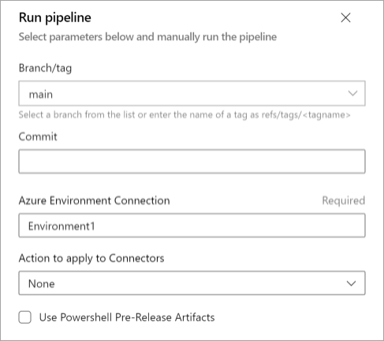

1. Choose the branch for the environment definition in the repository.  
1. Enter the name of the Azure DevOps service connection for your subscription in the **Azure Environment Connection** box.
1. Enter the name of the environment that a service connection can use to resolve multiple environments in the same subscription.
1. Choose the action to apply to the connectors.
1. Select **Use PowerShell Pre-Release Artifacts** if you want to use the prerelease versions of the PowerShell framework components.

The pipeline includes the following steps as part of the deployment flow:

* Deploy NuGet components.
* Connect by using NuGet tools with the artifacts repository.
* Resolve the feed.
* Install the required modules.
* Get the environment definition.
* Validate which resources exist in the destination.
* Add Log Analytics and Microsoft Sentinel if they're not in the workspace.
* If you already have Log Analytics, add Microsoft Sentinel over your instance of Log Analytics.
* Create a managed identity to represent the interaction between Microsoft Sentinel and Logic Apps.
* Create Azure Key Vault and set the role assignment for managing secrets and keys to the managed identity.
* If applicable, create an Azure Automation account and turn on the system-assigned managed identity.
* Set the role assignment over the key vault for the system-assigned managed identity.
* Create the Event Hubs definitions if they don't exist and set whether the definition includes the integration elements.
* Set the role assignment over the key vault for the system-assigned managed identity.
* Create the storage account definitions if they don't exist and set whether the definition includes the integration elements.
* Set the role assignment over the key vault for the system-assigned managed identity.
* Deploy the connector actions.
* Deploy the integration runbook on the Automation account.
* Deploy the Logic Apps connections if they're defined as part of the environment.

### Destroy a Microsoft Sentinel environment

When the environment is no longer needed, like in the case of a development or testing environment, you can destroy it as defined in this file.

`src/Release/Sentinel Deployment/ADO/Microsoft.Sentinel.Environment.Destroy.yml`

As when you deploy the environment pipeline, you specify the name of the service connection that represents the environment.

### Working with your Microsoft Sentinel environment

After your environment is ready, you can start creating the artifacts for setting up the different use cases.

1. Export the artifacts from the environment that you're working on as defined in this file.

   `src/Release/Artifacts Deployment/ADO/Microsoft.Sentinel.Artifacts.Export.yml`

1. Choose the branch for the environment definition in the repository.

   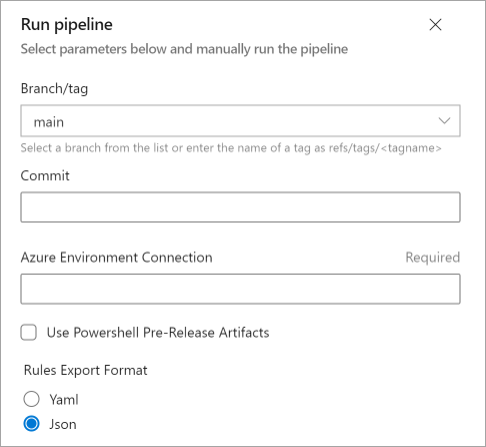

1. Enter the name of the Azure DevOps service connection for the environment that's being exported in the **Azure Environment Connection** box.
1. Select **Use PowerShell Pre-Release Artifacts** if you want to use the prerelease versions of the PowerShell framework components.
1. Choose the format for the analytic and hunting rules.

   The artifacts output file is available in the results. After you have the artifacts, you can include the output file in the Git repository.

### Build your artifacts in the Microsoft Sentinel environment

Place your artifacts under the Microsoft Sentinel MITRE use cases path. Set up your folder structure according to the different types of artifacts.

1. Start the build process as defined in this file.

   `src/Build/Artifacts/ADO/Microsoft.Sentinel.Artifacts.Build.yaml`

1. Choose the branch for the environment definition in the repository.

   Diagram of how to choose the branch for building the artifacts.](./media/build-artifacts-pipeline.png)

1. Select **Use PowerShell Pre-Release Artifacts** if you want to use the prerelease versions of the PowerShell framework components.

The pipeline is made up of these steps:

* Deploy NuGet components.
* Connect the NuGet tools to the artifacts repository.
* Resolve the feed.
* Install the required modules.
* Get the [Test toolkit framework](/azure/azure-resource-manager/templates/test-toolkit) for validating the ARM templates.
* Validate the ARM templates.
* Validate the PowerShell Runbooks code and do syntax validation.
* Run the Pester unit tests if applicable.
* Validate the KQL syntax in the hunting and analytic rules.

### Deploy your artifacts to the Microsoft Sentinel environment

In deploying your artifacts, you can use the Microsoft Sentinel repositories or the deployment pipeline samples on this repository. For more information, see [Deploy custom content from your repository](/azure/sentinel/ci-cd?tabs=github).

#### Microsoft Sentinel repositories

If you use Microsoft Sentinel repositories, you can set up a release process to include the artifacts in the repository that's connected to each Microsoft Sentinel instance. After the artifacts are committed in the repository, some of the steps are automatically done as part of creating the pipeline and enabling the Microsoft Sentinel repositories.

Also, you can customize the deployment processes that the Microsoft Sentinel repositories do based on practices that are described in this document. One important aspect to consider is the release approval, which you can set up by following these approaches:

* PR approval when committing the artifacts. For more information, see [Create pull requests](/azure/devops/repos/git/pull-requests?tabs=browser).
* Release pipeline approval when running the deployment. For more information, see [Define approvals and checks](/azure/devops/pipelines/process/approvals?tabs=check-pass).

#### Microsoft Sentinel deployment pipeline samples

By using the Microsoft Sentinel deployment pipeline samples, you can set up a release process.

1. Set up your release process as defined in this file.

   `src/Release/Artifacts Deployment/ADO/Microsoft.Sentinel.Artifacts.Deployment.yml`

1. Choose the branch for the environment definition in the repository.

   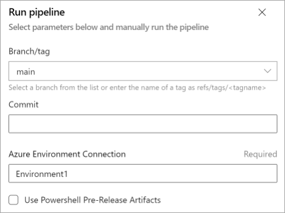

1. Enter the name of the Azure DevOps service connection for the environment that's being exported in the **Azure Environment Connection** box.
1. Select **Use PowerShell Pre-Release Artifacts** if you want to use the prerelease versions of the PowerShell framework components.


## Contributors

*This article is maintained by Microsoft. It was originally written by the following contributors.*

Principal author:

* [Kevin Kisoka](https://fr.linkedin.com/in/kevinkisoka) | Associate Architect

*To see non-public LinkedIn profiles, sign in to LinkedIn.*

## Next steps

* To learn about Microsoft Sentinel with DevOps for single-tenant architecture, see [Deploying and managing Microsoft Sentinel as code](https://techcommunity.microsoft.com/t5/azure-sentinel/deploying-and-managing-azure-sentinel-as-code/ba-p/1131928).
* To learn about MSSP multi-tenant architecture, see [Combining Azure Lighthouse with Microsoft Sentinel's DevOps capabilities](https://techcommunity.microsoft.com/t5/azure-sentinel/combining-azure-lighthouse-with-sentinel-s-devops-capabilities/ba-p/1210966).
* For information on Managed identity with Microsoft Sentinel, see [What's new: Managed identity for Microsoft Sentinel Logic Apps connector](https://techcommunity.microsoft.com/t5/azure-sentinel/what-s-new-managed-identity-for-azure-sentinel-logic-apps/ba-p/2068204).
* To learn how to deploy content from a Microsoft Sentinel repository, see [Deploy custom content from your repository](/azure/sentinel/ci-cd?tabs=github).
* To learn about Azure DevOps Security considerations, see [Default permissions quick reference](/azure/devops/organizations/security/permissions-access?toc=/azure/devops/get-started/toc.json&bc=/azure/devops/get-started/breadcrumb/toc.json).
* To learn how to protect an Azure DevOps repository, see [Add protection to a repository resource](/azure/devops/pipelines/process/repository-resource).
* For information on how to manage Azure DevOps service connection security, see [Service connections in Azure Pipelines](/azure/devops/pipelines/library/service-endpoints?tabs=yaml).

## Related resources

* [Dev SecOps in GitHub](../../solution-ideas/articles/devsecops-in-github.yml)
* [Hybrid security monitoring using Microsoft Defender for cloud and Microsoft Sentinel](../../hybrid/hybrid-security-monitoring.yml)
* [Design a CI/CD pipeline using Azure DevOps](../../example-scenario/apps/devops-dotnet-baseline.yml)
* [Advanced ARM template functionality](../../guide/azure-resource-manager/advanced-templates/index.md)
