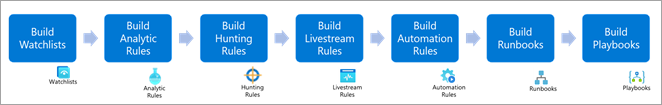
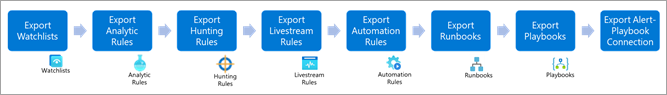
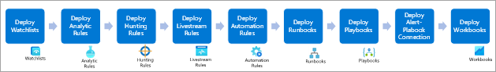

Security Operations Center teams experience challenges when integrating Microsoft Sentinel with Azure DevOps. The process involves many steps and the setup can take days with constant repetition. You can automate this part of the development.

Cloud modernization means engineers must constantly learn new skills and techniques for securing and protecting vital business assets. Engineers must build robust and scalable solutions that keep pace with the ever-changing security landscape and business needs. The security solution must be flexible, agile, and carefully planned from the earliest stages of development (shift-left).

This article shows you how to automate Microsoft Sentinel integration and deployment operations with Azure DevOps. You implement Azure DevOps using several Sentinel capabilities to secure your deployment. Then, you employ DevSecOps framework to manage and deploy Microsoft Sentinel artifacts at scale.

You can even expand the solution to cover more complex organizations that have multiple entities, subscriptions, and various operating models. Some of the operating models supported by this solution include: Local SOC, Global SOC, Cloud Service Provider (CSP), and Managed Security Service Provider (MSSP).

The audiences for this article:

* SOC Specialists (Analysts and Threat Hunters)
* SIEM Engineers
* Cybersecurity Architects
* Developers

## Potential use cases

The typical use cases for this architecture include:

* Rapid prototyping and Proof of Concept: Ideal for security organizations and SOC wanting to improve Cloud threat coverage or modernize their SIEM infrastructure with Infra as Code and Microsoft Sentinel.

* Sentinel as a Service: Our development framework integrates service lifecycle management principles. These principles suit simple or complex organizations like Managed Security Service Providers (MSSPs) who run repeatable, standardized actions across multiple customer tenants while combining the power of Azure DevOps & Azure Lighthouse. For example, an organization that needs to publish Sentinel use cases for a new threat actor or ongoing campaign.

* Building SOC use case for Threat detection: Many organizations and threat intelligence platforms rely on Mitre Att&ck content and taxonomy to analyze their Security Posture against advanced tradecraft or Techniques and Tactics Procedures. The solution defines a structured approach for developing threat detection engineering practices, by incorporating Mitre Att&ck terminology within Microsoft Sentinel artifacts development. The following illustration shows a Mitre Att&ck Cloud scenario:

## Architecture

> Under the architecture diagram, include this sentence and a link to the Visio file or the PowerPoint file:

_Download a [Visio file](https://arch-center.azureedge.net/[filename].vsdx) of this architecture._

### Dataflow

1. The Scrum Master and product management use Azure DevOps to define Epics, User Stories, and Product Backlog items as part of the project backlog.
   * The Scrum Master and product management use Azure Boards to create the backlog, schedule work in sprints, review the project board, create the repository structure, and set the security rules, as in, the approval workflows, branches, and so on.
   * The Azure Git Repository stores the scripts and the permits to manage Microsoft Sentinel artifacts in the infrastructure as code.
   * Artifacts and Source Control maintain the extensions and update packages or components of the DevSecOps workflow used in our solution, such as Azure Resource Manager Template Toolkit and Powershell Pester.
2. Sentinel Artifacts:
   * Policies: SIEM Engineers use Azure policies in the Reference Architecture, to configure and scale the diagnostic settings of the Azure services. The policies help automate deployment of the Microsoft Sentinel data connectors depending on the OMSIntegration API, such as Azure Key Vault.
   * Connectors: Microsoft Sentinel uses  logical connectors, the Azure Data Connectors to ingest security data (audits or metrics) from supported data sources, such as Azure AD, Azure Resources, Microsoft 365 Defender, or third-party solutions. The main list of Data connectors is managed by the SecurityInsights API; others rely on the OMSIntegration API and are managed with the Azure Policy (diagnostic settings).
   * Managed Identity: Microsoft Sentinel uses managed identity to act on behalf of the MSI while interacting with Playbooks (Logics Apps), or Automation Runbooks and the Key Vault.
   * Automation: Security Operations Center teams use automation during investigations. SOC teams run digital forensics data acquisition procedures with Azure Automation, such as Azure VM Chain of Custody or Advanced eDiscovery for Microsoft 365.
   * Analytics: SOC Analysts or Threat Hunters use built-in or custom analytics rules to analyze and correlate data in Microsoft Sentinel or to trigger playbooks if a threat and incident is identified.
   * Playbooks: Logic Apps run the SecOps repeatable actions, such as assigning an incident, updating an incident, or taking remediation actions, like isolating or containing a VM, revoking a token, or resetting a user password.
   * Threat Hunting: Threat Hunters use proactive threat hunting capabilities that can be coupled with Jupyter notebooks for advanced use cases, such as data processing, data manipulation, data visualization, ML, or Deep Learning.
   * Workbooks: SIEM Engineers use Workbooks Dashboards to visualize trends and statistics and to view the status of a Microsoft Sentinel instance and its sub-components.
   * Threat Intelligence: A specific data connector that fuses Threat Intelligence Platforms feeds with Microsoft Sentinel. Two connectivity methods are supported, TAXII or Graph API (tiIndicators).
3. Azure AD: Identity and Access Management capabilities are delivered to components used in the reference architecture, such as Managed Identities, Service Principal, RBACs for Microsoft Sentinel, Logic Apps, and Automation runbooks.
4. Azure DevOps Pipelines: DevOps engineers use pipelines to create service connections for managing the different Azure subscriptions (Sandbox and Production environments) with CI/CD pipelines. We recommend using approval workflows to prevent unexpected deployments and separated Service Principals if you target multiple subscriptions per Azure environment.
5. Azure Key Vault: SOC Engineers use the key vault to securely store service principal secrets and certificate. The component of the architecture helps enforce the DevSecOps principle of “no secrets in code” when used by Azure DevOps Pipeline service connections.
6. Azure Subscription: The SOC teams use two instances of Microsoft Sentinel in this Reference Architecture, separated within two logical Azure subscriptions to simulate Production and Sandbox environments. You can scale for your needs with other environments, such as Testing, Dev, Preproduction, and so on.

#### Dataflow Example

1. Admin one adds, updates, or deletes an entry in Admin one's fork of the Microsoft 365 config file.
2. Admin one commits and syncs the changes to Admin one's forked repository.
3. Admin one creates a pull request (PR) to merge the changes to the main repository.
4. The build pipeline runs on the PR.

### Components

This architecture makes use of the following components:  

* [Azure Active Directory](https://azure.microsoft.com/services/active-directory/): A multi-tenant, cloud-based service to manage your identity and access controls.
* [Azure DevOps](https://azure.microsoft.com/services/devops/): A cloud service to collaborate on code, build and deploy apps, or plan and track your work.
* [Azure Key Vault](https://azure.microsoft.com/services/key-vault/): A cloud service for securely storing and accessing secrets. A secret is anything that you want to tightly control access to, such as API keys, passwords, certificates, or cryptographic keys.
* [Azure Policy](https://azure.microsoft.com/services/azure-policy/): A service in Azure to create, assign, and manage policy definitions in your Azure environment.
* [Microsoft Sentinel](https://azure.microsoft.com/services/azure-sentinel/):
A scalable, cloud-native, security information and event management (SIEM) and security orchestration, automation, and response (SOAR) solution.
* [Azure Automation](https://azure.microsoft.com/services/automation/): An Azure service for simplifying cloud management through process automation. Use Azure Automation to automate long-running, manual, error-prone, and frequently repeated tasks to increase reliability, efficiency, and time to value for your organization.

### Alternatives

> Use this section to talk about alternative Azure services or architectures that you might consider for this solution. Include the reasons why you might choose these alternatives. Customers find this valuable because they want to know what other services or technologies they can use as part of this architecture.

> What alternative technologies were considered and why didn't we use them?

## Considerations

With security, in general terms, automation increases operations efficiency while saving time for more complex use cases, such as: threat detection engineering, threat intelligence, SOC, and SOAR use cases. While saving time, DevOps teams need to know where they can leverage IaC in the context of Microsoft Sentinel CI/CD in a secure fashion, which introduces the use of specific identities used by non-human accounts in Azure AD called [Service Principals](/azure/active-directory/develop/app-objects-and-service-principals) and [Managed Identities](/azure/active-directory/managed-identities-azure-resources/overview).

The following table summarizes security considerations regarding service principals with the main use cases covered by Microsoft Sentinel and Azure DevOps release pipelines:

| Use case | Requirements (least privilege) | Role assignment duration | Permission scope | Trustee| Security considerations |
| -- | --- | --- | --- | --- | ---------- |
| Enable Sentinel connectors | <ul type="circle"> <li> Security Administrator ** </li> <li> Owner * </li> <li> Sentinel Contributor </li> <li> Reader </li>| JIT (one-time activation)   On purpose (every time a new subscription and connector deploys) | Tenant | SPN | <ul type="circle"> <li> Use Key Vault to store SPN secrets and certificate. </li> <li> Enable SPN auditing. </li> <li> Periodically review permission assignment (Azure PIM for SPN) or suspicious activity for SPN. </li>  <li> Use AAD CA and MFA (when supported) for privileged accounts. </li> <li> Use Azure AD Custom Roles for more granularity. </li> |
| Deploy Sentinel artifacts (workbooks, analytics, rules, threat hunting queries, notebooks, playbooks) | <ul type="circle"> <li> Sentinel Contributor </li> <li> Logic Apps contributor </li> |Permanent | Sentinel's Workspace or Resource Group | SPN | <ul type="circle"> <li> Use ADO Workflow approval and checks to secure pipeline deployment with this SPN. </li>|
| Assign a policy to configure log streaming features to Sentinel|  Resource Policy Contributor ** | On purpose (every time a new subscription and connector deploys) | All subscriptions to be monitored| SPN | <ul type="circle"> <li> Use AAD CA and MFA (when supported) for privileged accounts. </li> |

\* Only concerns Azure AD Diagnostics Settings.  
\** Specific connectors need additional permissions granted like "Security Administrator" or "Resource Policy Contributor" to allow streaming their data to Sentinel Workspace: Azure AD; Office365, or M365 Defender, Paas Resources like Azure Key Vault.

### Privileged access model

Microsoft recommends adopting a privileged access model strategy to rapidly lower the risks to your organization from high-impact and high-likelihood attacks on privileged access. In the case of automatic processes in a DevOps model, you must base identity on [Service Principal](/azure/active-directory/develop/app-objects-and-service-principals) identities.

Privileged access should be the top security priority at every organization. Any compromise of these identities creates highly negative impacts to the organization. Privileged identities have access to business-critical assets in an organization, nearly always causing major impacts when attackers compromise these accounts.

Security of privileged access is critically important because it's foundational to all other security assurances. An attacker in control of your privileged accounts can undermine all other security assurances.  

For that reason, we recommend logically spreading the service principals into different levels or tiers following a minimum privilege principle. The following illustration shows how to classify the Service Principals, depending on type of access and where the access is required.

#### Level 0 service principals

Level 0 service principals have the highest level of permissions. These service principals entitle someone to perform tenant-wide or root management group administration tasks as a Global Administrator.

For security reasons and manageability, we recommend that you have only one service principal for this level. The permissions for this service principal persist, so it's highly recommended that you grant only the minimum permissions required and keep the account monitored and secured.

The secret or certificate for this account must be stored securely in the Azure Key Vault. We also strongly recommended that the Key Vault be located in a dedicated administrative subscription if possible.

#### Level 1 service principals

Level 1 service principals are elevated permissions limited and scoped to Management Groups at the business organization level. These service principals entitle someone to create subscriptions under the management group in scope.

For security reasons and manageability, we recommend that you have only one service principal for this level. The permissions for this service principal persist, so it's highly recommended that you grant only the minimum permissions required and keep the account monitored and secured.

The secret or certificate for this account must be stored securely in the Azure Key Vault. We also strongly recommended that the Key Vault be located in a dedicated administrative subscription if possible.

#### Level 2 service principals

Level 2 service principals are limited to the subscription level. These service principals entitle someone to perform administrative tasks under a subscription, acting as the subscription Owner.  

For security reasons and manageability, we recommend that you have only one service principal for this level. The permissions for this service principal persist, so it's highly recommended that you grant only the minimum permissions required and keep the account monitored and secured.

The secret or certificate for this account must be stored securely in the Azure Key Vault. We also strongly recommended that the Key Vault be located in a dedicated administrative resource group.

#### Level 3 service principals

Level 3 service principals are limited to the Workload Administrator. In a typical scenario, every workload is contained inside the same Resource Group. This structure limits the service principal permissions to just this Resource Group.

For security reasons and manageability, we recommend that you have only one service principal per workload. The permissions for this service principal persist, so it's highly recommended that you grant only the minimum permissions required and keep the account monitored and secured.

The secret or certificate for this account must be stored securely in the Azure Key Vault. We also strongly recommended that the Key Vault be located in a dedicated administrative resource group.

#### Level 4 service principals

Level 4 service principals are the lowest and most limited level. These service principals entitle someone to perform administrative tasks limited to one resource.

We recommended using managed identities where possible. In the case of non-managed identities, the secret or certificate must be stored securely in the Azure Key Vault where the Level 3 secrets are stored.

> [!NOTE]
> A best practice for organizations that follow the Security Tier approach is to avoid cross-level service principals.

### Availability

> How do I need to think about managing, maintaining, and monitoring this long term?

### Operations

> How do I need to think about operating this solution?

### Performance

> Are there any key performance considerations (past the typical)?

### Scalability

> Are there any size considerations around this specific solution?
> What scale does this work at?
> At what point do things break or not make sense for this architecture?

### Security

> Are there any security considerations (past the typical) that I should know about this? 

### Resiliency

> Are there any key resiliency considerations (past the typical)?

### DevOps

Microsoft Sentinel solutions are composed of three blocks, which ensure complete and successful implementation.  

The first block is the environment definition, which makes up the essential architecture elements. Your main concern with this block is to consider the number of production and non-production environments to be deployed, then how to ensure the implementation is homogeneous in all cases.

The second block is the Microsoft Sentinel Connector deployment, where you consider the kind of connectors required by your organization and the security requirements to enable them.

The third block is the Microsoft Sentinel artifacts lifecycle management, which covers coding, deployment, and use or destruction of the components. For example, the analytic rules, playbooks, workbooks, threat hunting, and so on.

Inter-dependencies between artifacts to consider:

* Automation rules defined in an Analytics rule
* Workbooks or analytics that require a new data source or connector
* Managing updates of existing components, such as:
  * How to version your artifacts
  * How to identify, test, and deploy an updated or entirely new analytics rule

### Build, test, and deploy infrastructure

In managing Microsoft Sentinel solutions and DevOps, it's important to consider the connectivity and security aspects of your Enterprise Architecture.

Azure DevOps can use Microsoft-hosted agents or self-hosted agents for build, test, and deploy activities.
Depending on your organization's requirements, you can use Microsoft-hosted, self-hosted, or a combination of both models.

* Microsoft-hosted agents: This option is the fastest way to work with Azure DevOps agents, because it's a shared infrastructure for your entire organization. For more information on using Microsoft-hosted agents in your pipeline, see [Microsoft-hosted agents](/azure/devops/pipelines/agents/hosted?view=azure-devops&tabs=yaml) Microsoft-hosted agents can work in hybrid-networking environments, granting access for the following [IP ranges](https://www.microsoft.com/download/details.aspx?id=56519)
* Self-hosted agents: This option gives you dedicated resources and more control when installing dependent software for your builds and deployments. Self-hosted agents can work over virtual machines, scale sets, and containers on Azure. For more information on self-hosted agents, see [Azure Pipelines agents](/azure/devops/pipelines/agents/agents?view=azure-devops&tabs=browser#install).

#### GitHub runners

GitHub can use GitHub-hosted runners or self-hosted runners for activities related to building, testing and deploying.  Depending on your organization needs, you can use GitHub-hosted, self-hosted, or a combination of both models.

GitHub-hosted runners

This option is the fastest way to work with GitHub workflows, since it's a shared infrastructure for an entire organization. For more information on GitHub hosted runners, see [About GitHub-hosted runners](https://docs.github.com/en/actions/using-github-hosted-runners/about-github-hosted-runners) GitHub-hosted agents work in hybrid-networking environments, according to certain network requirements. For more information on the network requirements, see [Supported runners and hardware resources](https://docs.github.com/en/actions/using-github-hosted-runners/about-github-hosted-runners#ip-addresses)
  
Self-hosted runners

This option gives your organization a dedicated resources infrastructure. Self-hosted runners work over Virtual Machines and Containers on Azure, and support auto-scaling.

### Considerations for choosing runners

The following are things to consider when choosing options for the agents and runners in your Microsoft Sentinel solution:

* Does your organization need dedicated resources for running processes on your Microsoft Sentinel environment(s)?
* Does your organization want to isolate resources for Production environment DevOps activities from the rest of environments? 
* Does your organization need to test cases that require access to critical resources or resources available only on an internal network?

## Deploy this scenario

You can set up the deployment process with Azure DevOps or GitHub. Azure DevOps supports using a YAML pipeline or a Release pipeline. For more information on using a YAML pipeline in Azure DevOps, see [Use Azure Pipelines](https://docs.microsoft.com/en-us/azure/devops/pipelines/get-started/pipelines-get-started?view=azure-devops). For more information on using a Release pipeline in Azure DevOps, see [Release pipelines](https://docs.microsoft.com/en-us/azure/devops/pipelines/release/?view=azure-devops). For more information on using GitHub with GitHub Actions, see [Understanding GitHub Actions](https://docs.github.com/en/actions/learn-github-actions/understanding-github-actions).

### Azure DevOps deployment

You can do the following deployment activities in an Azure DevOps deployment.

* Use a YAML pipeline to automatically trigger pull request approvals or run on-demand.  
* Manage service connections for different environments using Azure DevOps Groups.
* On your critical environments, set up deployment approvals using the service connection feature and Azure DevOps Groups to assign specific user permissions in your organization.

GitHub

You can do the following deployment activities in a GitHub deployment.

* Use GitHub to create pull requests or deployment activities.  
* Manage service principal credentials by using GitHub Secrets.
* Integrate deployment approval through the workflow that's associated with GitHub.

### Automatic deployment with Microsoft Sentinel infrastructure

You can deploy one or more Microsoft Sentinel environments, depending on your enterprise architecture:

* Organizations that need multiple instances on their Production environment can set up different subscriptions on the same tenant for each geographical location.  
* A centralized instance on the Production environment provides access to one or more organizations on the same tenant.
* Organizations that need multiple environments like Production, Pre-Production, Integration, and so on can create and destroy them as needed.

#### Physical vs logical environment definitions

You have two choices in setting up your environment definitions, physical or logical. Both have different options and advantages.

* Physical definition - The elements of the Microsoft Sentinel architecture are defined with the following options for Infrastructure as Code (IaC):
  * Bicep templates
  * Azure Resource Manager (ARM) templates
  * Terraform
* Logical definition - This acts as an abstraction layer for setting up different teams in the organization and defining their environments. The definition is set in the deployment pipeline and workflows as input for the build environment using the physical infrastructure layer.

Things for you to think about when defining your logical environments:

* Naming conventions
* Environment identifications
* Connectors and configurations

#### Code Repository

Given the environment approaches shown in the previous section, consider the following GitHub code repository organizations:

* Physical definition - Based on IaC options, think about an approach based on individual module definitions linked in the main deployment definition.

The following example shows a how your code might be organized:

Access to this repository should be restricted to the team that defines the architecture at the physical level, ensuring a homogeneous definition in the Enterprise architecture.

You can adapt the branching and merging strategy to the deployment strategy for each organization. If your organization needs to start with the definition, see [Adopt a Git branching strategy](/azure/devops/repos/git/git-branching-guidance?view=azure-devops). For more information on Azure ARM templates, see [Using linked and nested templates when deploying Azure resources](/azure/azure-resource-manager/templates/linked-templates?tabs=azure-powershell#linked-template). For more information on setting up Bicep environments, see [Install Bicep tools](/azure/azure-resource-manager/bicep/install). For more information on GitHub, see [GitHub flow](https://docs.github.com/en/get-started/quickstart/github-flow).

Logical definitions facilitate the organization environments. The Git repository must consolidate the different definitions for an organization.

The following example shows a how your code might be organized:

Using the repository is based on pull request actions, where the various environments are defined by different teams and approved by the organization's owners or approvers.

The privilege level for running an environment deployment is Level two. This level ensures that the Resource Group and the resources are created for the environment with the necessary security and privacy. This level also sets the user permissions on allowed actions in the production environments (Production, Pre-Production).  

Organizations that want environments on demand for testing and development and the ability to then destroy the environments after finishing their testing, can implement an Azure DevOps Pipeline or GitHub Actions. They can set scheduled triggers to destroy the environments as needed using Azure DevOps Events or GitHub Actions.

#### Sentinel Connectors Automatic Configuration  

Microsoft Sentinel Connectors is an essential part of the solution that supports connecting with different elements in the Enterprise Architecture landscape, like Azure AD, Microsoft 365, Microsoft Defenders, Threat Intelligence Platform solutions, and so on.  

When defining an Environment, the connectors configuration makes it possible to set up environments with homogeneous configurations.

Enabling connectors as part of the DevOps model must be supported over the Service Principal level model. This focus enures the right level of privileges as shown in the following table.

| Connector Scenario | Privilege Access Model Level | Azure Least Privilege | Requires Workflow Approval  |
| ---- | --- | --- | --- |
| Azure Active Directory | Level 0 | Global Admin or Security Admin | Recommended |
| Azure Active Directory Identity Protection | Level 0 | Global Admin or Security Admin | Recommended |
| Microsoft Defender for Identity | Level 0 | Global Admin or Security Admin | Recommended |
| Microsoft Office 365 | Level 0 | Global Admin or Security Admin | Recommended |
| Microsoft Cloud App Security | Level 0 | Global Admin or Security Admin | Recommended |
| Microsoft 365 Defender | Level 0 | Global Admin or Security Admin | Recommended |
| Microsoft Defender for IOT | Level 2 | Contributor | Recommended |
| Microsoft Defender for Cloud | Level 2 | Security Reader | Optional |
| Azure Activity | Level 2 | Subscription Reader | Optional |
| Threat Intelligence Platforms | Level 0 | Global Admin or Security Admin | Recommended |
| Security Events | Level 4 | None | Optional |
| Syslog | Level 4 | None | Optional |
| DNS (preview) | Level 4 | None | Optional |
| Windows Firewall | Level 4 | None | Optional |
| Windows Security Events via AMA | Level 4 | None | Optional |

### Sentinel Artifacts Deployment  

Microsoft Sentinel Artifacts is where DevOps has greater relevance, because each organization creates multiple artifacts for preventing and remediating attacks.

Implementing the Microsoft Sentinel artifacts can be the responsibility of one team or multiple teams. Automatic build and artifacts deployment is often the most common process requirement and can condition the approach for Agents/Runners.

Deploying and managing Microsoft Sentinel artifacts requires using the Microsoft Sentinel REST API. For more information, see [Microsoft Sentinel REST API](/rest/api/securityinsights/). The following diagram shows an Azure DevOps pipeline on an Azure REST API stack.

You can also implement your repository using PowerShell. 

If your organization uses MITRE, consider classifying the different artifacts and specifying the Tactics and Technics for each one. Be sure you include a corresponding metadata file for each artifact type.

For example, if you're creating a new playbook using an Azure ARM template and the file name is _Playbook.arm.json_, you add a JSON file named _Playbook.arm.mitre.json_. The metadata for this file then includes the CSV, JSON, or YAML formats corresponding to the MITRE Tactics or Technics you're using. 

By following this practice, your organization can evaluate your MITRE coverage based on the jobs done during implementation for the different artifact types you use.

#### Build artifacts

The objective of your build process is to ensure that you generate the highest quality artifacts. The following diagram shows some of the build process actions you can take:

* You can base your artifact definition on a descriptive schema in JSON or YAML format and then validate the schema to avoid syntax errors.  
  * Validate your ARM templates using [TTK ARM Template Test Toolkit](/azure/azure-resource-manager/templates/test-toolkit).
  * Validate your YAML and JSON files for custom models using PowerShell.
* Validate your watchlist settings and be sure the CIDR records that you define follow the correct schema (for example, 10.1.0.0/16).  
* Analytic rules, hunting rules, and live stream rules use KQL queries, which you can validate at the level of the syntax.
* The [KQL local validation](https://github.com/Azure/Azure-Sentinel#run-kql-validation-locally) tool is one option.
* The [KQL inline validation](https://github.com/Azure/Azure-Sentinel/blob/master/.azure-pipelines/kqlValidations.yaml) tool is integrated in DevOps pipeline.
* If you're implementing logic based on PowerShell for Azure Automation, you can include syntax validation and unit testing using the following elements:
  * [Pester](https://devblogs.microsoft.com/scripting/what-is-pester-and-why-should-i-care/)
  * [PowerShell Script Analyzer](https://docs.microsoft.com/en-us/powershell/module/psscriptanalyzer/?view=ps-modules)  
* Generate the MITRE manifest metadata report based on the metadata files included with the artifacts.

#### Export Artifacts

Usually, multiple implementation teams work over several Microsoft Sentinel instances to generate necessary artifacts and validate them. With the idea of reusing existing artifacts, an organization can implement automatic processes for getting the artifact definitions from existing environments. Automation can also supply information on any artifacts created by different development teams during implementation. The following diagram shows an example artifact extraction process.

#### Deploy Artifacts

The objective of your Deployment process is to reduce the time to market, increase performance across the multiple teams involved with setting up and managing your solution, and setting up integration testing to evaluate the health of the environment.  

Development teams use the process to ensure they can deploy, test, and validate artifact use cases under development.
 The Architecture team and the Security Operations Center (SOC) teams validate the pipeline quality on QA environments and work with the integration tests for attack scenarios. On the test cases, the team usually combines different artifacts as Analytic Rules, Remediation Playbooks, Watchlists, and so on. A part of each use case includes simulating attacks where the entire chain is evaluated from ingestion, detection, and remediation. The following diagram shows the deployment process sequence that ensures your artifacts are deployed in the right order.

Managing Sentinel artifacts as code offer you flexible ways to maintain your operations and automate the deployment in a CI/CD DevOps pipeline.

Microsoft solutions provide automation workflows for the following artifacts:

| Artifact | Automation workflows |
| ---- | --- |
| Watchlists | <ul type="circle"> <li>Code Review </li><ul><li>Schema validation </li></ul> </li> <li>[Deployment](/rest/api/securityinsights/watchlists) </li><ul><li>Create, Update, Delete watchlists and [items](/rest/api/securityinsights/watchlist-items) </li></ul></li></ul> |
| Analytics Rules <ul type="circle"> <li>Fusion</li> <li>Microsoft Security</li> <li>ML Behavioral Analytics</li> <li>Anomaly</li> <li>Scheduled</li></ul> | <ul type="circle"> <li>[Code Review](/azure/security/develop/security-code-analysis-overview) </li><ul><li>KQL Syntax validation</li><li>Schema validation</li><li>Pester</li></ul> </li> <li>[Deployment](/rest/api/securityinsights/alert-rules) </li><ul><li>Create, Enable, Update, Delete, Export</li><li>[Alert templates support](/rest/api/securityinsights/alert-rule-templates)</li></ul></li></ul> |
| Automation Rules | <ul type="circle"> <li>[Code Review](/azure/security/develop/security-code-analysis-overview) </li><ul><li>Schema validation</li></ul> </li> <li>[Deployment](/rest/api/securityinsights/alert-rules) </li><ul><li>Create, Enable, Update, Delete, Export</li></ul></li></ul> |
| Connectors | <ul type="circle"> <li>[Code Review](/azure/security/develop/security-code-analysis-overview) </li><ul><li>Schema validation</li></ul> </li> <li>[Deployment](/rest/api/securityinsights/data-connectors) </li><ul><li>Actions: Enable, Delete (Disable), Update</li></ul></li></ul> |
| Hunting Rules | <ul type="circle"> <li>[Code Review](/azure/security/develop/security-code-analysis-overview) </li><ul><li>KQL Syntax validation</li><li>Schema validation</li><li>Pester</li></ul> </li> <li>[Deployment](/azure/sentinel/hunting-with-rest-api) </li><ul><li>Actions: Create, Enable, Update, Delete, Export</li></ul></li></ul> |
| Playbooks | <ul type="circle"> <li>[Code Review](/azure/security/develop/security-code-analysis-overview) </li><ul><li>TTK </li></ul> </li> <li>[Deployment](/azure/logic-apps/logic-apps-azure-resource-manager-templates-overview) </li><ul><li>Actions: Create, Enable, Update, Delete, Export</li></ul></li></ul> |
| Workbooks | <ul type="circle"> <li>[Code Review](CR-LINK) </li><ul><li>Actions: Create, Update, Delete</li></ul> </li> <li>[Deployment](/azure/azure-monitor/visualize/workbooks-automate) </li><ul><li>Actions: Create, Update, Delete</li></ul></li></ul> |
| Runbooks | <ul type="circle"> <li>[Code Review](/azure/security/develop/security-code-analysis-overview) </li><ul><li>PowerShell Syntax validation</li><li>Pester</li></ul> </li> <li>[Deployment](/azure/automation/automation-deploy-template-runbook) </li><ul><li>Actions: Create, Enable, Update, Delete, Export</li></ul></li></ul> |

## Pricing

> How much will this cost to run?
> Are there ways I could save cost?
> If it scales linearly, than we should break it down by cost/unit. If it does not, why?
> What are the components that make up the cost?
> How does scale affect the cost?

> Link to the pricing calculator with all of the components in the architecture included, even if they're a $0 or $1 usage.
> If it makes sense, include small/medium/large configurations. Describe what needs to be changed as you move to larger sizes.

## Next steps

> Link to Docs and Learn articles, along with any third-party documentation.
> Where should I go next if I want to start building this?
> Are there any relevant case studies or customers doing something similar?
> Is there any other documentation that might be useful? Are there product documents that go into more detail on specific technologies that are not already linked?

Examples:
* [Azure Kubernetes Service (AKS) documentation](/azure/aks)
* [Azure Machine Learning documentation](/azure/machine-learning)
* [What are Azure Cognitive Services?](/azure/cognitive-services/what-are-cognitive-services)
* [What is Language Understanding (LUIS)?](/azure/cognitive-services/luis/what-is-luis)
* [What is the Speech service?](/azure/cognitive-services/speech-service/overview)
* [What is Azure Active Directory B2C?](/azure/active-directory-b2c/overview)
* [Introduction to Bot Framework Composer](/composer/introduction)
* [What is Application Insights](/azure/azure-monitor/app/app-insights-overview)
 
## Related resources

> Use "Related resources" for related architecture guides and architectures (content on the Azure Architecture Center).

Examples:
  - [Artificial intelligence (AI) - Architectural overview](/azure/architecture/data-guide/big-data/ai-overview)
  - [Choosing a Microsoft cognitive services technology](/azure/architecture/data-guide/technology-choices/cognitive-services)
  - [Chatbot for hotel reservations](/azure/architecture/example-scenario/ai/commerce-chatbot)
  - [Build an enterprise-grade conversational bot](/azure/architecture/reference-architectures/ai/conversational-bot)
  - [Speech-to-text conversion](/azure/architecture/reference-architectures/ai/speech-ai-ingestion)