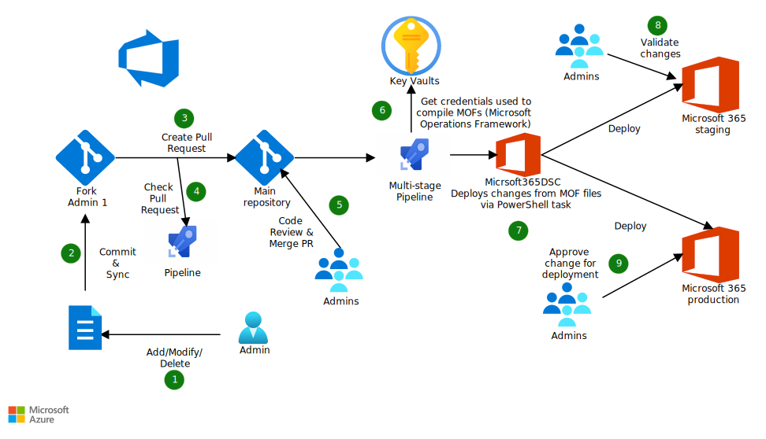

This article describes a solution that tracks changes that service administrators make and adds an approval process to deployments to Microsoft 365 tenants. It can help you prevent untracked changes to Microsoft 365 tenants and prevent configuration drift between multiple Microsoft 365 tenants.

## Architecture

*Download a [Visio file](https://arch-center.azureedge.net/m365-dev-ops.vsdx) of this architecture.*

### Workflow

1. Admin 1 adds, updates, or deletes an entry in Admin 1's fork of the Microsoft 365 configuration file.
2. Admin 1 commits and syncs the changes to Admin 1's forked repository.
3. Admin 1 creates a pull request (PR) to merge the changes to the main repository.
4. The build pipeline runs on the PR.
5. Admins review the code and merge the PR.
6. The merged PR triggers a pipeline to compile Managed Object Format (MOF) files. The pipeline calls Azure Key Vault to retrieve the credentials that are used in the MOF files.
7. An Azure PowerShell task in a multistage pipeline uses the compiled MOF files to deploy configuration changes via Microsoft365DSC.
8. Admins validate the changes in a staged Microsoft 365 tenant.
9. Admins get notification from the approval process in Azure DevOps for the production Microsoft 365 tenant. Admins approve or reject the changes.

### Components

- [Azure Pipelines](/azure/devops/pipelines/get-started/what-is-azure-pipelines) is an Azure DevOps service for continuous integration and continuous delivery (CI/CD). Use Azure Pipelines to test and build your code and ship it to any target. You can also use Azure Pipelines to implement quality gates to help ensure that you deploy changes in a controlled and consistent manner.
- [Key Vault](/azure/key-vault/general/overview) improves the security of storage for tokens, passwords, certificates, API keys, and other secrets. It also provides tightly controlled access to these secrets. Use Key Vault to store service principals and certificates that you use to deploy configuration changes to Microsoft 365 tenants.
- [Microsoft365DSC](https://microsoft365dsc.com) provides automation for the deployment, configuration, and monitoring of Microsoft 365 tenants via PowerShell Desired Stage Configuration (DSC). Use Microsoft365DSC to deploy configuration changes to Microsoft 365 tenants via Azure Pipelines.
- [Windows PowerShell DSC](/powershell/scripting/dsc/overview) is a management platform in PowerShell. You can use it to manage your development infrastructure by using a configuration-as-code model. This model is the underlying technology that Microsoft365DSC uses.

### Alternatives

You can use DSC in [Azure Automation](/azure/automation/automation-dsc-overview) to store configurations in a central location and add reporting of compliance with the desired state.

This architecture uses Key Vault to store Azure App Service certificates or user credentials that are used for authentication to the Microsoft 365 tenant. Key Vault provides scalability. As an alternative, you can use pipeline variables to reduce the complexity of the solution. By using an Azure virtual machine (VM) for Windows and DSC, you can apply and monitor a configuration to Microsoft 365 tenants that use [Microsoft365DSC](https://microsoft365dsc.com). You can use [Azure action groups](/azure/azure-monitor/alerts/action-groups) to send email to Microsoft 365 admins when the Azure Windows VM detects a configuration drift by using Microsoft 365DSC. In addition, an Azure action group can run a webhook to trigger an [Azure runbook](/azure/automation/automation-webhooks?tabs=portal) to generate a [report](https://microsoft365dsc.com/user-guide/get-started/comparing-configurations/) of configuration drift within Microsoft 365 tenants.

## Scenario details

Many companies are adopting DevOps practices and want to apply these practices to their Microsoft 365 tenants. If you don't adopt DevOps for Microsoft 365, you might encounter some common problems:

- Misconfiguration
- Challenges with tracking configuration changes
- No approval process for tenant modifications

You can use the solution described in this article to automate changes to Microsoft 365 tenant configurations by using [Azure DevOps](/azure/devops/user-guide/what-is-azure-devops) and [Microsoft365DSC](https://microsoft365dsc.com). Microsoft365DSC is a [PowerShell DSC](/powershell/scripting/dsc/overview) module. You can use it to configure and manage Microsoft 365 tenants in a true DevOps style, which is configuration as code.

### Potential use cases

This solution can help you manage Microsoft 365 tenant configuration in a controlled and automated way by using DevOps tools and practices across:

- Development, test, acceptance, and production environments.
- Multiple customer tenants, like in a managed service provider scenario.

## Considerations

These considerations implement the pillars of the Azure Well-Architected Framework, which is a set of guiding tenets that can be used to improve the quality of a workload. For more information, see [Microsoft Azure Well-Architected Framework](/azure/well-architected/).

Most people starting out with PowerShell DSC find that it takes a while to learn it. It helps if you have a solid understanding of PowerShell and experience with creating scripts.

### Security

Security provides assurances against deliberate attacks and the abuse of your valuable data and systems. For more information, see [Design review checklist for Security](/azure/well-architected/security/checklist).

Most Microsoft365DSC resources support authentication via username and password. We don't recommend that type of authentication because Microsoft best practices recommend multifactor authentication. If the Microsoft 365 resources support them, application credentials are the preferred method. SharePoint in Microsoft 365, Microsoft Entra ID, and other resources support application credentials.

If you build a Microsoft365DSC solution on Azure DevOps, you can also take advantage of the security in [Azure Pipelines](/azure/devops/pipelines/security/overview) and an [approval process](/azure/devops/pipelines/release/approvals/approvals) to safeguard deployment to your production tenant.

### Cost Optimization

Cost Optimization is about looking at ways to reduce unnecessary expenses and improve operational efficiencies. For more information, see [Design review checklist for Cost Optimization](/azure/well-architected/cost-optimization/checklist).

For Azure DevOps pricing information, see [Pricing for Azure DevOps](https://azure.microsoft.com/pricing/details/devops/azure-devops-services). If you incorporate Key Vault into your solution, see [Key Vault pricing](https://azure.microsoft.com/pricing/details/key-vault).

You can also use the [Azure pricing calculator](https://azure.microsoft.com/pricing/calculator) to estimate costs.

### Operational Excellence

Operational Excellence covers the operations processes that deploy an application and keep it running in production. For more information, see [Design review checklist for Operational Excellence](/azure/well-architected/operational-excellence/checklist).

Some operations teams consider Azure DevOps to be a tool for developers. But these teams can benefit from using Azure DevOps. Operations teams can:

- Store their scripts in a repository and add source control and versioning.
- Automate deployments of scripts.
- Use boards to track tasks and projects.

Using a configuration-as-code model isn't a one-time task. It's a shift in your way of working and a fundamental change for all team members. You no longer make changes manually. Instead, everything is implemented in scripts and deployed automatically. All team members need to have the skills to make this change.

### Performance Efficiency

Performance Efficiency is the ability of your workload to scale to meet the demands placed on it by users in an efficient manner. For more information, see [Design review checklist for Performance Efficiency](/azure/well-architected/performance-efficiency/checklist).

You can use this solution when you work with multiple environments, multiple workloads, or multiple teams. You can configure the validation process so that experts need to approve each workload. You can also extend the solution to deploy to multiple tenants for scenarios, including development, test, acceptance, and production scenarios, or for multiple organizations.

## Deploy this scenario

The Microsoft 365 DSC whitepaper, [Managing Microsoft 365 in true DevOps style with Microsoft365DSC and Azure DevOps](https://m365dscwhitepaper.azurewebsites.net/Managing%20Microsoft%20365%20with%20Microsoft365Dsc%20and%20Azure%20DevOps.pdf), provides detailed steps to deploy this scenario.

## Contributors

*This article is being maintained by Microsoft. It was originally written by the following contributors.*

Principal author:

* [Derek Smay](https://www.linkedin.com/in/dereksmay) | Senior Cloud Solution Architect

## Next steps

- [Managing Microsoft 365 in true DevOps style with Microsoft365DSC and Azure DevOps](https://m365dscwhitepaper.azurewebsites.net/Managing%20Microsoft%20365%20with%20Microsoft365Dsc%20and%20Azure%20DevOps.pdf)
- [Microsoft365DSC source code](https://github.com/microsoft/Microsoft365DSC)
- [Microsoft365DSC YouTube channel](https://www.youtube.com/channel/UCveScabVT6pxzqYgGRu17iw)
- [Microsoft365DSC site](https://microsoft365dsc.com)
- [Microsoft365DSC export generator tool](https://export.microsoft365dsc.com)

## Related resource

[Microsoft 365 solution and architecture center](/microsoft-365/solutions)