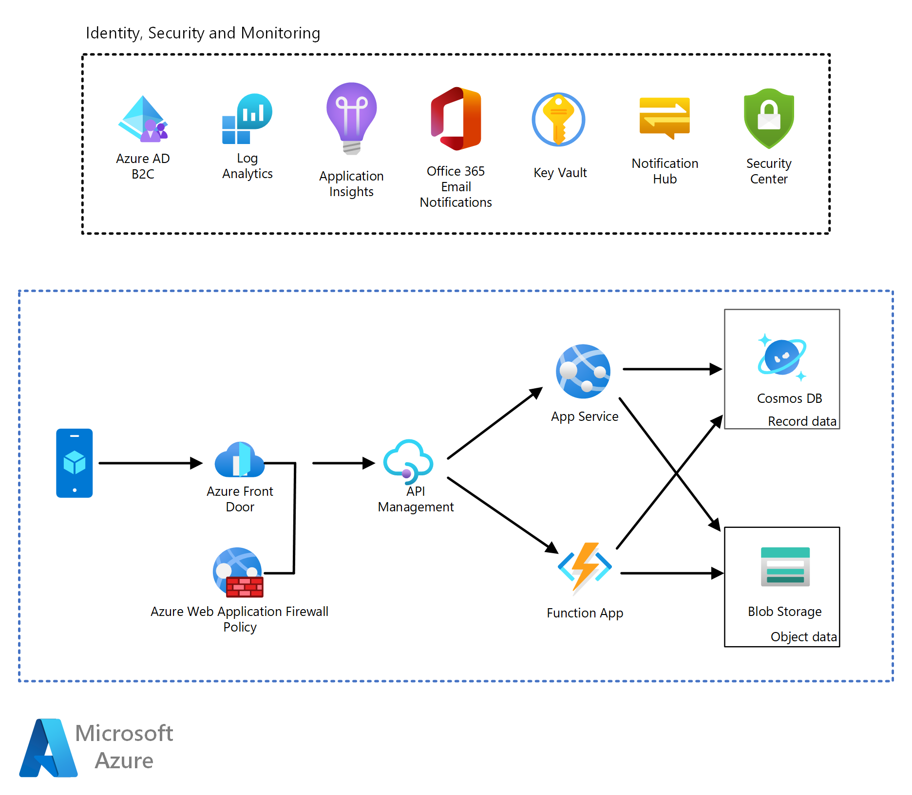

# Consumer Health Portal on Azure

Throughout the health and life sciences industry, organizations are adopting a *digital health* strategy. While not the only component, one of the core pillars to digital health is a *consumer health portal*. Whether its use is for tracking progress and statistics from a wearable device, engaging with a medical provider, or even tracking healthy eating habits, the consumer health portal is a necessary component in various digital health models. This architecture is designed to prescribe the core components of such a portal, that aligns with the pillars of the [Azure Well Architected Framework](https://docs.microsoft.com/azure/architecture/framework/). You may choose to customize this architecture to meet your particular needs.

## Potential use cases

- Tracking statistics of a wearable device.
- Gaining access to medical records and engaging with a medical provider.
- Entering times and doses of medications which can be used for refill data or simply self-tracking of medications.
- Interacting with a healthy eating coach for weight loss or diabetes.

## Architecture

In this solution, we leverage the global footprint of Azure Front Door and edge security features of Azure Web Application Firewall (WAF) to authenticate the inbound data. The authenticated data is then routed by Azure API Management (APIM) to either the front-end interface for the users on the Azure App Service, or APIs hosted in Azure Functions.

The primary backend data service used is Azure Cosmos DB. The multi-model abilities of Cosmos DB, in addition to its scalability and security, allow flexibility for any type of consumer health portal. Any data that is not in a record format is stored in Azure Blob Storage as an object. This could include data such as, medical images, photos taken by the consumer, uploaded documents, archived data, and so on. Blob storage provides an affordable storage for large volumes of unstructured data. This frees up CosmosDB, which can now be used to store data optimized for it, lowering its cost and improving its performance.

### Components

- [Azure HIPPA HITRUST 9.2 blueprint](https://docs.microsoft.com/azure/governance/blueprints/samples/hipaa-hitrust-9-2) is an [Azure blueprint](https://docs.microsoft.com/azure/governance/blueprints/) that uses [Azure Policy](https://docs.microsoft.com/azure/governance/policy/overview). It helps assess HIPPA HITRUST 9.2 controls and deploy a core set of policies for Azure workloads. While this does not give full compliance coverage for HIPPA HITRUST, it is a great place to start and add additional controls where applicable and necessary. Compliance with the policy initiatives can also be visualized in this blueprint as well as in Azure Defender.

- [Azure Front Door](https://azure.microsoft.com/services/frontdoor/) is used to manage at-scale edge traffic, and to increase performance for end-users by presenting endpoints all around the world. This is a cloud-native technology which doesn't require any licensing; you pay for only what you use. In this workload scenario, Azure Front Door serves as the ingress point for all traffic to the consumer health portal.
  
- [Azure Web Application Firewall](https://azure.microsoft.com/services/web-application-firewall/) protects applications from common web-based attacks such as OWASP vulnerabilities, SQL injections, cross-site scripting, and others. This is a cloud-native technology which doesn't require any licensing and is pay-as-you-use.
  
- [Azure API Management](https://azure.microsoft.com/services/api-management/) aids in the publishing, routing, securing, logging and analytics of APIs. Whether the API is only being used by the end-user or integrated with a third-party for external interoperability, API management allows for flexibility in how APIs are extended and presented.
  
- [Azure App Service](https://azure.microsoft.com/services/app-service/) is a service used to host HTTP-based web services. It supports a wide array of languages, can run on Linux or Windows, fully integrates with CI/CD pipelines, and can even run container workloads as a [PaaS](https://azure.microsoft.com/overview/what-is-paas/) offering. App Service allows for both scale-up, as well as scale-out, in addition to having native integration with identity, security, and logging services in Azure. It is able to meet the scaling needs of the consumer health portal while maintaining compliance. In this workload scenario, it hosts the front-end web portal.
  
- [Azure Function Apps](https://azure.microsoft.com/services/functions/) is a serverless platform solution on Azure that allows for strong flexibility in writing code that can act as compute-on-demand without having to maintain any of the underlying systems. In this workload scenario, Azure Functions can host any APIs, as well as any work that needs to be done asynchronously, such as running periodic jobs and computing statistics over a certain period of time.
   
- [Azure Cosmos DB](https://azure.microsoft.com/services/cosmos-db/) is a fully-managed, multi-model, NoSQL database offering that offers single-digit response times, and guarantees performance at any scale. Each user in the consumer health system will have only data related to themselves, which is why it makes sense to use a NoSQL data structure. Cosmos DB allows for nearly limitless scale, as well as multi-region read and write. With the drastic growth of the amount of data collected by these types of consumer health systems, Cosmos DB will allow for security, speed and scale appropriately, regardless of whether there are 100 or 1,000,000 active users.

- [Azure Key Vault](https://docs.microsoft.com/azure/azure-monitor/app/app-insights-overview) is an Azure native service used for securely storing and accessing secrets, keys, and certificates. Key Vault allows for HSM-backed security, and audited access through Azure Active Directory integrated role-based access controls. Applications should never have keys or secrets locally. In this solution, all secrets such as API Keys, passwords, cryptographic keys, and certificates should be stored in Azure Key Vault.
  
- [Azure AD B2C](https://azure.microsoft.com/services/active-directory/external-identities/b2c/) provides business-to-consumer identity-as-a-service at massive scale, the cost for which scales along with your active user count. In consumer-facing applications like this solution, instead of creating a new account, users may want to bring their own identity. It can be anything from a social ID, to an email account, or any SAML provider identity service. This allows for an easier onboarding experience for the user. The solution provider does not need to host and maintain the user identities, but instead just reference them.
 
- [Azure Log Analytics](https://docs.microsoft.com/azure/azure-monitor/log-query/log-analytics-overview), an Azure Monitor Logs tool, can be used for diagnostic or logging information, and query this data to sort, filter, or visualize them. This service is priced by consumption, and is perfect for hosting diagnostic and usage logs from all of the services in this solution.
  
- [Azure Application Insights](https://docs.microsoft.com/azure/azure-monitor/app/app-insights-overview), another feature of Azure Monitor, is the native Application Performance Management (APM) service in Azure. It can be easily integrated into the front-end App Service, and into all of the Azure Functions code to enable live monitoring of the applications. Application Insights easily allows for detection of performance and usability anomalies and faults directly generated from the applications themselves, and not just from the compute platform hosting them.

- [Office 365 Email](https://docs.microsoft.com/microsoft-365/enterprise/azure-integration) is an industry-leading service used for email and communications. Many organizations have already invested in the use of this service. In this solution it can be used for sending out confirmation emails or any other emails related to the consumer health portal. 
  
- [Azure Notification Hub](https://azure.microsoft.com/services/notification-hubs/) is a simple and scalable push notification engine service that enables the ability to send notifications to any mobile platform. If the consumer health portal leverages a mobile app, integrating with Azure Notification Hub allows for a cost-effective way to push notifications to users with the app installed. In this workload example, notifications can be sent to remind users of their appointments, to enter information for disconnected devices, to reach certain health goals, and so on.  

- [Azure Defender](https://azure.microsoft.com/services/security-center/) is the core of security monitoring and posture management for this entire cloud-native solution. Azure Defender integrates with almost all major services on the Azure platform. Its capabilities include security alerts, anomaly detection, best practice reccomendations, regulatory compliance scores, and threat detection. In addition to HIPPA/HITRUST compliance monitoring, and overall Azure Security best practice monitoring, this solution uses the following:
  -  [Azure Defender for App Service](https://docs.microsoft.com/azure/security-center/defender-for-app-service-introduction)
  -   [Azure Defender for Storage](https://docs.microsoft.com/azure/security-center/defender-for-storage-introduction)
  -   [Azure Defender for KeyVault](https://docs.microsoft.com/azure/security-center/defender-for-key-vault-introduction)
  -   [Azure Defender for Resource Manager (Preview)](https://docs.microsoft.com/azure/security-center/defender-for-resource-manager-introduction)
  -   [Azure Defender for DNS](https://docs.microsoft.com/azure/security-center/defender-for-dns-introduction)
  -   [Threat Protections for Azure WAF](https://docs.microsoft.com/azure/security-center/other-threat-protections#threat-protection-for-other-microsoft-services-)
  -   [Threat Protections for Azure Cosmos DB (Preview)](https://docs.microsoft.com/azure/security-center/other-threat-protections#threat-protection-for-azure-cosmos-db-preview)

### Alternatives

- [Twillo's SendGrid](https://azuremarketplace.microsoft.com/marketplace/apps/SendGrid.SendGrid?tab=Overview) may be used as an alternative for email notifications. SendGrid has direct marketplace integration in Azure, is very easy to setup, and has a free tier of email services. However, if customers already have an Office 365 subscription and if they plan on sending a large number of emails, using Office 365 integration could be a more cost effective solution.

- [Azure API for FHIR](https://azure.microsoft.com/services/azure-api-for-fhir/) may be used for interoperability of medical records, using HL7 or FHIR communication standards. This service should be used if your application needs to receive or transmit medical records from other systems. For instance, if this were a portal for medical providers, Azure API for FHIR could integrate with the provider's electronic medical records system directly.

- [Azure IoT Hub](https://azure.microsoft.com/services/iot-hub/) is a service fine-tuned for ingesting device data. If the portal is the front-end for a solution which collects data from a wearable or any other medical device, IoT Hub should be used to ingest this data. For more information, read the *INGEST* process of the [Remote Patient Monitoring Solutions](https://docs.microsoft.com/azure/architecture/solution-ideas/articles/remote-patient-monitoring) architecture. 

## Availability considerations

This solution is currently designed as a single-region deployment. If your scenario requires a multi-region deployment for high-availability, disaster recovery, or even proximity, you may need a [Paired Azure Region](https://docs.microsoft.com/azure/best-practices-availability-paired-regions) with the following configurations.

- Cosmos DB should be extended to leverage a [multi-region configuration](https://docs.microsoft.com/azure/cosmos-db/high-availability).

- Azure API Management [deployed using CI/CD](https://docs.microsoft.com/azure/api-management/devops-api-development-templates) into a secondary region. You may also leverage [API Managment's Multi-Region Deployment capability](https://docs.microsoft.com/azure/cosmos-db/high-availability). 

- Azure App Service and Functions will need to be deployed seperately to additional regions. This can be done within your [CI/CD pipeline](https://azure.microsoft.com/en-in/solutions/architecture/azure-devops-continuous-integration-and-continuous-deployment-for-azure-web-apps/) by creating a parallel deployment. Additionally, you can reference this [Highly available multi-region web application](https://docs.microsoft.com/azure/architecture/reference-architectures/app-service-web-app/multi-region) reference architecture. 

- Depending on the requirement for RTO (recovery time objective), Azure Blob Storage could either be configured as Geo-redundant storage (GRS) or Read-access Geo-Redundnant (RA-GRS) storage to allow reads directly from the alternate region. To read more, please reference the [Azure Storage Redundancy](https://docs.microsoft.com/azure/storage/common/storage-redundancy) documentation. 

- Azure Key Vault has multiple layers of [availability and redundancy](https://docs.microsoft.com/azure/key-vault/general/disaster-recovery-guidance) built-in to the service.

### Security considerations

For best practices on security for each of the services used in this solution, please reference the documentation below.

#### Azure Front Door

Azure Front Door's Web Application Firewall (WAF) should be used to mitigate many different common attacks. A good baseline is to start out by using the latest version of the [Open Web Application Security Project (OWASP) core rule sets (CRS)](https://docs.microsoft.com/azure/web-application-firewall/ag/application-gateway-crs-rulegroups-rules) and add [custom policies](https://docs.microsoft.com/azure/web-application-firewall/ag/application-gateway-customize-waf-rules-portal) as needed. While Azure Front Door is already designed to absorb large amounts of traffic, you should also consider using the [caching mechanisms within Azure Front Door](https://docs.microsoft.com/azure/frontdoor/front-door-caching) to help reduce the traffic load to the backend systems where possible. For troubleshooting and supporting potential security investigations, [logging should be configured](https://docs.microsoft.com/azure/web-application-firewall/afds/waf-front-door-monitor) for both Azure Front Door and the Web Application Firewall. You can read more at [Security Practices for Azure Front Door](https://docs.microsoft.com/azure/frontdoor/security-baseline).

#### Azure API Management

All traffic to APIM should be authenticated, either by using [Azure AD B2C APIM Authentication](https://docs.microsoft.com/azure/active-directory-b2c/secure-api-management) or with token-identified sessions. Azure API Management should also be configured to store [resource logs](https://docs.microsoft.com/azure/api-management/api-management-howto-use-azure-monitor#resource-logs). You can read more at [Security Practices for Azure API Management](https://docs.microsoft.com/azure/api-management/security-baseline).

#### Azure App Service

All traffic to this architecture, including the App service, should be secured end-to-end with [TLS](https://docs.microsoft.com/azure/app-service/overview-security#https-and-certificates). The App service should also [deny insecure protocols](https://docs.microsoft.com/azure/app-service/overview-security#insecure-protocols-http-tls-10-ftp) to tighten the attack surface. Additionally, APIM should pass back the client's authentication to the App service to allow it to validate against its own [client authentication and authorization] (https://docs.microsoft.com/azure/app-service/overview-security#client-authentication-and-authorization). All [secrets used in App service](https://docs.microsoft.com/azure/app-service/overview-security#application-secrets) should be stored in Key Vault, using a [managed service identity](https://docs.microsoft.com/azure/active-directory/managed-identities-azure-resources/overview) where possible. The App Service should also [store diagnostic logs](https://docs.microsoft.com/azure/app-service/troubleshoot-diagnostic-logs) to support any security diagnostic efforts, and should be integrated with [Azure Defender for App Service](https://docs.microsoft.com/azure/security-center/defender-for-app-service-introduction). You can read more at [Security Practices for Azure App Service](https://docs.microsoft.com/azure/app-service/overview-security)

#### Azure Functions

All requests to the Azure Functions in this solution should 
    - [require HTTPS](https://docs.microsoft.com/azure/azure-functions/security-concepts#require-https), 
    - use [Azure API Management to authenticate requests](https://docs.microsoft.com/azure/azure-functions/security-concepts#use-azure-api-management-apim-to-authenticate-requests), and
    - use [Managed Identities](https://docs.microsoft.com/azure/azure-functions/security-concepts#managed-identities) where possible. 
You should store all keys in [Azure Key Vault] (https://docs.microsoft.com/azure/azure-functions/security-concepts#key-vault-references). As with any application, make sure to perform [data validation](https://docs.microsoft.com/azure/azure-functions/security-concepts#key-vault-references) on input, and [integrate with Azure Defender](https://docs.microsoft.com/azure/security-center/defender-for-app-service-introduction). Lastly, always configure [logging and monitoring for Azure Functions](https://docs.microsoft.com/azure/azure-functions/security-concepts#log-and-monitor). You can read more at [Security Practices for Azure Functions](https://docs.microsoft.com/azure/azure-functions/security-concepts).

#### Azure Blob Storage

Where possible, restrict access to blob storage by using 
    - [Azure Active Directory](https://docs.microsoft.com/azure/storage/common/storage-auth-aad) to authorize user access, and 
    - [Managed Service Identities](https://docs.microsoft.com/azure/storage/common/storage-auth-aad-msi) for resource access to blob storage. 
If neither of these two authentication types will work for your application, use a [Shared Access Signature (SAS)](https://docs.microsoft.com/azure/storage/common/storage-sas-overview) token at the most granular level, instead of an account key. SAS tokens are invalidated after rotating account keys. 

Make sure to also use [Role-based Access Control](https://docs.microsoft.com/azure/storage/common/storage-sas-overview) to the blob storage. Use [Azure Storage Firewalls](https://docs.microsoft.com/azure/storage/common/storage-network-security) to disallow network traffic other than that from *Trusted Microsoft Services*. Always integrate Azure Storage with [Azure Defender for Storage](https://docs.microsoft.com/azure/security-center/defender-for-storage-introduction) in addition to configuring [monitoring for Blob Storage](https://docs.microsoft.com/azure/storage/blobs/monitor-blob-storage?tabs=azure-portal). You can read more at [Security Practices for Azure Blob Storage](https://docs.microsoft.com/azure/storage/blobs/security-recommendations).

#### Azure Cosmos DB

[Role-based access controls](https://docs.microsoft.com/azure/cosmos-db/role-based-access-control) should be enabled for CosmosDB management. Access to the data in CosmosDB should be [appropriately secured](https://docs.microsoft.com/azure/cosmos-db/secure-access-to-data). Configure CosmosDB to [store diagnostic logs for control plane operations](https://docs.microsoft.com/azure/cosmos-db/audit-control-plane-logs#enable-diagnostic-logs-for-control-plane-operations) as well as to [store resource logs](https://docs.microsoft.com/azure/cosmos-db/cosmosdb-monitor-resource-logs). You can read more at [Security Practices for Azure Cosmos DB](https://docs.microsoft.com/azure/cosmos-db/database-security).

#### Azure Key Vault

Requests made to the Azure Key Vault should [be authenticated using Azure AD or MSI](https://docs.microsoft.com/azure/key-vault/general/authentication-fundamentals) in addition to [privileged access controls](https://docs.microsoft.com/azure/key-vault/general/security-overview#privileged-access). Integrate Key Vault with [Azure Defender for Key Vault](https://docs.microsoft.com/azure/security-center/defender-for-key-vault-introduction) in addition to [logging Key Vault actions](https://docs.microsoft.com/azure/key-vault/general/logging?tabs=Vault) in Azure Monitor. You can read more at [Security Practices for Azure Key Vault](https://docs.microsoft.com/azure/key-vault/general/security-overview).

#### Azure AD B2C

B2C already has built-in features to [protect against threats](https://docs.microsoft.com/azure/active-directory-b2c/threat-management) such as, denial-of-service and password-based attacks. Configure [Audit Logging](https://docs.microsoft.com/azure/active-directory-b2c/view-audit-logs) for Azure AD B2C, to allow for security investigations, and to create [log alerts](https://docs.microsoft.com/azure/azure-monitor/platform/alerts-log) for any threat management logs generated by B2C. You can read more at [Security Practices for Azure AD B2C](https://docs.microsoft.com/azure/active-directory-b2c/threat-management).

#### Azure Log Analytics

[Role-based access controls](https://docs.microsoft.com/azure/active-directory-b2c/threat-management) should be in place for Log Analytics to allow only authorized users to access data sent to the workspace. You can read more at [Security Practices for Azure Log Analytics](https://docs.microsoft.com/azure/azure-monitor/platform/data-security).

#### Azure Application Insights

Any [personal data](https://docs.microsoft.com/azure/azure-monitor/platform/personal-data-mgmt) should be obfuscated before being sent to Application Insights. [Role-based access controls for application insights](https://docs.microsoft.com/azure/azure-monitor/app/resources-roles-access-control) should also be put in place to only allow authorized users to view data sent to Application Insights. You can read more at [Security Practices for Azure Application Insights](https://docs.microsoft.com/azure/azure-monitor/app/data-retention-privacy#how-secure-is-my-data).

Additionally, see the [Security Practices for Azure Notification Hub](https://docs.microsoft.com/azure/notification-hubs/notification-hubs-push-notification-security).

## Pricing

Pricing for this architecture is largely variable based on the tiers of services you end up using, the capacity, throughput, types of queries being done on the data, number of users, and business continuity and disaster recovery. It can start anywhere from around $2,500/mo and scale from there.

To get started, you can view the Azure Calculator Generic Estimate [here](https://azure.com/e/ff314a92d6f947049b45c117695c3cd2).

[Azure API Management Consumption Tier](https://azure.microsoft.com/pricing/details/api-management/): Depending on the scale of your workload, and requirements for enterprise functionality, using the consumption tier of Azure API Manangement could save costs. 

## Next steps

- Learn more about [Azure API for FHIR](https://docs.microsoft.com/azure/healthcare-apis/overview).
- Learn more about [Publishing internal APIs Externally](https://docs.microsoft.com/azure/architecture/example-scenario/apps/publish-internal-apis-externally).

## Related resources

<!-- links -->

- [HIPPA and HITRUST Compliant Health Data AI](https://docs.microsoft.com/azure/architecture/solution-ideas/articles/security-compliance-blueprint-hipaa-hitrust-health-data-ai)