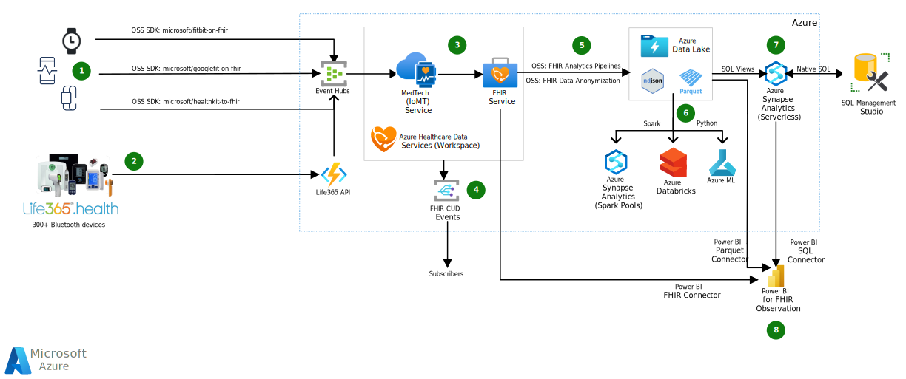

Health systems, hospitals, and large physician practices are shifting to hospital-at-home initiatives (also known as remote patient monitoring). Remote patient monitoring is a subset of clinical care where patients activity and physiological data can be accessed and delivered using remote health devices in accordance with individualized care plan parameters.

This article provides guidance on how to design a solution using Azure Health Data Services and devices for intelligent remote patient monitoring. The solution will help alleviate many of the device integration challenges your organization is bound to face when building such a solution at scale.  

## Architecture

*Download a [Visio file](https://arch-center.azureedge.net/remote-patient-monitoring.vsdx) of this architecture.*

### Dataflow

1. **Patient devices generate activity and physiological data.** The data is then extracted from the devices using one of the available Microsoft open-source (OSS) SDKs and ingested by Azure Event Hubs.

1. **Life365.health platform supports 300+ devices that generate activity and physiological data** The Life365 API ingests the activity and physiological data from the patient monitoring devices into Azure Event Hubs.

1. **The Azure MedTech service pulls the device measurements from Event Hubs**, transforming them into FHIR format [Fast Healthcare Interoperability Resources (FHIR®)](https://hl7.org/fhir/), and passes them into the Azure FHIR service. The Azure Health Data Services workspace is a logical container for healthcare service instances, such as the FHIR and MedTech services.  

1. **Azure Health Data Services workspace sends notification messages to events subscribers** when a FHIR resource is created, updated, or deleted in the Azure FHIR service. The notifications can be sent to multiple endpoints to trigger automation, including starting workflows or sending email and text messages. 

1. **FHIR Analytics Pipelines incrementally export non-anonymized FHIR data to Azure Data Lake**, making it available for analytics with various Azure data services. The exported data can also be anonymized by leveraging tools such as the Microsoft open-source [Tools for Health Data Anonymization](https://github.com/microsoft/Tools-for-Health-Data-Anonymization). The default anonymization is based on the [HIPAA Safe Harbor](https://www.hhs.gov/hipaa/for-professionals/privacy/special-topics/de-identification/index.html) method, which can be extended and modified as needed.

   > [!IMPORTANT]  
   > The exported FHIR data in this dataflow is raw, which includes PHI information. The process of de-identification can be used to  remove personal identifiers from the data for research or sharing purposes. If you desire de-identified data sets you **must** take measures to anonymize the data before exporting it, using a tool such as the one mentioned above.

1. **Further analysis of the FHIR data in the Parquet and JSON formats is done** using Spark pools in Azure Synapse, Azure Databricks, and Azure Machine Learning (ML) services. 

1. **SQL Views are created in the Serverless SQL pools in Azure Synapse.** A SQL view is created for each FHIR resource based on the Parquet files in the Azure Data Lake. Based on these views, data engineers and developers can write native SQL in Microsoft SQL Management Studio, or any other SQL editor, to query the FHIR resources. 

1. **Power BI and the Power Query connector for FHIR is used to import and shape data** directly from the FHIR Service API endpoint. Power BI also offers Parquet and SQL connectors for accessing the FHIR resource directly in the Parquet format or through the SQL Views in Synapse. 

### Components

#### Devices

**Consumer devices**

Microsoft provides open-source SDKs to facilitate transfer of data from various consumer devices for ingestion by Azure Event Hubs:

- The [Fitbit on FHIR](https://github.com/microsoft/FitbitOnFHIR) OSS SDK supports Fitbit devices.
- The [Fit on FHIR](https://github.com/microsoft/fit-on-fhir) OSS SDK supports Google Fit devices.
- The [HealthKitToFhir Swift Library](https://github.com/microsoft/healthkit-to-fhir) OSS SDK supports Apple devices.

**Life365.health supported medical devices**

The [Life365.health platform](https://www.life365.health/solutions-remote-patient-monitoring) is integrated with [over 300 Bluetooth monitoring devices](https://www.life365.health/en/supported-devices) for ingestion by Azure Event Hubs. The devices span multiple categories and OEMs, ranging from spirometers, thermometers, weight scales, pill reminders, activity trackers, blood glucose meters, blood pressure monitors, EKG / ECG, fetal dopplers, heart rate monitors, pulse oximeters, sleep trackers and more. The Life365 app also allows manual recording of readings taken from non-Bluetooth devices. This architecture utilizes the Life365 API to ingest the device measurements from the Life365 devices into Event Hubs.

**Other**

While the above options help make it easier, this architecture supports any similar data sources that can be securely ingested into Event Hubs, directly or indirectly through an intermediary API.

#### Azure services (data collection and storage)

- [Azure Event Hubs](https://azure.microsoft.com/services/event-hubs/) - a fully managed, real-time data ingestion service that’s simple, trusted, and scalable. Stream millions of events per second from any source to build dynamic data pipelines and immediately respond to business challenges. In this architecture it's used for collecting and aggregating the device data, for transfer to Azure Health Data Services.

- [Azure Health Data Services](https://azure.microsoft.com/services/health-data-services/) is a set of managed API services based on open standards and frameworks that enable workflows to improve healthcare and offer scalable and secure healthcare solutions. The services used in this architecture include:
   - [Azure Health Data Services workspace](/azure/healthcare-apis/workspace-overview) - provides a container for the other Azure Health Data Services instances, creating a compliance boundary (HIPAA, HITRUST) in which protected health information can travel.

   - [Azure FHIR service](/azure/healthcare-apis/fhir/) - makes it easy to securely store and exchange protected health information (PHI) in the cloud. Device data is transformed into FHIR-based [Observation](https://www.hl7.org/fhir/observation.html) resources to support remote patient monitoring. 

   - Azure [MedTech service](/azure/healthcare-apis/iot/) - a cornerstone of [Microsoft Cloud for Healthcare](https://www.microsoft.com/industry/health/microsoft-cloud-for-healthcare), used to support remote patient monitoring. MedTech is a Platform as a service (PaaS) that enables you to gather near-real-time data from diverse medical devices and convert it into an FHIR-compliant service format and store in a FHIR service. MedTech service's device data translation capabilities make it possible to transform a wide variety of data into a unified FHIR format that provides secure health data management in a cloud environment.  

     MedTech service is important for remote patient monitoring because healthcare data can be difficult to access or analyze when it comes from diverse or incompatible devices, systems, or formats. Medical information that isn't easy to access can be a barrier on gaining clinical insights and a patient's health care plan. The ability to translate health data into a unified FHIR format enables MedTech service to successfully link devices, health data, labs, and remote in-person care. As a result, this capability can facilitate the discovery of important clinical insights and trend capture, supporting the clinician, care team, patient, and family. It can also help make connections to new device applications and enable advanced research projects. Just as care plans can be individualized per use case, remote patient monitoring scenarios and use cases can vary per individualized need.  

- [Azure Event Grid](https://azure.microsoft.com/services/event-grid/) - the [Azure Health Data Services events service](/azure/healthcare-apis/events/) generates events whenever a FHIR resource is created, updated or deleted (CUD). These events can be broadcast by Azure Event Grid to downstream consumers to act on event-based data.

#### Azure services and tools (data analytics)

- [FHIR Analytics Pipelines](https://github.com/microsoft/FHIR-Analytics-Pipelines) - an OSS project used to build components and pipelines for rectangularizing and moving FHIR data, from Azure FHIR servers to [Azure Data Lake](https://azure.microsoft.com/solutions/data-lake/). In this architecture, the data is converted to JavaScript Object Notation (JSON) and [Parquet](/azure/databricks/data/data-sources/read-parquet) format, making it available for analytics with various Azure data services. 

- [Tools for Health Data Anonymization](https://github.com/microsoft/Tools-for-Health-Data-Anonymization) - an OSS project backed by the Microsoft Healthcare team helps anonymize healthcare data, on-premises or in the cloud, for secondary usage such as research, public health, and more. The anonymization core engine uses a configuration file to specify different parameters, as well as anonymization methods for different data-elements and data types. 

- [Azure Synapse Analytics](https://azure.microsoft.com/services/synapse-analytics/) - a limitless analytics service that brings together data integration, enterprise data warehousing, and big data analytics. It gives you the freedom to query data on your terms, using either serverless or dedicated options—at scale. Azure Synapse brings these worlds together with a unified experience to ingest, explore, prepare, transform, manage, and serve data for immediate BI and machine learning needs.

- [Apache Spark pools](/azure/synapse-analytics/spark/apache-spark-overview) - Apache Spark is a parallel processing framework that supports in-memory processing to boost the performance of big data analytic applications. Apache Spark in Azure Synapse Analytics is one of Microsoft's implementations of Apache Spark in the cloud. Azure Synapse makes it easy to create and configure a serverless Apache Spark pool in Azure. Spark pools in Azure Synapse are compatible with Azure Storage and Azure Data Lake Generation 2 Storage. So you can use Spark pools to process your data stored in Azure.

- [Azure Databricks](https://azure.microsoft.com/products/databricks/) - a data analytics platform optimized for the Microsoft Azure cloud services platform. Databricks provides a unified analytics platform for data analysts, data engineers, data scientists, and machine learning engineers. Three environments are offered for developing data intensive applications: Databricks SQL, Databricks Data Science & Engineering, and Databricks Machine Learning.

- [Azure ML](https://azure.microsoft.com/services/machine-learning/) - an Azure cloud service for accelerating and managing the machine learning project lifecycle. Machine learning professionals, data scientists, and engineers can use it in their day-to-day workflows: Train and deploy models, and manage MLOps. You can create a model in Azure Machine Learning or use a model built from an open-source platform, such as Pytorch, TensorFlow, or scikit-learn. MLOps tools help you monitor, retrain, and redeploy models.

- [Power BI](https://powerbi.microsoft.com/) - provides self-service analytics at enterprise scale, allowing you to:
   - Create a data-driven culture with business intelligence for all.
   - Keep your data secure with industry-leading data security capabilities including sensitivity labeling, end-to-end encryption, and real-time access monitoring.is used for further analysis of FHIR data.

- [Power Query connectors](/power-query/connectors/) used with Power BI include: 
   - [Parquet file data source connector](/power-bi/connect-data/desktop-data-sources#file-data-sources) - used to access Azure Data Lake Parquet file data.
   - [Power Query connector for FHIR](/power-query/connectors/fhir/fhir) - used to import and shape data from a FHIR server.
   - [Azure Synapse Analytics SQL data source connector](/power-bi/connect-data/desktop-data-sources#azure-data-sources) - used for creating SQL queries against Azure Synapse Analytics.

- [SQL Server Management Studio](/sql/ssms/download-sql-server-management-studio-ssms) - a desktop app used to create native SQL queries against SQL data stores, such as Azure Synapse Analytics SQL pools.

### Alternatives

**Life365.health**  

The advantage of Life365.health is that with one integration point, you can push measurements from a wide range of devices in the Life365 ecosystem into the Azure Health Data Services. Other wearable device APIs exist, such as Garmin Activity API and Polar AccessLink API, for which a similar integration pattern can be achieved. However, these APIs are exclusive to measurement from devices of their own manufacturers, such as Garmin and Polar respectively. 

Devices and patients need to be defined, linked, and synchronized between the Azure Health Data Services and the Life365 API. This configuration can be achieved by syncing the patient and device IDs between the Azure Health Data Services and Life365 API. In essence, a new patient and device is created and linked in the Azure FHIR Service first. Then the corresponding patient and device is created and linked in the Life365 API. The IDs of the patients and devices, first created in the Azure Health Data Services, will then be updated as external IDs in the respective patient and device entities in the Life365 API.

**Microsoft Cloud for HealthCare**

This example workload addresses one way of implementing a remote patient monitoring solution. The [Microsoft Cloud for Healthcare](https://www.microsoft.com/industry/health/microsoft-cloud-for-healthcare) also provides a [remote patient monitoring solution](https://solutions.microsoft.com/Microsoft%20Cloud%20for%20Healthcare). For more information on that solution, see the [remote patient monitoring guided tour](https://guidedtour.microsoft.com/guidedtour/healthcare/remote-patient-monitoring).

## Scenario details

There's a plenitude of medical and wearable/consumer devices out there today. To access device measurements/readings, many of the in-home monitoring devices (such as blood pressure devices, scale…etc.) provide Bluetooth connectivity (such as Bluetooth Low Energy, or other older versions of the Bluetooth standard). There are also consumer wearable devices, as well as more advanced in-home devices that provide API connectivity to access the devices measurements. In this case the devices can sync the readings directly to the API (Wifi enabled) or connect to a mobile app on a smart phone (via Bluetooth), allowing the app to sync the reading back to the API.  

### Problem statement

Given the wide range of wearable and in-home medical devices and connectivity options (from Bluetooth to API specification), multiplied by the number of patients within the healthcare organization, data integration and orchestration may become a daunting task. 

### Potential use cases

- **Clinical trials and research** – Help clinical research teams integrate and offer a wide range of in-home and wearable medical devices to the study participant. In other words, offer a quasi-Bring-Your-Own-Device (BYOD) option to your study participants.

- **Data science and population health analytics** – The activity and physiological data will be available in the industry FHIR standard format, as well as other open-source data formats (JSON and Parquet). In addition to the data format, native connectors are provided to help with the data analysis and transformation. Including connectors such as the Power BI connector for FHIR, Synapse Serverless SQL views and Spark clusters in Synapse. 

   This solution also provides a parameterized method to anonymize the dataset for de-identified research purposes. This "secondary use data" can be analyzed and used to find best practices and support clinical evidence-based workflows. Observations stored in the FHIR server can be used to find variances and workflows that promote the best outcomes and practices.

- **Enable healthcare providers** - Providers will be able to: 
   - gain better insights into patient health status
   - create proactive digital health care models for preventative medical care
   - take more informed actions based on the physiological indicators/notifications
   - provide pathways for remote physiologic monitoring reimbursement 

- **Patient Reported Outcome (PRO) questionnaires and PRO-driven care** - By using events and PRO questionnaires, individualized care plans and care variance workflows can be created. The patient is allowed to have more autonomy and control over the individualized care plan, which helps adoption and sustained use. PRO-driven care can also be helpful in solving the gap in education and patient outcomes. By linking education questionnaires and PROs, RPM can be used to support medication, treatment, and/or follow up care, by answering questions such as:
   - Are patients taking their BP correctly? 
   - Is the scale being used at the right time and frequency? 
   - Are we looping in PROs for patient adoption and individualized care planning? 

   For patients using iOS devices, questionnaire apps can be built using the [Apple ResearchKit](https://www.researchandcare.org/researchkit/). Questionnaire data is ingested by Azure Event Hubs and made available via the FHIR service, just like device patient activity and physiological data.

- **Allow for multiple types and more precise health devices** - Use medical and home medical devices to generate health data in near-real-time for data ingestion and analysis. 

## Considerations

These considerations address the pillars of the Azure Well-Architected Framework, which is a set of guiding tenets that can be used to improve the quality of a workload. For more information, see [Microsoft Azure Well-Architected Framework](/azure/architecture/framework).

### Reliability

Reliability ensures your application can meet the commitments you make to your customers. For more information, see [Overview of the reliability pillar](/azure/architecture/framework/resiliency/overview).

The availability of clinical data and insights is critical for many healthcare organizations. Here are ways to minimize downtime of the Azure services indicated in this solution:

- Data Lake Storage is always [replicated three times](/azure/storage/common/storage-redundancy) in the primary region, with the option to choose locally redundant storage (LRS) or zone-redundant storage (ZRS).

- Azure Event Hubs spreads the risk of catastrophic failures of individual machines or even complete racks across clusters that span [multiple failure domains within a datacenter](/azure/event-hubs/event-hubs-availability-and-consistency?tabs=dotnet#availability). For more information, see Azure Event Hubs - [Geo-disaster recovery](/azure/event-hubs/event-hubs-geo-dr?tabs=portal).

- Databricks provides [disaster recovery guidance](/azure/databricks/administration-guide/disaster-recovery) for its data analytics platform.

- The Machine Learning deployment can be [multi-regional](/azure/machine-learning/how-to-high-availability-machine-learning).

### Security

Security provides assurances against deliberate attacks and the abuse of your valuable data and systems. For more information, see [Overview of the security pillar](/azure/architecture/framework/security/overview).

Healthcare data often includes sensitive protected health information (PHI) and personal information. The following resources are available to secure this data:

- Data Lake Storage uses Azure role-based access control (RBAC) and access control lists (ACLs) to create an [access control model](/azure/storage/blobs/data-lake-storage-access-control-model)

- Azure Health Data Services is a collection of secured managed services using [Azure Active Directory (Azure AD)](/azure/active-directory/), a global identity provider that supports [OAuth 2.0](https://oauth.net/2/). When you create a new service of Azure Health Data Services, your data is encrypted using Microsoft-managed keys by default. Refer to [Authentication and Authorization for Azure Health Data Services](/azure/healthcare-apis/authentication-authorization) for more details.

- Azure Event Hubs provides encryption of data at rest with Azure Storage [Service Encryption (Azure SSE)](/azure/event-hubs/event-hubs-premium-overview#encryption-of-events). As such, [IP Firewall](/azure/event-hubs/network-security#ip-firewall) rules can be applied at the Event Hubs namespace Level. Access to [private endpoints](/azure/event-hubs/network-security#private-endpoints) and [virtual network](/azure/event-hubs/network-security#advanced-security-scenarios-enabled-by-vnet-integration) can also be configured.

- [Synapse RBAC](/azure/synapse-analytics/security/synapse-workspace-synapse-rbac) extends the capabilities of [Azure RBAC](/azure/role-based-access-control/overview) for Synapse workspaces and their content. Azure RBAC is used to manage who can create, update, or delete the Synapse workspace and its SQL pools, Apache Spark pools, and Integration runtimes.

### Cost optimization

Cost optimization is about looking at ways to reduce unnecessary expenses and improve operational efficiencies. For more information, see [Overview of the cost optimization pillar](/azure/architecture/framework/cost/overview).

The pricing for many of the Azure components can be found in the [Azure Pricing Calculator](https://azure.com/e/3031cab6beb541a0a72733c0f88729c9). Ultimately, pricing for this solution is based on factors such as:

- The Azure services that are used.
- Volume of data, in terms of the number of patients/devices and the number of activity and physiological data types being ingested.
- Capacity and throughput requirements for Event Hubs.
- Compute resources that are needed to perform machine learning training and deployments, Synapse Spark Pools and Databricks clusters.
- The visualization and reporting solution, such as Power BI.

When implementing this solution, consider the data retention and archival policy for the underlying Azure Data Lake. Take advantage of [Azure Storage lifecycle management](/azure/storage/blobs/lifecycle-management-overview) to provide an automated way to:
- transition file blobs down to the cool access tier
- archive tiers based on when the file was last modified. 

To learn more about Life365.health plans and pricing, review the [Life365 API Connect Data offer in the Microsoft Azure Marketplace](https://azuremarketplace.microsoft.com/marketplace/apps/life365inc1629235889975.life365-api-connect?tab=Overview)

### Performance efficiency

Performance efficiency is the ability of your workload to scale to meet the demands placed on it by users in an efficient manner. For more information, see [Performance efficiency pillar overview](/azure/architecture/framework/scalability/overview).

This solution provides a scalable near-realtime architecture for remote patient monitoring. It's important to acknowledge the multi-layered data flow from the interface between the devices and the Life365 API, to the ingestion from Life365 API and Azure Event Hubs, to the transformation in the MedTech Service in Azure Health Data Service, and lastly to the incremental export and anonymization to the data lake format. Hence, the data flow will be processed in near-realtime and any downstream application and/or integrations should be designed as such. Yet, the performance of this solution can scale to a serve a large number of devices and patients at the enterprise level.

- This solution leverages Azure Event Hubs as the major ingestion point. Scalability of Event Hubs can be managed with [Throughput units](/azure/event-hubs/event-hubs-scalability#throughput-units), [Processing units](/azure/event-hubs/event-hubs-scalability#processing-units) and the [Capacity units](/azure/event-hubs/event-hubs-dedicated-overview). As such, [partitioning](/azure/event-hubs/event-hubs-scalability#partitions) can help with processing of large volumes of events in Event Hubs.

- Apache Spark for Azure Synapse Analytics pool's [Autoscale feature automatically scales](/azure/synapse-analytics/spark/apache-spark-autoscale) the number of nodes in a cluster instance up and down.

- Azure Machine Learning offers deployment for [inference with GPU](/azure/machine-learning/v1/how-to-deploy-inferencing-gpus) processors and [Azure FPGAs](/azure/machine-learning/v1/how-to-deploy-fpga-web-service) that make it possible to achieve low latency for real-time inference.

## Contributors

*This article is maintained by Microsoft. It was originally written by the following contributors.* 

Principal authors: 

 - [Mustafa Al-Durra](https://www.linkedin.com/in/mustafaaldurra/) | Healthcare Industry Architect
 - [Janna Templin](https://www.linkedin.com/in/janna-templin-9081a165/) | Senior Program Manager

*To see non-public LinkedIn profiles, sign in to LinkedIn.*

## Next steps

Technologies and resources that are relevant to implementing this architecture:

- Try the available quickstarts and tutorials for components used in this architecture:
  - [Azure Event Hubs](/azure/event-hubs/event-hubs-create)
  - [Azure Healthcare Data Services](/azure/healthcare-apis/get-started-with-health-data-services) resource and related components:
    - [AHDS workspace](/azure/healthcare-apis/healthcare-apis-quickstart)
    - [MedTech service](/azure/healthcare-apis/iot/get-started-with-iot)
    - [FHIR Service](/azure/healthcare-apis/fhir/get-started-with-fhir)
    - [Azure Event Grid](/azure/healthcare-apis/events/events-deploy-portal)
  - [Azure Data Lake Storage and data analysis using Azure services](/azure/storage/blobs/data-lake-storage-integrate-with-services-tutorials)
  - [Tools for Health Data Anonymization](https://github.com/microsoft/Tools-for-Health-Data-Anonymization)
  - [Azure Synapse Analytics serverless SQL pools](/azure/synapse-analytics/quickstart-serverless-sql-pool)
  - [SQL Server Management Studio](/sql/ssms/quickstarts/ssms-connect-query-sql-server)
  - [Power BI](/power-bi/fundamentals/desktop-getting-started)
  
- Review [Microsoft Cloud for Healthcare](/industry/healthcare/) resources:
   - Learn about [Data management considerations](/industry/healthcare/data-management)
   - Review the available reference architectures, including [Characteristics of healthcare data](/industry/healthcare/architecture/data-characteristics)

## Related resources

- Review the [remote patient monitoring solution](https://solutions.microsoft.com/Microsoft%20Cloud%20for%20Healthcare) in the Microsoft Cloud Solution Center. For more information, see the [remote patient monitoring guided tour](https://guidedtour.microsoft.com/guidedtour/healthcare/remote-patient-monitoring).
- [Virtual patient visits using Microsoft Cloud for Healthcare](/azure/architecture/example-scenario/mch-health/virtual-health-mch) shows a potential solution for scheduling and following up on virtual visits between patients, providers, and care managers.
