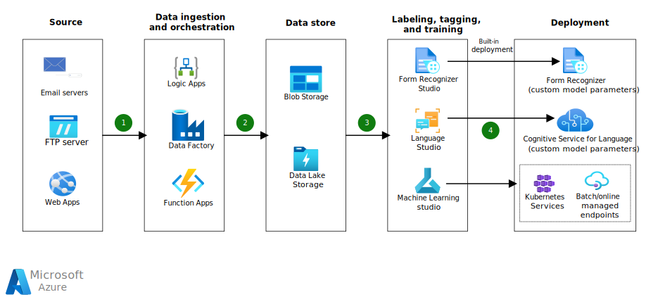

This article describes Azure solutions for building, training, deploying, and using custom document processing models. These Azure services also offer user interface (UI) capabilities to do labeling or tagging for text processing.

## Architecture

*Download a [Visio file](https://arch-center.azureedge.net/BuildandDeployCustomModels.vsdx) of this architecture.*

### Dataflow

1. Orchestrators like Azure Logic Apps, Azure Data Factory, or Azure Functions ingest messages and attachments from email servers, and files from FTP servers or web applications.

   - Azure Functions and Logic Apps enable serverless workloads. The service you choose depends on your preference for service capabilities like development, connectors, management, and execution context. For more information, see [Compare Azure Functions and Azure Logic Apps](/azure/azure-functions/functions-compare-logic-apps-ms-flow-webjobs#compare-azure-functions-and-azure-logic-apps).

   - Consider using Azure Data Factory for bulk data movement.

1. The orchestrators send ingested data to Azure Blob Storage or Data Lake Storage, organizing the data across data stores based on characteristics like file extensions or customers.

1. Form Recognizer Studio, Language Studio, or Azure Machine Learning studio label and tag textual data and build the custom models. You can use these three services independently or in various combinations to address different use cases.

   - If the document requires extracting key-value pairs or creating a custom table from an image format or PDF, use Form Recognizer Studio to tag the data and train the custom model.

   - For document classification based on content, or for domain-specific entity extraction, you can train a custom text classification or Named Entity Recognition (NER) model in Language Studio.

   - Azure Machine Learning studio can also do labeling for text classification or entity extraction with open-source frameworks like PyTorch or TensorFlow.

1. To deploy the custom models and use them for inference:

   - Form Recognizer has built-in model deployment. [Use Form Recognizer SDKs or the REST API](/azure/applied-ai-services/form-recognizer/how-to-guides/use-sdk-rest-api) to apply custom models for inferencing. Include the [model ID](https://westus.dev.cognitive.microsoft.com/docs/services/form-recognizer-api-v2-1/operations/AnalyzeWithCustomForm) or [custom model name](https://westus.dev.cognitive.microsoft.com/docs/services/form-recognizer-api-v3-0-preview-2/operations/AnalyzeDocument) in the Form Recognizer request URL, depending on the API version. Form Recognizer doesn't require any further deployment steps.

   - Language Studio provides an option to deploy custom language models. Get the REST endpoint [prediction URL](/azure/cognitive-services/language-service/custom-named-entity-recognition/how-to/call-api?tabs=language-studio#send-an-entity-recognition-request-to-your-model) by selecting the model to deploy. You can do model inferencing by using either the REST endpoint or the [Azure SDK client libraries](/azure/cognitive-services/language-service/custom-named-entity-recognition/how-to/call-api?tabs=client#send-an-entity-recognition-request-to-your-model).

   - Azure Machine Learning can deploy custom models to online or batch [Azure Machine Learning managed endpoints](/azure/machine-learning/concept-endpoints). You can also [deploy to Azure Kubernetes Service (AKS)](/azure/machine-learning/how-to-deploy-azure-kubernetes-service?tabs=python#deploy-to-aks) as a web service by using the Azure Machine Learning SDK.

### Components

- [Logic Apps](https://azure.microsoft.com/services/logic-apps) is part of [Azure Integration Services](https://azure.microsoft.com/product-categories/integration). Logic Apps creates automated workflows that integrate apps, data, services, and systems. With [managed connectors](/azure/connectors/managed) for services like Azure Storage and Office 365, you can trigger workflows when a file lands in the storage account or email is received.

- [Data Factory](https://azure.microsoft.com/services/data-factory) is a managed cloud extract, transform, load (ETL) service for data integration and transformation. Data Factory can add [transformation activities](/azure/data-factory/transform-data) to a pipeline that include invoking a REST endpoint or running a notebook on the ingested data.

- [Azure Functions](https://azure.microsoft.com/services/functions) is a serverless compute service that can host event-driven workloads with short-lived processes.

- [Blob Storage](https://azure.microsoft.com/services/storage/blobs) is the object storage solution for raw files in this scenario. Blob Storage supports libraries for multiple languages, such as .NET, Node.js, and Python. Applications can access files on Blob Storage via HTTP/HTTPS. Blob Storage has [hot, cool, and archive access tiers](/azure/storage/blobs/access-tiers-overview) to support cost optimization for storing large amounts of data.

- [Data Lake Storage](https://azure.microsoft.com/services/storage/data-lake-storage) is a set of capabilities built on Azure Blob Storage for big data analytics. Data Lake Storage retains the cost effectiveness of Blob Storage, and provides features like file-level security and file system semantics with hierarchical namespace.

- [Form Recognizer](https://azure.microsoft.com/services/form-recognizer), part of [Azure Applied AI Services](https://azure.microsoft.com/solutions/ai/applied-ai-services), has in-built document analysis capabilities to extract printed and handwritten text, tables, and key-value pairs. Form Recognizer has prebuilt models for extracting data from invoices, documents, receipts, ID cards, and business cards. Form Recognizer can also train and deploy custom models by using either a [custom template](/azure/applied-ai-services/form-recognizer/concept-custom-template) form model or a [custom neural](/azure/applied-ai-services/form-recognizer/concept-custom-neural) document model.

  [Form Recognizer Studio](https://formrecognizer.appliedai.azure.com) provides a UI for exploring Form Recognizer features and models, and for building, tagging, training, and deploying custom models.

- [Azure Cognitive Service for Language](https://azure.microsoft.com/services/cognitive-services/language-service) consolidates the Azure natural language processing services. The suite offers prebuilt and customizable options. For more information, see the Cognitive Service for Language [available features](/azure/cognitive-services/language-service/overview#available-features).

  [Language Studio](https://aka.ms/languageStudio) provides a UI for exploring and analyzing Azure Cognitive Service for Language features. Language Studio also provides options for building, tagging, training, and deploying custom models.

- [Azure Machine Learning](https://azure.microsoft.com/services/machine-learning) is an open platform for managing machine learning model development and deployment at scale.

  - Azure Machine Learning studio provides data labeling options for [images](/azure/machine-learning/how-to-create-image-labeling-projects#image-labeling-capabilities) and [text](/azure/machine-learning/how-to-create-text-labeling-projects).
  - [Export labeled data](/azure/machine-learning/how-to-use-labeled-dataset#export-data-labels) as [COCO](https://cocodataset.org) or Azure Machine Learning datasets. You can use the datasets for training and deploying models in Azure Machine Learning notebooks. 
  - [Deploy models to AKS](/azure/machine-learning/how-to-deploy-azure-kubernetes-service?tabs=python#deploy-to-aks) as a web service for real-time inferencing at scale, or as managed endpoints for both real-time and batch inferencing.

### Alternatives

You can add more workflows to this scenario based on specific use cases.

- If the document is in image or PDF format, you can extract the data by using Azure [Computer Vision](/azure/cognitive-services/computer-vision/overview-ocr), [Form Recognizer Read API](/azure/applied-ai-services/form-recognizer/how-to-guides/use-prebuilt-read?pivots=programming-language-python), or open-source libraries.

- You can do [document and conversation summarization](/azure/cognitive-services/language-service/text-summarization/overview) by using the prebuilt model in Azure Cognitive Service for Language.

- Use pre-processing code to do text processing steps like cleaning, stop words removal, lemmatization, stemming, and text summarization on extracted data, per document processing requirements. You can expose the code as REST APIs for automation. Do these steps manually or automate them by integrating with the [Logic Apps](/azure/logic-apps/logic-apps-custom-api-host-deploy-call) or [Azure Functions](/samples/azure-samples/flask-app-on-azure-functions/azure-functions-python-create-flask-app) ingestion process.

## Scenario details

Document processing is a broad area. It can be difficult to meet all your document processing needs with the prebuilt models available in Azure Form Recognizer and Azure Cognitive Service for Language. You might need to build custom models to automate document processing for different applications and domains.

Major challenges in model customization include:

- Labeling or tagging text data with relevant key-value pair entities to classify text for extraction.
- Deploying models securely at scale for easy integration with consuming applications.

### Potential use cases

The following use cases can take advantage of custom models for document processing:

- Build custom NER and text classification models based on open-source frameworks.
- Extract custom key-values from documents for various industry verticals like insurance and healthcare.
- Tag and extract specific domain-dependent entities beyond the [prebuilt NER models](/azure/cognitive-services/luis/luis-concept-prebuilt-model), for domains like security or finance.
- Create custom tables from documents.
- Extract signatures.
- Label and classify emails or other documents based on content.

## Considerations

These considerations implement the pillars of the Azure Well-Architected Framework, which is a set of guiding tenets that can be used to improve the quality of a workload. For more information, see [Microsoft Azure Well-Architected Framework](/azure/architecture/framework).

For this example workload, implementing each pillar depends on optimally configuring and using each component Azure service.

### Reliability

Reliability ensures your application can meet the commitments you make to your customers. For more information, see [Overview of the reliability pillar](/azure/architecture/framework/resiliency/overview).

#### Availability

- See the availability service level agreements (SLAs) for each component Azure service:

  - Azure Form Recognizer - [SLA for Azure Applied AI Services](https://azure.microsoft.com/support/legal/sla/azure-applied-ai-services/v1_0).
  - Azure Cognitive Service for Language - [SLA for Azure Cognitive Services](https://azure.microsoft.com/support/legal/sla/cognitive-services/v1_1).
  - Azure Functions - [SLA for Azure Functions](https://azure.microsoft.com/support/legal/sla/functions/v1_2).
  - Azure Kubernetes Service - [SLA for Azure Kubernetes Service (AKS)](https://azure.microsoft.com/support/legal/sla/kubernetes-service/v1_1).
  - Azure Storage - [SLA for Storage Accounts](https://azure.microsoft.com/support/legal/sla/storage/v1_5/).

- For configuration options to design high availability applications with Azure storage accounts, see [Use geo-redundancy to design highly available applications](/azure/storage/common/geo-redundant-design).

#### Resiliency

- Handle failure modes of individual services like Azure Functions and Azure Storage to ensure resiliency of the compute services and data stores in this scenario. For more information, see [Resiliency checklist for specific Azure services](/azure/architecture/checklist/resiliency-per-service).

- For Form Recognizer, [back up and recover your Form Recognizer models](/azure/applied-ai-services/form-recognizer/disaster-recovery).

- For custom text classification with Cognitive Services for Language, [back up and recover your custom text classification models](/azure/cognitive-services/language-service/custom-classification/fail-over).

- For custom NER in Cognitive Services for Language, [back up and recover your custom NER models](/azure/cognitive-services/language-service/custom-named-entity-recognition/fail-over).

- Azure Machine Learning depends on constituent services like Blob Storage, compute services, and AKS. To provide resiliency for Azure Machine Learning, configure each of these services to be resilient. For more information, see [Failover for business continuity and disaster recovery](/azure/machine-learning/how-to-high-availability-machine-learning).

### Security

Security provides assurances against deliberate attacks and the abuse of your valuable data and systems. For more information, see [Overview of the security pillar](/azure/architecture/framework/security/overview).

- Implement data protection, identity and access management, and network security recommendations for [Blob Storage](/azure/storage/blobs/security-recommendations), [Cognitive Services](/security/benchmark/azure/baselines/cognitive-services-security-baseline) for Form Recognizer and Language Studio, and [Azure Machine Learning](/security/benchmark/azure/baselines/machine-learning-security-baseline).

- Azure Functions can access resources in a virtual network through [virtual network integration](/azure/azure-functions/functions-networking-options#virtual-network-integration).

### Cost optimization

Cost optimization is about looking at ways to reduce unnecessary expenses and improve operational efficiencies. For more information, see [Overview of the cost optimization pillar](/azure/architecture/framework/cost/overview).

The total cost of implementing this solution depends on the pricing of the services you choose.

The major costs for this solution are:

- The compute cost involved in Azure Machine Learning training. Choose the right node type, cluster size, and number of nodes to help optimize costs. Azure Machine Learning provides options to set the minimum nodes to zero and to set the idle time before the scale down. For more information, see [Manage and optimize Azure Machine Learning costs](/azure/machine-learning/how-to-manage-optimize-cost).

- Data orchestration duration and activities. For Azure Data Factory, the charges for copy activities on the Azure integration runtime are based on the number of Data Integration Units (DIUs) used and the execution duration. Added orchestration activity runs are also charged, based on their number.

  Logic Apps pricing plans depend on the resources you create and use. The following articles can help you choose the right plan for specific use cases:
  
  - [Costs that typically accrue with Azure Logic Apps](/azure/logic-apps/plan-manage-costs#costs-that-typically-accrue-with-azure-logic-apps)
  - [Single-tenant versus multi-tenant and integration service environment for Azure Logic Apps](/azure/logic-apps/single-tenant-overview-compare)
  - [Usage metering, billing, and pricing models for Azure Logic Apps](/azure/logic-apps/logic-apps-pricing)

For more information on pricing for specific components, see the following resources:

- [Azure Form Recognizer pricing](https://azure.microsoft.com/pricing/details/form-recognizer)
- [Azure Functions pricing](https://azure.microsoft.com/pricing/details/functions)
- [Logic Apps Pricing](https://azure.microsoft.com/pricing/details/logic-apps/)
- [Azure Data Factory pricing](https://azure.microsoft.com/en-in/pricing/details/data-factory/data-pipeline)
- [Azure Blob Storage pricing](https://azure.microsoft.com/pricing/details/storage/blobs)
- [Language Service pricing](https://azure.microsoft.com/pricing/details/cognitive-services/language-service)
- [Azure Machine Learning pricing](https://azure.microsoft.com/pricing/details/machine-learning/#overview)

Use the [Azure pricing calculator](https://azure.microsoft.com/pricing/calculator) to add your selected component options and estimate the overall solution cost.

### Performance efficiency

Performance efficiency is the ability of your workload to scale to meet the demands placed on it by users in an efficient manner. For more information, see [Performance efficiency pillar overview](/azure/architecture/framework/scalability/overview).

#### Scalability

- To scale Azure Functions automatically or manually, [choose the right hosting plan](/azure/azure-functions/functions-scale).

- Form Recognizer supports 15 concurrent requests per second by default. To request an increased quota, [create an Azure support ticket](/azure/azure-portal/supportability/how-to-create-azure-support-request).

- For Azure Machine Learning custom models hosted as web services on AKS, the [azureml-fe](/azure/machine-learning/how-to-deploy-azure-kubernetes-service?tabs=python#autoscaling) front end automatically scales as needed. This component also routes incoming inference requests to deployed services.

- For deployments as managed endpoints, support [autoscaling](/azure/machine-learning/concept-endpoints#autoscaling) by integrating with the [Azure Monitor autoscale feature](/azure/azure-monitor/autoscale/autoscale-overview).

- The API service limits on [custom NER](/azure/cognitive-services/language-service/custom-named-entity-recognition/service-limits#apis-limits) and [custom text classification](/azure/cognitive-services/language-service/custom-classification/service-limits#api-limits) for inferencing are 20 GET or POST requests per minute.

## Contributors

*This article is maintained by Microsoft. It was originally written by the following contributor.*

Principal author:

 - [Jyotsna Ravi](https://www.linkedin.com/in/jyotsna-ravi-50182624) | Sr. Customer Engineer

*To see non-public LinkedIn profiles, sign in to LinkedIn.*

## Next steps

- [Get started: Form Recognizer Studio](/azure/ai-services/document-intelligence/quickstarts/try-document-intelligence-studio?view=doc-intel-3.1.0)
- [Use Form Recognizer SDKs or REST API](/azure/applied-ai-services/form-recognizer/how-to-guides/use-sdk-rest-api)
- [Quickstart: Get started with Language Studio](/azure/cognitive-services/language-service/language-studio)
- [What is optical character recognition (OCR)?](/azure/cognitive-services/computer-vision/overview-ocr)
- [How to configure Azure Functions with a virtual network](/azure/azure-functions/configure-networking-how-to)

## Related resources

- [Extract text from objects using Power Automate and AI Builder](../ai/extract-object-text.yml)
- [Suggest content tags with NLP using deep learning](../../solution-ideas/articles/website-content-tag-suggestion-with-deep-learning-and-nlp.yml)
- [Knowledge mining in contract management](../../solution-ideas/articles/contract-management.yml)
- [Knowledge mining for content research](../../solution-ideas/articles/content-research.yml)
- [Automate document processing by using Azure Form Recognizer](../ai/automate-document-processing-azure-form-recognizer.yml)
- [Automate healthcare forms](../ai/form-recognizer-healthcare.yml)
