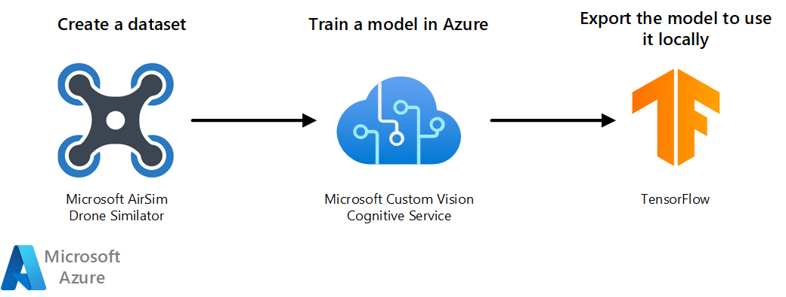

[!INCLUDE [header_file](../../../includes/sol-idea-header.md)]

This architecture uses Custom Vision to classify images taken by a simulated drone. It provides a way to combine AI and the Internet of Things (IoT). Azure Custom Vision can also be used for object detection purpose.

## Architecture

*Download a [Visio file](https://arch-center.azureedge.net/vision-classifier-model-with-custom-vision.vsdx) of this architecture.*

### Workflow

1. Use AirSim's 3D-rendered environment to take images taken with the drone. Use the images as the training dataset.
1. Import and tag the dataset in a [Custom Vision](/azure/cognitive-services/Custom-Vision-Service) project. The cognitive service trains and tests the model.
1. Export the model into TensorFlow format so you can use it locally.
1. The model can also be deployed to a [container](/azure/iot-edge/tutorial-deploy-custom-vision?view=iotedge-2018-06) or to [mobile devices](/azure/cognitive-services/custom-vision-service/export-your-model).

### Components

#### Microsoft AirSim Drone simulator

[Microsoft AirSim Drone simulator](https://github.com/microsoft/AirSim) is built on the [Unreal Engine](https://www.unrealengine.com). The simulator is open-source, cross-platform, and developed to help AI research. In this architecture, it creates the dataset of images used to train the model.

#### Azure Custom Vision

[Azure Custom Vision](https://www.customvision.ai) is part of [Azure Cognitive Services](https://azure.microsoft.com/services/cognitive-services). In this architecture, it creates an image classifier model.

#### TensorFlow

[TensorFlow](https://www.tensorflow.org) is an open-source platform for machine learning (ML). It's a tool that helps you develop and train ML models. When you export your model to TensorFlow format, you'll have a protocol buffer file with the Custom Vision model that you can use locally in your script.

## Scenario details

Azure Cognitive Services offers many possibilities for Artificial Intelligence (AI) solutions. One of them is [Azure Custom Vision](/azure/cognitive-services/custom-vision-service), which allows you to build, deploy, and improve your image classifiers. This architecture uses Custom Vision to classify images taken by a simulated drone. It provides a way to combine AI and the Internet of Things (IoT). Azure Custom Vision can also be used for object detection purpose.

### Potential use case

This solution is ideal for the rescue, simulation, robotics, aircraft, aerospace, and aviation industries.

Microsoft [Search and Rescue Lab](https://github.com/microsoft/DroneRescue) suggests a hypothetical use case for Custom Vision. In the lab, you fly a Microsoft AirSim simulated drone around in a 3D-rendered environment. You use the simulated drone to capture synthetic images of the animals in that environment. After creating a dataset of images, you use the dataset to train a Custom Vision classifier model. To train the model, you tag the images with the names of the animals. When you fly the drone again, take new images of the animals. This solution identifies the name of the animal in each new image.

In a practical application of the lab, an actual drone replaces the Microsoft AirSim simulated drone. If a pet is lost, the owner provides images of the pet to the Custom Vision model trainer. Just like in the simulation, the images are used to train the model to recognize the pet. Then, the drone pilot searches an area where the lost pet might be. As it finds animals along the way, the drone's camera can capture images and determine if the animal is the lost pet.

## Deploy this scenario

To deploy this reference architecture, follow the steps described in the [GitHub repo of the Search and Rescue Lab](https://github.com/microsoft/DroneRescue).

## Contributors

*This article is maintained by Microsoft. It was originally written by the following contributors.*

Principal authors:

 * [Jose Contreras](https://www.linkedin.com/in/josedanielcontreras) | Principal Software Engineer

## Next steps

* [Learn more about Microsoft AirSim](https://github.com/microsoft/AirSim)
* [Learn more about Azure Custom Vision Cognitive Service](/azure/cognitive-services/custom-vision-service)
* [Learn more about Azure Cognitive Services](/azure/cognitive-services)

## Related resources

Read other Azure Architecture Center articles:

* [Image classification on Azure](../../example-scenario/ai/intelligent-apps-image-processing.yml)
* [Geospatial analysis with Azure Synapse Analytics](../../industries/aerospace/geospatial-processing-analytics.yml)
* [AI enrichment with image and natural language processing in Azure Cognitive Search](../../solution-ideas/articles/cognitive-search-with-skillsets.yml)
