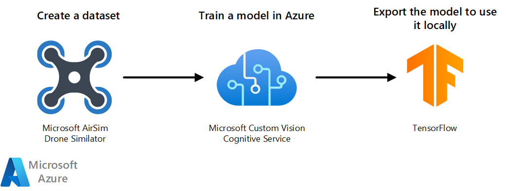

# Vision classifier model with Azure Custom Vision Cognitive Service

Azure Cognitive Services offers many possibilities for Artificial Intelligence (AI) solutions. One of them is [Custom Vision](https://docs.microsoft.com/azure/cognitive-services/custom-vision-service/) which allows you to build, deploy, and improve your image classifiers. This architecture uses Custom Vision to classify images taken by a simulated drone. It provides a way to combine AI and the Internet of Things (IoT).

## Potential use case

Microsoft [Search and Rescue Lab](https://github.com/Microsoft/DroneRescue) suggests a hypothetical use case for Custom Vision. In the lab, you fly a Microsoft AirSim simulated drone around in a 3D-rendered environment. You use the simulated drone to capture synthetic images of the animals in that environment. You create a dataset of images of the animals. You then use the dataset of images to train a Custom Vision classifier model in Azure to know the names of the animals in the images. When you fly the drone again and take new images of the animals, this solution identifies the type of animal in each new image.

The a practical application, Microsoft AirSim simulated drone is replaced with a real drone. If an owner looses a pet, images of the pet can be used to create the Custom Vision model in Azure. Just like in the simulation, the images of the pet are used to train the model to recognize the pet. Then, the drone can be deployed to search an area where the lost pet might be. As it encounters animals, the drone's camera can capture images and determine if the animal is the lost pet.

## Architecture

1. Use AirSim's 3D-rendered environment to take images taken with the drone. Use the images as the training dataset.
1. Import and tag the dataset in a Custom Vision project. The cognitive service trains and tests the model.
1. Export the model into TensorFlow format so you can use it locally.

## Components

### Microsoft AirSim Drone simulator

[Microsoft AirSim Drone simulator](https://github.com/microsoft/AirSim) is built on the [Unreal Engine](https://www.unrealengine.com/). It's open-source, cross-platform, and developed to help AI research. In this architecture, it creates the dataset of images used to train the model.

### Azure Custom Vision

[Azure Custom Vision](https://www.customvision.ai) s part of [Azure Cognitive Services](https://azure.microsoft.com/services/cognitive-services/). In this architecture, it creates an image classifier model.

### TensorFlow

[TensorFlow] is an open-source platform for machine learning (ML). It's a tool that helps you develop and train ML models. When you export your model to TensorFlow format, you'll have a protocol buffer file with the Custom Vision model that you can use locally in your script.

## Next steps

To deploy this reference architecture, follow the steps described in the [GitHub repo of the Search and Rescue Lab](https://github.com/Microsoft/DroneRescue).

## Related resources

* [Learn more about Microsoft AirSim](https://github.com/microsoft/AirSim)
* [Learn more about Azure Custom Vision Cognitive Service](https://docs.microsoft.com/azure/cognitive-services/custom-vision-service/)
* [Learn more about Azure Cognitive Services](https://docs.microsoft.com/azure/cognitive-services/)
