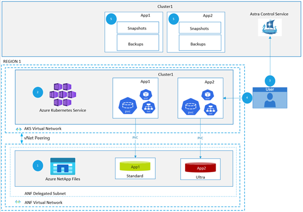
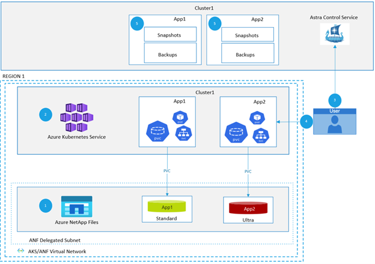

Containerized applications introduce new challenges when it comes to data protection and stateful backups. For business-critical workloads that are deployed on Kubernetes, application backup and recovery must satisfy the following requirements:

* Simplicity: Establishing data protection policies and on-demand backups in an intuitive manner, independent of details of underlying infrastructure.
* Portability: Backups must be consumable in multiple Kubernetes clusters, enabling cross-region mobility of applications.
* Application-aware: Protect the entire application wholistically including standard Kubernetes resources like secrets, ConfigMaps (in addition to persistent volumes), and other custom Kubernetes resources. When possible, quiesce the application to ensure no data in-flight is lost when backing it up.

This reference architecture explains how NetApp [Astra Control Service](https://azuremarketplace.microsoft.com/marketplace/apps/netapp.astra-info?tab=Overview) (ACS) can be used to provide data protection, disaster recovery, and application mobility for stateful applications running on [Azure Kubernetes Service](/azure/aks/intro-kubernetes) (AKS). Astra Control offers stateful AKS workloads a rich set of storage and application-aware data management services powered by [Azure NetApp Files](/azure/azure-netapp-files/azure-netapp-files-introduction)’ (ANF) trusted data protection technology.

## Potential use cases

Applications that are stateful fall in this category. Example use cases include:

* Continuous Integration (CI) systems [Jenkins]
* Database workloads [MySQL, MongoDB, PostgreSQL]
* AI/ML components [TensorFlow, PyTorch]
* Elasticsearch
* Kafka
* Source Code Management [GitLab]

## Architecture

The architecture diagram walks through the operations involved in deploying and protecting applications on Azure Kubernetes Service (AKS) with Astra Control Service (ACS), on Azure NetApp Files (ANF).

1. An Azure NetApp Files account is created on the desired Azure subscription. Capacity pools that map to the needed service levels (Standard, Premium, and Ultra) are also defined in this step.
2. AKS cluster(s) are deployed in the region of choice. The clusters must be present in a region where [Azure Kubernetes Service and Azure NetApp Files](https://azure.microsoft.com/global-infrastructure/services/?products=kubernetes-service,netapp&regions=all) are available. In addition, clusters must be present in a VNet that has [(direct) access to an Azure NetApp Files delegated subnet](/azure/azure-netapp-files/azure-netapp-files-network-topologies#virtual-network-for-azure-netapp-files-volumes).
3. After signing up for an Astra Control Service account, existing AKS clusters are discovered using ACS. In this step, a Service Principal that has Contributor access to the Azure subscription is used to automatically discover AKS clusters that are present in the Azure subscription. This step will also include the creation of Kubernetes storageClasses, using Astra Trident, that map to ANF capacity pools defined in (1). The creation of storageClasses is handled through Astra Trident and does not require Azure or Kubernetes RBAC. The storageClasses are defined to map to the ANF capacity pools based on their service level.
4. Applications are installed on AKS clusters by the end user. Persistent volumes will be provisioned on the storageClasses created in (3). Applications can be deployed using several methods such as Helm charts, operators, YAML manifests grouped using labels and/or namespace.
5. ACS is used to manage applications and their associated resources (pods, services, deployments, PVCs, and so on). Users can define applications by confining them to a namespace, grouping resources that are identified by a custom Kubernetes label, or deploying applications with Helm3 in a namespace. [Point-in-time snapshots](/azure/azure-netapp-files/snapshots-introduction#what-volume-snapshots-are), [backup policies](/azure/azure-netapp-files/backup-introduction), [instant active clones](/azure/azure-netapp-files/snapshots-introduction#restoring-cloning-an-online-snapshot-to-a-new-volume), can now be orchestrated through ACS to protect application workloads. This is achieved through:, can now be orchestrated through ACS to protect application workloads. This is achieved through:
    1. The creation of ACS protection policies which specify the schedule and backup target, enabling applications to be automatically backed up.
    2. On-demand snapshots that can be created at any time for each individual application.
    3. Instantaneous backups or clones for each individual application.

Backups and/or snapshots are used to restore application state in the event of app failures/disasters. Apps can also be cloned and migrated across namespaces, as well as AKS clusters in the same or separate regions.

## Components

* [Azure Kubernetes Service](https://azure.microsoft.com/services/kubernetes-service/) is a managed Kubernetes service to deploy Kubernetes clusters with ease. Azure Kubernetes Service (AKS) offers serverless Kubernetes, an integrated continuous integration and continuous delivery (CI/CD) experience, and enterprise-grade security and governance.
* [Azure NetApp Files](https://azure.microsoft.com/services/netapp/) is an Azure storage service offered by Microsoft that provides enterprise-grade (NFS and SMB) file shares. Azure NetApp Files makes it easy for enterprise line-of-business (LOB) and storage professionals to migrate and run complex, file-based applications with no code change, particularly important for persistent volumes in any Kubernetes environment.
* [Virtual Network](https://azure.microsoft.com/services/virtual-network/) is used to create virtual networks that Azure resources will utilize.
* [Astra Control Service](https://azuremarketplace.microsoft.com/marketplace/apps/netapp.astra-info) is a fully managed application-aware data management service that manages, protects, and moves data-rich Kubernetes workloads in both public clouds and on-premises. Astra enables data protection, disaster recovery, and migration for your Kubernetes workloads using Azure NetApp Files’ industry-leading [data management technology for snapshot, backup, cross region replication, and cloning](https://docs.microsoft.com/azure/azure-netapp-files/snapshots-introduction).

## Alternatives

Use of a custom multi-pronged approach to separately backup/replicate persistent volumes, K8s resources, and other configuration state that is needed for a successful restore of an application. This can be cumbersome, challenging to be made app-agnostic, and usually is not scalable across multiple apps and environment that a typical enterprise has.

In certain, mainly I/O heavy, environments it might be cost beneficial to avoid cross peered VNet traffic by simplifying the architecture and bringing the AKS clusters and Azure NetApp Files delegated subnet into the same, single VNet.

## Considerations

Here are some key considerations to account for when it comes to managing Kubernetes applications using the architecture detailed.

### Managing

Discovering and managing applications is dependent on the way applications are deployed as well as identified. Typical strategies applied include grouping application objects in a dedicated namespace, assigning labels to objects that make up an application, as well as using Helm charts. Astra Control supports all three. When defining protection policies, workloads must be clearly identified beforehand. An essential pre-requisite is to make sure an application can be uniquely detected by Astra Control. Learn more about managing apps [here](https://docs.netapp.com/us-en/astra-control-service/use/manage-apps.html#manage-apps).

### Monitoring

With the introduction of the Kubernetes plane, monitoring is an important requirement for infrastructure as well as the platform layer. Astra Control provides a unified control plane to define and manage application protection policies across multiple AKS clusters. This provides a convenient, one-touch [dashboard](https://docs.netapp.com/us-en/astra-control-service/use/view-dashboard.html) to continuously handle workloads across regions. In addition, Astra Trident also provides a rich set of [Prometheus metrics](https://docs.netapp.com/us-en/trident/trident-use/monitor-trident.html) that provide visibility into the storage provisioned.

### Scalability

Depending on the degree of scalability desired, AKS clusters have additional worker nodes added to them. To scale, you can add additional node pools or scale existing node pools. This will effectively increase the number of nodes in your cluster and the total amount of cores and memory available for your containerized applications.

When using [_basic_ network features with Azure NetApp Files](/azure/azure-netapp-files/azure-netapp-files-network-topologies#configurable-network-features) a limit of 1000 IP addresses in use for a VNet is enforced. It is also worth noting that in each VNet, only one subnet can be delegated to Azure NetApp Files. For a complete list of resource limits for Azure NetApp Files, take a look at the [Resource Limits](/azure/azure-netapp-files/azure-netapp-files-resource-limits).
Azure NetApp Files [*standard* network features](/azure/azure-netapp-files/azure-netapp-files-network-topologies#configurable-network-features) lifts this 1000 IP address limitation.

### Availability

An AKS cluster will be deployed in a single region. To protect application workloads, it is recommended to deploy them across [multiple AKS clusters that span multiple regions](/azure/architecture/reference-architectures/containers/aks-multi-region/aks-multi-cluster). This would be influenced by [AKS region availability](/azure/aks/quotas-skus-regions#region-availability) and Azure’s [paired regions](/azure/best-practices-availability-paired-regions). By deploying clusters across multiple availability zones, nodes are distributed across multiple zones within a single region. This distribution of AKS cluster resources improves cluster availability as they're resilient to failure of a specific zone.. By deploying clusters across multiple availability zones, nodes are distributed across multiple zones within a single region. This distribution of AKS cluster resources improves cluster availability as they're resilient to failure of a specific zone.

Azure NetApp Files is designed with high availability in mind. It is built on a highly available bare-metal fleet of all flash storage systems providing a [99.99% availability SLA](https://azure.microsoft.com/support/legal/sla/netapp/v1_1/). In addition, Azure NetApp Files supports [Cross-Region Replication](/azure/azure-netapp-files/cross-region-replication-introduction) for disaster recovery. Volumes can be replicated between Azure region pairs continuously. To learn more about this, learn about the [requirements](/azure/azure-netapp-files/cross-region-replication-manage-disaster-recovery) for cross-region replication, as well as how it can be [configured](/azure/azure-netapp-files/cross-region-replication-create-peering).

### Performance

There are multiple performance tiers offered by Azure NetApp Files. When discovering AKS clusters with ACS, the onboarding process will involve the creation of curated storageClasses that map to the Standard, Premium, and Ultra service tiers. Users can choose to deploy applications and select the storage tier of choice based on their requirements. Multiple capacity pools can coexist, with provisioned volumes being offered a performance guarantee that corresponds to the service tier. To learn more, refer to the list of [supported service levels](/azure/azure-netapp-files/azure-netapp-files-service-levels) in Azure NetApp Files.

## Deploy this scenario

*Prerequisites:* You must have an existing Azure Account.
The steps below explain how you can get started with AKS and ACS to deploy and protect applications:

1. [Register](/azure/azure-netapp-files/azure-netapp-files-register) the NetApp Resource Provider.
2. Review the [requirements](https://docs.netapp.com/astra-control-service/get-started/set-up-microsoft-azure.html#aks-cluster-requirements) for Astra Control Service with Azure Kubernetes Service.
3. [Create a NetApp account](https://docs.netapp.com/us-en/astra-control-service/get-started/set-up-microsoft-azure.html#create-a-netapp-account-2) on the Azure portal to consume Azure NetApp Files.
4. [Set up capacity pools](https://docs.netapp.com/us-en/astra-control-service/get-started/set-up-microsoft-azure.html#set-up-a-capacity-pool) on the Azure NetApp Files account to consume storage.
5. [Delegate a subnet](https://docs.netapp.com/us-en/astra-control-service/get-started/set-up-microsoft-azure.html#delegate-a-subnet-to-azure-netapp-files-2) to Azure NetApp Files.
6. Create a [Service Principal](https://docs.netapp.com/us-en/astra-control-service/get-started/set-up-microsoft-azure.html#create-an-azure-service-principal-2) that will be used by Astra Control Service to discover AKS clusters and perform backup, restore and data management operations.
7. [Register](https://docs.netapp.com/us-en/astra-control-service/get-started/register.html) for Astra Control Service by creating a NetApp Cloud Central account.
8. [Add AKS clusters](https://docs.netapp.com/us-en/astra-control-service/get-started/add-first-cluster.html) to start managing applications with Astra Control Service.
9. [Detect applications](https://docs.netapp.com/us-en/astra-control-service/use/manage-apps.html#manage-apps-by-namespace) and [establish protection policies](https://docs.netapp.com/us-en/astra-control-service/use/protect-apps.html) to backup and restore with ease.

For additional helpful resources, check out the following:

* [Disaster Recovery of AKS Workloads with Astra Control Service and Azure NetApp Files](https://techcommunity.microsoft.com/t5/azure-architecture-blog/disaster-recovery-of-aks-workloads-with-astra-control-service/ba-p/2948089) walks you through the steps involved in protecting applications with the architecture discussed above.
* Astra Control Service documentation can be found [here](https://docs.netapp.com/us-en/astra-control-service/).

## Pricing

Use the [Azure Pricing calculator](https://azure.microsoft.com/pricing/calculator/) to evaluate the costs involved for the following components:

* Azure Kubernetes Service
* Azure NetApp Files
* Virtual Network

See Pricing Plans for Astra Control Service [here](https://cloud.netapp.com/astra-control). Adopting Astra Control Service for protecting your business-critical Kubernetes workloads enable you to focus on your application instead of spending time and resources on DIY solutions that do not scale. For as little as ~$200 per month you can protect an AKS application that might be generating millions of dollars of revenue. Astra Control Service is  available from the [Azure marketplace](https://azuremarketplace.microsoft.com/marketplace/apps/netapp.astra-info?tab=Overview).

Use the [Azure NetApp Files Performance Calculator](https://cloud.netapp.com/azure-netapp-files/tco) for detailed bandwidth and pricing calculations. A basic and advanced calculator is available, providing various levels of detail.

## Next steps

* Deploy a cluster using Azure Kubernetes Service. Refer to this [QuickStart guide](/azure/aks/tutorial-kubernetes-deploy-cluster?tabs=azure-cli).
* Get started with Azure NetApp Files using the [QuickStart guide](/azure/azure-netapp-files/azure-netapp-files-quickstart-set-up-account-create-volumes?tabs=azure-portal).
* To learn more about Astra Control Service, look at the documentation hosted on [docs.netapp.com](https://docs.netapp.com/us-en/astra-control-service/).

## Related resources

* For an in-depth explanation of disaster recovery with Astra Control Service, look at [Disaster Recovery of AKS workloads with Astra Control Service and Azure NetApp Files](https://techcommunity.microsoft.com/t5/azure-architecture-blog/disaster-recovery-of-aks-workloads-with-astra-control-service/ba-p/2948089)
* [AKS baseline for multiregion clusters - Azure Architecture Center](/azure/architecture/reference-architectures/containers/aks-multi-region/aks-multi-cluster)
* [Azure Kubernetes Service (AKS)](/azure/aks/intro-kubernetes)
* [Azure NetApp Files (ANF)](/azure/azure-netapp-files/azure-netapp-files-introduction)
* [NetApp Astra Control Service (ACS)](https://azuremarketplace.microsoft.com/marketplace/apps/netapp.astra-info?tab=Overview)
