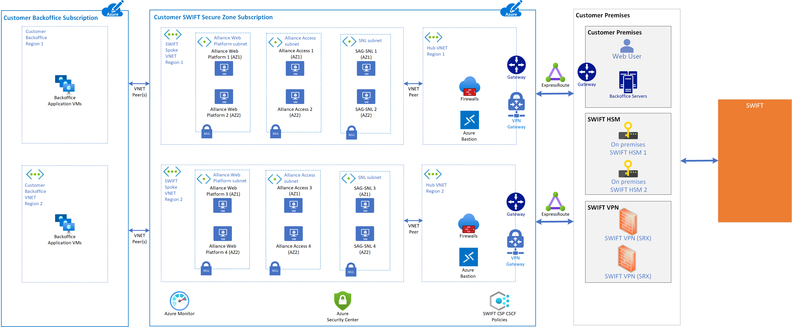
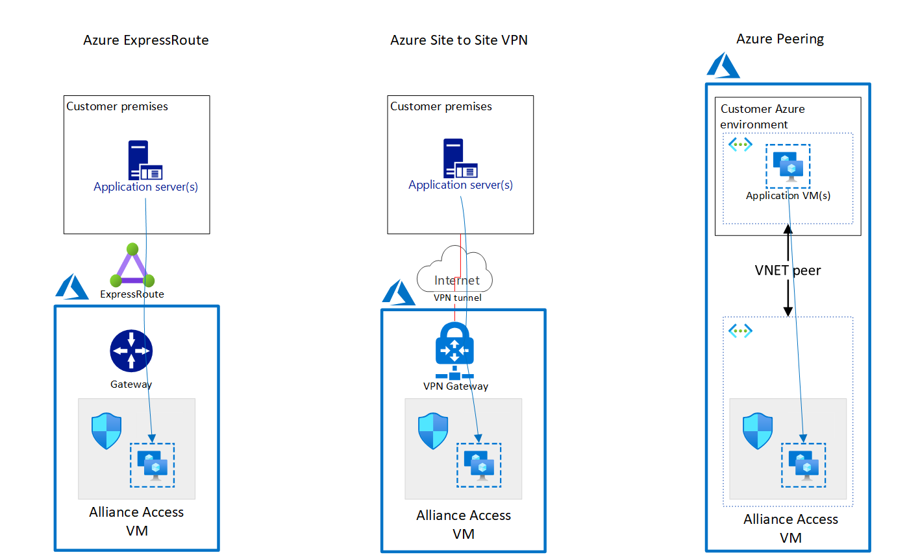
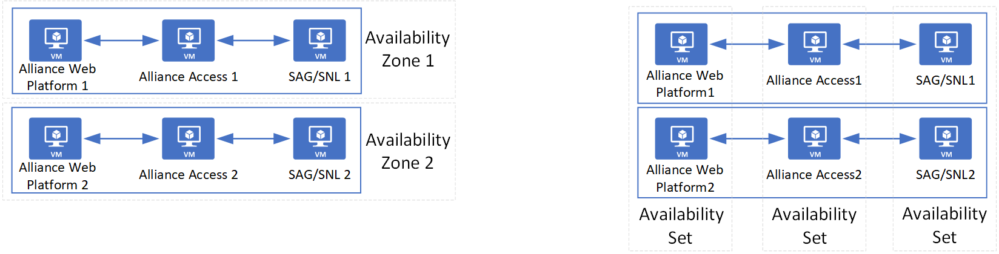

--- 
title: SWIFT Alliance Access on Azure
description: This article provides a reference architecture for deploying and running SWIFT Alliance Access on Azure.
author: ehaslett
ms.author: ethaslet
ms.date: 06/09/2022
ms.topic: example-scenario
ms.service: architecture-center
ms.subservice: example-scenario
ms.category:
  - featured
ms.custom:
  - fcp
  - example-scenario
categories:
  - integration
  - migration
summary: Use this reference architecture to deploy and run SWIFT Alliance Access Infrastructure and networking components in Azure.
products:
  - azure-virtual-machines
  - azure-virtual-network
  - azure-managed-disks
  - azure-load-balancer
  - azure-firewall
---

# SWIFT Alliance Access on Azure

This article provides a reference architecture for deploying and running SWIFT Alliance Access on Azure.

## Architecture

*Download a [PowerPoint file](https://arch-center.azureedge.net/swift-alliance-access-multi-region.pptx) that contains this architecture diagram.*

The Alliance Access Secure Zone subscription contains resources managed by the customer. The resources for Alliance Access can be deployed with an Azure Resource Manager template to create the core infrastructure as described in this architecture. An Alliance Access deployment in Azure should adhere to SWIFT's Customer Security Program (CSP) Control Framework (CSCF). We recommend that customers use the SWIFT CSP-CSCF Azure policies in this subscription.

Once the Alliance Access infrastructure in Azure is deployed, the customer follows SWIFT's instructions for installing the Alliance Access software.

### Workflow

* **Azure subscription**: An Azure subscription is needed to deploy Alliance Access. We recommend that you use a new Azure subscription to manage and scale Alliance Access.
* **Azure resource group**: The Alliance Access Secure Zone subscription has an Azure resource group that hosts these Alliance Access components:
  * Alliance Web Platform, running on an Azure virtual machine (VM).
  * Alliance Access, running on an Azure VM. The Alliance Access software contains an embedded Oracle database.
  * SWIFTNet Link (SNL) and SWIFT Alliance Gateway (SAG), running together on an Azure VM.
* **Azure Virtual Network**: An Azure Virtual Network forms a private network boundary around the SWIFT deployment. Customers should choose a network address space that doesn't conflict with the customer's on-premises sites, such as back office, hardware security module (HSM), and users.
* **Azure Virtual Network subnet**: Alliance Access components should be deployed in separate subnets to allow traffic control between them via Azure network security groups.
* **Azure route table**: Network connectivity between Alliance Access VMs and the customer's on-premises sites can be controlled by using an Azure route table.
* **Azure Firewall**: Any outbound connectivity from Alliance Access VMs to the internet should be routed by Azure Firewall. Typical examples of such connectivity are time sync and anti-virus definition update.
* **Azure Virtual Machines**: Azure Virtual Machines provides compute services for running Alliance Access. Use these guidelines for choosing the right SKU:
  * Use a compute-optimized SKU for the Alliance Web Platform front-end.
  * Use a memory-optimized SKU for Alliance Access with an embedded Oracle database.
* **Azure Managed Disk**: By using Premium SSD managed disks, Alliance Access components get high-throughput, low-latency disk performance. The components also have the ability to back up and restore disks that are attached to VMs.
* **Azure proximity placement group**: Customers can consider using Azure [proximity placement groups](/azure/virtual-machines/co-location) to ensure that all Alliance Access VMs are close to each other. Proximity placement groups reduce network latency between Alliance Access components.

The SWIFT customer establishes a secure connection from their on-premises or colocation site to the Alliance Access Secure Zone subscription.

* ExpressRoute can be used to connect the customer's on-premises to Azure over a private connection.
* Site-to-site VPN can be used to connect the customer's on-premises to Azure over the internet.
* The customer's Azure environment can be peered.

*Download a [PowerPoint file](https://arch-center.azureedge.net/swift-alliance-access-customer-connectivity-2.pptx) that contains this architecture diagram.*

The SWIFT customer's business and application systems can connect with Alliance Access VMs as shown in the previous diagram. However, business users can connect to the Alliance Web Platform only. The recommended Azure Firewall and Azure Network Security Group are configured to only allow appropriate traffic to pass to the Alliance Web Platform.

### Components

* [Azure Virtual Network](https://azure.microsoft.com/services/virtual-network)
* [Azure Virtual Machines](https://azure.microsoft.com/services/virtual-machines)
* [Azure Firewall](https://azure.microsoft.com/services/azure-firewall)
* [Azure Managed Disk](https://azure.microsoft.com/services/storage/disks)

### Alternatives

This Azure architecture shows all SWIFT components running in Azure, except the HSM and Alliance Connect networking solution appliances. It's possible to run SWIFT's [Alliance Access with Alliance Connect Virtual](swift-alliance-access-vsrx-on-azure.yml) networking solution in Azure.

## Scenario details

This architecture provides an overview of deploying SWIFT's Alliance Access on Azure. Alliance Access is one of the messaging interfaces that SWIFT offers for secure financial messaging.

### Potential use cases

These architectures are optimal for the finance industry.

The following examples are intended for both existing and new SWIFT customers, and can be used for the following scenarios:

* Migrating Alliance Access from on-premises to Azure
* Creating a new Alliance Access environment in Azure

## Considerations

These considerations implement the pillars of the Azure Well-Architected Framework, which is a set of guiding tenets that you can use to improve the quality of a workload. For more information, see [Microsoft Azure Well-Architected Framework](/azure/architecture/framework).

* Customers interested in deploying Alliance Access in Azure can contact SWIFT and Microsoft to get further assistance. A customer's Microsoft account team can be engaged to help guide the Azure implementation.
* SWIFT customer resources on Azure should comply with the SWIFT Customer Security Programme-Customer Security Controls Framework. CSP-CSCF control 1.1 mandates separation between production, test, and development environments. The recommended approach is to deploy each environment in a separate subscription. This approach makes it easier to separate the environments.

### Operational excellence

Operational excellence covers the operations processes that deploy an application and keep it running in production. For more information, see [Overview of the operational excellence pillar](/azure/architecture/framework/devops/overview).

* Customers have the responsibility for operating both the Alliance Access software and the underlying Azure resources in the Alliance Access subscription.
* Azure Monitor provides a comprehensive set of monitoring capabilities. These tools can monitor the Azure infrastructure, but not the SWIFT software. You can use a monitoring agent to collect event logs, performance counters, and other logs, and have these logs and metrics sent to Azure Monitor. For more information, see [Overview of the Azure monitoring agents](/azure/azure-monitor/platform/agents-overview).
* [Azure Alerts](/azure/azure-monitor/alerts/alerts-overview) uses your Azure Monitor data to alert you when it detects issues with your infrastructure or application. The alerts allow you to identify and address issues before the users of your system notice them.
* [Log Analytics in Azure Monitor](/azure/azure-monitor/logs/log-analytics-overview) allows you to edit run log queries with data in Azure Monitor Logs.
* Use [Azure Resource Manager](/azure/azure-resource-manager/templates/overview) templates (ARM templates) to provision Azure infrastructure components.
* Consider [Azure virtual machine extensions](/azure/virtual-machines/extensions/overview) to configure other solution components for your Azure infrastructure.
* The Alliance Access VM is the only component that stores business data and possibly requires backup and restore capabilities. Data in Alliance Access is stored in an Oracle database. You can use built-in tools for backup and restore.

### Performance efficiency

Performance efficiency is the ability of your workload to scale to meet the demands placed on it by users in an efficient manner. For more information, see [Performance efficiency pillar overview](/azure/architecture/framework/scalability/overview).

* Consider deploying an Azure virtual machine scale set to run web server VM instances in a [proximity placement group](/azure/virtual-machines/co-location). This approach colocates VM instances and reduces latency between VMs.
* Consider using Azure VMs with accelerated networking for up to 30 Gbps of network throughput.
* [Azure Managed Disks](/azure/virtual-machines/managed-disks-overview) with premium SSD allows for up to 20,000 IOPS and 900 Mbps of throughput.
* Consider configuring Azure Disk host caching as **ReadOnly** for higher disk throughput.

### Security

Security provides assurances against deliberate attacks and the abuse of your valuable data and systems. For more information, see [Overview of the security pillar](/azure/architecture/framework/security/overview).

* [Azure network security groups](/azure/virtual-network/network-security-groups-overview) can be configured to collect flow logs and packet captures in [Azure Network Watcher](https://azure.microsoft.com/services/network-watcher). Security group flow logs in Network Watcher can be sent to Azure Storage accounts. [Microsoft Sentinel](https://azure.microsoft.com/services/microsoft-sentinel) offers built-in orchestration and automation of common tasks. This functionality can collect the flow logs, detect and investigate threats, and respond to incidents.
* [Microsoft Defender for Cloud](https://azure.microsoft.com/services/defender-for-cloud) protects your hybrid data, cloud-native services, and servers. It integrates with your existing security workflows, such as SIEM solutions and Microsoft threat intelligence, to streamline threat mitigation.
* [Azure Bastion](https://azure.microsoft.com/services/azure-bastion) enables connectivity transparency from the Azure portal to a VM by using RDP or SSH. Because Azure Bastion requires administrators to sign in to the Azure portal, [Azure Active Directory Multi-Factor Authentication](/azure/active-directory/authentication/concept-mfa-howitworks) can be enforced and [Conditional Access](/azure/active-directory/conditional-access/overview) can be used to enforce other restrictions—for example, which public IP address administrators can sign in. Deploying Azure Bastion also enables just-in-time access, which opens required ports on-demand when remote access is required.

#### Authentication and authorization

Administrators managing the SWIFT infrastructure in Azure require an identity in the [Azure Active Directory (Azure AD)](https://azure.microsoft.com/services/active-directory) of the Azure tenant associated with the subscription. Azure AD can be a part of an enterprise hybrid identity configuration that integrates your on-premises enterprise identity system with the cloud. However, SWIFT's CSP-CSCF recommends separating the identity system for SWIFT deployments from your enterprise identity system. If your current tenant is already integrated with your on-premises directory, you can create a separate tenant with a separate Azure AD to follow this recommendation.

Users enrolled in the Azure AD can sign in to the Azure portal, or authenticate with other management tools like [Azure PowerShell](/powershell/azure/overview) or [Azure Command-Line Interface](/cli/azure). [Azure Active Directory Multi-Factor Authentication](/azure/active-directory/authentication/concept-mfa-howitworks) and other restrictions, such as IP range restrictions, can be configured with [Conditional Access](/azure/active-directory/conditional-access/overview). Users get permissions on Azure subscriptions through [role-based access control (RBAC)](/azure/role-based-access-control/overview), which governs which operations users can do on a subscription.

The Azure AD associated with a subscription enables only the management of Azure services. For instance, you might provision VMs in Azure under a subscription. Azure AD provides credentials for signing in to those VMs only if you explicitly enable Azure AD authentication. To see how Azure can help customers use Azure AD for application authentication, see [Migrate application authentication to Azure AD](/azure/active-directory/manage-apps/migrate-application-authentication-to-azure-active-directory).

#### Enforcing SWIFT CSP-CSCF policies

[Azure Policy](https://azure.microsoft.com/services/azure-policy) enables customers to set policies that need to be enforced within an Azure subscription to meet compliance or security requirements. For example, Azure Policy can be used to block administrators from deploying certain resources, or to enforce network configuration rules that block traffic to the internet. Customers can use built-in policies or create policies themselves.

SWIFT has a policy framework that helps customers enforce a subset of SWIFT CSP-CSCF requirements. As part of this framework, customers use Azure policies within a customer subscription. For simplicity, you can create a separate subscription in which you deploy SWIFT Secure Zone components, and another subscription for other potentially related components. Separate subscriptions enable you to apply the SWIFT CSP-CSCF Azure policies only to subscriptions that contain a SWIFT Secure Zone.

We recommend that customers deploy SWIFT components in a subscription that's separate from any back-office applications. Separate subscriptions ensure that SWIFT CSP-CSCF applies only to SWIFT components and not to customer-specific components.

Consider using the latest implementation of SWIFT CSP controls, but first consult your Microsoft team.

### Resilience

When you deploy SWIFT components on-premises, you need to make decisions about resilience. For on-premises resilience, we recommend that you deploy into at least two separate data centers. This approach prevents a data center failure from compromising your business. The same considerations apply in Azure, although some different concepts apply.

#### Azure resilience concepts

Azure provides different service level agreements (SLAs) on VM availability. These SLAs vary, depending on whether you deploy a single VM, multiple VMs in an [availability set](/azure/virtual-machines/availability-set-overview), or multiple VMs spread over multiple [availability zones](/azure/availability-zones/az-overview). To mitigate the risk of a regional outage, SWIFT's Alliance Access should be deployed in multiple Azure regions.

For more information, see [Availability options for Azure Virtual Machines](/azure/virtual-machines/availability).

#### Single region multi-active resilience

The Alliance Access component uses an embedded Oracle database. To align with a multi-active Alliance Access deployment, customers can use a path-resilient architecture.

Path resilience has all the required SWIFT components placed in one path. You duplicate each path as many times as you need for resilience and scaling. If there's a failure, you fail over an entire path instead of a single component. The figure shows what this resiliency approach looks like with availability zones (left) or availability sets (right). This architecture has a simpler SWIFT configuration. But a failure in any component in a path requires that you switch to another path. By combining Web Platform and Alliance Access on a single VM, you can reduce the number of infrastructure components that can fail. Depending on the usage pattern of the SWIFT components, you might consider this possibility.

*Download a [PowerPoint file](https://arch-center.azureedge.net/swift-alliance-access-path-resilience.pptx) that contains this architecture diagram.*

Because different SWIFT components connect to specific nodes, you can't use Azure Load Balancer to automate failover or to provide load balancing. Instead, you have to rely on SWIFT's software capabilities to detect failure and switch to a secondary node. The actual uptime you achieve depends on how quickly a component can detect failure and fail over. Because you're using availability zones or availability sets, the VM uptime SLA for each component is well-defined.

#### Multi-region multi-active resilience

To increase resilience beyond a single Azure region, we recommend that you deploy in multiple Azure regions by using [Azure Paired Regions](/azure/best-practices-availability-paired-regions). Each Azure region is paired with another region within the same geography, together making a regional pair. Azure serializes platform updates (planned maintenance) across region pairs so that only one paired region is updated at a time. If an outage affects multiple regions, at least one region in each pair will be prioritized for recovery.

## Contributors

*This article is maintained by Microsoft. It was originally written by the following contributors.*

Principal author:

* [Ethan Haslett](https://www.linkedin.com/in/ethan-haslett-1502841) | Senior Cloud Solution Architect

## Next steps

* [What is Azure Virtual Network?](/azure/virtual-network/virtual-networks-overview)
* [Linux virtual machines in Azure](/azure/virtual-machines/linux/overview)
* [Azure virtual machine extensions](/azure/virtual-machines/extensions/overview)
* [What is Azure Firewall?](/azure/firewall/overview)
* [Introduction to Azure managed disks](/azure/virtual-machines/managed-disks-overview)
* [Availability zones](/azure/availability-zones/az-overview)

## Related resources

Explore the functionality and architecture of some other SWIFT modules in detail, as provided below.

* [SWIFT's Alliance Connect Virtual in Azure](swift-on-azure-vsrx.yml)
* [SWIFT's Alliance Access with Alliance Connect Virtual](swift-alliance-access-vsrx-on-azure.yml)
* [SWIFT's Alliance Messaging Hub (AMH) with Alliance Connect Virtual](swift-alliance-messaging-hub-vsrx.yml)
* [SWIFT Alliance Cloud in Azure](swift-alliance-cloud-on-azure.yml)
* [SWIFT Alliance Lite2 on Azure](swift-alliance-lite2-on-azure.yml)
