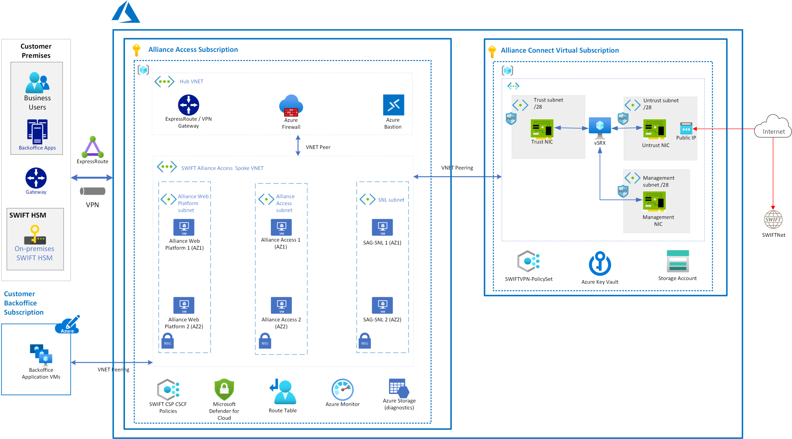

This article provides an overview of deploying SWIFT's Alliance Access on Azure, which is one of the messaging interfaces offered by SWIFT for secure financial messaging.

## Potential use cases

The following examples are intended for both existing and new SWIFT customers, and can be used for:

* Migrating Alliance Access from on-premises to Azure

* Establishing a new Alliance Access environment in Azure

## Architecture

_Download a [PowerPoint file](https://arch-center.azureedge.net/swift-alliance-access-multi-region.pptx) that contains this architecture diagram._

The Alliance Access Secure Zone subscription contains resources managed by the customer. The resources for Alliance Access can be deployed with an Azure Resource Manager template to create the core infrastructure as described in this architecture.  An Alliance Access deployment in Azure should adhere to SWIFT’s Customer Security Program (CSP) Control Framework (CSCF). We recommend customers use the SWIFT CSP-CSCF Azure policies in this subscription.

Once the Alliance Access infrastructure in Azure is deployed, the customer follows SWIFT's instructions for installing the Alliance Access software.

### Workflow

* **Azure subscription**: An Azure subscription is needed to deploy Alliance Access. We recommend that you use a new Azure subscription to manage and scale Alliance Access.

* **Azure resource group**: The Alliance Access Secure Zone subscription has an Azure resource group, hosting following Alliance Access components.

    1. Alliance Web Platform, running on an Azure virtual machine (VM).
    2. Alliance Access, running on an Azure VM. The Alliance Access software contains an embedded Oracle database.
    3. SWIFTNet Link (SNL) and SWIFT Alliance Gateway (SAG), running together on an Azure VM.

* **Azure Virtual Network**: An Azure Virtual Network forms a private network boundary around the SWIFT deployment. Customers should choose a network address space that doesn't conflict with the customer's on-premises sites. For example, back office, Hardware Security Module (HSM), and users.

* **Azure Virtual Network subnet**: Alliance Access components should be deployed in separate subnets. Separate subnets to allow traffic control between them via Azure network security groups.

* **Azure route table**: Network connectivity between Alliance Access components' VMs and the customer's on-premises sites can be controlled via Azure route table.

* **Azure Firewall**: Any outbound connectivity from Alliance Access components' VMs to the internet should be routed via Azure Firewall. Typical examples of such connectivity are time sync, anti-virus definition update, and so on.

* **Azure Virtual Machines**: Azure Virtual Machines provides compute services for running Alliance Access components. Consider using following general guidelines for choosing the right SKU.

    1. Compute optimized SKU for running Alliance Web Platform front-end.
    2. Memory optimized SKU for running Alliance Access with an embedded Oracle database.

* **Azure Managed Disk**: Premium SSD managed disks ensure Alliance Access components get high throughput, low latency disk performance, and the ability to back up and restore disks attached to VMs.

* **Azure proximity placement group**: Customers can consider using Azure [proximity placement groups](/azure/virtual-machines/co-location) (PPG) to ensure all Alliance Access VMs will be placed as close as possible to each other. PPGs will reduce the network latency between Alliance Access components.

The SWIFT customer will establish a secure connectivity from their on-premise/Co-Lo site to Alliance Access Secure Zone subscription.

* ExpressRoute can be used to connect customer premises to Azure via private connectivity.
* Site-to-site VPN can be used to connect customer premises to Azure via the internet.
* Peering from a customer's Azure environment.

_Download a [PowerPoint file](https://arch-center.azureedge.net/swift-alliance-access-customer-connectivity-2.pptx) that contains this architecture diagram._

The SWIFT customer's business/application systems can connect with Alliance Access VMs as shown above. However, business users can connect to the Alliance Web Platform only. The recommended Azure Firewall and Azure Network Security Group are configured to only allow appropriate traffic to pass to Alliance Web Platform.

### Components

* [Azure Virtual Network](https://azure.microsoft.com/services/virtual-network)
* [Azure Virtual Machines](https://azure.microsoft.com/services/virtual-machines)
* [Azure Firewall](https://azure.microsoft.com/services/azure-firewall)
* [Azure Managed Disk](https://azure.microsoft.com/services/storage/disks)

### Alternatives

This Azure architecture shows all SWIFT components running in Azure, except the Hardware Security Module. It's possible to run SWIFT's [Alliance Access with Alliance Connect](swift-alliance-access-on-azure.yml) networking solution in Azure.

## Considerations

A customer's account team at Microsoft can be engaged to help guide the Azure implementation.

***Separating different environments***

SWIFT customer resources on Azure should comply with the SWIFT Customer Security Programme-Customer Security Controls Framework. CSP-CSCF control 1.1 mandates separation between different environments (production, test, and development). The recommended approach is to deploy each environment in a separate subscription. Separate subscriptions make it easier to separate servers and other infrastructure, credentials, and more.

The following guidance will help improve architecture quality for Alliance Access on Azure.

### Operational excellence

Customers have the responsibility for operating both the Alliance Access software and the underlying Azure resources in the Alliance Access subscription.

* Azure provides a comprehensive set of monitoring capabilities in Azure Monitor. These tools focus on the infrastructure deployed in Azure. Monitoring the SWIFT's software falls outside these tools. You can use a monitoring agent to collect event logs, performance counters, and other logs, and have these logs and metrics sent to Azure Monitor. For more information, see [Overview of the Azure monitoring agents](/azure/azure-monitor/platform/agents-overview).

* [Azure Alerts](/azure/azure-monitor/alerts/alerts-overview) proactively notifies you when issues are found with your infrastructure or application using your monitoring data in Azure Monitor. They allow you to identify and address issues before the users of your system notice them.

* [Log Analytics in Azure Monitor](/azure/azure-monitor/logs/log-analytics-overview) allows you to edit run log queries with data in Azure Monitor Logs.

* Use [Azure Resource Manager](/azure/azure-resource-manager/templates/overview) (ARM) templates to provision Azure infrastructure components.

* Consider [Azure virtual machine extensions](/azure/virtual-machines/extensions/overview) to configure any other solution component on top of Azure infrastructure.

* The Alliance Access VM is the only component that stores business data and possibly requires backup and restore capabilities. Data in Alliance Access is stored in an Oracle database and the built-in backup tools can be used.

### Performance efficiency

* Consider deploying an Azure virtual machine scale set running Web server VM instances in a [Proximity Placement Group](/azure/virtual-machines/co-location), which co-locates VM instances and reduced inter-VM latency.

* Consider using Azure VMs with accelerated networking for up to 30 Gbps of network throughput.

* [Azure Managed Disks](/azure/virtual-machines/managed-disks-overview) with premium SSD allows for up to 20,000 IOPS and 900 MB/s of throughput.

* Consider configuring Azure Disk host caching as *ReadOnly* for higher disk throughput.

### Security

* [Azure network security groups](/azure/virtual-network/network-security-groups-overview) (NSG) can be configured to collect flow logs and packet captures in Network Watcher. NSG flow logs in Azure Network Watcher can be sent to Azure Storage accounts. [Microsoft Sentinel](https://azure.microsoft.com/services/microsoft-sentinel) can collect these logs, detect and investigate threats, and respond to incidents with built-in orchestration and automation of common tasks.

* [Microsoft Defender for Cloud](https://azure.microsoft.com/services/defender-for-cloud) protects your hybrid data, cloud-native services, and servers and integrates with your existing security workflows, such as SIEM solutions and Microsoft threat intelligence, to streamline threat mitigation.

* [Azure Bastion](https://azure.microsoft.com/services/azure-bastion) enables connectivity transparency from the Azure portal to a virtual machine via RDP or SSH. As Azure Bastion requires administrators to sign in to the Azure portal, [Azure Active Directory Multi-Factor Authentication](/azure/active-directory/authentication/concept-mfa-howitworks) can be enforced and [Conditional Access](/azure/active-directory/conditional-access/overview) can be used to enforce other restrictions. For example, which public IP address administrators can sign in. Deploying Azure Bastion also enables just-in-time access, which opens required ports on-demand when remote access is required.

***Authentication and authorization***

Administrators managing the SWIFT infrastructure in Azure will need an identity in the [Azure Active Directory](https://azure.microsoft.com/services/active-directory) (Azure AD) of the Azure tenant associated with the subscription. Azure AD can be a part of an enterprise hybrid identity configuration that integrates your on-premises enterprise identity system with the cloud. However, SWIFT's CSP-CSCF recommends separating the identity system for SWIFT deployments from your enterprise identity system. If your current tenant is already integrated with your on-premises directory, you can create a separate tenant with a separate Azure AD to follow this recommendation.

Users enrolled in the Azure AD can sign in to the Azure portal, or authenticate with other management tools like [Azure PowerShell](/powershell/azure/overview) or [Azure Command-Line Interface](/cli/azure). [Azure Active Directory Multi-Factor Authentication](/azure/active-directory/authentication/concept-mfa-howitworks) and other restrictions, such as IP range restrictions, can be configured with [Conditional Access](/azure/active-directory/conditional-access/overview). Users get permissions on Azure subscriptions through Azure [role-based access control (RBAC)](/azure/role-based-access-control/overview), which governs the operations users can do on a subscription.

The Azure AD associated with a subscription only enables management of Azure services. Azure AD does not provide credentials to sign into virtual machines provisioned in Azure under a subscription unless Azure AD authentication has been explicitly enabled. To see how Azure can help customers use Azure AD for application authentication, see [Migrate application authentication to Azure AD](/azure/active-directory/manage-apps/migrate-application-authentication-to-azure-active-directory).

***Enforcing SWIFT CSP-CSCF policies***

[Azure Policy](https://azure.microsoft.com/services/azure-policy/) enables customers to set policies that need to be enforced within (part of) an Azure subscription to meet compliance or security requirements. For example, Azure Policy can be used to block administrators to deploy certain resources or enforce network configuration rules that block traffic to the internet. Customers can use built-in policies or create policies themselves.

SWIFT has a policy framework that helps customers enforce a subset of SWIFT CSP-CSCF requirements using Azure policies within a customer subscription. For simplicity, you can create a separate subscription in which you deploy SWIFT Secure Zone components and another subscription for other (potentially related) components. Separate subscriptions enable you to apply the SWIFT CSP-CSCF Azure policies to subscriptions only containing a SWIFT Secure Zone.

We recommend customers deploy SWIFT components in a separate subscription from any back-office applications. Separate subscriptions ensure SWIFT CSP-CSCF only applies to SWIFT components and not to customer specific components.

Consider using the latest implementation of SWIFT CSP controls in Azure after consulting the Microsoft team working with you.

### Resilience

When you deploy SWIFT components on-premises, you need to make decisions around resilience. For on-premises resilience, we recommend you deploy into two separate data centers at minimum, so that a failure in one data center doesn’t compromise your business. The same considerations apply in Azure, although some different concepts apply, as we'll discuss next.

***Azure resilience concepts***

Azure provides different service level agreements (SLAs) on virtual machine (VM) availability, depending on whether you deploy a single VM, multiple VMs in an [Availability Set](/azure/virtual-machines/availability-set-overview), or multiple VMs spread over multiple [Availability Zones](/azure/availability-zones/az-overview). To mitigate the risk of a regional outage, SWIFT's Alliance Access should be deployed in multiple Azure regions.

For more detail, see [Availability options for Azure Virtual Machines](/azure/virtual-machines/availability).

***Single region multi-active resilience***

The Alliance Access component uses an embedded Oracle database. To align with the approach of a multi-active Alliance Access deployment, customers can use a path resilient architecture.

Path resilience has all the required SWIFT's components combined in one path. You duplicate each path as many times as you need for your resilience and scale needs. On a failure, you would fail over an entire path instead of a single component. The figure shows what this resiliency approach would look like with availability zones (left) or availability sets (right). This architecture is less complex from a SWIFT configuration perspective but does mean a failure in any component in a path requires you to switch to another path. Combining Web Platform and Alliance Access on a single virtual machine reduces the number of infrastructure components that can fail and could be a consideration depending on the usage pattern of the SWIFT's components.

_Download a [PowerPoint file](https://arch-center.azureedge.net/swift-alliance-access-path-resilience.pptx) that contains this architecture diagram._

Because different SWIFT's components connect to specific nodes, you can’t use the Azure Load Balancer to automate failover or provide load balancing. Instead, you need to rely on SWIFT's software capabilities to detect failure and switch to a secondary node. The actual uptime you achieve depends on how quickly a component can detect failure and failover. Because you are using availability zones or availability sets, the virtual machine uptime SLA for each component is well-defined.

***Multi-region multi-active resilience***

To increase resilience beyond a single Azure region, deploying in multiple Azure regions is recommended, using [Azure Paired Regions](/azure/best-practices-availability-paired-regions). Each Azure region is paired with another region within the same geography, together making a regional pair. Across the region pairs Azure serializes platform updates (planned maintenance), so only one paired region is updated at a time. If an outage affects multiple regions, at least one region in each pair will be prioritized for recovery.

## Next steps

* [What is Azure Virtual Network?](/azure/virtual-network/virtual-networks-overview)
* [Linux virtual machines in Azure](/azure/virtual-machines/linux/overview)
* [Azure virtual machine extensions](/azure/virtual-machines/extensions/overview)
* [What is Azure Firewall?](/azure/firewall/overview)
* [Introduction to Azure managed disks](/azure/virtual-machines/managed-disks-overview)
* [Availability Zones](/azure/availability-zones/az-overview)

## Related resources

Explore the functionality and architecture of some other SWIFT modules in detail, as provided below.

* [SWIFT Alliance Connect in Azure](swift-on-azure-srx.yml)
* [SWIFT Alliance Connect Virtual in Azure](swift-on-azure-vsrx.yml)
* [Alliance Access](swift-alliance-access-on-azure.yml)
* [Alliance Messaging Hub (AMH)](swift-alliance-messaging-hub.yml)
* [Alliance Messaging Hub (AMH) with Alliance Connect Virtual](swift-alliance-messaging-hub-vsrx.yml)
* [Alliance Lite2](swift-alliance-lite-2-on-azure.yml)
* [Alliance Cloud](swift-alliance-cloud-on-azure.yml)