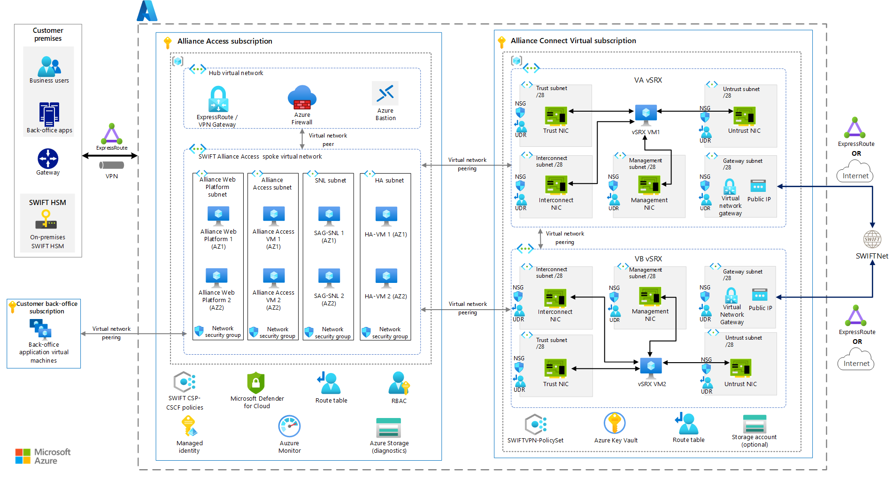
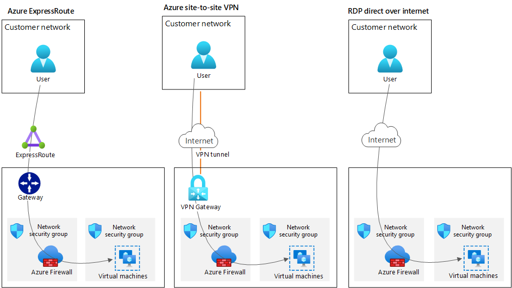
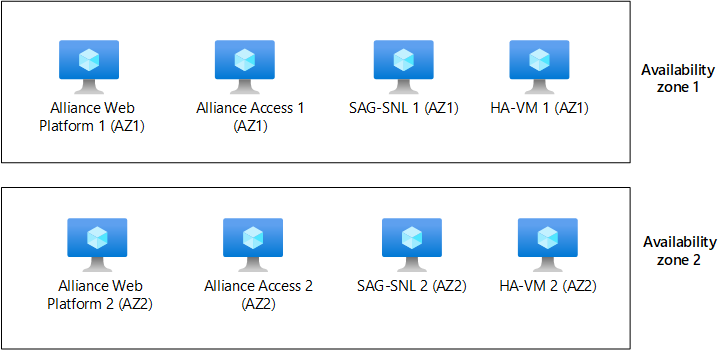

> [!NOTE]
> For updates on SWIFT product availability in the cloud, see the [SWIFT website](https://www.swift.com/our-solutions/interfaces-and-integration/alliance-connect-virtual).

This article provides an overview of deploying SWIFT Alliance Access on Azure. Alliance Access is one of the messaging interfaces that SWIFT offers for enhanced-security financial messaging. You can deploy the solution in a single Azure subscription. For better management and governance of the solution, however, we recommend that you use two Azure subscriptions: 
- One subscription contains the SWIFT Alliance Access components.
- The other subscription contains the resources to connect to the SWIFT network via Alliance Connect Virtual.

## Architecture

*Download a [Visio file](https://arch-center.azureedge.net/swift-alliance-vSRX-GA-allModules.vsdx) that contains this architecture diagram. See the **AA (All-GoldSilverBronze)** tab.*

The Alliance Access subscription contains resources that you manage. To create the core infrastructure of Alliance Access resources shown in the diagram, you can use an Azure Resource Manager template (ARM template). Alliance Access deployments on Azure should follow the guidance in SWIFT's Customer Security Programme (CSP) - Customer Security Control Framework (CSCF). We recommend that you use SWIFT CSP-CSCF Azure policies in this subscription.

The Alliance Connect Virtual subscription contains the components that are required to enable connectivity with SWIFTNet. High availability is enabled because the vSRX components depicted in the preceding diagram are deployed redundantly into two Azure availability zones. Additionally, HA-VM 1 and HA-VM 2 monitor and maintain the route tables to provide higher resiliency and improve the availability of the solution. 

The connection between SWIFTNet and customer-specific networking components can use the dedicated Azure ExpressRoute line or the internet. SWIFT offers three connectivity options: Bronze, Silver, and Gold. Choose the option that's best suited to message-traffic volumes and the required level of resiliency. For more information about these options, see [Alliance Connect: Bronze, Silver, and Gold packages](https://www.swift.com/our-solutions/interfaces-and-integration/alliance-connect/alliance-connect-bronze-silver-and-gold-packages).

For more information about resiliency, see [Single-region multi-active resiliency](#single-region-multi-active-resiliency) and [Multi-region multi-active resiliency](#multi-region-multi-active-resiliency) later in this article.

After you deploy the Alliance Access infrastructure on Azure, follow SWIFT's instructions for installing the Alliance Access software.

### Workflow

- **Azure subscription:** You need an Azure subscription to deploy Alliance Access. We recommend that you use a new Azure subscription to manage and scale Alliance Access.
- **Azure resource group:** The Alliance Access subscription contains an Azure resource group that hosts these Alliance Access components:
  - Alliance Web Platform, running on an Azure virtual machine (VM).
  - Alliance Access, running on an Azure VM. The Alliance Access software contains an embedded Oracle database.
  - SWIFTNet Link (SNL) and SWIFT Alliance Gateway (SAG), running together on an Azure VM.
- **Azure Virtual Network:** Virtual Network forms a private network boundary around the SWIFT deployment. Choose a network address space that doesn't conflict with your on-premises sites, like back-office, Hardware Security Module (HSM), and user sites.
- **Virtual Network subnet:** Alliance Access components should be deployed in separate subnets to allow traffic control between them via Azure network security groups.
- **Azure route table:** You can control network connectivity between Alliance Access VMs and your on-premises sites by using an Azure route table. 
- **Azure Firewall:** Any outbound connectivity from Alliance Access VMs to the internet should be routed by Azure Firewall. Typical examples of such connectivity are time syncs and antivirus definition updates.
- **Azure Virtual Machines:** Virtual Machines provides compute services for running Alliance Access. Use these guidelines to choose the right SKU:
  - Use a compute-optimized SKU for the Alliance Web Platform front end.
  - Use a memory-optimized SKU for Alliance Access with an embedded Oracle database.
- **Azure managed disks:** If you use Premium SSD managed disks, Alliance Access components benefit from high-throughput, low-latency disk performance. The components can also back up and restore disks that are attached to VMs.
- **Azure proximity placement groups:** You can consider using Azure [proximity placement groups](/azure/virtual-machines/co-location) to ensure that all Alliance Access VMs are close to each other. Proximity placement groups reduce network latency between Alliance Access components.

You need to establish an enhanced-security connection from your on-premises or colocation site to the Alliance Access subscription. You can use one of these methods:

- Use ExpressRoute to connect your premises to Azure over a private connection.
- Use site-to-site VPN to connect your premises to Azure over the internet.
- Use Remote Desktop Protocol (RDP) over the internet to connect. (Alternatively, you can use Azure Bastion for these connections.) Your Azure environment can be peered.

Your business and application systems can connect with Alliance Access VMs as shown in the previous diagram. However, business users can connect only to the Alliance Web Platform. The recommended Azure firewall and Azure network security group are configured to allow only appropriate traffic to pass to the Alliance Web Platform.

### Components  

- [Virtual Network](https://azure.microsoft.com/products/virtual-network)  
- [Virtual Machines](https://azure.microsoft.com/products/virtual-machines)  
- [Azure Firewall](https://azure.microsoft.com/products/azure-firewall) 
- [Azure managed disks](https://azure.microsoft.com/products/storage/disks)

## Scenario details

Alliance Access is one of the messaging interfaces that SWIFT offers for enhanced-security financial messaging.

### Potential use cases

This solution is optimal for the finance industry.

This approach is intended for both existing and new SWIFT customers. It can be used for the following scenarios:

- Migrating Alliance Access from on-premises to Azure
- Creating a new Alliance Access environment on Azure

## Considerations

These considerations implement the pillars of the Azure Well-Architected Framework, which is a set of guiding tenets that you can use to improve the quality of a workload. For more information, see [Microsoft Azure Well-Architected Framework](/azure/architecture/framework).

If you want more information about the following considerations, contact your account team at Microsoft, which can help guide your Azure implementation of SWIFT.

### Reliability

Reliability ensures that your application can meet the commitments that you make to your customers. For more information, see [Overview of the reliability pillar](/azure/architecture/framework/resiliency/overview).

When you deploy SWIFT components on-premises, you need to make decisions about availability and resiliency. For on-premises resiliency, we recommend that you deploy components into at least two datacenters. This approach helps ensure that a datacenter failure won't compromise your business. The same considerations apply on Azure, although some different concepts apply.

Alliance Access/Entry and Alliance Web Platform with the embedded database can be deployed into an Azure cloud infrastructure. The Azure infrastructure needs to comply with the corresponding application's requirements for performance and latency.

For information about the database recovery process, see the Alliance Access administration guide, section 14, on the [SWIFT website](https://www.swift.com/our-solutions/interfaces-and-integration/alliance-connect-virtual).

#### Azure resiliency concepts

Azure provides service-level agreements (SLAs) for VM availability. These SLAs vary, depending on whether you deploy a single VM, multiple VMs in an [availability set](/azure/virtual-machines/availability-set-overview), or multiple VMs spread over multiple [availability zones](/azure/reliability/availability-zones-overview). To mitigate the risk of a regional outage, deploy SWIFT Alliance Access in multiple Azure regions.
 
For more information, see [Availability options for Azure Virtual Machines](/azure/virtual-machines/availability).

#### Single-region multi-active resiliency

Alliance Access uses an embedded Oracle database. To align with a multi-active Alliance Access deployment, you can use a path-resilient architecture.

When you use path resiliency, you place all required SWIFT components in one path. You duplicate each path as many times as you need to for resiliency and scaling. If there's a failure, you fail over an entire path instead of a single component. The following diagram shows what this resiliency approach looks like when you use availability zones. This architecture is easier to configure, but a failure in any component in a path requires that you switch to another path. 

By combining Web Platform and Alliance Access on a single VM, you reduce the number of infrastructure components that can fail. Depending on the usage pattern of the SWIFT components, you might consider that configuration. For Alliance Access components and Alliance Connect Virtual instances, deploy the related systems in the same Azure zone, as shown in the preceding architecture diagram. For example, deploy Alliance Access Web Platform 1 VMs, Alliance Access 1 VMs, SAG-SNL 1, HA-VM 1, and VA vSRX VM1 in AZ1.

*Download a [Visio file](https://arch-center.azureedge.net/diagrams-swift-alliance-access-with-alliance-connect-virtual-in-azure.vsdx) that contains this architecture diagram.*

Because SWIFT components connect to different nodes, you can't use Azure Load Balancer to automate failover or to provide load balancing. Instead, you have to rely on SWIFT's software capabilities to detect failure and switch to a secondary node. The actual uptime you achieve depends on how quickly a component can detect failure and fail over. Because you're using availability zones or availability sets, the VM uptime SLA for each component is well-defined.

#### Multi-region multi-active resiliency

To increase resiliency beyond a single Azure region, we recommend that you deploy in multiple Azure regions by using [Azure paired regions](/azure/best-practices-availability-paired-regions). Each Azure region is paired with another region in the same geography. Azure serializes platform updates (planned maintenance) across region pairs so that only one paired region is updated at a time. If an outage affects multiple regions, at least one region in each pair is prioritized for recovery.

### Security

Security provides assurances against deliberate attacks and the abuse of your valuable data and systems. For more information, see [Overview of the security pillar](/azure/architecture/framework/security/overview).

- You can use [Azure Network Watcher](https://azure.microsoft.com/services/network-watcher) to collect [Azure network security group](/azure/virtual-network/network-security-groups-overview) flow logs and packet captures. You can send security group flow logs from Network Watcher to Azure Storage accounts. [Microsoft Sentinel](https://azure.microsoft.com/services/microsoft-sentinel) provides built-in orchestration and automation of common tasks. This functionality can collect the flow logs, detect and investigate threats, and respond to incidents.
- [Microsoft Defender for Cloud](https://azure.microsoft.com/services/defender-for-cloud) can help protect your hybrid data, cloud-native services, and servers. It integrates with your existing security workflows, like SIEM solutions and Microsoft threat intelligence, to streamline threat mitigation.
- [Azure Bastion](https://azure.microsoft.com/services/azure-bastion) provides connectivity transparency from the Azure portal to a VM by using RDP or SSH. Because Azure Bastion requires administrators to sign in to the Azure portal, [Azure Active Directory multifactor authentication](/azure/active-directory/authentication/concept-mfa-howitworks) can be enforced. You can use [Conditional Access](/azure/active-directory/conditional-access/overview) to enforce other restrictions. For example, you can specify the public IP address that administrators can use to sign in. Deploying Azure Bastion also enables just-in-time access, which opens required ports on-demand when remote access is required.

#### Authentication and authorization

Administrators who manage the SWIFT infrastructure on Azure need to have an identity in the [Azure Active Directory](https://azure.microsoft.com/services/active-directory) (Azure AD) service of the Azure tenant that's associated with the subscription. Azure AD can be a part of an enterprise hybrid identity configuration that integrates your on-premises enterprise identity system with the cloud. However, SWIFT's CSP-CSCF recommends separating the identity system for SWIFT deployments from your enterprise identity system. If your current tenant is already integrated with your on-premises directory, you can create a separate tenant with a separate Azure AD instance to comply with this recommendation.

Users enrolled in Azure AD can sign in to the Azure portal or authenticate by using other management tools, like [Azure PowerShell](/powershell/azure/overview) or [Azure CLI](/powershell/azure/overview). You can configure [Active Directory multifactor authentication](/azure/active-directory/authentication/concept-mfa-howitworks) and other safeguards, like IP range restrictions, by using [Conditional Access](/azure/active-directory/conditional-access/overview). Users get permissions on Azure subscriptions via [role-based access control (RBAC)](/azure/role-based-access-control/overview), which governs the operations that users can do in a subscription.

The Azure AD service that's associated with a subscription enables only the management of Azure services. For example, you might provision VMs in Azure under a subscription. Azure AD provides credentials for signing in to those VMs only if you explicitly enable Azure AD authentication. To learn about using Azure AD for application authentication, see [Migrate application authentication to Azure AD](/azure/active-directory/manage-apps/migrate-application-authentication-to-azure-active-directory).

#### Enforce SWIFT CSP-CSCF policies

You can use [Azure Policy](https://azure.microsoft.com/services/azure-policy) to set policies that need to be enforced in an Azure subscription to meet compliance or security requirements. For example, you can use Azure Policy to block administrators from deploying certain resources, or to enforce network configuration rules that block traffic to the internet. You can use built-in policies or create your own policies.

SWIFT has a policy framework that can help you enforce a subset of SWIFT CSP-CSCF requirements. A part of this framework enables you to use Azure policies within your subscription. For simplicity, you can create a separate subscription in which you deploy SWIFT secure zone components and another subscription for other potentially related components. Separate subscriptions enable you to apply the SWIFT CSP-CSCF Azure policies only to subscriptions that contain a SWIFT secure zone.

We recommend that you deploy SWIFT components in a subscription that's separate from any back-office applications. By using separate subscriptions, you can ensure that SWIFT CSP-CSCF applies only to SWIFT components and not to your own components.

Consider using the latest implementation of SWIFT CSP controls, but first consult the Microsoft team that you're working with.

### Operational excellence

Operational excellence covers the operations processes that deploy an application and keep it running in production. For more information, see [Overview of the operational excellence pillar](/azure/architecture/framework/devops/overview).

- You're responsible for operating the Alliance Access software and the underlying Azure resources in the Alliance Access subscription.
- Azure Monitor provides a comprehensive set of monitoring capabilities. It can monitor the Azure infrastructure but not the SWIFT software. You can use a monitoring agent to collect event logs, performance counters, and other logs, and send those logs and metrics to Azure Monitor. For more information, see [Overview of the Azure monitoring agents](/azure/azure-monitor/platform/agents-overview).
- [Azure Alerts](/azure/azure-monitor/alerts/alerts-overview) uses your Azure Monitor data to notify you when it detects problems with your infrastructure or application. The alerts enable you to identify and address problems before the users of your system notice them.
- You can use [Log Analytics in Azure Monitor](/azure/azure-monitor/logs/log-analytics-overview) to edit and run log queries against data in Azure Monitor Logs.
- You should use [ARM templates](/azure/azure-resource-manager/templates/overview) to provision Azure infrastructure components.
- You should consider using [Azure virtual machine extensions](/azure/virtual-machines/extensions/overview) to configure other solution components for your Azure infrastructure.
- The Alliance Access VM is the only component that stores business data and possibly requires backup and restore capabilities. Data in Alliance Access is stored in an Oracle database. You can use built-in tools for backup and restore.

### Performance efficiency

Performance efficiency is the ability of your workload to scale to meet the demands placed on it by users in an efficient manner. For more information, see [Performance efficiency pillar overview](/azure/architecture/framework/scalability/overview).

- Consider deploying an Azure Virtual Machine Scale Set to run web server VM instances in a [proximity placement group](/azure/virtual-machines/co-location). This approach colocates VM instances and reduces latency between VMs.
- Consider using Azure VMs with accelerated networking, which provide up to 30 Gbps of network throughput.
- Consider using [Azure managed disks](/azure/virtual-machines/managed-disks-overview) with Premium SSD, which provide up to 20,000 IOPS and 900 Mbps of throughput.
- Consider configuring Azure disk host caching as read-only to get increased disk throughput.

## Contributors

*This article is maintained by Microsoft. It was originally written by the following contributors.*

Principal authors: 

- [Gansu Adhinarayanan](https://www.linkedin.com/in/ganapathi-gansu-adhinarayanan-a328b121) | Director - Partner Technology Strategist 
- [Mahesh Kshirsagar](https://www.linkedin.com/in/mahesh-kshirsagar-msft/?originalSubdomain=uk) | Senior Cloud Solution Architect
- [Ravi Sharma](https://www.linkedin.com/in/ravisharma4sap) | Senior Cloud Solution Architect 

*To see non-public LinkedIn profiles, sign in to LinkedIn.*

## Next steps 

- [What is Azure Virtual Network?](/azure/virtual-network/virtual-networks-overview) 
- [Linux virtual machines on Azure](/azure/virtual-machines/linux/overview)
- [Azure virtual machine extensions](/azure/virtual-machines/extensions/overview)
- [What is Azure Firewall?](/azure/firewall/overview) 
- [Introduction to Azure managed disks](/azure/virtual-machines/managed-disks-overview)
- [Availability zones](/azure/availability-zones/az-overview)

## Related resources

Explore the functionality and architecture of other SWIFT modules:

- [SWIFT Alliance Connect Virtual on Azure](swift-on-azure-vsrx.yml) 
- [SWIFT Alliance Messaging Hub (AMH) with Alliance Connect Virtual](swift-alliance-messaging-hub-vsrx.yml) 
- [SWIFT Alliance Cloud on Azure](swift-alliance-cloud-on-azure.yml)
- [SWIFT Alliance Lite2 on Azure](swift-alliance-lite2-on-azure.yml)