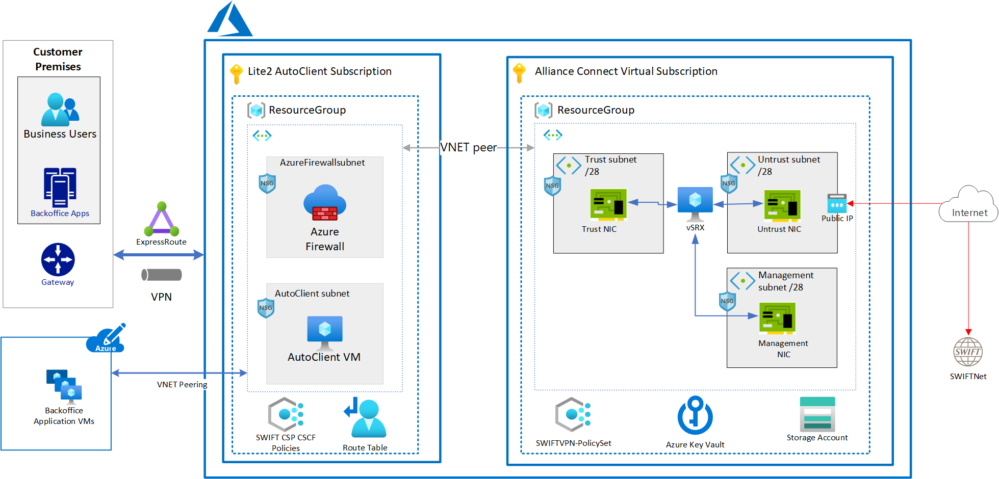
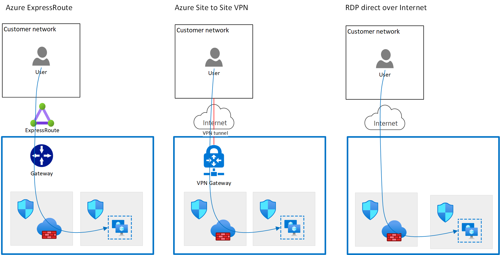

This article provides an overview of deploying SWIFT's Alliance Lite2 connectivity stack in Azure. The solution requires two Azure subscriptions. One subscription contains the Alliance Lite2 AutoClient resources. The other subscription contains the resources to connect to SWIFT's network.

## Potential use cases

This solution applies to:

* Organizations that plan to migrate Alliance Lite2 (SIL, Direct Link, AutoClient) from on-premises to Azure, including connectivity to SWIFT's network.
* New SWIFT customers that want to deploy directly to Azure.

## Architecture

_Download a [Visio file](https://arch-center.azureedge.net/swift-lite2-vsrx-mvp.vsdx) of this architecture._

### Workflow

The two-subscription design separates the resources based on who's responsible for them. For more information, see [Two-subscription design](#two-subscription-design) and [Operations](#operations) in this article.

The Lite2 AutoClient subscription has a single resource group. It contains:

* An Azure virtual network.
* An Azure subnet for the Azure firewall, with an Azure network security group.
* An Azure subnet for Alliance Lite2 AutoClient, with an Azure network security group.
* An Azure firewall configured to allow RDP traffic to Alliance Lite2 AutoClient.
* Azure policies for SWIFT.

You're responsible for establishing secure connectivity to the Alliance Lite2 AutoClient subscription. You can use one of these methods:

* Use Azure ExpressRoute to connect your premises to Azure via private connectivity.
* Use Azure site-to-site VPN to connect your premises to Azure via the internet.
* Use direct RDP over the internet for internet connectivity.

You use RDP, with one of the preceding three connectivity approaches, to connect to Alliance Lite2 AutoClient software running on the Lite2 AutoClient VM. You also configure the recommended Azure firewall and Azure network security group to allow only RDP traffic to pass to the Lite2 AutoClient VM. Traffic from the Lite2 AutoClient software to SWIFTNet flows through the virtual network peer via Juniper vSRX, which has an established VPN tunnel to SWIFTNet over the internet.

### Components
- [Azure Virtual Network](https://azure.microsoft.com/services/virtual-network) is the fundamental building block for your private network on Azure.
- [Azure Firewall](https://azure.microsoft.com/services/azure-firewall) provides cloud-native, intelligent network firewall security.
- [Azure ExpressRoute](https://azure.microsoft.com/services/expressroute) provides fast, reliable, and private connections to Azure.

## Considerations

Your account team at Microsoft can help you with the Azure implementation.

### Two-subscription design

The two-subscription design separates the resources based on who's responsible for them. You're primarily responsible for the Alliance Lite2 AutoClient resources. SWIFT provides Juniper vSRX as part of Alliance Connect Virtual, a managed connectivity service. In this context, SWIFT configures Juniper vSRX and establishes the VPN tunnel from the vSRX to SWIFT. You don't have access or visibility into the vSRX configuration or operation. You do have visibility and operational responsibility for the underlying Azure infrastructure resources. For more information, see [Deploy this scenario](#deploy-this-scenario) in this article.

### Segregating environments

SWIFT customer resources on Azure should comply with the SWIFT Customer Security Programme Customer Security Controls Framework (CSP-CSCF). CSP-CSCF control 1.1 requires segregation of environments (production, test, development). We recommend that you deploy each environment in a separate subscription. Doing so makes it easier to segregate servers and other infrastructure, credentials, and so on.

### Availability

The Alliance Lite2 connectivity stack is a single-tenant solution. For each SWIFT customer, there's an instance of Alliance Lite2 AutoClient and Alliance Connect Virtual. To increase resiliency and availability, we recommend that you deploy a second similar configuration in standby mode in a different Azure region.

### Operations

You're responsible for operating the Alliance Lite2 AutoClient software and the underlying Azure resources in the Alliance Lite2 AutoClient subscription.

In the SWIFT Alliance Connect Virtual subscription, SWIFT is responsible for configuration of Alliance Connect Virtual and network connectivity between Alliance Connect Virtual and SWIFT. You're responsible for operating and monitoring the underlying infrastructure resources.

Azure provides a comprehensive set of monitoring capabilities in Azure Monitor. These tools focus on the infrastructure that's deployed in Azure. Monitoring of the SWIFT software isn't covered by these tools. You can use a monitoring agent to collect event logs, performance counters, and other logs and send these logs and metrics to Azure Monitor. For more information, see [Overview of Azure Monitor agents](/azure/azure-monitor/platform/agents-overview).

[Azure alerts](/azure/azure-monitor/alerts/alerts-overview) notify you when problems are found with your infrastructure or application. These alerts use your data in Azure Monitor. You can use these alerts to identify and address problems before your users notice them.

You can use [Log Analytics in Azure Monitor](/azure/azure-monitor/logs/log-analytics-overview) to edit and run log queries with data in Azure Monitor Logs.

### Security

The traffic between Alliance Lite2 AutoClient and Alliance Connect Virtual is limited to specific and known traffic. To monitor the traffic, you can use network security groups with the packet capture capabilities that are available in Azure Network Watcher, combined with Microsoft Defender for Cloud and Microsoft Sentinel. By using Network Watcher, you can send the flow logs from the network security group to Azure Storage accounts. Doing so allows [Microsoft Sentinel](https://azure.microsoft.com/services/microsoft-sentinel) to collect the logs, detect and investigate threats, and respond to incidents with built-in orchestration and automation of common tasks.

[Azure Bastion](https://azure.microsoft.com/services/azure-bastion) provides connectivity from the Azure portal to a virtual machine via RDP or SSH. Because Azure Bastion requires administrators to sign in to the Azure portal, you can enforce multi-factor authentication. You can use Conditional Access to enforce other restrictions. For example, you can restrict the public IP address that administrators can use to sign in.

Azure Bastion requires a dedicated subnet to deploy to and a public IP address. Azure Bastion restricts access to this public IP address by using a managed network security group. Azure Bastion also provides just-in-time access, which opens required ports on demand only when remote access is required.

#### Enforcing SWIFT CSP-CSCF policies

You can use [Azure Policy](https://azure.microsoft.com/services/azure-policy) to set policies that need to be enforced in part of an Azure subscription to meet compliance or security requirements. For example, you can use Azure Policy to block administrators from deploying certain resources or to enforce network configuration rules that block traffic to the internet. You can use built-in policies or create your own policies.

SWIFT has a policy framework that can help you enforce a subset of SWIFT CSP-CSCF requirements by using Azure policies in your subscription. For simplicity, you can create one subscription in which you deploy SWIFT secure zone components and another subscription for other potentially related components. If you use separate subscriptions, you can apply the SWIFT CSP-CSCF Azure policies only to subscriptions that contain a SWIFT secure zone.

We recommend that you deploy SWIFT components in a subscription that doesn't contain any back-office applications. Separate subscriptions ensure that SWIFT CSP-CSCF applies only to SWIFT components and not to your own components.

Consider using the latest implementation of SWIFT CSP controls in Azure after you consult with the Microsoft team that you're working with.

## Deploy this scenario

The Lite2 AutoClient subscription contains resources that you manage. You can deploy the resources for the Alliance Lite2 AutoClient by using an Azure Resource Manager template (ARM template) to create the core infrastructure, as described in this architecture. You can modify the template to meet your needs as long as it adheres to SWIFT's CSP-CSCF. We recommend that you use the SWIFT CSP-CSCF Azure policies in this subscription.

The SWIFT Alliance Connect Virtual subscription contains resources that you deploy. You can deploy the resources by using an ARM template that's provided by SWIFT. It's known as the Cloud Infrastructure Definition (CID) file. SWIFT manages the configuration and operation of the Juniper vSRX.

After the SWIFT Alliance Connect Virtual and Alliance Lite2 AutoClient infrastructure is deployed, follow SWIFT's instructions for installing the Alliance Lite2 AutoClient software. These instructions include peering the virtual networks in both subscriptions.

## Next steps

* [SWIFT's Alliance Lite2](https://www.swift.com/our-solutions/interfaces-and-integration/alliance-lite2)
* [What is Azure Virtual Network?](/azure/virtual-network/virtual-networks-overview)
* [What is Azure Firewall?](/azure/firewall/overview)
* [What is Azure ExpressRoute?](/azure/expressroute/expressroute-introduction)

## Related resources

<!--* [SWIFT Alliance Connect in Azure](swift-on-azure-srx.yml)-->
<!--* [SWIFT Alliance Connect Virtual in Azure](swift-on-azure-vsrx.yml)-->
* [Alliance Access](swift-alliance-access-vsrx-on-azure.yml)
* [SWIFT Alliance Access on Azure](swift-alliance-access-on-azure.yml)
* [SWIFT Alliance Messaging Hub (AMH) on Azure](swift-alliance-messaging-hub.yml)
* [Alliance Messaging Hub (AMH) with Alliance Connect Virtual](swift-alliance-messaging-hub-vsrx.yml)
<!--* [Alliance Cloud](swift-alliance-cloud-on-azure.yml)-->

<!-- links -->

[calculator]: https://azure.com/e
