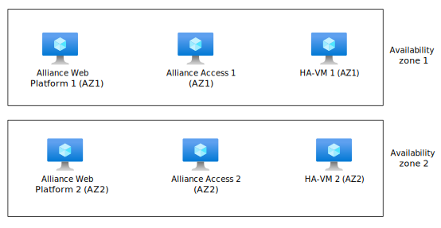

> [!NOTE]
> For updates on SWIFT product availability in the cloud, see the [SWIFT website](https://www.swift.com/our-solutions/interfaces-and-integration/alliance-connect-virtual).

This article provides an overview of how to deploy SWIFT Alliance Remote Gateway in Azure. Alliance Remote Gateway is a secure, cloud-based service that you can use to connect Alliance Access or Alliance Entry directly to SWIFT without hosting a connectivity product on-premises. You retain full control over your Alliance Access and Alliance Entry systems. 

You can deploy the solution by using a single Azure subscription. However, for better management and governance of the overall solution, you should use two different Azure subscriptions:

- One subscription contains the SWIFT Alliance Access components. 
- The second subscription contains the resources that you need to connect to the SWIFT network via Alliance Connect Virtual.

## Architecture

*Download a [Visio file](https://arch-center.azureedge.net/vSRX-GA-ARG-Gold-only.vsdx) that contains this architecture diagram.

### Workflow

The following workflow corresponds to the preceding diagram.

- Business users: Business users are located at the customer premises, usually within an enterprise or financial institution environment. They access the system via back-office applications.

- Customer premises connectivity: Business users connect to the Azure-hosted applications via an Azure ExpressRoute connection or an Azure VPN gateway, which ensures secure and reliable connectivity.

- Customer back-office subscription: This subscription contains back-office application virtual machines (VMs) that are part of the Azure services. It connects to the main Azure infrastructure through virtual network peering, which indicates a direct network link between Azure virtual networks.

- Alliance Remote Gateway subscription: The central part of this architecture is the Alliance Remote Gateway subscription. This subscription contains the following components:
  - Hub virtual network: Acts as the central point of connectivity via a connection to ExpressRoute or a VPN gateway and Azure Firewall for secure and filtered internet access.
  - SWIFT Alliance Access spoke virtual network: Contains infrastructure for SWIFT Alliance Access with subnets for web platforms, access services, and high-availability virtual machines.
  - Security and management services: Manage, secure, and monitor the environment by using services like Microsoft Defender for Cloud, Microsoft Entra managed identities, Azure Monitor, and Azure Storage.
  
  The high-availability subnets and VMs help ensure that the system remains operational even if individual components fail.

  The Alliance Remote Gateway subscription contains resources that you manage. After you implement a service, the Alliance Access or Alliance Entry on-premises systems connect to the Alliance Remote Gateway server that's deployed at the SWIFT operating centres. 
  
  You retain full control of the Alliance Access or Alliance Entry configuration and features, including message entry and display, routing, operator definitions, scheduling, and manual or automated printing.
  
  You can deploy the resources for Alliance Remote Gateway with an Azure Resource Manager template (ARM template) to create the core infrastructure as described in this architecture. An Alliance Access deployment in Azure should adhere to the SWIFT Customer Security Programme (CSP) and Customer Security Controls Framework (CSCF). We recommend that you use the SWIFT CSP-CSCF Azure policies in this subscription.

- Alliance Connect Virtual subscription: The Alliance Connect Virtual subscription contains the components that are required to enable connectivity to the Alliance Remote Gateway server through a multi-vendor secure IP network. 

  When you deploy the respective Juniper vSRX Virtual Firewall components that the preceding architecture diagram shows, you enable high availability by deploying the redundant resources in two different Azure availability zones. Additionally, **high availability VM 1** and **high availability VM 2** monitor and maintain the route tables to provide higher resiliency and improve the availability of the overall solution.

  This subscription is peered with the Alliance Remote Gateway subscription. It contains subnets for trust, interconnect, and untrust zones. It also includes each zone's network interface cards and user-defined routes for controlled network traffic flow.

  You can maintain the connection between the Alliance Remote Gateway server and these customer-specific networking components over the dedicated ExpressRoute connection or over the internet. SWIFT offers three different connectivity options, Bronze, Silver, and Gold. Choose the best option for your message traffic volumes and required level of resilience. For more information about these connectivity options, see [Alliance Connect: Bronze, Silver, and Gold packages](https://www.swift.com/our-solutions/interfaces-and-integration/alliance-connect/alliance-connect-bronze-silver-and-gold-packages).

- External connectivity: The architecture includes connections to SWIFTNet Link via the ExpressRoute connection or the internet for the secure transfer of financial messages and transactions.

- Routing and policies: Route tables and policies like the SWIFT CSP-CSCF policies and the SWIFTNet Link policy govern traffic routing and enforce security compliance within the deployment.

### Components
  
- [Azure subscription](https://azure.microsoft.com/pricing/purchase-options/pay-as-you-go): You need an Azure subscription to deploy Alliance Remote Gateway. We recommend that you use a new Azure subscription to manage and scale Alliance Remote Gateway and its components.

- [Azure resource group](/azure/azure-resource-manager/management/manage-resource-groups-portal): The Alliance Remote Gateway secure zone subscription has an Azure resource group that hosts the following Alliance Remote Gateway components:
  - Alliance Web Platform SE that runs on an Azure virtual machine.
  - Alliance Access that runs on an Azure virtual machine. The Alliance Access software contains an embedded Oracle database.

- [Azure Virtual Network](https://azure.microsoft.com/products/virtual-network): Virtual Network provides a private network boundary around the SWIFT deployment. Choose a network address space that doesn't conflict with your on-premises sites, like back-office, hardware security module, and user sites.

- [Virtual Network subnet](/azure/virtual-network/virtual-network-for-azure-services): You should deploy Alliance Access components in separate subnets to allow traffic control between the components via Azure network security groups.

- [Azure route table](/azure/virtual-network/manage-route-table): You can control network connectivity between Alliance Access VMs and your on-premises sites by using an Azure route table.

- [Azure Firewall](https://azure.microsoft.com/products/azure-firewall): Any outbound connectivity from Alliance Access VMs to the internet should pass through Azure Firewall. Typical examples of this connectivity are time syncs and antivirus definition updates.

- [Azure Virtual Machines](https://azure.microsoft.com/products/virtual-machines): Virtual Machines provides compute services for running Alliance Access. Use these guidelines to choose the right subscription.
  - Use a compute-optimized subscription for the Alliance Web Platform SE front end.
  - Use a memory-optimized subscription for Alliance Access with an embedded Oracle database.

- [Azure managed disks](https://azure.microsoft.com/products/storage/disks): Azure Premium SSD managed disks provide high-throughput, low-latency disk performance for Alliance Access components. The components can also back up and restore disks that are attached to VMs.

- [Azure proximity placement groups](/azure/virtual-machines/co-location): Consider using Azure proximity placement groups to ensure that all Alliance Access VMs are physically located close to each other. Proximity placement groups reduce network latency between Alliance Access components.

## Scenario details

You can use this approach to migrate SWIFT connectivity from an on-premises environment to an Azure environment, or use Azure to establish new SWIFT connectivity.

### Potential use cases

This solution is optimal for the finance industry. It's for existing SWIFT customers and can be used when you migrate Alliance Access from on-premises environments to Azure environments.

## Considerations

These considerations implement the pillars of the Azure Well-Architected Framework, which is a set of guiding tenets that can be used to improve the quality of a workload. For more information, see [Microsoft Azure Well-Architected Framework](/azure/architecture/framework). 

The following considerations apply to this solution. For more information, contact your account team at Microsoft to help guide your Azure implementation for SWIFT.

### Reliability

Reliability ensures your application can meet the commitments you make to your customers. For more information, see [Overview of the reliability pillar](/azure/architecture/framework/resiliency/overview).

When you deploy SWIFT components on-premises, you need to make decisions about availability and resiliency. For on-premises resiliency, we recommend that you deploy components into at least two datacenters. The same considerations apply in Azure, but some different concepts apply.

You can deploy Alliance Access and Alliance Entry into an Azure cloud infrastructure. The Azure infrastructure needs to comply with the corresponding application's requirements for performance and latency.

For information about the database recovery process, see section 14 in the Alliance Access administration guide on the [SWIFT website](https://www.swift.com/our-solutions/interfaces-and-integration/alliance-connect-virtual).

#### Azure resiliency concepts

Azure provides service-level agreements (SLAs) for VM availability. These SLAs vary depending on whether you deploy a single virtual machine, multiple VMs in an [availability set](/azure/virtual-machines/availability-set-overview), or multiple VMs spread over multiple [availability zones](/azure/reliability/availability-zones-overview). To mitigate the risk of a regional outage, deploy SWIFT Alliance Access in multiple Azure regions. For more information, see [Availability options for Azure Virtual Machines](/azure/virtual-machines/availability).

#### Single-region multi-active resiliency

Alliance Access uses an embedded Oracle database. To align with a multi-active Alliance Access deployment, you can use a path-resilient architecture. A path-resilient architecture places all required SWIFT components in one path. You can duplicate each path as many times as you need to for resiliency and scaling. If there's a failure, you fail over an entire path instead of a single component. The following diagram shows what this resiliency approach looks like when you use availability zones. This architecture is easier to set up, but a failure in any component in a path requires you to switch to another path.

Adding other components to this architecture usually increases the overall costs. It's important to factor these components into your planning and budgeting for the project.

By combining Alliance Web Platform SE and Alliance Access on a single VM, you reduce the number of infrastructure components that can fail. You might consider that configuration, depending on the usage pattern of the SWIFT components. For Alliance Access components and Alliance Connect Virtual instances, deploy the related systems in the same Azure zone, as shown in the preceding architecture diagram. For example, deploy Alliance Access Web Platform SE VMs, Alliance Access VMs, and high-availability VMs in two availability zones.

Because SWIFT components connect to different nodes, you can't use Azure Load Balancer to automate failover or to provide load balancing. Instead, you have to rely on SWIFT software capabilities to detect failure and switch to a secondary node. The actual uptime you achieve depends on how quickly a component can detect failure and fail over. When you use availability zones or availability sets, the VM uptime SLA for each component is well defined.

#### Multiregion multi-active resiliency

To increase resiliency beyond a single Azure region, we recommend that you deploy SWIFT Alliance Access in multiple Azure regions by using [Azure paired regions](/azure/best-practices-availability-paired-regions). Each Azure region is paired with another region in the same geography. Azure serializes platform updates, or planned maintenance, across region pairs so that only one paired region is updated at a time. If an outage affects multiple regions, at least one region in each pair is prioritized for recovery.

### Security

Security provides assurances against deliberate attacks and the abuse of your valuable data and systems. For more information, see [Overview of the security pillar](/azure/architecture/framework/security/overview).

- You can use [Azure Network Watcher](https://azure.microsoft.com/services/network-watcher) to collect [Azure network security group](/azure/virtual-network/network-security-groups-overview) flow logs and packet captures. You can send security group flow logs from Network Watcher to Azure Storage accounts. [Microsoft Sentinel](https://azure.microsoft.com/services/microsoft-sentinel) provides built-in orchestration and automation of common tasks. This functionality can collect the flow logs, detect and investigate threats, and respond to incidents.

- [Microsoft Defender for Cloud](https://azure.microsoft.com/services/defender-for-cloud) can help protect your hybrid data, cloud-native services, and servers. It integrates with your existing security workflows, like security information and event management solutions and Microsoft Threat Intelligence, to streamline threat mitigation.

- [Azure Bastion](https://azure.microsoft.com/services/azure-bastion) provides connectivity transparency from the Azure portal to a VM by using Remote Desktop Protocol (RDP) or Secure Shell Protocol (SSH). Because Azure Bastion requires administrators to sign in to the Azure portal, you can enforce [Microsoft Entra multifactor authentication (MFA)](/entra/identity/authentication/concept-mfa-howitworks). You can use [Microsoft Entra Conditional Access](/entra/identity/conditional-access/overview) to enforce other restrictions. For example, you can specify the public IP address that administrators can use to sign in. Azure Bastion also enables just-in-time access, which opens the required ports on demand when you need remote access.

#### Authentication and authorization

Administrators who manage the SWIFT infrastructure in Azure need to have an identity in the [Microsoft Entra ID](https://www.microsoft.com/security/business/identity-access/microsoft-entra-id) service of the Azure tenant that's associated with the subscription. Microsoft Entra ID can be a part of an enterprise hybrid identity configuration that integrates your on-premises enterprise identity system with the cloud. However, SWIFT CSP-CSCF policies recommend separating the identity system for SWIFT deployments from your enterprise identity system. If your current tenant is already integrated with your on-premises directory, you can create a separate tenant with a separate Microsoft Entra ID instance to comply with this recommendation.

Users who are enrolled in Microsoft Entra ID can sign in to the Azure portal or authenticate by using other management tools, like [Azure PowerShell](/powershell/azure/overview) or [Azure CLI](/powershell/azure/overview). You can configure [MFA](/entra/identity/authentication/concept-mfa-howitworks) and other safeguards like IP range restrictions by using [Conditional Access](/entra/identity/conditional-access/overview). Users get permissions on Azure subscriptions via [role-based access control (RBAC)](/azure/role-based-access-control/overview), which governs the operations that users can perform in a subscription.

The Microsoft Entra ID instance that's associated with a subscription enables only the management of Azure services. For example, you might set up VMs in Azure under a subscription. Microsoft Entra ID provides credentials for signing in to those VMs only if you explicitly enable Microsoft Entra authentication. To learn about using Microsoft Entra ID for application authentication, see [Plan application migration to Microsoft Entra ID](/entra/identity/enterprise-apps/migrate-adfs-apps-phases-overview).

#### Enforce SWIFT CSP-CSCF policies

You can use [Azure Policy](https://azure.microsoft.com/services/azure-policy) to set policies that need to be enforced in an Azure subscription to meet compliance or security requirements. For example, you can use Azure Policy to block administrators from deploying certain resources or to enforce network configuration rules that block traffic to the internet. You can use built-in policies or create your own policies.

SWIFT has a policy framework that can help you enforce a subset of SWIFT CSP-CSCF requirements and use Azure policies within your subscription. For simplicity, you can create a separate subscription in which you deploy SWIFT secure zone components and another subscription for other potentially related components. By using separate subscriptions, you can apply the SWIFT CSP-CSCF and Azure policies only to subscriptions that contain a SWIFT secure zone.

We recommend that you deploy SWIFT components in a subscription that's separate from any back-office applications. By using separate subscriptions, you can ensure that SWIFT CSP-CSCF policies apply only to SWIFT components and not to your own components. Consider using the latest implementation of SWIFT CSP controls, but first consult the Microsoft team that you're working with.

#### Connectivity methods

You can establish a secure connection from your on-premises or colocation site to the SWIFT Alliance Remote Gateway secure zone subscription.

- Use ExpressRoute to connect your on-premises site to Azure over a private connection.
- Use site-to-site VPN to connect your on-premises site to Azure over the internet.
- Use RDP or Azure Bastion to connect your on-premises site to Azure over the internet. Your Azure environment can be peered.

The SWIFT customer's business and application systems can connect with Alliance Access or Alliance Entry gateway VMs. However, business users can connect to the Alliance Web Platform SE only. The platform configures the recommended Azure Firewall and Azure network security group to allow only the appropriate traffic to pass to the Alliance Web Platform SE.

### Operational excellence

Operational excellence covers the operations processes that deploy an application and keep it running in production. For more information, see [Overview of the operational excellence pillar](/azure/architecture/framework/devops/overview). 

You're responsible for operating the Alliance Access software and the underlying Azure resources in the Alliance Access subscription.

- Monitor provides a comprehensive set of monitoring capabilities. You can use it to monitor the Azure infrastructure but not the SWIFT software. You can use a monitoring agent to collect event logs, performance counters, and other logs, and send those logs and metrics to Monitor. For more information, see [Overview of the Azure monitoring agents](/azure/azure-monitor/platform/agents-overview).

- [Monitor alerts](/azure/azure-monitor/alerts/alerts-overview) use your Monitor data to notify you when it detects problems with your infrastructure or application. Incorporate alerts so you can identify and address problems before your customers notice them.

- You can use [Log Analytics in Monitor](/azure/azure-monitor/logs/log-analytics-overview) to edit and run log queries against data in Monitor Logs.

- You should use [ARM templates](/azure/azure-resource-manager/templates/overview) to set up Azure infrastructure components.

- You should consider using [Azure virtual machine extensions](/azure/virtual-machines/extensions/overview) to set up other solution components for your Azure infrastructure.

- The Alliance Access VM is the only component that stores business data and possibly requires backup and restore capabilities. Data in Alliance Access is stored in an Oracle database. You can use built-in tools to back up and restore data.

### Performance efficiency

Performance efficiency is the ability of your workload to scale to meet the demands placed on it by users in an efficient manner. For more information, see [Performance efficiency pillar overview](/azure/architecture/framework/scalability/overview).

- Consider deploying Azure Virtual Machine Scale Sets to run web server VM instances in a [proximity placement group](/azure/virtual-machines/co-location). This approach colocates VM instances and reduces latency between VMs.

- Consider using Virtual Machines with accelerated networking, which provides up to 30 Gbps of network throughput.

- Consider using [Azure Premium SSD managed disks](/azure/virtual-machines/managed-disks-overview). Managed disks provide up to 20,000 input/output operations per second and 900 Mbps of throughput.

- Consider making Azure disk host caching read-only to get increased disk throughput.

## Contributors

*This article is maintained by Microsoft. It was originally written by the following contributors.*

Principal authors: 

- [Gansu Adhinarayanan](https://www.linkedin.com/in/ganapathi-gansu-adhinarayanan-a328b121) | Director - Partner Technology Strategist 
- [Ravi Sharma](https://www.linkedin.com/in/ravisharma4sap) | Senior Cloud Solution Architect 

*To see non-public LinkedIn profiles, sign in to LinkedIn.*

## Next steps 

- [What is Azure Virtual Network?](/azure/virtual-network/virtual-networks-overview) 
- [Linux VMs on Azure](/azure/virtual-machines/linux/overview)
- [Azure virtual machine extensions](/azure/virtual-machines/extensions/overview)
- [What is Azure Firewall?](/azure/firewall/overview) 
- [Introduction to Azure managed disks](/azure/virtual-machines/managed-disks-overview)
- [Availability zones](/azure/availability-zones/az-overview)

## Related resources

Explore the functionality and architecture of other SWIFT modules:

- [SWIFT Alliance Connect Virtual on Azure](swift-on-azure-vsrx.yml) 
- [SWIFT Alliance Messaging Hub (AMH) with Alliance Connect Virtual](swift-alliance-messaging-hub-vsrx.yml) 
- [SWIFT Alliance Cloud on Azure](swift-alliance-cloud-on-azure.yml)
- [SWIFT Alliance Lite2 on Azure](swift-alliance-lite2-on-azure.yml)