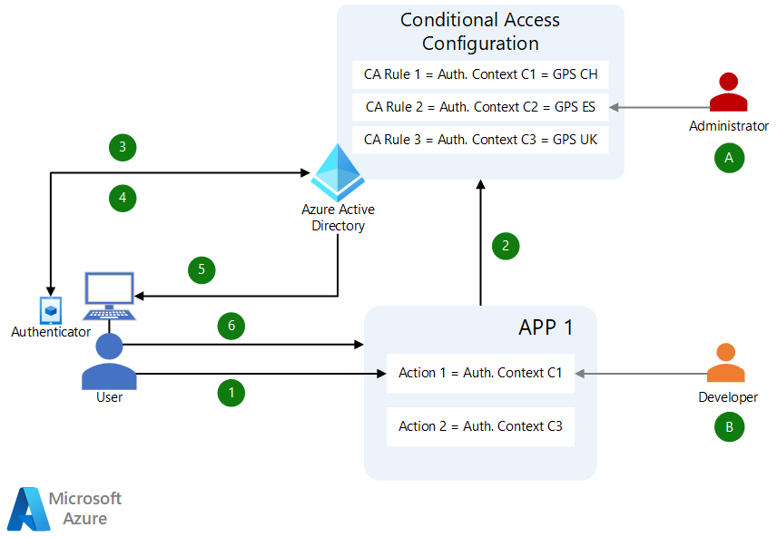

This article describes [Microsoft Entra](https://www.microsoft.com/security/business/microsoft-entra) Azure Active Directory (Azure AD) credentials capabilities and advanced features that can help financial services industries (FSIs) deliver on jurisdictional and government regulatory requirements. These features allow access to client data within line-of-business (LOB) applications from approved locations only. Microsoft Authenticator provides users' GPS locations to Azure AD for Conditional Access authentication context policy evaluation.

## Architecture

*Download a [Visio file](https://arch-center.azureedge.net/AuthN-AuthZ-for-Compliance.vsdx) of this architecture.*

### Workflow

An administrator **(A)** configures a Conditional Access policy that maps authentication context to **GPS Named Location**, for example **C1 = GPS CH (Switzerland)**, **C2 = GPS ES (Spain)**, and **C3 = GPS UK (United Kingdom)**. This mapping is a one-time activity.

Application developers **(B)** make their apps aware of the application context, and trigger step-up authentication requesting the required claims for actions from within their applications. For example, Action 1 requires authentication context claim `acrs=C1`.

1. End-users are already authenticated to App 1. A user tries to take Action 1 within App 1.

1. Action 1 requires authentication context claim `C1` to run successfully. If the current token doesn't have a claim `C1`, it triggers a claims challenge.

1. Azure AD runs Conditional Access policy `C1` that maps claim `C1` to GPS location `CH (Switzerland)`, and requests location from the user's Authenticator app.

1. The user consents if it's the first time they're sharing location data, and provides location information.

1. If the location information matches `CH (Switzerland)`, Azure AD issues a new access token with claim `C1`.

1. The call comes back to App 1 with the new access token and claim `C1`, and Action 1 runs successfully.

### Components

This solution uses the following components:

- [Azure AD](https://azure.microsoft.com/products/active-directory) is an enterprise identity service that provides single sign-on, multifactor authentication, and conditional access. This solution uses the following Azure AD features:

  - [Azure AD Conditional Access authentication context](/azure/active-directory/conditional-access/concept-conditional-access-cloud-apps#authentication-context) can further secure data and actions in applications. This scenario uses a GPS-based named location authentication context.

  - [Named locations](/azure/active-directory/conditional-access/location-condition) can use either IP addresses or GPS coordinates to control users' access to apps and data. This solution uses GPS-based named locations for conditional access.

- The [Microsoft Authenticator](https://www.microsoft.com/security/mobile-authenticator-app) app provides simple, fast, two-factor authentication across applications. This scenario requires users to use the Authenticator app to provide their GPS locations.

### Alternatives

This article illustrates Azure AD Conditional Access with an authentication context that includes the GPS location condition. Named locations can also use IP addresses. Azure AD can also use authentication context with other conditions, such as requiring multifactor authentication or requiring devices to be marked as compliant.

## Scenario details

Today, FSIs face challenges like increasing competition, cultural shift, dynamic business changes, macroeconomic driving costs, and rising enterprise and consumer customer expectations. Some of the greatest challenges are around security breaches and stringent compliance and regulatory requirements. FSIs must protect critical data from wrongdoers, and prevent and mitigate security breaches. At the same time, FSIs must empower authorized users to access their data seamlessly and securely.

Some countries/regions have local and global regulatory requirements or data residency requirements. Enterprises also need the ability to allow or block access to data based on user location. So, in addition to controls such as multifactor authentication (MFA), role-based access control (RBAC), and attribute-based access control (ABAC), FSIs must consider user location at the time of data access.

The GPS location-based Conditional Access policy uses the following key Authenticator and Azure AD Conditional Access capabilities:

- Authenticator with precision GPS access to the device, including *jailbroken detection* and *rooted device detection*.
- Azure AD authentication context integration with Conditional Access.
- Azure AD named **Countries** locations.
- Advanced Azure AD Conditional Access policy integration with applications, services, and workloads.

This scenario also illustrates passwordless strong authentication with Microsoft Authenticator phone sign-in, and shows Temporary Access Pass (TAP) as an option to onboard users to Authenticator. Passwordless phone sign-in and TAP aren't required to enforce the GPS location condition.

The overall scenario helps enterprises implement a security solution to mitigate security risks and deliver governance and compliance in line with local regulations and overall FSI standards.

### Potential use cases

Potential use cases aren't limited to the financial sector. Other industries may also want to utilize this capability to permit access to highly sensitive data only from certain locations:

- Block access to data within an LOB application if the user isn't within a certain jurisdiction, such as Singapore.
- Block access to certain parts of an application, or data like trade secrets, if the user isn't within the appropriate jurisdiction, such as the United States.
- Block access to certain parts of an application if the user isn't within a certain area, like the European Union.
- Allow Privileged Identity Management (PIM) admin access to Azure resources in a certain jurisdiction only if the privileged admin is within that jurisdiction.
- Allow access to a certain SharePoint site for a certain jurisdiction only from within that jurisdiction.

## Considerations

These considerations implement the pillars of the Azure Well-Architected Framework, which is a set of guiding tenets that can be used to improve the quality of a workload. For more information, see [Microsoft Azure Well-Architected Framework](/azure/architecture/framework).

### Reliability

Reliability ensures your application can meet the commitments you make to your customers. For more information, see [Overview of the reliability pillar](/azure/architecture/framework/resiliency/overview).

The key components of this solution are part of Azure AD. Resilience depends on Azure AD service resilience. For more information, see [SLA for Azure Active Directory (Azure AD)](https://azure.microsoft.com/support/legal/sla/active-directory/v1_1).

### Security

Security provides assurances against deliberate attacks and the abuse of your valuable data and systems. For more information, see [Overview of the security pillar](/azure/architecture/framework/security/overview).

This solution provides access control into applications and workloads, but when the protected application exports or downloads backend data, you also need to protect that data. Consider the protection of data at rest, specifically when the data is personal and other sensitive information. FSI regulations typically require the data within LOB applications to be encrypted at rest and in transit, and only accessible to authorized users from compliant devices.

Technologies like data classification and encryption, data leak prevention (DLP), and other data protection technologies help keep out wrongdoers and ensure that FSIs meet their regulatory and compliance commitments. The current solution doesn't specifically address those capabilities.

### Cost optimization

Cost optimization is about looking at ways to reduce unnecessary expenses and improve operational efficiencies. For more information, see [Overview of the cost optimization pillar](/azure/architecture/framework/cost/overview).

The key components are part of Azure AD P2. For more information, see [Pricing - Azure Active Directory](https://azure.microsoft.com/pricing/details/active-directory/#pricing).

### Operational excellence

Operational excellence covers the operations processes that deploy an application and keep it running in production. For more information, see [Overview of the operational excellence pillar](/azure/architecture/framework/devops/overview).

Operations fall under the [shared responsibility model](/azure/security/fundamentals/shared-responsibility). The key solution components are part of the Azure AD software as a service (SaaS) that Microsoft provides. Customers need to appropriately configure the infrastructure components, and appropriately manage and monitor usage.

Application developers must follow the appropriate guidance to correctly integrate the solution and deliver the best user experience. For more information, see:

- [Developer guidance for Azure AD Conditional Access](/azure/active-directory/develop/v2-conditional-access-dev-guide)
- [Developer guidance for Azure AD Conditional Access authentication context](/azure/active-directory/develop/developer-guide-conditional-access-authentication-context)

### Performance efficiency

Performance efficiency is the ability of your workload to scale to meet the demands placed on it by users in an efficient manner. For more information, see [Performance efficiency pillar overview](/azure/architecture/framework/scalability/overview).

Performance of this solution depends on Azure AD. Developers should follow appropriate guidance to ensure a smooth experience for their application users that doesn't degrade performance.

## Deploy this scenario

To deploy this scenario, follow the guidance at [Conditional Access - Location-based data protection in a web app](https://github.com/microsoft/ms-identity-conditional-access-for-compliance).

Also see [Use the Conditional Access auth context to perform step-up authentication for high-privilege operations in a web app](https://github.com/Azure-Samples/ms-identity-dotnetcore-ca-auth-context-app/blob/main/README.md).

## Contributors

*This article is maintained by Microsoft. It was originally written by the following contributors.*

Principal authors:

- [Caleb Baker](https://www.linkedin.com/in/baker-caleb) | Principal Product Manager - Identity Engineering
- [Kunal Kodkani](https://www.linkedin.com/in/kunalkodkani) | Senior Program Manager - Cloud for Industry (FSI)
- [Paresh Nhathalal](https://www.linkedin.com/in/paresh-nhathalal-72613b2) | Senior Customer Engineering Manager - Identity Engineering

*To see non-public LinkedIn profiles, sign in to LinkedIn.*

## Next steps

- [Passwordless sign-in with Microsoft Authenticator](/azure/active-directory/authentication/howto-authentication-passwordless-phone)
- [Azure AD Conditional Access documentation](/azure/active-directory/conditional-access)
- [Location condition in Azure AD Conditional Access](/azure/active-directory/conditional-access/location-condition)
- [Manage site access based on sensitivity label - SharePoint in Microsoft 365](/sharepoint/authentication-context-example)
- [Azure AD Privileged Identity Management](/azure/active-directory/privileged-identity-management)

## Related resources

- [Azure identity and access management design area](/azure/cloud-adoption-framework/ready/landing-zone/design-area/identity-access?toc=https://learn.microsoft.com/azure/architecture/toc.json&bc=https://learn.microsoft.com/azure/architecture/bread/toc.json)
- [Conditional Access for zero trust](../../guide/security/conditional-access-zero-trust.md)
- [Conditional Access architecture](../../guide/security/conditional-access-architecture.yml)
- [Conditional Access framework and policies](../../guide/security/conditional-access-framework.md)

