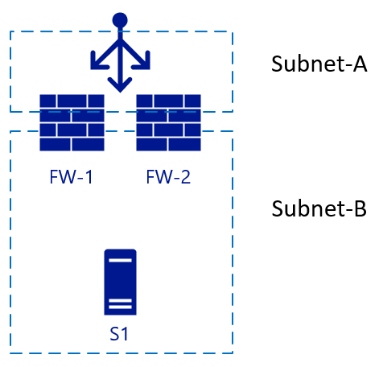
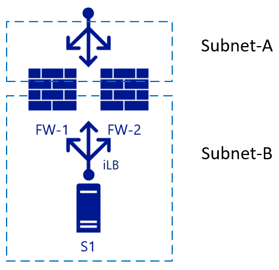
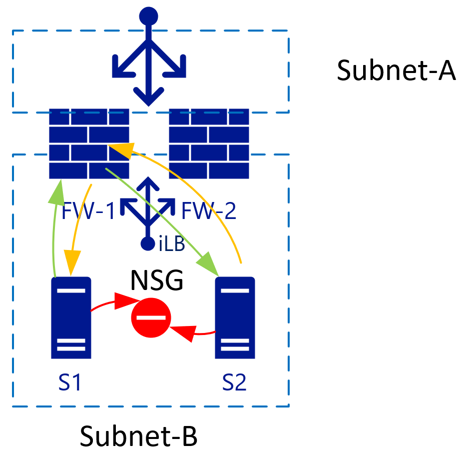
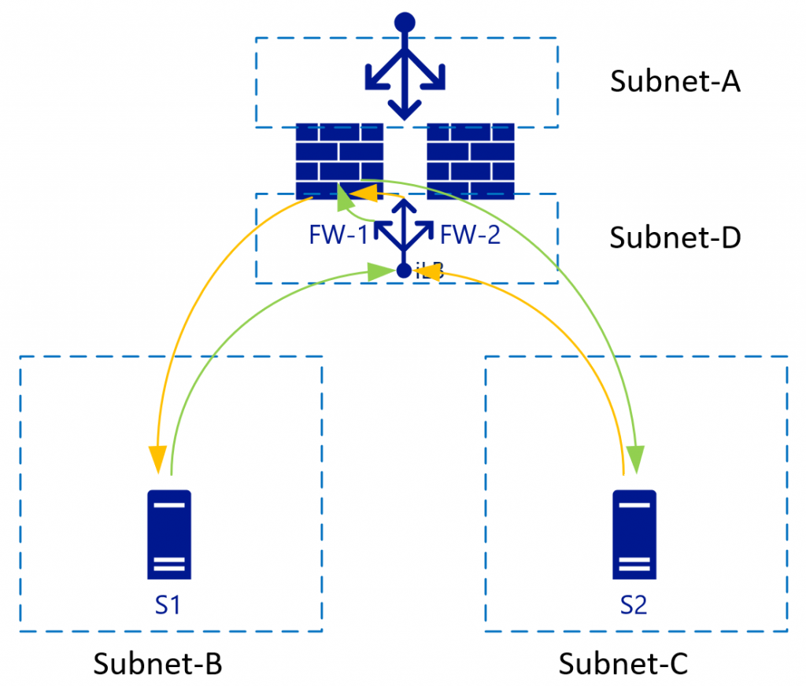
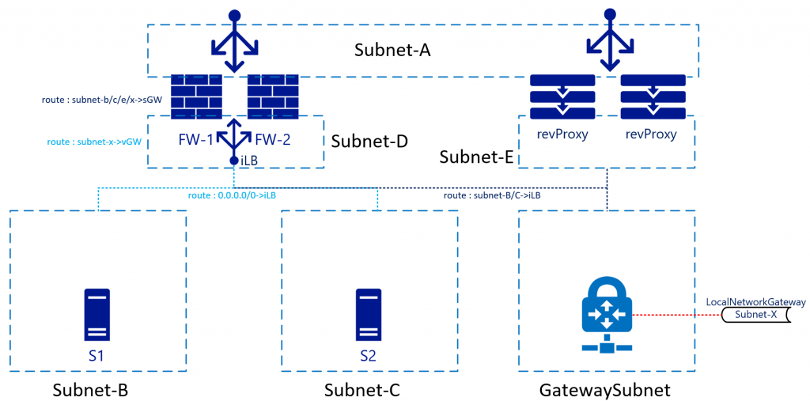

# Design Load Balanced Firewall in Azure

The cloud is changing the way infrastructure is designed, including the design of firewalls as the network is not physical or in virtual LANs anymore. Not all features of a physical network are available in a virtual network (VNet). This includes the use of floating IP addresses or broadcast traffic and that influences the implementation of HA architectures. Load balancers for *Network Virtual Appliances (NVAs)* can/must be implemented in a certain way to achieve a highly available (HA) architecture within a virtual network. This guide presents a structured approach for designing HA firewalls (FWs) in Azure using third-party virtual appliances.

## Options for designing highly available NVAs

When deploying HA architectures, there are a few options to provide failover:

* **Azure API-managed route tables** - This option uses two route tables, one active, one passive to switch the active gateway IP for all services running on a VNet/subnet.
* **Azure API-managed floating IP** - This option uses a secondary IP address on the FWs that can be moved between an active and a stand-by FW.
* **Load Balancer managed** - This option uses an Azure Load Balancer to act as the gateway IP for the subnet, which then forwards the traffic to the active FW. It may even forward the traffic active-active to provide true load balancing.

The problem with the first two options is that failover itself is slow. The FW must instruct the failover, which is essentially a “reconfiguration” of Azure services through a new deployment. Depending on how fast that deployment is completed, the traffic flows will be down for several minutes. Furthermore, it doesn’t allow for an active-active configuration where both firewalls are operating at the same time.

The third option is therefore most preferred. The downtime is minimized as the load balancer can fail over almost instantly to the stand-by firewall (in active-passive) or just remove the load from the failed firewall (in active-active). But you cannot just use load balancers as "default gateways" as they affect the traffic flow and TCP packets need to be stateful. 

## Two-legged firewalls

The following picture starts with two FWs (FW-1 & FW-2), with an external load balancer and a backend server S1.

This is a simple setup, used for inbound traffic. A packet hits the load balancer, which chooses the destination FW from its configuration. The chosen firewall then sends the traffic to the backend (web) server. If FW-1 has SNAT enabled, server S1 will see the traffic coming from the internal IP of FW-1 and therefore sends its reply to the packet to FW-1 as well. Failover can happen quickly to FW-2 in this scenario. For outbound traffic, we could add another load balancer on the internal side, so when server S1 initiates traffic the same principle will apply. Traffic hits the internal LB (iLB) which then chooses a firewall that then performs NAT translation for external resolution:

## Three-legged firewalls

Problems start to arise when we add another interface to the firewall, and NAT translation between *internal* zones needs to be disabled; in this case, Subnet-B and Subnet-C:

The L3 routing between the internal zones (Subnet-B and Subnet-C) will both be load balanced without NAT. This becomes clearer looking at the traffic flows including the load-balancers in a different view. The diagram below shows the view where the internal Load Balancers [iLB] are linked to a specific NIC on the FWs:

With L3 traffic (without NAT), S2 will see the S1 IP address as the source address and therefore will send the return traffic for subnet B (to which S1-IP belongs) to the iLB in Subnet-C. As iLB in Subnet-B and iLB in Subnet-C do not synchronize their session states, depending on the load-balancing algorithm traffic could end-up on FW-2. FW-2 by default doesn’t know anything about the initial (green) packet and will therefore drop the connection.

Some firewall vendors try to keep a connection state between the firewalls, but they would have to have almost instant synchronization to be up to date on the connection states. Check with your firewall vendor if they recommend this setup.

The best way to deal with this problem is to eliminate it. In the example above this means eliminating Subnet-C, which bring us to the advantages of Virtualized VNets.

### Isolate hosts in a subnet with Network Security Groups

When there are two VMs in a single subnet, you can apply an NSG that isolates traffic between the two. By default, traffic inside a VNet is all allowed. Adding a *Deny all* rule on the NSG, isolates all VMs from each other.

### VNets use the same backend (virtual) routers

VNet/subnets use a single backend router system from Azure and as such, there is no need to specify a router IP for each subnet. The route destination can be anywhere in the same VNET or even outside.

With the virtualized networks, you can control the routes in every subnet. These routes can also point to a single IP in another subnet. In the picture above, that would be the iLB in Subnet-D, which load-balances the two firewalls. As S1 initiates traffic (green), it will be load balanced to for example FW-1. FW-1 will then connect to S2 (still green). S2 will send the response traffic to the IP of S1 (as NAT is disabled) and because of the route tables, S2 uses the same iLB IP as it’s gateway. The iLB will be able to match the traffic to the initial session and therefore will always point this traffic back to FW-1, which then sends it to S1, establishing a synchronous traffic flow.

For this to work though, the FW needs to have a route table (internally) pointing Subnet-B and Subnet-C to its default subnet GW (the first logically available IP in the subnet range in that VNET).

## Impact on reverse proxy services

When deploying a reverse proxy service *Normally* this would be behind the FW, but it is also possible to put it *in-line* with the FW and actually route the traffic through the FW. The advantage of this is that the reverse proxy service would *see* the original IP of the connecting client:

For this, the route tables on Subnet-E need to point Subnet-B and Subnet-C through the internal load balancer. Some reverse proxy services have built in firewalls allowing you to remove the FW all together in this network flow and point from reverse proxy straight to Subnet-B/C servers.

In this scenario, SNAT will be required on the reverse proxy's as well to avoid return traffic to flow through and denied by the FWs to Subnet-A.

## VPN/ER

Azure provides BGP-enabled/highly-available VPN/ER services through the Azure Virtual Network Gateways. Most architects keep these for backend or non-internet facing connections. This means that the routing table needs to accommodate the subnets behind these connections too. While there is not a large difference to subnet-B/C connectivity, there is in the design of the return traffic; completing the picture:

In this architecture, traffic hitting the FW from, for example Subnet-B to Subnet-X would be sent to the iLB, which in turn sends it to either firewall. The internal route inside the FW will send the traffic back to the Subnet-GW (first available IP in Subnet-D). You don’t have to send the traffic straight to the Gateway appliance itself, as another route on Subnet-D will have a route for Subnet-X pointing it to the *Virtual Network Gateway*. Azure Networking will take care of the actual routing.

Return traffic coming from Subnet-X will be forwarded to the iLB in Subnet-D as the GatewaySubnet will also have a custom route pointing Subnet-B-C to the iLB. Subnet-D is not via the iLB. This will be treated as *regular* inter-VNET routing.

While not in the drawing, it would make sense for Subnet-B/C/D/Gateway to also include a route for Subnet-A pointing it to the iLB. This to avoid the “regular” VNET routing to bypass the FWs. This as Subnet-A is just another subnet in the VNET according to the Azure networking stack. It will not treat Subnet-A different although you treat it is DMZ/Internet/etc.

## Summary

In short, the way you treat firewalls in your on-premises (physical/VLAN-based) networks, with as many interfaces (virtual or physical) is not the same as you would in Azure. If necessary you still can (to some degree), but there are better ways to ensure you can minimize fail-over downtime; have active-active implementations and *clean* routing tables.

More information on using load balancers as *gateways* for all traffic can be found on [High availability ports overview](/azure/load-balancer/load-balancer-ha-ports-overview).