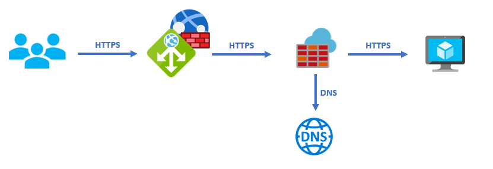
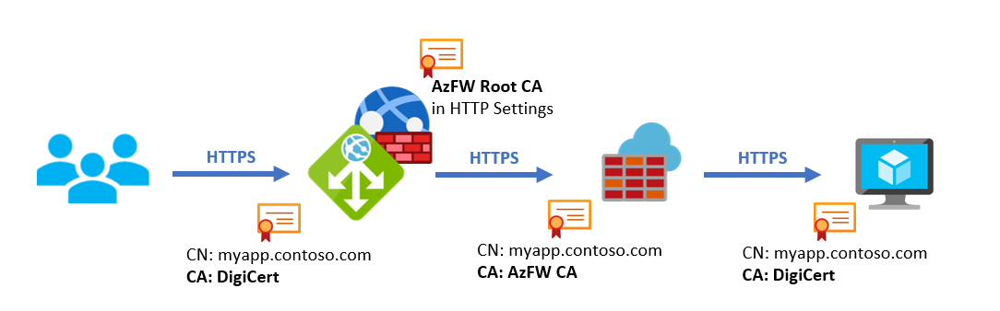
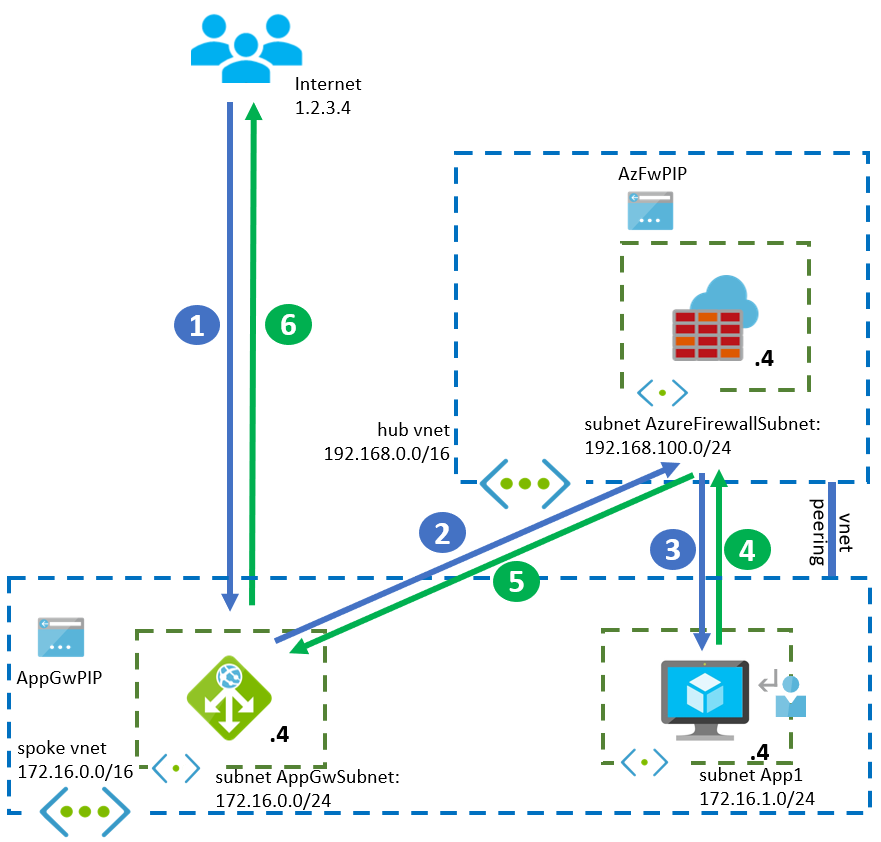
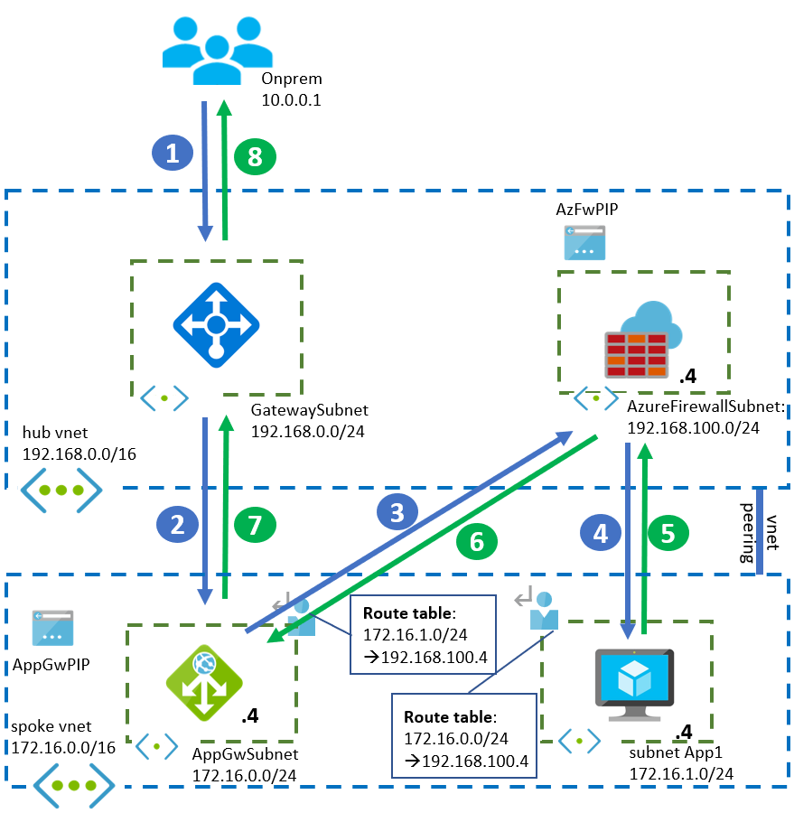
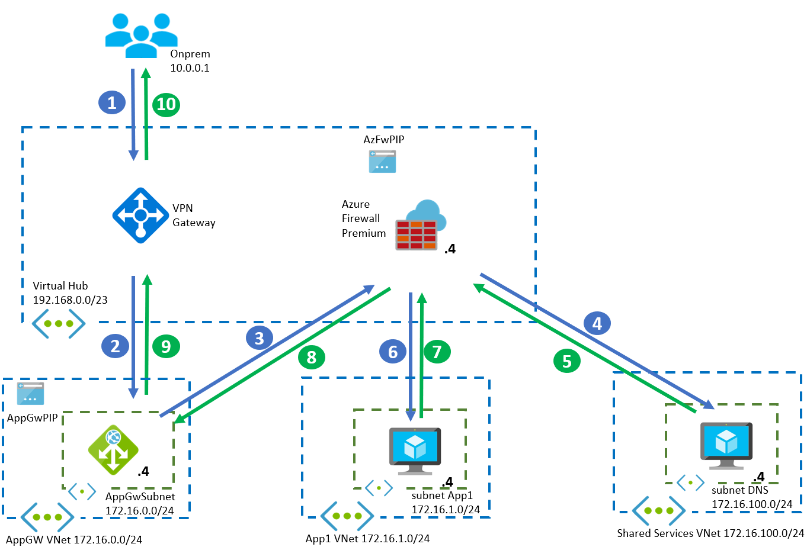

Application security should be tackled in a multi-layered approach. One of those layers is networking security, where network appliances can inspect network packets to make sure that only legitimate traffic reaches your application.

Different network appliances typically specialize in different aspects of the network packet: while Web Application Firewalls are looking for patterns that would indicate an attack at the web application layer, next-generation firewalls usually focus on more generic threats, not restricted to web applications. In some situations you may want to combine multiple types of network security appliances for maximum protection. When combining two or more network appliances there are different patterns that can be used. Some of these patterns are explored in [Firewall and Application Gateway for virtual networks][appgw_azfw]. This document will double down on one of the most common approaches for maximum security, the one where Azure Application Gateway is deployed before Azure Firewall:

In this design, traffic is encrypted with SSL at all times. The packets sent from the client encrypted with SSL will arrive first at the Azure Application Gateway with Web Firewall functionality enabled. It will decrypt the packets and inspect them searching for web application threats. Should the session be allowed, it will be encrypted again and sent over the Azure Firewall. The Azure Firewall will decrypt traffic ([TLS Inspection][azfw_tls]), and validate that the packet is legitimate with its [Intrusion Detection and Protection][azfw_idps] features. it will finally forward the packets to their final destination in the Virtual Network (in the diagram represented as a Virtual Machine).

This design allows to have multiple inspection engines making sure that the traffic is legitimate: the Web Application Firewall will prevent attacks at the web layer described by the [OWASP Core Rule Set][appgw_crs], such as SQL Code Injection or Cross Site Scripting, and the Azure Firewall will apply its more generic Intrusion Detection and Prevention rules, for example to detect malicious files uploaded to the web application.

## Azure Firewall Premium and name resolution

The Azure Firewall Premium will use its Intrusion Detection and Prevention inspection capabilities to verify that the traffic is not malicious. One of the verifications it performs is making sure that the value of the HTTP Host header matches the packets IP address and TCP port destination. For example, if the Application Gateway sends web packets addressed to the IP 172.16.1.4 and TCP port 443, the value of the HTTP Host header should resolve to that very same IP.

HTTP Host headers typically do not contain IP addresses but names, since they need to match with the digital certificate installed in the server. As a consequence, Azure Firewall Premium needs to be able to resolve the name of the Host header to an IP address via DNS (Domain Name Service):

- If using a traditional hub and spoke architecture, the easiest way to do this is configuring a DNS private zone linked to the Virtual Network where the Azure Firewall Premium is deployed, and making sure that an A record exists for the value that the Azure Application Gateway uses both for the health checks and for the real traffic.
- If using Virtual WAN secured hubs, you cannot associate a DNS private zone to the secure hub where the Azure Firewall is deployed. As a consequence, you need to configure the [Azure Firewall DNS Settings][azfw_dns] to use custom DNS servers that you would deploy in a Shared Services Virtual Network, connected to Virtual WAN. You could then associate a DNS private zone to that Shared Services VNet, so that the DNS servers are able to resolve the name that the Application Gateway uses in the HTTP Host header.

> [!NOTE]
> Since the Azure Application Gateway does not support including a port number in the HTTP Host header, the Azure Firewall will always assume the default HTTPS TCP Port (443). Hence, non-standard TCP ports other than 443 are not supported in the connection between the Azure Application Gateway and the web server.

## Digital Certificates

As the previous diagram shows, there are three distinct SSL connections, each validated by digital certificates:

- From client to Azure Application Gateway: You need to deploy the digital certificate that the client will see in the Azure Application Gateway. This will typically be a certificate issued by a well-known Certificate Authority such as DigiCert or Let's Encrypt.
- From Azure Application Gateway to Azure Firewall: In order to decrypt and inspect TLS traffic, Azure Firewall Premium dynamically generates certificates and presents itself to the Application Gateway as being the web server. In order to do that, it will leverage a private Certificate Authority that it will use to sign the certificates it generates, as described in [Azure Firewall Premium certificates][azfw_certs]. The Azure Application Gateway needs to validate those certificates, so it needs to have Azure Firewall's Root CA configured in the HTTP Settings for the application.
- From Azure Firewall to web server: Azure Firewall will finally establish the last SSL session to the destination web server. As part of the verifications performed by Azure Firewall premium, it will verify that the Web Server SSL packets are signed by a well-known Certificate Authority.

The following diagram shows the different SSL sessions and certificates at play:

The main reason why Azure Application Gateway and Azure Firewall behave differently regarding certificates is because they have slightly different functionality:

- Azure Application Gateway is a **reverse web proxy**. That means that it proxies HTTP(S) connections for any client talking to certain servers, normally to protect those servers from web attacks, or to offload certain web operations such as SSL. These servers (the IP address or Fully-Qualified Domain Name of the systems where the web server is running) are declared in the backend pool of the Application Gateway. Since any client should be able to access the application, the Application Gateway should be configured with a digital certificate signed by a public certificate authority, that any SSL client will accept.
- Azure Firewall is a **forward web proxy**, or just a web proxy. Its purpose is intercepting SSL calls between certain clients and any server, usually to protect those specific clients from web threats. Since a forward proxy needs to impersonate any possible target server, it does so generating digital certificates on the fly, and presenting those to the client. The downside of that approach is that the client needs to trust the certificate authority that the Azure Firewall will use to sign those dynamically generated certificates.

## Example design with Hub and Spoke network

In hub and spoke design, shared network components are typically deployed in the hub VNet, while application-specific components are located in the spokes. While it is pretty common considering the Azure Firewall as a shared resource, it is not so obvious whether Web Application Firewalls are similarly shared network devices, or on the contrary application-specific components. The overall recommendation is treating Azure Application Gateway as an application device, and hence deploy it in a spoke VNet, out of these reasons:

- Troubleshooting Web Application Firewall alerts typically requires in-depth knowledge of the application in order to decide whether the messages triggering those alarms are legitimate or not.
- Treating the Azure Application Gateway as a shared resource could lead to exhausting some of the [Azure Application Gateway Limits][appgw_limits]
- Having applications managed by different teams leveraging the same Azure Application Gateway might create some Role-Based Access Control challenges, since each of those developer teams would have access to the whole configuration of the Azure Application Gateway

The following diagram describes the connection flow for a connection coming from the public Internet, with the Azure Application Gateway deployed into a spoke Virtual Network:

If traffic is not coming from the public Internet but from an on-premises network (via Site-to-Site VPN or ExpressRoute), it will arrive at a Virtual Network Gateway in the hub first. The rest of the network flow is the same as in the previous case:

## Example design with Virtual WAN

[Virtual WAN][vwan_overview] can be a very interesting component in the architecture, since amongst other benefits, it will eliminate the need for user-maintained user-defined routes in the spoke Virtual Networks. Instead, the administrator can define static routes in the virtual hub route tables, and these routes will be programmed in every VNet connected to the virtual hub. There are two main differences when leveraging Virtual WAN as networking platform:

- Firstly, DNS private zones cannot be linked to the virtual hub, since the virtual hub is a Microsoft-managed Virtual Network and the subscription owner does not have privilege to link private DNS zones. Instead, DNS resolution for the Azure Firewall can be implemented with DNS forwarders deployed in a Shared Services VNet (see [Azure Firewall DNS Settings][azfw_dns]).
- Secondly, Virtual WAN is not able to program routes in the spoke for prefix with same or longer length than the VNet prefix. That means that if the Application Gateway and the destination web server are in the same Virtual Network, Virtual WAN will not be able to inject a route that overrides the system route for the VNet, and hence traffic between the Application Gateway and the web server will bypass the Azure Firewall.

The following diagram reflects the packet flow for accessing the Azure Application Gateway from an on-premises network connected to Virtual WAN via Site-to-Site VPN or ExpressRoute, access from the Internet would be similar:

## Example design with Azure Route Server

Finally, the [Azure Route Server][ars_overview] offers another possibility to inject routes automatically in the spoke, to avoid the administrative overhead of maintaining route tables. Its design is a combination of the hub and spoke and Virtual WAN variants:

- The hub Virtual Network is customer-managed, so the subscription admin can do operations such as linking the hub VNet to DNS private zones.
- Azure Route Server has the same limitation as Virtual WAN around injecting prefixes with the same or longer length than the Virtual Network prefix in the spokes. Hence, the Application Gateway and the destination web server needs to be in different Virtual Networks.
- Whether DNS is required or not will depend on the functionality of the Network Virtual Appliance (NVA) in the hub. In the following diagram the DNS step is depicted, but note that this might vary depending on the NVA.

One remark to this design is that the Azure Route Server requires today that the device injecting the routes sends them over Border Gateway Protocol (BGP). Since the Azure Firewall does not support BGP, this design would require a third-party Network Virtual Appliance (NVA):

## Conclusion

By having different appliances such as a Web Application Firewall and a Next-Generation Firewall you can get multi-layer network protection by implementing multiple security checks on your web traffic.

[appgw_azfw]: https://docs.microsoft.com/en-us/azure/architecture/example-scenario/gateway/firewall-application-gateway
[azfw_dns]: https://docs.microsoft.com/azure/firewall/dns-settings
[azfw_certs]: https://docs.microsoft.com/azure/firewall/premium-certificates
[appgw_limits]: https://docs.microsoft.com/azure/azure-resource-manager/management/azure-subscription-service-limits#application-gateway-limits
[azfw_limits]: https://docs.microsoft.com/azure/azure-resource-manager/management/azure-subscription-service-limits#azure-firewall-limits
[azfw_tls]: https://docs.microsoft.com/azure/firewall/premium-features#tls-inspection
[azfw_idps]: https://docs.microsoft.com/azure/firewall/premium-features#idps
[appgw_crs]: https://docs.microsoft.com/azure/web-application-firewall/ag/application-gateway-crs-rulegroups-rules
[vwan_overview]: https://docs.microsoft.com/azure/virtual-wan/virtual-wan-about
[ars_overview]: https://docs.microsoft.com/azure/route-server/overview