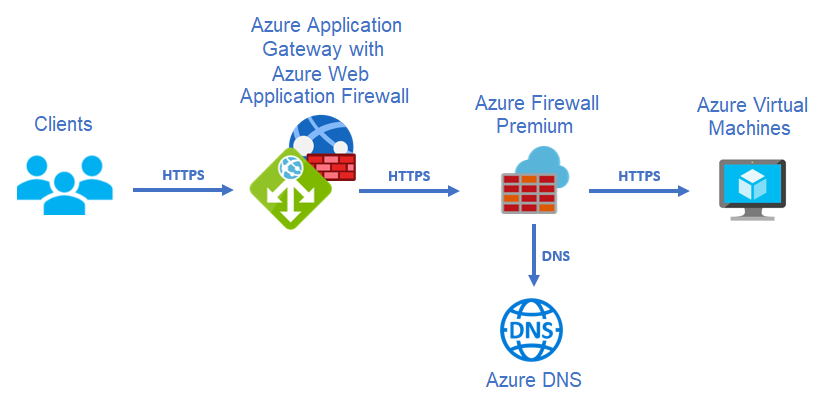
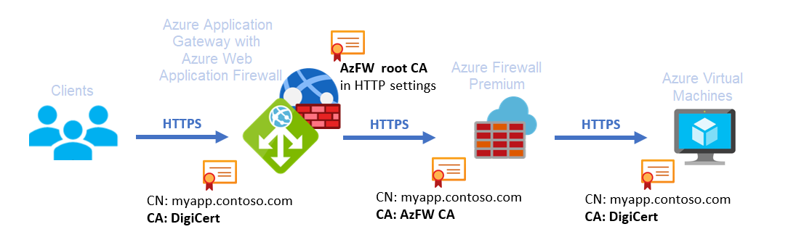

For tackling application security, a multi-layered approach works best. Network security makes up one layer. In this layer, network appliances inspect network packets to ensure that only legitimate traffic reaches your application.

Different network appliances typically specialize in different aspects of the network packet: while Web Application Firewalls are looking for patterns that would indicate an attack at the web application layer, next-generation firewalls usually focus on more generic threats, not restricted to web applications. In some situations you may want to combine multiple types of network security appliances for maximum protection. When combining two or more network appliances there are different patterns that can be used. Some of these patterns are explored in [Firewall and Application Gateway for virtual networks][appgw_azfw]. This document will double down on one of the most common approaches for maximum security, the one where Azure Application Gateway is deployed before Azure Firewall:

This architecture uses SSL to encrypt traffic at every step.

1. A client sends packets to Azure Application Gateway, which has the Web Firewall feature turned on.

1. Application Gateway decrypts the packets and searches for threats to web applications. If Application Gateway doesn't find any threats, it encrypts the packets and sends them to Azure Firewall.

1. Azure Firewall runs security checks:

   - [TLS inspection][azfw_tls] decrypts and examines the packets.
   - [Intrusion detection and protection][azfw_idps] features check the packets for malicious intent.

   If the packets pass the tests, Azure Firewall takes these steps:

   - Encrypts the packets
   - Uses a Domain Name System (DNS) service to determine the application VM
   - Forwards the packets to the application VM

Multiple inspection engines in this architecture ensure traffic integrity:

- Web Application Firewall uses rules to prevent attacks at the web layer. Examples of attacks include SQL code injection and cross-site scripting. For more information on rules and the Open Web Application Security Project (OWASP) Core Rule Set, see [Web Application Firewall CRS rule groups and rules][appgw_crs].
- Azure Firewall uses generic intrusion detection and prevention rules. Among other threats, these rules help identify malicious files that target web applications.

## Azure Firewall Premium and name resolution

When checking for malicious traffic, Azure Firewall Premium verifies that the HTTP Host header matches the packet IP address and TCP port. For example, suppose Application Gateway sends web packets to the IP address 172.16.1.4 and TCP port 443. The value of the HTTP Host header should resolve to that IP address.

HTTP Host headers don't typically contain IP addresses. Instead, the headers contain names that match the server's digital certificate. As a result, Azure Firewall Premium uses Domain Name Service (DNS) to resolve the Host header name to an IP address:

- In a traditional hub and spoke architecture, DNS private zones provide an easy way to use DNS:

  - Configure a DNS private zone.
  - Link the zone to the virtual network that contains Azure Firewall Premium.
  - Make sure that an A record exists for the value that Azure Application Gateway uses for traffic and for health checks.

- In a virtual WAN secured hub, you can't associate a DNS private zone with the secure hub that contains the Azure Firewall. Instead, take these steps:

  - Configure the [Azure Firewall DNS Settings][azfw_dns] to use custom DNS servers.
  - Deploy the DNS servers in a shared services virtual network that you connect to the virtual WAN.

  You can link a DNS private zone to the shared services virtual network. Then the DNS servers can resolve the name that Application Gateway uses in the HTTP host header.

> [!NOTE]
> Azure Application Gateway doesn't support port numbers in HTTP Host headers. As a result, Azure Firewall assumes a default HTTPS TCP Port of 443. The connection between Azure Application Gateway and the web server then only supports TCP port 443, not non-standard ports.

## Digital Certificates

This architecture contains three distinct SSL connections. Digital certificates validate each one:

- From clients to Azure Application Gateway: In Azure Application Gateway, deploy the digital certificate that clients see. A well-known certificate authority (CA) such as DigiCert or Let's Encrypt typically issues such a certificate.
- From Azure Application Gateway to Azure Firewall: In order to decrypt and inspect TLS traffic, Azure Firewall Premium dynamically generates certificates and presents itself to Application Gateway as the web server. A private CA signs the certificates that Azure Firewall Premium generates, as [Azure Firewall Premium certificates][azfw_certs] describes. Azure Application Gateway needs to validate those certificates. So configure the root CA that Azure Firewall uses in the application's HTTP settings.
- From Azure Firewall to the web server: Azure Firewall Premium establishes an SSL session with the destination web server. Azure Firewall Premium verifies that a well-known CA has signed the web server SSL packets.

The following diagram shows the common names (CNs) and CAs that the architecture's SSL sessions and certificates use:

Azure Application Gateway and Azure Firewall handle certificates differently because their roles differ slightly:

- Azure Application Gateway is a *reverse web proxy*. It protects web servers from malicious clients by intercepting HTTP and HTTPS requests. Declare each protected server in the backend pool of the Application Gateway with its IP address or fully qualified domain name. Legitimate clients should be able to access each application. So configure Application Gateway with a digital certificate that a public CA has signed. Use a CA that any SSL client will accept.
- Azure Firewall is a *forward web proxy*, or simply a web proxy. It protects clients from malicious web servers by intercepting SSL calls from the protected clients. When a protected client makes an HTTP request, the forward proxy impersonates the target web server by generating digital certificates on the fly and presenting them to the client. A private CA that Azure Firewall Premium uses signs the dynamically generated certificates. Configure the protected clients to trust that private CA. In this architecture, Azure Firewall Premium protects requests from Application Gateway to the web server. Application Gateway trusts the CA that Azure Firewall uses.

## Hub and spoke example

A hub and spoke design typically deploys shared network components in the hub virtual network and application-specific components in the spokes. In most systems, Azure Firewall is a shared resource. But Web Application Firewall can be a shared network device or an application-specific component. For the following reasons, it's usually best to treat Azure Application Gateway as an application device and deploy it in a spoke virtual network:

- It's challenging to troubleshoot Web Application Firewall alerts. You generally need in-depth knowledge of the application to decide whether the messages that trigger those alarms are legitimate.
- If you treat Azure Application Gateway as a shared resource, you might exceed [Azure Application Gateway Limits][appgw_limits].
- You might face role-based access control challenges if you deploy Azure Application Gateway in the hub. This situation can come up when teams manage different applications but use the same instance of Azure Application Gateway. This setup gives each team access to the entire Azure Application Gateway configuration.

In the following diagram, Azure Application Gateway is in a spoke virtual network, and a client connects from the public Internet:

1. A client submits a request to a web server.
1. Application Gateway intercepts the client packets and inspects them. If the packets pass inspection:

   - Application Gateway establishes a connection to one of the back end servers.
   - The Application Gateway subnet forwards the packets to Azure Firewall.

1. Azure Firewall runs security checks on the packets. If they pass the tests, Azure Firewall forwards the packets to the application VM.
1. The VM responds and sets the destination IP address to Application Gateway. The Application Gateway subnet redirects the packets to Azure Firewall.
1. Azure Firewall forwards the packets to Application Gateway.
1. Application Gateway answers the client.

Traffic can also arrive from an on-premises network instead of the public internet, either through a site-to-site VPN or ExpressRoute. In this scenario, the traffic first reaches a virtual network gateway in the hub. The rest of the network flow is the same as the previous case:

1. An on-premises client connects to the virtual network gateway.
1. The gateway forwards the client packets to Application Gateway.
1. Application Gateway inspects the packets. If they pass inspection:

   - Application Gateway establishes a connection to one of the back end servers.
   - The Application Gateway subnet forwards the packets to Azure Firewall.

1. Azure Firewall runs security checks on the packets. If they pass the tests, Azure Firewall forwards the packets to the application VM.
1. The VM responds and sets the destination IP address to Application Gateway. The Application Gateway subnet redirects the packets to Azure Firewall.
1. Azure Firewall forwards the packets to Application Gateway.
1. Application Gateway sends the packets to the virtual network gateway.
1. The virtual network gateway answers the client.

## Virtual WAN example

You can also use [Virtual WAN][vwan_overview] in this architecture. This component offers many benefits. For instance, it eliminates the need for user-maintained routes in spoke virtual networks. You can define static routes in virtual hub route tables instead. The programming of every virtual network that you connect to the hub then contains these routes.

When you use Virtual WAN as a networking platform, two main differences result:

- You can't link DNS private zones to a virtual hub, because Microsoft manages virtual hubs. As the subscription owner, you don't have permissions for linking private DNS zones. Instead, use DNS forwarders to implement DNS resolution for Azure Firewall. Deploy the forwarders in a shared services virtual network. For more information, see [Azure Firewall DNS settings][azfw_dns].
- You can only use Virtual WAN to program routes in a spoke if the prefix is shorter than the virtual network prefix. This limitation becomes apparent when Application Gateway and the destination web server are in the same virtual network. In that case, Virtual WAN can't inject a route that overrides the system route for the virtual network. As a result, traffic between Application Gateway and the web server bypasses Azure Firewall.

The following diagram reflects the packet flow for accessing the Azure Application Gateway from an on-premises network connected to Virtual WAN via Site-to-Site VPN or ExpressRoute, access from the Internet would be similar:

One aspect to consider in this design is that the routing advertised by the hub to the spoke Virtual Networks might have to be modified for certain services. More concretely, the Azure Application Gateway v2 does not support a 0.0.0.0/0 route pointing to anything other than the Internet, since that breaks the connectivity required by Microsoft to manage the Application Gateway. In case you are advertising a 0.0.0.0/0 route from the virtual hub, there are two ways to prevent that route from being inserted in the Application Gateway subnet:

- You can create a route table with a route for 0.0.0.0/0 and next hop Internet, and associate it to the subnet where the Application Gateway is deployed
- If the Application Gateway is deployed in a dedicated spoke, you can disable the propagation of the default route in the settings for the VNet connection

## Example design with Azure Route Server

Finally, the [Azure Route Server][ars_overview] offers another possibility to inject routes automatically in the spoke, to avoid the administrative overhead of maintaining route tables. Its design is a combination of the hub and spoke and Virtual WAN variants:

- The hub Virtual Network is customer-managed, so the subscription admin can do operations such as linking the hub VNet to DNS private zones.
- Azure Route Server has the same limitation as Virtual WAN around injecting prefixes with the same or longer length than the Virtual Network prefix in the spokes. Hence, the Application Gateway and the destination web server needs to be in different Virtual Networks.
- Whether DNS is required or not will depend on the functionality of the Network Virtual Appliance (NVA) in the hub. In the following diagram the DNS step is depicted, but note that this might vary depending on the NVA.

One remark to this design is that the Azure Route Server requires today that the device injecting the routes sends them over Border Gateway Protocol (BGP). Since the Azure Firewall does not support BGP, this design would require a third-party Network Virtual Appliance (NVA):

Note that the design with the Route Server might advertise the 0.0.0.0/0 route to the Application Gateway subnet too, which is not supported. In this case, the only solution is configuring a route table for the Application Gateway subnet with a route for 0.0.0.0/0 and next hop Internet.

## Conclusion

By having different appliances such as a Web Application Firewall and a Next-Generation Firewall you can get multi-layer network protection by implementing multiple security checks on your web traffic.

[appgw_azfw]: https://docs.microsoft.com/en-us/azure/architecture/example-scenario/gateway/firewall-application-gateway
[azfw_dns]: https://docs.microsoft.com/azure/firewall/dns-settings
[azfw_certs]: https://docs.microsoft.com/azure/firewall/premium-certificates
[appgw_limits]: https://docs.microsoft.com/azure/azure-resource-manager/management/azure-subscription-service-limits#application-gateway-limits
[azfw_limits]: https://docs.microsoft.com/azure/azure-resource-manager/management/azure-subscription-service-limits#azure-firewall-limits
[azfw_tls]: https://docs.microsoft.com/azure/firewall/premium-features#tls-inspection
[azfw_idps]: https://docs.microsoft.com/azure/firewall/premium-features#idps
[appgw_crs]: https://docs.microsoft.com/azure/web-application-firewall/ag/application-gateway-crs-rulegroups-rules
[vwan_overview]: https://docs.microsoft.com/azure/virtual-wan/virtual-wan-about
[ars_overview]: https://docs.microsoft.com/azure/route-server/overview