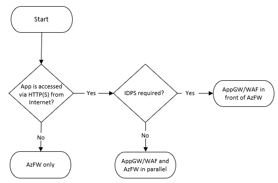
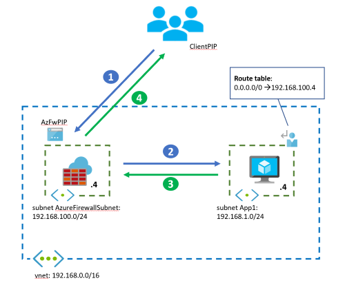
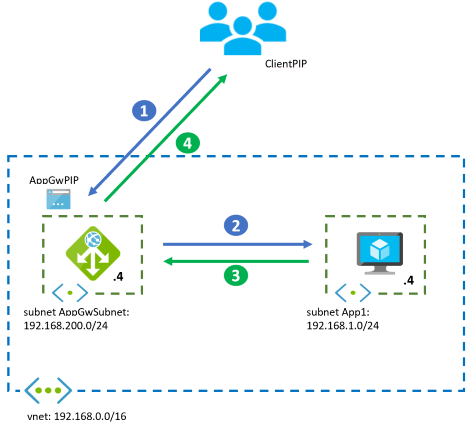
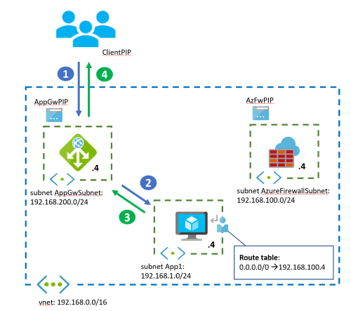
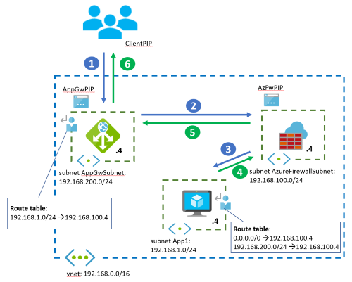
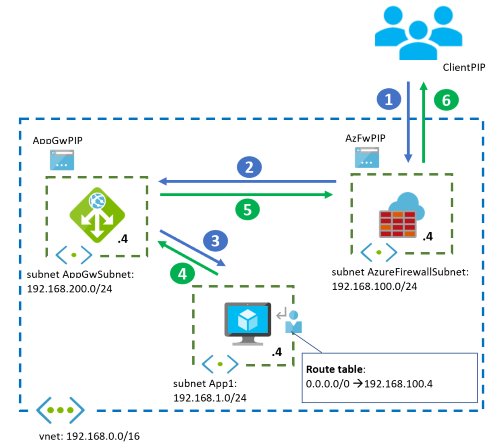
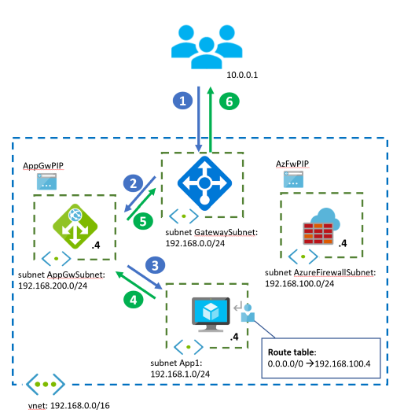
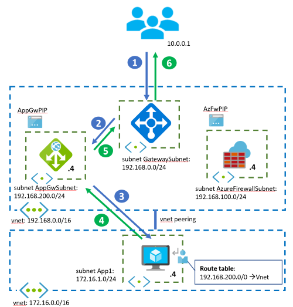

To secure Azure application workloads, you should use protective measures, such as authentication and encryption, in the applications themselves. You can also add security layers to the virtual networks (VNets) that host the applications. These security layers protect the application's inbound flows from unintended utilization. They also limit outbound flows to the internet to only those endpoints your application requires. This article describes [Azure Virtual Network][azure-virtual-network] security services like Azure DDoS Protection, Azure Firewall and Azure Application Gateway, when to use each service, and network design options that combine both.

- [Azure DDoS Protection Standard](/azure/ddos-protection/ddos-protection-overview), combined with application-design best practices, provides enhanced DDoS mitigation features to provide more defense against DDoS attacks. You should enable [Azure DDOS Protection Standard](/azure/ddos-protection/ddos-protection-overview) on any perimeter virtual network.
- [Azure Firewall][azfw-overview] is a managed next-generation firewall that offers [network address translation (NAT)][nat]. Azure Firewall bases packet filtering on Internet Protocol (IP) addresses and Transmission Control Protocol and User Datagram Protocol (TCP/UDP) ports, or on application-based HTTP(S) or SQL attributes. Azure Firewall also applies Microsoft threat intelligence to identify malicious IP addresses. For more information, see the [Azure Firewall documentation][azfw-docs].
- [Azure Firewall Premium][azfw-premium-features] includes all functionality of Azure Firewall Standard and other features, such as TLS-inspection and Intrusion Detection and Protection System (IDPS).
- [Azure Application Gateway][appgw-overview] is a managed web traffic load balancer and HTTP(S) full reverse proxy that can do Secure Socket Layer (SSL) encryption and decryption. Application gateway preserves the original client IP address in an X-Forwarded-For HTTP header. Application Gateway also uses Web Application Firewall to inspect web traffic and detect attacks at the HTTP layer. For more information, see the [Application Gateway documentation][appgw-docs].
- [Azure Web Application Firewall (WAF)][web-application-firewall] is an optional addition to Azure Application Gateway. It provides inspection of HTTP requests, and it prevents malicious attacks at the web layer, such as SQL Injection or Cross-Site Scripting. For more information, see the [Web Application Firewall documentation][waf-docs].

These Azure services are complementary. One or the other may be best for your workloads, or you can use them together for optimal protection at both the network and application layers. Use the following decision tree and the examples in this article to determine the best security option for your application's virtual network.

Azure Firewall and Azure Application Gateway use different technologies, and they support securitization of different flows:

|Application Flow| Can be filtered by Azure Firewall | Can be filtered by WAF on Application Gateway |
| --- | :---: |:---: |
| HTTP(S) traffic from on-premises/internet to Azure (inbound) | Yes | Yes |
| HTTP(S) traffic from Azure to on-premises/internet (outbound) | Yes | No |
| Non-HTTP(S) traffic, inbound/outbound | Yes | No |

Depending on the network flows an application requires, the design can be different on a per-application basis. The following diagram offers a simplified decision tree that helps choosing the recommended approach for an application. The decision depends on whether the application is published via HTTP(S) or some other protocol:

This article will cover the widely recommended designs from the flow chart, and others that are applicable in less common scenarios:

- [Azure Firewall alone](#azure-firewall-only), when there are no web applications in the virtual network. It will control both inbound traffic to the applications and outbound traffic.
- [Application Gateway alone](#application-gateway-only), when only web applications are in the virtual network, and [network security groups (NSGs)][nsgs] provide sufficient output filtering. The functionalities provided by Azure Firewall can prevent many attack scenarios (such as data exfiltration, IDPS, and so on). Due to this reason, the Application Gateway alone scenario isn't typically recommended and hence not documented and is not in the flow chart above.
- [Azure Firewall and Application Gateway in parallel](#firewall-and-application-gateway-in-parallel), which is one of the most common designs. Use this combination when you want Azure Application Gateway to protect HTTP(S) applications from web attacks, and Azure Firewall to protect all other workloads and filter outbound traffic.
- [Application Gateway in front of Azure Firewall](#application-gateway-before-firewall), when you want Azure Firewall to inspect all traffic, WAF to protect web traffic, and the application to know the client's source IP address. With Azure Firewall Premium and TLS inspection, this design supports the end-to-end SSL scenario as well.
- [Azure Firewall in front of Application Gateway](#application-gateway-after-firewall), when you want Azure Firewall to inspect and filter traffic before it reaches the Application Gateway. Because the Azure Firewall isn't going to decrypt HTTPS traffic, the functionality that it's adding to the Application Gateway is limited. This scenario isn't documented in the flow chart above.

In the last part of this article, variations of the previous fundamental designs are described. These variations include:

- [On-premises application clients](#on-premises-clients).
- [Hub and spoke networks](#hub-and-spoke-topology).
- [Azure Kubernetes Service (AKS)](#azure-kubernetes-service) implementations.

You can add other reverse proxy services like an [API Management][apim-overview] gateway or [Azure Front Door][frontdoor]. Or you can replace the Azure resources with third-party [network virtual appliances](#other-network-virtual-appliances).

 > [!NOTE]
 > In the following scenarios an Azure virtual machine is used as an example of web application workload. The scenarios are also valid to other workload types such as containers or Azure Web Apps. For setups including private endpoints please consider the recommendations in [Use Azure Firewall to inspect traffic destined to a private endpoint][azfw-endpoint]

## Azure Firewall only

If there are no web-based workloads in the virtual network that can benefit from WAF, you can use Azure Firewall only. The design in this case is simple, but reviewing the packet flow will help understand more complex designs. In this design, all inbound traffic is sent to the Azure Firewall via user defined routes (UDRs) for connections from on-premises or other Azure VNets. It is addressed to the Azure Firewall's public IP address for connections from the public internet, as the diagram below shows. Outbound traffic from Azure VNets is sent to the Firewall via UDRs, as shown in the dialog below.

The following table summarizes the traffic flows for this scenario:

| Flow | Goes through Application Gateway / WAF | Goes through Azure Firewall |
| ---- | :--: | :--: |
| HTTP(S) traffic from internet/onprem to Azure     | N/A | Yes (see below) |
| HTTP(S) traffic from Azure to internet/onprem     | N/A | Yes |
| Non-HTTP(S) traffic from internet/onprem to Azure | N/A | Yes |
| Non-HTTP(S) traffic from Azure to internet/onprem | N/A | Yes |

Azure Firewall won't inspect inbound HTTP(S) traffic. But it will be able to apply layer 3 & layer 4 rules and FQDN-based application rules. Azure Firewall will inspect outbound HTTP(S) traffic depending on the Azure Firewall tier and whether you configure TLS inspection:

- Azure Firewall Standard will only inspect layer 3 & layer 4 attributes of the packets in network rules, and the Host HTTP header in application rules.
- Azure Firewall Premium adds capabilities such as inspecting other HTTP headers (such as the User-Agent) and enabling TLS inspection for deeper packet analysis. Azure Firewall isn't equivalent to a Web Application Firewall. If you have web workloads in your Virtual Network, using WAF is highly recommended.

The following packet walk example shows how a client accesses a VM-hosted application from the public internet. The diagram includes only one VM for simplicity. For higher availability and scalability, you'd have multiple application instances behind a load balancer.
In this design, Azure Firewall inspects both incoming connections from the public internet, and outbound connections from the application subnet VM by using the UDR.

- Azure Firewall service deploys several instances under the covers, here with the front-end IP address 192.168.100.4 and internal addresses from the range 192.168.100.0/26.  These individual instances are normally invisible to the Azure administrator.  But noticing the difference is useful in some cases, such as when troubleshooting network issues. 
- If traffic comes from an on-premises virtual private network (VPN) or [Azure ExpressRoute][expressroute] gateway instead of the internet, the client starts the connection to the VM's IP address. It doesn't start the connection to the firewall's IP address, and the firewall will do no Source NAT per default.

### Architecture

The following diagram shows the traffic flow assuming the instance IP address is `192.168.100.7`.

#### Workflow

1. The client starts the connection to the public IP address of the Azure Firewall:
   - Source IP address: ClientPIP
   - Destination IP address: AzFwPIP
2. The request to the Azure Firewall public IP is distributed to a back-end instance of the firewall, in this case 192.168.100.7. The Azure Firewall [Destination NAT (DNAT) rule][azfw-dnat] translates the destination IP address to the application IP address inside the virtual network. The Azure Firewall also *Source NATs (SNATs)* the packet if it does DNAT. For more information, see [Azure Firewall known issues][azfw-issues]. The VM sees the following IP addresses in the incoming packet:
   - Source IP address: 192.168.100.7
   - Destination IP address: 192.168.1.4
3. The VM answers the application request, reversing source and destination IP addresses. The inbound flow doesn't require a *user-defined route (UDR)*, because the source IP is Azure Firewall's IP address. The UDR in the diagram for 0.0.0.0/0 is for outbound connections, to make sure packets to the public internet go through the Azure Firewall.
   - Source IP address: 192.168.1.4
   - Destination IP address: 192.168.100.7
4. Finally, Azure Firewall undoes the SNAT and DNAT operations, and delivers the response to the client:
   - Source IP address: AzFwPIP
   - Destination IP address: ClientPIP

## Application Gateway only

This design covers the situation where only web applications exist in the virtual network, and inspecting outbound traffic with NSGs is sufficient to protect outbound flows to the internet.

 > [!NOTE]
 > This is not a recommended design since using Azure Firewall to control outbound flows (instead of only NSGs) will prevent certain attack scenarios such as data exfiltration, where you make sure that your workloads are only sending data to an approved list of URLs. Further, NSGs only work on layer 3 and layer 4 and have no FQDN support.

The main difference from the previous design with only the Azure Firewall is that the Application Gateway doesn't act as a routing device with NAT. It behaves as a full reverse application proxy. That is, Application Gateway stops the web session from the client, and establishes a separate session with one of its backend servers. Inbound HTTP(S) connections from the Internet need to be sent to the public IP address of the Application Gateway, connections from Azure or on-premises to the gateway's private IP address. Return traffic from the Azure VMs will follow standard VNet routing back to the Application Gateway (see the packet walk further down for more details). Outbound internet flows from Azure VMs will go straight to the internet.

The following table summarizes traffic flows:

| Flow | Goes through Application Gateway / WAF | Goes through Azure Firewall |
| ---- | :--: | :--: |
| HTTP(S) traffic from internet/onprem to Azure     | Yes | N/A |
| HTTP(S) traffic from Azure to internet/onprem     | No  | N/A |
| Non-HTTP(S) traffic from internet/onprem to Azure | No  | N/A |
| Non-HTTP(S) traffic from Azure to internet/onprem | No  | N/A |

### Architecture

The following packet walk example shows how a client accesses the VM-hosted application from the public internet.

#### Workflow

1. The client starts the connection to the public IP address of the Azure Application Gateway:
   - Source IP address: ClientPIP
   - Destination IP address: AppGwPIP
2. The request to the Application Gateway public IP is distributed to a back-end instance of the gateway, in this case 192.168.200.7. The Application Gateway instance that receives the request stops the connection from the client, and establishes a new connection with one of the back ends. The back end sees the Application Gateway instance as the source IP address. The Application Gateway inserts an *X-Forwarded-For* HTTP header with the original client IP address.
   - Source IP address: 192.168.200.7 (the private IP address of the Application Gateway instance)
   - Destination IP address: 192.168.1.4
   - X-Forwarded-For header: ClientPIP
3. The VM answers the application request, reversing source and destination IP addresses. The VM already knows how to reach the Application Gateway, so doesn't need a UDR.
   - Source IP address: 192.168.1.4
   - Destination IP address: 192.168.200.7
4. Finally, the Application Gateway instance answers the client:
   - Source IP address: AppGwPIP
   - Destination IP address: ClientPIP

Azure Application Gateway adds metadata to the packet HTTP headers, such as the *X-Forwarded-For* header containing the original client's IP address. Some application servers need the source client IP address to serve geolocation-specific content, or for logging. For more information, see [How an application gateway works][appgw-networking].

- The IP address `192.168.200.7` is one of the instances the Azure Application Gateway service deploys under the covers, here with the internal, private front-end IP address `192.168.200.4`. These individual instances are normally invisible to the Azure administrator. But noticing the difference is useful in some cases, such as when troubleshooting network issues.

- The flow is similar if the client comes from an on-premises network over a VPN or ExpressRoute gateway. The difference is the client accesses the private IP address of the Application Gateway instead of the public address.

> [!NOTE]
> See [Preserve the original HTTP host name between a reverse proxy and its back-end web application][preserve-http-host] for more information on X-Forwarded-For and preserving the host name on a request.

## Firewall and Application Gateway in parallel

Because of its simplicity and flexibility, running Application Gateway and Azure Firewall in parallel is often the best scenario.

Implement this design if there's a mix of web and non-web workloads in the virtual network. Azure WAF in Azure Application Gateway protects inbound traffic to the web workloads, and the Azure Firewall inspects inbound traffic for the other applications. The Azure Firewall will cover outbound flows from both workload types.

Inbound HTTP(S) connections from the Internet should be sent to the public IP address of the Application Gateway, HTTP(S) connections from Azure or on-premises to its private IP address. Standard VNet routing will send the packets from the Application Gateway to the destination VMs, as well as from the destination VMs back to the Application Gateway (see the packet walk further down for more details). For inbound non-HTTP(S) connections, traffic should be targeting the public IP address of the Azure Firewall (if coming from the public Internet), or it will be sent through the Azure Firewall by UDRs (if coming from other Azure VNets or on-premises networks). All outbound flows from Azure VMs will be forwarded to the Azure Firewall by UDRs.

The following table summarizes the traffic flows for this scenario:

| Flow | Goes through Application Gateway / WAF | Goes through Azure Firewall |
| ---- | :--: | :--: |
| HTTP(S) traffic from internet/onprem to Azure     | Yes | No |
| HTTP(S) traffic from Azure to internet/onprem     | No  | Yes |
| Non-HTTP(S) traffic from internet/onprem to Azure | No  | Yes |
| Non-HTTP(S) traffic from Azure to internet/onprem | No  | Yes |

This design gives much more granular egress filtering than NSGs. For example, if applications need connectivity to a specific Azure Storage Account, you can use *fully qualified domain name (FQDN)*-based filters. With FQDN-based filters, applications aren't sending data to rogue storage accounts. That scenario couldn't be prevented just by using NSGs. This design is often used where outbound traffic requires FQDN-based filtering. One example situation is when [limiting egress traffic from an Azure Kubernetes Services cluster][aks-egress].

### Architectures

The following diagram illustrates the traffic flow for inbound HTTP(S) connections from an outside client:

The following diagram illustrates the traffic flow for outbound connections from the network VMs to the internet. One example is to connect to backend systems or get operating system updates:

The packet flow steps for each service are the same as in the previous standalone design options.

## Application Gateway before Firewall

In this option, inbound web traffic goes through both Azure Firewall and WAF. The WAF provides protection at the web application layer. Azure Firewall acts as a central logging and control point, and it inspects traffic between the Application Gateway and the backend servers. The Application Gateway and Azure Firewall aren't sitting in parallel, but one after the other.

With [Azure Firewall Premium][azfw-premium-features], this design can support end-to-end scenarios, where the Azure Firewall applies TLS inspection to do IDPS on the encrypted traffic between the Application Gateway and the web backend.

This design is appropriate for applications that need to know incoming client source IP addresses, for example to serve geolocation-specific content or for logging. Application Gateway in front of Azure Firewall captures the incoming packet's source IP address in the *X-forwarded-for* header, so the web server can see the original IP address in this header. For more information, see [How an application gateway works][appgw-networking].

Inbound HTTP(S) connections from the Internet need to be sent to the public IP address of the Application Gateway, HTTP(S) connections from Azure or on-premises to the private IP address. From the Application Gateway UDRs will make sure that the packets are routed through the Azure Firewall (see the packet walk further down for more details). For inbound non-HTTP(S) connections, traffic should be targeting the public IP address of the Azure Firewall (if coming from the public Internet), or it will be sent through the Azure Firewall by UDRs (if coming from other Azure VNets or on-premises networks). All outbound flows from Azure VMs will be forwarded to the Azure Firewall by UDRs.

The following table summarizes the traffic flows for this scenario:

| Flow | Goes through Application Gateway / WAF | Goes through Azure Firewall |
| ---- | :--: | :--: |
| HTTP(S) traffic from internet/onprem to Azure     | Yes | Yes |
| HTTP(S) traffic from Azure to internet/onprem     | No  | Yes |
| Non-HTTP(S) traffic from internet/onprem to Azure | No  | Yes |
| Non-HTTP(S) traffic from Azure to internet/onprem | No  | Yes |

For web traffic from on-premises or internet to Azure, the Azure Firewall will inspect flows that the WAF has already allowed. Depending on whether the Application Gateway encrypts backend traffic (traffic from the Application Gateway to the application servers), you'll have different potential scenarios:

1. The Application Gateway encrypts traffic following zero-trust principles ([End-to-End TLS encryption](/azure/application-gateway/ssl-overview#end-to-end-tls-encryption)), and the Azure Firewall will receive encrypted traffic. Still, Azure Firewall Standard will be able to apply inspection rules, such as layer 3 & layer 4 filtering in network rules, or FQDN filtering in application rules using the TLS Server Name Indication (SNI) header. [Azure Firewall Premium][azfw-premium-features] provides deeper visibility with IDPS, such as URL-based filtering.
1. If the Application Gateway is sending unencrypted traffic to the application servers, the Azure Firewall will see inbound traffic in clear text. TLS inspection isn't needed in the Azure Firewall.
1. If IDPS is enabled in the Azure Firewall, it will verify that the HTTP Host header matches the destination IP. With that purpose, it will need name resolution for the FQDN that's specified in the Host header. This name resolution can be achieved with Azure DNS Private Zones and the default Azure Firewall DNS settings using Azure DNS. It can also be achieved with custom DNS servers that need to be configured in the Azure Firewall settings. (For more information, see [Azure Firewall DNS Settings][azfw-dns].) If there isn't administrative access to the Virtual Network where the Azure Firewall is deployed, the latter method is the only possibility. One example is with Azure Firewalls deployed in Virtual WAN Secured Hubs.

### Architecture

For the rest of the flows (inbound non-HTTP(S) traffic and any outbound traffic), the Azure Firewall will provide IDPS inspection and TLS inspection where appropriate. It also provides [FQDN-based filtering in network rules][azfw-dns] based on DNS.

#### Workflow

Network traffic from the public internet follows this flow:

1. The client starts the connection to the public IP address of the Azure Application Gateway:
   - Source IP address: ClientPIP
   - Destination IP address: AppGwPIP
2. The request to the Application Gateway public IP is distributed to a back-end instance of the gateway, in this case 192.168.200.7. The Application Gateway instance stops the connection from the client, and establishes a new connection with one of the back ends. The UDR to `192.168.1.0/24` in the Application Gateway subnet forwards the packet to the Azure Firewall, while preserving the destination IP to the web application:
   - Source IP address: 192.168.200.7 (private IP address of the Application Gateway instance)
   - Destination IP address: 192.168.1.4
   - X-Forwarded-For header: ClientPIP
3. Azure Firewall doesn't SNAT the traffic, because the traffic is going to a private IP address. It forwards the traffic to the application VM if rules allow it. For more information, see [Azure Firewall SNAT][azfw-snat]. However, if the traffic hits an application rule in the firewall, the workload will see the source IP address of the specific firewall instance that processed the packet, since the Azure Firewall will proxy the connection:
   - Source IP address if the traffic is allowed by an Azure Firewall network rule: 192.168.200.7 (the private IP address of one of the Application Gateway instances).
   - Source IP address if the traffic is allowed by an Azure Firewall application rule: 192.168.100.7 (the private IP address of one of the Azure Firewall instances).
   - Destination IP address: 192.168.1.4
   - X-Forwarded-For header: ClientPIP
4. The VM answers the request, reversing source and destination IP addresses. The UDR to `192.168.200.0/24` captures the packet sent back to the Application Gateway and redirects it to Azure Firewall, while preserving the destination IP toward the Application Gateway.
   - Source IP address: 192.168.1.4
   - Destination IP address: 192.168.200.7
5. Here again the Azure Firewall doesn't SNAT the traffic, since it's going to a private IP address, and forwards the traffic to the Application Gateway.
   - Source IP address: 192.168.1.4
   - Destination IP address: 192.168.200.7
6. Finally, the Application Gateway instance answers the client:
   - Source IP address: AppGwPIP
   - Destination IP address: ClientPIP

Outbound flows from the VMs to the public internet go through Azure Firewall, as defined by the UDR to `0.0.0.0/0`.

## Application Gateway after firewall

This design lets Azure Firewall filter and discard malicious traffic before it reaches the Application Gateway. For example, it can apply features like threat intelligence-based filtering. Another benefit is that the application gets the same public IP address for both inbound and outbound traffic, regardless of protocol. However, Azure Firewall SNATs the incoming traffic, so the application will not have visibility to the original IP address of the HTTP requests. From an administration perspective, for example for troubleshooting purposes, you can obtain the actual client IP for a specific connection by correlating it with the SNAT logs of the Azure Firewall.

There's limited benefit in this scenario, because Azure Firewall will only see encrypted traffic going to the Application Gateway. There might be scenarios where this design is preferred. One case is if another WAF is earlier in the network (for example, with [Azure Front Door][afd-overview]), which could capture the original source IP in the `X-Forwarded-For` HTTP header. Or the design is preferred if many public IP addresses are required.

HTTP(S) inbound flows from the public Internet should target the public IP address of the Azure Firewall, and the Azure Firewall will DNAT (and SNAT) the packets to the private IP address of the Application Gateway. From other Azure VNets or on-premises networks, HTTP(S) traffic should be sent to the Application Gateway's private IP, and forwarded through the Azure Firewall with UDRs. Standard VNet routing will make sure that return traffic from the Azure VMs goes back to the Application Gateway, and from the Application Gateway to the Azure Firewall if DNAT rules were used. For traffic from on-premises or Azure UDRs in the Application Gateway subnet should be used (see the packet walk further down for more details). All outbound traffic from the Azure VMs to the internet will be sent through the Azure Firewall by UDRs.

The following table summarizes the traffic flows for this scenario:

| Flow | Goes through Application Gateway / WAF | Goes through Azure Firewall |
| ---- | :--: | :--: |
| HTTP(S) traffic from internet/onprem to Azure     | Yes | Yes (see below) |
| HTTP(S) traffic from Azure to internet/onprem     | No  | Yes |
| Non-HTTP(S) traffic from internet/onprem to Azure | No  | Yes |
| Non-HTTP(S) traffic from Azure to internet/onprem | No  | Yes |

For inbound HTTP(S) traffic, the Azure Firewall would typically not decrypt traffic. It would instead apply IDPS policies that don't require TLS inspection, like IP-based filtering or using HTTP headers.

### Architecture

The application can't see the original source IP address of the web traffic; the Azure Firewall SNATs the packets as they come in to the virtual network. To avoid this problem, use [Azure Front Door][afd-overview] in front of the firewall. Azure Front Door injects the client's IP address as an HTTP header before it enters the Azure virtual network.

#### Workflow

Network traffic from the public internet follows this flow:

1. The client starts the connection to the public IP address of the Azure Firewall:
   - Source IP address: ClientPIP
   - Destination IP address: AzFWPIP
2. The request to the Azure Firewall public IP is distributed to a back-end instance of the firewall, in this case 192.168.100.7. The Azure Firewall DNATs the web port, usually TCP 443, to the private IP address of the Application Gateway instance. Azure Firewall also SNATs when doing DNAT. For more information, see [Azure Firewall known issues][azfw-issues]:
   - Source IP address: 192.168.100.7 (the private IP address of the Azure Firewall instance)
   - Destination IP address: 192.168.200.4
3. The Application Gateway establishes a new session between the instance handling the connection and one of the backend servers. The original IP address of the client isn't in the packet:
   - Source IP address: 192.168.200.7 (the private IP address of the Application Gateway instance)
   - Destination IP address: 192.168.1.4
   - X-Forwarded-For header: 192.168.100.7
4. The VM answers the Application Gateway, reversing source and destination IP addresses:
   - Source IP address: 192.168.1.4
   - Destination IP address: 192.168.200.7
5. The Application Gateway replies to the SNAT source IP address of the Azure Firewall instance. Even if the connection is coming from a specific Application Gateway instance like `.7`, Azure Firewall sees the internal IP address of the Application Gateway `.4` as the source IP:
   - Source IP address: 192.168.200.4
   - Destination IP address: 192.168.100.7
6. Finally, Azure Firewall undoes SNAT and DNAT and answers the client:
   - Source IP address: AzFwPIP
   - Destination IP address: ClientPIP

Even if the Application Gateway has no listeners configured for applications, it still needs a public IP address so Microsoft can manage it.

> [!NOTE]
> A default route to `0.0.0.0/0` in the Application Gateway subnet pointing to the Azure Firewall is not supported, since it would break the control plane traffic required for the correct operation of the Azure Application Gateway.

## On-premises clients

The preceding designs all show application clients coming from the public internet. On-premises networks also access applications. Most of the preceding information and traffic flows are the same as for internet clients, but there are some notable differences:

- A VPN gateway or ExpressRoute gateway sits in front of Azure Firewall or Application Gateway.
- WAF uses the private IP address of the Application Gateway.
- Azure Firewall doesn't support DNAT for private IP addresses. That's why you must use UDRs to send inbound traffic to Azure Firewall from the VPN or ExpressRoute gateways.
- Make sure to verify caveats around *forced tunneling* for the [Azure Application Gateway][appgw-defaultroute] and for the [Azure Firewall][azfw-defaultroute]. Even if your workload doesn't need outbound connectivity to the public internet, you can't inject a default route like `0.0.0.0/0` for the Application Gateway that points to the on-premises network, or you'll break control traffic. For Azure Application Gateway, the default route needs to point to the public internet.

### Architecture

The following diagram shows the Azure Application Gateway and Azure Firewall parallel design. Application clients come from an on-premises network connected to Azure over VPN or ExpressRoute:

Even if all clients are located on-premises or in Azure, Azure Application Gateway and Azure Firewall both need to have public IP addresses. The public IP addresses allow Microsoft to manage the services.

## Hub and spoke topology

The designs in this article still apply in a *hub and spoke* topology. Shared resources in a central hub virtual network connect to applications in separate spoke virtual networks through virtual network peerings.

### Architecture

#### Considerations

Some considerations for this topology include:

- The Azure Firewall is deployed in the central hub virtual network. The diagram above shows the practice of deploying the Application Gateway in the hub. Application teams often manage components such as Azure Application Gateways or Azure API Management gateways, though. In this case, these components are deployed in the spoke virtual networks.
- Pay special attention to UDRs in the spoke networks: When an application server in a spoke receives traffic from a specific Azure Firewall instance, like the `192.168.100.7` address in the previous examples, it should send return traffic back to the same instance. If a UDR in the spoke sets the next hop of traffic addressed to the hub to the Azure Firewall IP address (`192.168.100.4` in the diagrams above), return packets might end up on a different Azure Firewall instance, causing asymmetric routing. Make sure that if you have UDRs in the spoke VNets to send traffic to shared services in the hub through the Azure Firewall, these UDRs don't include the prefix of the Azure Firewall subnet.
- The previous recommendation applies equally to the Application Gateway subnet and any other Network Virtual Appliances or reverse proxies that might be deployed in the hub VNet.
- You can't set the next hop for the Application Gateway or Azure Firewall subnets through static routes with a next hop type of `Virtual Network`. This next hop type is only valid in the local VNet and not across VNet peerings. For more information about user-defined routes and next hop types, see [Virtual network traffic routing][udr].

### Asymmetric routing

The diagram below shows how a spoke sends back SNATted traffic back to the ALB of an Azure Firewall. This setup causes asymmetric routing:

To solve this problem, define UDRs in the spoke without the Azure Firewall subnet but with only the subnets where the shared services are located. In the example, the correct UDR in the spoke should only contain 192.168.1.0/24. It shouldn't contain the whole 192.168.0.0/16, as marked in red.

## Integration with other Azure products

You can integrate Azure Firewall and Azure Application Gateway with other Azure products and services.

### API Management Gateway

Integrate reverse proxy services like [API Management][apim] gateway into the previous designs to provide functionality like API throttling or authentication proxy. Integrating an API Management gateway doesn't greatly alter the designs. The main difference is that instead of the single Application Gateway reverse proxy, there are two reverse proxies chained behind each other.

For more information, see the [Design Guide to integrate API Management and Application Gateway in a virtual network][appgw-apim] and the application pattern [API Gateways for Microservices][app-gws].

### Azure Kubernetes Service

For workloads running on an AKS cluster, you can deploy Azure Application Gateway independently of the cluster. Or you can integrate it with the AKS cluster using the [Azure Application Gateway Ingress Controller][agic_overview]. When configuring certain objects at the Kubernetes levels (such as services and ingresses), the Application Gateway automatically adapts without needing extra manual steps.

Azure Firewall plays an important role in AKS cluster security. It offers the required functionality to filter egress traffic from the AKS cluster based on FQDN, not just IP address. For more information, see [Control egress traffic for AKS cluster nodes][aks-egress].

When you combine Application Gateway and Azure Firewall to protect an AKS cluster, it's best to use the parallel design option. The Application Gateway with WAF processes inbound connection requests to web applications in the cluster. Azure Firewall permits only explicitly allowed outbound connections. See [Baseline architecture for an Azure Kubernetes Service (AKS) cluster][aks-secure-baseline] for an example of the parallel design option.

### Azure Front Door

[Azure Front Door][frontdoor] functionality partly overlaps with Azure Application Gateway. For example, both services offer web application firewalling, SSL offloading, and URL-based routing. One main difference is that while Azure Application Gateway is inside a virtual network, Azure Front Door is a global, decentralized service.

You sometimes can simplify virtual network design by replacing Application Gateway with a decentralized Azure Front Door. Most designs described here remain valid, except for the option of placing Azure Firewall in front of Azure Front Door.

An interesting use case is using Azure Firewall in front of Application Gateway in your virtual network. As described earlier, the `X-Forwarded-For` header injected by the Application Gateway will contain the firewall instance's IP address, not the client's IP address. A workaround is to use Azure Front Door in front of the firewall to inject the client's IP address as a `X-Forwarded-For` header before the traffic enters the virtual network and hits the Azure Firewall.  A second option is to [Secure your Origin with Private Link in Azure Front Door Premium][azure-front-door-private-link].

For more information about the differences between the two services, or when to use each one, see [Frequently Asked Questions for Azure Front Door][afd-vs-appgw].

## Other network virtual appliances

Microsoft products aren't the only choice to implement web application firewall or next-generation firewall functionality in Azure. A wide range of Microsoft partners provide network virtual appliances (NVAs). The concepts and designs are essentially the same as in this article, but there are some important considerations:

- Partner NVAs for next-generation firewalling may offer more control and flexibility for NAT configurations unsupported by the Azure Firewall. Examples include DNAT from on-premises or DNAT from the internet without SNAT.
- Azure-managed NVAs (like Application Gateway and Azure Firewall) reduce complexity, compared to NVAs where users need to handle scalability and resiliency across many appliances.
- When using NVAs in Azure, use *active-active* and *autoscaling* setups, so these appliances aren't a bottleneck for applications running in the virtual network.

## Contributors

*This article is maintained by Microsoft. It was originally written by the following contributors.*

Principal author:

* [Jose Moreno](https://de.linkedin.com/in/erjosito) | Principal Customer Engineer

## Next steps

Learn more about the component technologies:

- [What is Azure Application Gateway?](/azure/application-gateway/overview)
- [What is Azure Firewall?](/azure/firewall/overview)
- [What is Azure Front Door?](/azure/frontdoor/front-door-overview)
- [Azure Kubernetes Service](/azure/aks/intro-kubernetes)
- [What is Azure Virtual Network?](/azure/virtual-network/virtual-networks-overview)
- [What is Azure Web Application Firewall?](/azure/web-application-firewall/overview)

## Related resources

Explore related architectures:

- [Implement a secure hybrid network](../../reference-architectures/dmz/secure-vnet-dmz.yml)
- [Securely managed web applications](../apps/fully-managed-secure-apps.yml)
- [Securing your Microsoft Teams channel bot and web app behind a firewall](../teams/securing-bot-teams-channel.yml)
- [Consumer health portal on Azure](../digital-health/health-portal.yml)
- [Security considerations for highly sensitive IaaS apps in Azure](../../reference-architectures/n-tier/high-security-iaas.yml)
- [Multitenant SaaS on Azure](../multi-saas/multitenant-saas.yml)
- [Enterprise deployment using App Services Environment](../../reference-architectures/enterprise-integration/ase-standard-deployment.yml)
- [High availability enterprise deployment using App Services Environment](../../reference-architectures/enterprise-integration/ase-high-availability-deployment.yml)
- [Baseline architecture for an Azure Kubernetes Service (AKS) cluster](/azure/architecture/reference-architectures/containers/aks/baseline-aks)

[azfw-overview]: /azure/firewall/overview
[azfw-premium-features]: /azure/firewall/premium-features
[azfw-docs]: /azure/firewall/
[azfw-dnat]: /azure/firewall/tutorial-firewall-dnat
[azfw-snat]: /azure/firewall/snat-private-range
[azfw-issues]: /azure/firewall/overview#known-issues
[azfw-dns]: /azure/firewall/fqdn-filtering-network-rules
[azfw-endpoint]: /azure/private-link/inspect-traffic-with-azure-firewall
[appgw-overview]: /azure/application-gateway/overview
[appgw-docs]: /azure/application-gateway/
[waf-docs]: /azure/web-application-firewall/
[appgw-apim]: /azure/api-management/api-management-howto-integrate-internal-vnet-appgateway
[api-gws]: ../../microservices/design/gateway.md
[agic_overview]: /azure/application-gateway/ingress-controller-overview
[apim-overview]: /azure/api-management/api-management-key-concepts
[aks-egress]: /azure/aks/limit-egress-traffic
[afd-overview]: /azure/frontdoor/front-door-overview
[afd-vs-appgw]: /azure/frontdoor/front-door-faq#what-is-the-difference-between-azure-front-door-and-azure-application-gateway
[appgw-networking]: /azure/application-gateway/how-application-gateway-works
[azure-virtual-network]: https://azure.microsoft.com/services/virtual-network/
[web-application-firewall]: https://azure.microsoft.com/services/web-application-firewall/
[nat]: /azure/virtual-network/nat-overview
[udr]: /azure/virtual-network/virtual-networks-udr-overview
[expressroute]: https://azure.microsoft.com/services/expressroute/
[apim]: https://azure.microsoft.com/services/api-management/
[app-gws]: https://microservices.io/patterns/apigateway.html
[frontdoor]: https://azure.microsoft.com/services/frontdoor/
[nsgs]: /azure/virtual-network/security-overview
[azfw-defaultroute]: /azure/firewall/forced-tunneling
[appgw-defaultroute]:/azure/application-gateway/configuration-overview#azure-virtual-network-and-dedicated-subnet
[aks-secure-baseline]: /azure/architecture/reference-architectures/containers/aks/secure-baseline-aks
[azure-front-door-private-link]: /azure/frontdoor/private-link
[preserve-http-host]: /azure/architecture/best-practices/host-name-preservation
