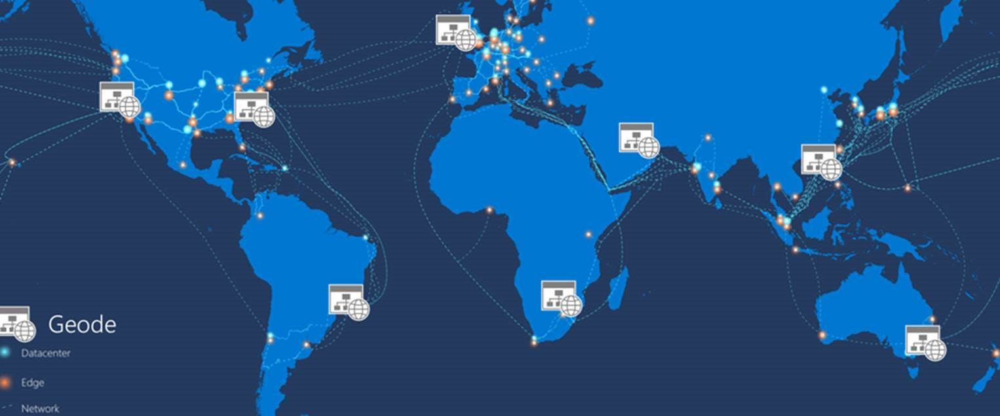

# Geodes

The geode pattern involves splicing a collection of backend services into a set of *geo*graphical no*de*s, each of which is capable of servicing any request for any client in any region. This allows requests to be served in an active-active-active manner while request processing can then be distributed across multiple geographical regions, enhancing both low-latency performance and providing ultimate availability.

## Context and Problem

Many large scale services have challenges of geographic availability and scale. Modern cloud infrastructure meanwhile has evolved to enable geographic load balancing of front-end services while allowing for geographic data replication of backend services.

In "classic" designs we'd often *"bring data to the compute"*  (For example, your application would retain data in a remote SQL server, which serves as the compute tier for that data, relying on scale-up for growth.)

The geode pattern is an example whereby we'd do the reverse and *"bring compute to the data"*: starting with the principle that (for availability and performance reasons, getting data closer to the user) data is going to be geo-distributed, we will make sure that these geo-distributed datastores are co-located with the compute which will handle that data.

(Other examples where this happens is in Big Data architectures where commodity hardware is used to process data co-located on the same machine, using map-reduce to consolidate results across machines.  Another example is edge and near edge compute whereby we're bringing compute closer to the data on the edge of the network.  Also single-page apps represent an example whereby we're bringing more compute/intelligence to where the data resides and originates: the user's browser.)

The classic approach may present challenges in a number of forms: 
- network latency: users coming from the other side of the globe connecting to the hosting endpoint
- traffic management: my users may have bursts in demand that can overwhelm the services in a single region
- complexity: the complexity of deploying 40 copies of my app infrastructure into multiple regions for a follow-the-sun-service is overwhelming and often cost-prohibitive (40x as expensive).

The geode pattern harnesses key features of Azure to route traffic to the nearest geographical endpoint by which latency is reduced and performance increases. Cloud data-replication services are used to ensure that _all_ requests can be served from _all_ geo-nodes – as their data store is identical.  In addition by using serverless and consumption-based billed technologies waste and cost is reduced from having duplicate geo-distributed deployments. Furthermore, the resiliency of the whole solution increases with each added geode, since all geodes can take over from each other in the event of a regional outage.

## Solution

Split the service into a number of satellite deployments spread around the globe – each of which is called a "geode". Each geode is placed behind a global load balancer and uses a geo-replicated read-write service (Such as Azure CosmosDB) to host the data plane, ensuring cross-geo data consistency.

**Geodes enjoy the following charateristics:**
- They are a collection of disparate types of resources – often defined as a template.
- All dependencies reside within the geode footprint, no geode is dependent on another to operate
- They are loosely coupled via an edge network and replication backplane. For example Traffic Manager or Azure Front Door can be used for fronting the geodes while Cosmos DB can act as the replication backplane.
- They are self-contained, if one dies the others continue to operate.
- These services could deployed into an intra-zone, zonal, or regional footprint depending on the level of Geo-Distribution, Geo-Regulation location constraints.
- The key difference between a deployment stamp and a geode is that geodes never exist in isolation, there should be always more than one in a production platform.
- They are not clusters as they share a replication backplane and hence have the issues of quorum taken care of by the platform.

## Issues and Considerations

Please consider the following points when deciding how to implement this pattern:
- Use a replicating data store that provides control over the data-consistency, such as Azure Cosmos DB. 
- Use a frontend service that does dynamic content acceleration, split TCP, and Anycast routing such as Azure Front Door.
- Making a deliberate choice whether to process data locally in each region or distribute making aggregations in a single geode and then replicating the result across the globe. The [Cosmos DB Change feed processor](https://docs.microsoft.com/en-us/azure/cosmos-db/change-feed-processor) offers this granular control using its "lease container" concept and the "leasecollectionprefix" in the corresponding [Azure Functions binding](https://docs.microsoft.com/en-us/azure/cosmos-db/change-feed-functions).  Each approach has distinct advantages and drawbacks.
- Use serverless technologies where possible to reduce the always-on deployment cost – especially where load gets rebalanced around the globe frequently. This potentially allows for a high number of geodes to be deployed with minimal marginal cost.
- This design pattern implicitly decouples everything from everywhere else, resulting in an ultra-highly distributed and decoupled architecture. Whilst this is a good thing – consider how to track different components of the same request as they might execute asynchronously on different instances.  Get a good monitoring strategy in place.
- Use Autoscaling to autoscale out instances of compute and/or Database throughput within a Geode.  Each geode individually scales out, within the common backplane constraints.
- Use Infrastructure as Code practices and tools, such as Resource Manager templates, Azure Deployment Manager, or others. These principles and tools allow for identical deployments to be rapidly rolled out across a large number of separate regions or instances.
- It is perfectly reasonable to have nested geodes, should one require it where local availability techniques (such as availability zones or paired regions) are augmented with the Geode Pattern for global availability. Though this increases complexity, it is particularly useful if your architecture is underpinned by a storage engine such as blob storage which can only replicate to a paired region.
- Geodes can work in tandem, leveraging Cosmos DB's change feed and a realtime communication platform like SignalR which allows for geodes to loosely communicate with other remote geode’s users so the user is completely unaware they are acting on a remote part of a geo-distributed system. This is demonstrated in the sample voting app.

## When to use this pattern

Use this pattern: 
- anywhere you are implementing a high-scale platform that has users distributed over a wide area
- use this pattern for any service that requires extreme availability and resilience characteristics, as services based on the Geode pattern can survive the loss of multiple service regions *at the same time*.

## This pattern might not be suitable for

- Architectures which may have constraints that mean that all Geodes cannot be equal in terms of data storage. For example, there may be data residency requirements, an application that needs to maintain temporary state for a particular session, or a heavy weighting of requests towards a single region. In this case, consider using deployment stamps in combination with a global routing plane that is aware of where a user’s data resides.
- Situations where there is no geographical distribution required.  Instead consider availability zones and/or paired regions for clustering.
- Situations where a legacy platform needs to be retrofitted.  The pattern presented here works for cloud-native development only and is very difficult to retrofit.
- Very simple architectures and requirements, where geo-redundancy and geo-distribution are not required or advantageous.

## Examples

- Windows Active Directory implements a very early variant of this pattern where multimaster replication is enabled, all updates can be served from all nodes, but the idea of FSMO roles means that all geodes are not equal.

- There is a "QnA" sample application which showcases this design pattern in practice.  **Temporary Link until we find a better location: https://github.com/xstof/qnademo**

