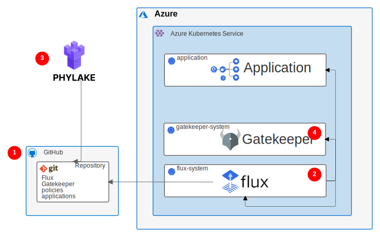

Enterprise companies' operations must follow many regulatory requirements, data privacy regulations, and security standards. Security should follow the principle of least privilege access. Audits need to track who changed what and when on all production systems.

Organizations that use Kubernetes to run their application workloads have to follow these requirements when securing their clusters. Kubernetes isn't secure by default, but operators can use its features to make it secure.

[GitOps](https://www.gitops.tech) is an operational framework for Kubernetes cluster management and application delivery. GitOps applies development practices like version control, collaboration, compliance, and continuous integration/continuous deployment (CI/CD) to infrastructure automation.

Kubernetes describes everything from cluster state to application deployments declaratively with code. In GitOps, [infrastructure as code (IaC)](https://wikipedia.org/wiki/Infrastructure_as_code) uses code to declare the desired state of infrastructure components like virtual machines (VMs), networks, and firewalls. This code is version controlled and auditable.

GitOps for Kubernetes places the cluster infrastructure desired state under version control. A component within the cluster continuously syncs the code. Rather than having direct access to the cluster, most operations happen through code changes that can be reviewed and audited. This approach supports the security principle of least privilege access.

GitOps not only enforces policies within the cluster, but also helps support security by providing feedback for proposed policy changes. Early feedback is more convenient for developers, and reduces risk and costs.

This article describes a solution for using GitOps with an Azure Kubernetes Services (AKS) cluster. This solution provides full audit capabilities, policy enforcement, and early feedback.

## Potential use cases

This solution benefits any organization that wants the advantages of deploying applications and infrastructure as code, with an audit trail of every change. The solution is especially suitable for highly regulated industries like insurance, banking, and finance.

## Architecture



This solution follows a strong GitOps approach.

1. The single point of truth is the **GitHub repository** that holds the provisioned AKS cluster configurations. The repository stores all AKS application manifests and cluster infrastructure desired states. Every change to the cluster happens under version control. GitHub functionality:

   - Ensures review for changes.
   - Prevents unintended or unauthorized changes.
   - Enforces desired quality checks.

1. **Flux** is the GitOps operator and controller, and is the only component that can make changes to the cluster. Flux pulls cluster desired state changes from GitHub, and syncs them into AKS. Flux:

   - Pulls desired changes from GitHub.
   - Detects any configuration drift.
   - Reconciles the state in the Kubernetes cluster.
   - Manages Gatekeeper and the applications.
   - Updates itself.

1. **Open Policy Agent (OPA) Gatekeeper** enforces policies with a validating admission webhook. Gatekeeper validates cluster configuration changes against provisioned policies, and applies the changes only if they comply with policies.

1. **Syncier Security Tower** is a GitOps control kit that provides an overview of all AKS clusters and helps manage policies. Syncier Security Tower:

   - Assembles all cluster images in an overview that shows which versions are deployed and identifies outdated images.
   - Provides feedback on policy violations via pull request (PR) feedback before changes are applied.
   - Introduces risk acceptance whenever policies can't be applied for good reasons.
   - Provides security policies to OPA Gatekeeper.

### Components

This solution uses the following components:

- [Azure Kubernetes Service (AKS)](https://azure.microsoft.com/services/Kubernetes-service) is a highly available, secure, and fully managed Kubernetes service in Azure. In AKS, Azure manages the Kubernetes API server, and cluster owners and operators access and manage the Kubernetes nodes and node pools.

- [GitHub](https://github.com) is a code hosting platform for version control and collaboration. GitHub offers Git distributed version control, source code management, and other features.

- [Flux](https://fluxcd.io) is an open-source collection of tools for keeping Kubernetes clusters in sync with configuration sources like Git repositories. Flux automates configuration updates when there is new code to deploy.

- [OPA Gatekeeper](https://github.com/open-policy-agent/gatekeeper) is a project that integrates the open-source OPA admission controller with Kubernetes. Kubernetes admission controllers enforce policies on objects during create, update, and delete operations, and are fundamental to Kubernetes policy enforcement.

- [Syncier Security Tower](https://securitytower.syncier.com) is a tool that Syncier developed and makes publicly available to help overcome GitOps security and compliance challenges. To help ensure that only trusted images run in the cluster, Syncier Security Tower comes with a set of best-practice policies that are grouped by well-known security standards.

### Alternatives

In this architecture, Flux is the GitOps operator that reconciles the cluster desired state in the Git repository with the deployed resources in the AKS cluster. An alternative to Flux is the open-source [Argo CD project](https://argoproj.github.io/argo-cd), a declarative, GitOps continuous delivery tool for Kubernetes. Both Argo CD and Flux are widely used, and are listed as Cloud Native Computing Foundation (CNCF) incubation projects.

## Considerations

The following considerations apply to this solution.

### Scalability

GitOps has many benefits, but as cluster landscapes grow, so does the number of repositories. This solution helps meet challenges like:

- Keeping an overview of all environments and clusters.
- Tracking critical images.
- Checking that certain policies are active in every cluster.

### Security

This solution provides several security-related benefits. With the GitOps approach, individual developers or administrators don't directly access the Kubernetes clusters to apply changes or updates. Instead, users push changes to a Git repository, and the GitOps operator, Flux in this case, reads them and applies them to the cluster. This approach follows the security best practice of least privilege by not giving DevOps teams write permissions to the Kubernetes API. In diagnostic or troubleshooting scenarios, you can grant cluster permissions for a limited time on a case-by-case basis.

To make sure the AKS clusters are using security best practices, this solution enforces OPA policies with a validating admission webhook. Syncier Security Tower includes a set of policies based on Kubernetes security standards, which you can provision on a cluster scope. Syncier Security Tower provides early feedback via PR review if proposed Kubernetes manifests violate the policies.

Apart from the task of setting up repository permissions, consider implementing the following security measures in Git repositories that sync to AKS clusters:

- **Branch protection:** Protect the branches that represent the state of the Kubernetes clusters from having changes pushed to them directly. Require every change to be proposed by a PR that is reviewed by at least one other person. Also use PRs to do automatic checks. For example, Syncier Security Tower validates Kubernetes manifests that a PR creates or modifies. Syncier Security Tower checks changes against provisioned policies before they can be synced into the cluster.

- **PR review:** Require PRs to have at least one reviewer, to enforce the four-eyes principle. You can also use the GitHub [code owners](https://docs.github.com/en/github/creating-cloning-and-archiving-repositories/creating-a-repository-on-github/about-code-owners) feature to define individuals or teams that are responsible for reviewing specific files in a repository.

- **Immutable history:** Only allow new commits on top of existing changes. Immutable history is especially important for auditing purposes.

- **Further security measures:** Require your GitHub users to activate [two-factor authentication](https://wikipedia.org/wiki/Multi-factor_authentication). Also, allow only signed commits, which can't be altered after the fact.

### Operations

GitOps can increase DevOps productivity. One of the most useful features is the ability to quickly roll back changes that are behaving unexpectedly, just by performing Git operations. The commit graph still contains all commits, so it can help with the post-mortem analysis.

GitOps teams often manage multiple environments for the same application. It's typical to have several stages of an application deployed to different Kubernetes clusters or namespaces. The Git repository, which is the single source of truth, shows which versions of applications are currently deployed to a cluster.

Syncier Security Tower extracts this information from the repository and displays it in a user-friendly way. An overview shows which container images and versions are deployed in each environment.

DevOps teams can use advanced Syncier Security Tower features to get insights into who changed what and when in an application, or browse and filter based on factors like change type or resource kind. Syncier Security Tower provides a control center to activate policies and compare compliance state over different clusters.

## Deploy this scenario

Take the following steps to provision a GitOps setup for AKS:

1. Create an AKS cluster by following the [quickstart guide](/azure/aks/kubernetes-walkthrough) through **Connect to the cluster.** Stop before **Run the application**, and don't deploy anything in the cluster yet.

1. Install the Flux CLI by following the Flux [installation instructions](https://fluxcd.io/docs/installation).

1. Run the following commands in a Bash shell. Set the variables `GITHUB_TOKEN`, `GITHUB_USER`, and `GITHUB_REPO` according to your environment.

   ```bash
   export GITHUB_TOKEN="<your token>"
   export GITHUB_USER="<your username>"
   export GITHUB_REPO="<your repository>"

   flux bootstrap github \
      --owner=$GITHUB_USER \
      --repository=$GITHUB_REPO \
      --branch=main \
      --path=./cluster \
      --personal

   git clone https://github.com/$GITHUB_USER/$GITHUB_REPO
   cd $GITHUB_REPO

   mkdir -p .securitytower
   cat << EOF > .securitytower/cluster.yaml
   apiVersion: securitytower.io/v1alpha1
   kind: Cluster
   metadata:
      name: $GITHUB_REPO
   spec:
      policies:
         path: /policies
   EOF

   flux create kustomization policies \
      --source=flux-system \
      --path="./policies" \
      --prune=true \
      --validation=none \
      --interval=1m \
      --export > ./cluster/policies.yaml

   git add .
   git commit -m "Create Syncier Security Tower cluster config and add policy Kustomization"
   git push

   kubectl apply -f https://raw.githubusercontent.com/open-policy-agent/gatekeeper/release-3.4/deploy/gatekeeper.yaml
   ```

1. Install Gatekeeper by following the Gatekeeper [Installation guide](https://open-policy-agent.github.io/gatekeeper/website/docs/install/#installation). To configure Gatekeeper correctly, see [Enforcing policies with OPA Gatekeeper](https://securitytower.syncier.com/docs/guide/policies).

1. Install Syncier Security Tower to your repository from the [GitHub marketplace](https://github.com/marketplace/security-tower).

1. To set up all needed configuration files, follow the Syncier Security Tower [Getting Started guide](https://securitytower.syncier.com/docs/guide/get-started).

You've now successfully provisioned a running GitOps setup. From here, you can:

- Add more clusters.
- Use Syncier Security Tower to get an overview of the images your clusters are using.
- Provision policies with Syncier Security Tower to comply with your security standards.

## Pricing

- Use the [Azure pricing calculator](https://azure.microsoft.com/pricing/calculator) to estimate costs.

- AKS offers free cluster management. Costs are limited to the compute, storage, and networking resources AKS uses to host nodes. Refer to [Azure Virtual Machine](https://azure.microsoft.com/pricing/details/virtual-machines) or [Azure Container Instances](https://azure.microsoft.com/pricing/details/container-instances) pricing to review specific pricing details for each compute service.

- GitHub offers a free service, but to use advanced security-related features like code owners or required reviewers, you need the **Team** plan. For more information, see the [GitHub pricing page](https://github.com/pricing).

## Next steps

- [Guide To GitOps](https://www.weave.works/technologies/gitops)
- [Open Policy Agent](https://www.openpolicyagent.org)
- [Get this architecture running with our step-by-step guide](https://securitytower.syncier.com/docs/guide/step-by-step-guide)

## Related resources
- [Azure Kubernetes Service solution journey](../../reference-architectures/containers/aks-start-here.md)
- [Secure DevOps for AKS](../../solution-ideas/articles/secure-devops-for-kubernetes.yml)
