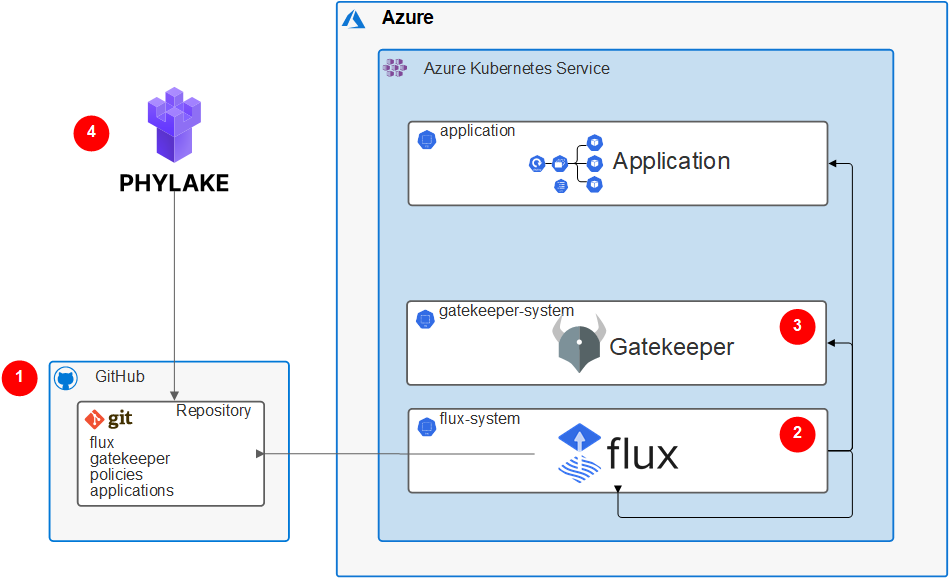
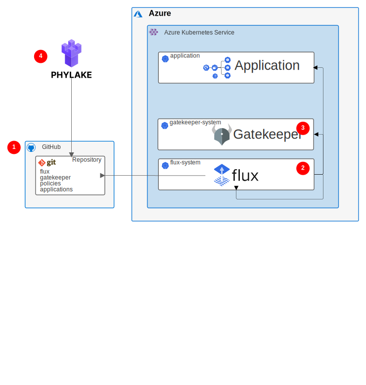

Enterprises that use Kubernetes to run their applications workloads must comply with many data privacy regulations, regulatory requirements, and security standards.

- Operations must follow the principle of least privilege access.
- Auditors must know who changed what and when on all production systems.
- Kubernetes clusters must be as secure as possible. Kubernetes isn't secure by default, and cluster operators are responsible for using its features to make it secure.

Kubernetes is built to describe everything from cluster state to application deployments declaratively with code. In GitOps, *Infrastructure as Code* describes the process of declaring the desired state of infrastructure components like virtual machines (VMs), networks, and firewalls as code. The code is version controlled and can be audited.

Combining Kubernetes with GitOps places the cluster desired state under version control. A component within the cluster continuously syncs the infrastructure code. Rather than having direct access to the Kubernetes cluster, most operations happen via code changes that can be reviewed and audited.

GitOps not only enforces policies within the cluster, but also helps support best practices by providing feedback to users before they make policy changes. Besides the convenience for DevOps, early feedback also helps businesses reduce costs.

This article describes a blueprint for GitOps using an Azure Kubernetes Services (AKS) cluster. The solution provides full audit capabilities, policy enforcement, and early feedback.

## Potential use cases

This blueprint benefits any organization that wants the advantages of deploying applications and infrastructure as code, including an audit trail of every change. The solution is especially suitable for regulated industries like insurance, banking, and finance.

## Architecture





This solution follows a strong GitOps approach. The single point of truth is the GitHub repository that holds the provisioned AKS cluster configurations. Flux is the GitOps operator that syncs any desired cluster state changes into AKS. Phylake provides security policies to OPA Gatekeeper, which enforces the policies.

1. All AKS application manifests and cluster infrastructure desired states are stored in the GitHub repository. Every change to the cluster happens under version control. GitHub functionality ensures that changes are reviewed, prevents unintended or unauthorized changes, and enforces desired quality checks.
   
1. Flux acts as the GitOps controller, and is the only component that can make changes within the cluster. Flux reads the desired change from GitHub, detects any configuration drift, and reconciles the state in the Kubernetes cluster. Flux manages Gatekeeper and the applications, and updates itself.
   
1. Phylake is a GitOps control kit that provides an overview of all AKS clusters to help manage policies. Phylake:
   
   - Assembles all cluster images in an overview that shows which versions are deployed and identifies outdated images.
   - Provides feedback on policy violations via pull request (PR) feedback before changes are applied.
   - Introduces risk acceptance whenever policies can't be applied for a good reason.
   
1. Open Policy Agent (OPA) Gatekeeper validates any desired changes to cluster configuration against provisioned policies, and only applies the changes if they comply with policies.

## Components

This solution uses the following components:

- [Azure Kubernetes Service (AKS)](https://azure.microsoft.com/services/Kubernetes-service/) is a highly available, secure, and fully managed Kubernetes service in Azure. In AKS, Azure manages the Kubernetes API server, and the cluster owners and operators can access and manage the Kubernetes nodes or node pools.

- [GitHub](https://github.com) is a code hosting platform for version control and collaboration. GitHub offers Git distributed version control and source code management functionality, plus other features.

- [Flux](https://fluxcd.io) is an open-source collection of tools for keeping Kubernetes clusters in sync with configuration sources like Git repositories. Flux automates configuration updates when there is new code to deploy.

- [Phylake](https://phylake.io) is a tool Syncier developed and made publicly available to help overcome GitOps security and compliance challenges. Phylake assembles all cluster images in an overview, provides feedback on policy violations before the changes are applied, and introduces risk acceptance when policies can't be applied. Phylake comes with a set of best practice policies grouped by well-known security standards, to help ensure that only trusted images run in the cluster.

- [OPA Gatekeeper](https://www.openpolicyagent.org/docs/latest/Kubernetes-introduction/) is a project that integrates the open-source OPA admission controller with Kubernetes. Kubernetes admission controllers enforce policies on objects during create, update, and delete operations, and are fundamental to Kubernetes policy enforcement.

### Alternatives

In this architecture, Flux is the GitOps operator that reconciles the desired state stored in the Git repository with the resources deployed in the AKS cluster. One alternative to Flux is the open-source [Argo CD project](https://argoproj.github.io/argo-cd/), a declarative, GitOps continuous delivery tool for Kubernetes. Both Argo CD and Flux are widely used, and are listed as Cloud Native Computing Foundation (CNCF) incubation projects.

## Considerations

The following considerations apply to this solution.

### Scalability

As cluster landscapes grow, the number of repositories constantly increases. Challenges include:
- Keeping an overview of all environments and clusters
- Tracking critical images
- Checking that certain policies are active in every cluster

### Security

This solution provides several security-related benefits. With the GitOps approach, individual developers or administrators don't directly access the Kubernetes clusters to apply changes or updates. Instead, users push changes to a Git repository, and the GitOps operator, Flux in this case, reads them and applies them to the cluster. This approach follows the security best practice of least privilege by not giving DevOps teams write permissions to the Kubernetes API. In diagnostic or troubleshooting scenarios, you can grant cluster permissions for a limited time on a case by case basis.

Apart from the task of setting up repository permissions, consider implementing the following requirements when setting up Git repositories that sync to AKS clusters:

- **Branch protection:** Protect the branches that represent the state of the Kubernetes clusters from having changes pushed to them directly. Require every change to be proposed by a pull request and reviewed by at least one other person. Also use PRs to do automatic checks. For example, Phylake validates Kubernetes manifests that a PR creates or modifies, and checks them against provisioned policies before the change can be synced into the cluster.

To make sure the AKS clusters are using security best practices, this solution enforces OPA Kubernetes policies with a validating admission webhook. Phylake provides a set of policies based on Kubernetes security standards, which you can provision on a cluster scope. Phylake provides early feedback via PR review for Kubernetes manifests that violate the policies.

- **Pull request review:** Require PRs to have at least one reviewer, to enforce the four-eyes principle. You can also use the GitHub [code owners](https://docs.github.com/en/github/creating-cloning-and-archiving-repositories/creating-a-repository-on-github/about-code-owners) feature to define individuals or teams responsible for reviewing specific files in a repository.

- **Immutable history:** Only allow new commits on top of existing changes. Immutable history is especially important for auditing purposes.

- **Further security measures:** You can require your GitHub users to activate two-factor-authentication. You can also allow only signed commits, which can't be altered after the fact.

### Operations

GitOps can increase DevOps productivity. One of the most useful features is the ability to quickly roll back changes that are behaving unexpectedly, just by performing Git operations. The commit graph still contains all commits, so it can help with the post-mortem analysis.

GitOps teams often manage multiple environments for the same application. It's typical to have several stages of an application deployed to different Kubernetes clusters or namespaces. You can easily see which versions of applications are currently deployed to a cluster by looking at the Git repository, which is the single source of truth. Tools like Phylake can extract this information from the repository and display it in a more user-friendly way. Phylake provides an overview that shows which container images and versions are deployed in which environment.

DevOps teams can use advanced Phylake features to get insights into who changed what and when in an application, or browse and filter based on factors like change type or resource kind. Phylake provides a control center to activate policies and compare compliance state over different clusters.

## Deploy this scenario

Perform the following steps to provision a running GitOps setup:

1. Create an AKS cluster by following the [quickstart guide](https://docs.microsoft.com/en-us/azure/aks/Kubernetes-walkthrough). Stop at **Run the application**, and don't deploy anything in the cluster yet.

1. Set up Flux by running the following code:
   
   ```bash
   set -eo pipefail
   
   export GITHUB_TOKEN="token"
   export GITHUB_USER="user"
   export GITHUB_REPO="cluster-flux"
   
   flux bootstrap github \
      --owner=$GITHUB_USER \
      --repository=$GITHUB_REPO \
      --branch=main \
      --path=./cluster \
      --personal
   
   git clone https://github.com/$GITHUB_USER/$GITHUB_REPO
   cd $GITHUB_REPO
   
   mkdir -p .phylake
   cat << EOF > .phylake/cluster.yaml
   apiVersion: phylake.io/v1alpha1
   kind: Cluster
   metadata:
      name: $GITHUB_REPO
   spec:
      policies:
         path: /policies
   EOF
   
   flux create kustomization policies \
      --source=flux-system \
      --path="./policies" \
      --prune=true \
      --validation=none \
      --interval=1m \
      --export > ./cluster/policies.yaml
   
   git add .
   git commit -m "Create Phylake cluster config and add policy Kustomization"
   git push
   
   kubectl apply -f https://raw.githubusercontent.com/open-policy-agent/gatekeeper/release-3.4/deploy/gatekeeper.yaml
   ```
   
1. Install Gatekeeper by using [this guide](https://open-policy-agent.github.io/gatekeeper/website/docs/install/#installation). To configure Gatekeeper correctly, see [Enforcing policies with OPA Gatekeeper](https://phylake.io/docs/reference/policies).
   
1. Install Phylake and Phylake CLI.
   
   - Install Phylake via the [GitHub marketplace](https://github.com/marketplace/phylake-io).
   
   - **phylake-cli** is Phylake's official command line tool. It brings clusters, policies, application instances, and other Phylake and Kubernetes concepts to the terminal. View installation instructions and CLI commands: [*https://github.com/syncier/phylake-cli*](https://github.com/syncier/phylake-cli)
   
You've now successfully provisioned a running GitOps setup. From here, you can:

- Add more clusters.
- Get an overview of the used images in your clusters by using Phylake.
- Provision policies with Phylake to comply with your security standards.

## Pricing

- Use the [Azure pricing calculator](https://azure.microsoft.com/pricing/calculator/) to estimate costs.

- AKS offers free cluster management. Billing is isolated to the compute, storage, and networking resources AKS uses to host nodes. Refer to [Azure Virtual Machine](https://azure.microsoft.com/pricing/details/virtual-machines/) or [Azure Container Instances](https://azure.microsoft.com/pricing/details/container-instances/) pricing to review specific pricing details for each compute service.

- GitHub offers a free service, but to use advanced security related features like code owners or required reviewers, you need the **Team** plan. See the [GitHub pricing page](https://github.com/pricing) for more details.

## Next steps

- [Guide To GitOps](https://www.weave.works/technologies/gitops/)
- [Open Policy Agent](https://www.openpolicyagent.org/)

## Related resources
- [Azure Kubernetes Service solution journey](/azure/architecture/reference-architectures/containers/aks-start-here)
- [Choose a Kubernetes at the edge compute option](/azure/architecture/operator-guides/aks/choose-kubernetes-edge-compute-option)
- [Secure DevOps for AKS](/azure/architecture/solution-ideas/articles/secure-devops-for-kubernetes)


