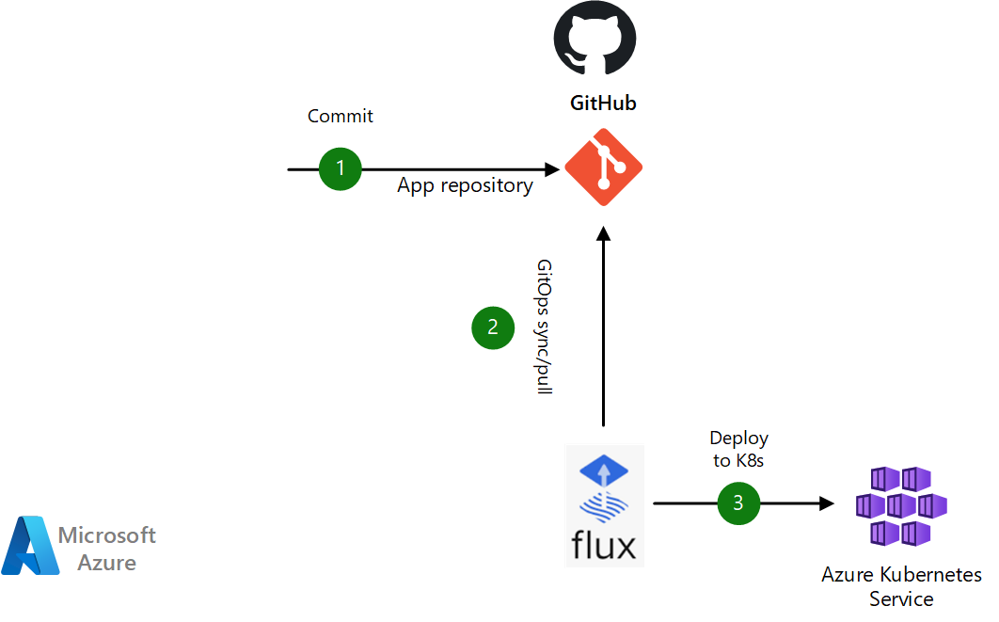
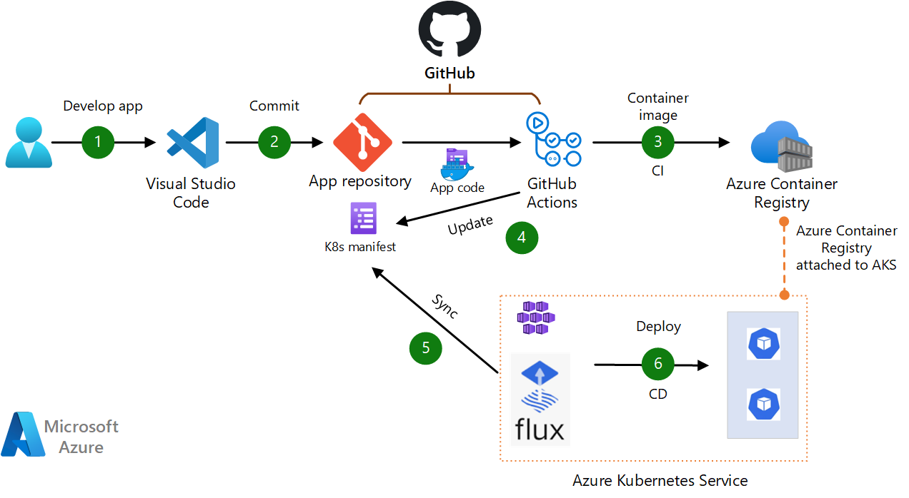
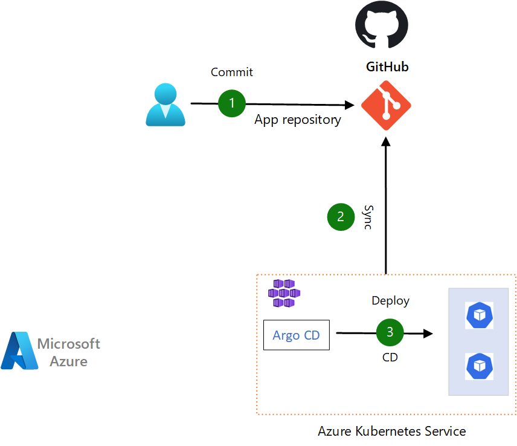
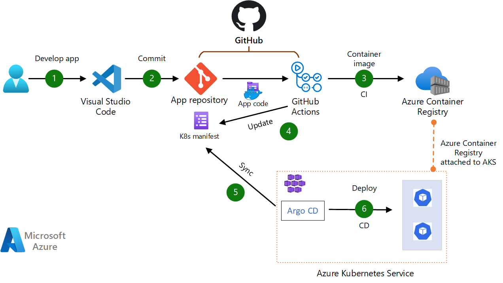
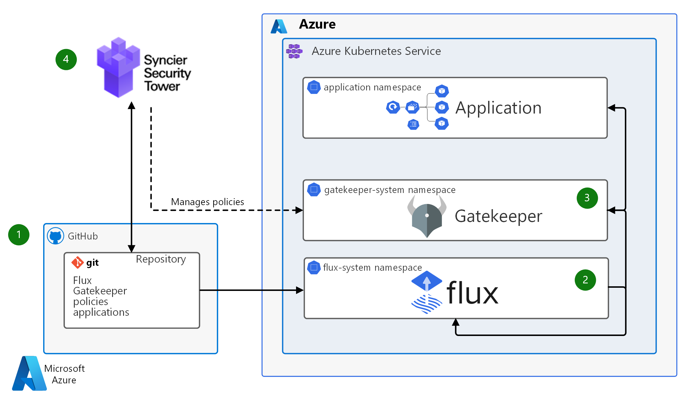

GitOps is a set of principles for operating and managing software systems using source control as the system's source-of-truth. Though GitOps can be applied to any software system, GitOps is extensively used in Kubernetes cluster management and application delivery. GitOps applies development practices like version control, collaboration, compliance, and continuous integration/continuous deployment (CI/CD) to infrastructure automation. 

This article describes some common options for using GitOps with an Azure Kubernetes Services (AKS) cluster. 

## Architecture

### Scenario 1: GitOps with Flux and AKS

In this scenario, Flux is the GitOps operator and controller. Flux pulls cluster desired state changes from GitHub, and syncs them into AKS.

### Dataflow 

1. Developer commits configuration changes to GitHub repository.
1. Flux detects configuration drift in the Git repository, and pulls the configuration changes.
1. Flux Reconciles the state in the Kubernetes cluster.

Flux is an  inside-out process, which is important for security. No cluster endpoints need to be exposed for Flux to detect, pull and reconcile configuration changes.

You can use Azure Policy to apply Flux v2 configurations (Microsoft.KubernetesConfiguration/fluxConfigurations resource type) at scale on AKS clusters. More details can be found [here](/azure/azure-arc/kubernetes/use-azure-policy-flux-2).

#### Alternatives

1. Flux can be used with other Git Repositories such as Azure DevOps, GitLabs, BitBucket etc. 
1. Instead of Git Repositories, [Flux Bucket API](https://fluxcd.io/flux/components/source/buckets/) defines a Source to produce an Artifact for objects from storage solutions like Amazon S3, Google Cloud Storage buckets, or any other solution with a S3 compatible API such as Minio, Alibaba Cloud OSS and others. 
1. Flux can also be configured against [Azure Blob Storage Container as a source to produce artifacts](/azure/azure-arc/kubernetes/conceptual-gitops-flux2).

### Scenario 2: Implementing CI/CD using GitOps with Flux, GitHub and AKS

This scenario covers a pull-based DevOps pipeline for a web application. This pipeline uses GitHub Actions for build. For deployment, it uses Flux as a GitOps operator to pull/sync the app. The data flows through the scenario as follows:

#### Dataflow

1. The app code is developed using an IDE such as Visual Studio Code.
1. The app code is committed to a GitHub repository.
1. GitHub Actions builds a container image from the app code and pushes the container image to Azure Container Registry.
1. GitHub Actions updates a Kubernetes manifest deployment file with the current image version based on the version number of the container image in the Azure Container Registry.
1. Flux operator syncs with, or pulls from, the Git repository.
1. Flux deploys the app to the AKS cluster using manifest files. (Flux can deploy to AKS using Kubernetes manifests / helm charts / Kustomization files).

### Scenario 3:  GitOps with Argo CD, GitHub repository and AKS

In this scenario, Kubernetes administrator(s) may make changes to kubernetes configuration objects (such as secrets / configmaps / etc.) and commit the changes directly to GitHub repository. 

#### Dataflow

The data flow for this scenario is as follows:

1. The Kubernetes administrator makes configuration changes in YAML files and commits the changes to the GitHub repository.
1. Argo CD syncs with, or pulls from, the Git repository.
1. Argo CD deploys the app to the AKS cluster.

#### Alternatives

The configuration source repository could be any Git compatible repository, including Azure DevOps.

Argo CD need not automatically sync the desired target state to the AKS cluster. Argo CD is implemented as a kubernetes controller which continuously monitors running applications and compares the current, live state in AKS cluster against the desired target state specified in the Git repo. Argo CD reports & visualizes the differences, while providing facilities to automatically or manually sync the live state back to the desired target state.

### Scenario 4:  Implementing CI/CD using GitOps with Argo CD, GitHub actions and AKS

This scenario covers a pull-based DevOps pipeline for a web application. This pipeline uses GitHub Actions for build. For deployment, it uses Argo CD as a GitOps operator to pull/sync the app. The data flows through the scenario as follows:

#### Dataflow

1. The app code is developed using an IDE such as Visual Studio code.
1. The app code is committed to a GitHub repository.
1. GitHub Actions builds a container image from the app code and pushes the container image to Azure Container Registry.
1. GitHub Actions updates a Kubernetes manifest deployment file with the current image version based on the version number of the container image in the Azure Container Registry.
1. Argo CD syncs with, or pulls from, the Git repository.
1. Argo CD deploys the app to the AKS cluster.

#### Alternatives

The configuration source repository could be any Git compatible repository, including Azure DevOps.

### Scenario 5: Enforcing policies using Sycier tower and GitOps operator. 

*Download a [Visio file](https://archcenter.blob.core.windows.net/cdn/gitops-blueprint-aks.vsdx) of this architecture.*

#### Dataflow

This solution follows a strong GitOps approach.

1. The single point of truth is the **GitHub repository** that holds the provisioned AKS cluster configurations. The repository stores all AKS application manifests and cluster infrastructure desired states. Every change to the cluster happens under version control. GitHub functionality:

   - Ensures review for changes.
   - Prevents unintended or unauthorized changes.
   - Enforces desired quality checks.

1. **Flux** is the GitOps operator and controller, and is the only component that can make changes to the cluster. Flux pulls cluster desired state changes from GitHub, and syncs them into AKS. Flux:

   - Pulls desired changes from GitHub.
   - Detects any configuration drift.
   - Reconciles the state in the Kubernetes cluster.
   - Manages Gatekeeper and the applications.
   - Updates itself.

1. **Open Policy Agent (OPA) Gatekeeper** enforces policies with a validating admission webhook. Gatekeeper validates cluster configuration changes against provisioned policies, and applies the changes only if they comply with policies.

1. **Syncier Security Tower** is a GitOps control kit that provides an overview of all AKS clusters and helps manage policies. Syncier Security Tower:

   - Assembles all cluster images in an overview that shows which versions are deployed and identifies outdated images.
   - Provides feedback on policy violations via pull request (PR) feedback before changes are applied.
   - Introduces risk acceptance whenever policies can't be applied for good reasons.
   - Provides security policies to OPA Gatekeeper.

### Components

The architecture scenarios shown previously use one or more of the following components:

1. [Azure Kubernetes Service (AKS)](/azure/aks) is a highly available, secure, and fully managed Kubernetes service in Azure. In AKS, Azure manages the Kubernetes API server, and cluster owners and operators access and manage the Kubernetes nodes and node pools.

1. [GitHub](https://github.com) is a code hosting platform for version control and collaboration. GitHub offers Git distributed version control, source code management, and other features.

1. [Azure DevOps](https://dev.azure.com) is a platform that provides devops services for teams to share code, track work, and ship software

1. [Flux](https://fluxcd.io/) is a GitOps tool that automates the deployment of applications on Kubernetes. Flux automates configuration updates when there is new code to deploy. Flux is provided as a native extension to Azure Kubernetes Service. 

1. [Argo CD](https://argo-cd.readthedocs.io/) is a declarative, GitOps continuous delivery tool for Kubernetes.

1. [OPA Gatekeeper](https://github.com/open-policy-agent/gatekeeper) is a project that integrates the open-source OPA admission controller with Kubernetes. Kubernetes admission controllers enforce policies on objects during create, update, and delete operations, and are fundamental to Kubernetes policy enforcement.

1. [Syncier Security Tower](https://securitytower.syncier.com/) is a tool that Syncier developed and makes publicly available to help overcome GitOps security and compliance challenges. To help ensure that only trusted images run in the cluster, Syncier Security Tower comes with a set of best-practice policies that are grouped by well-known security standards.

## Scenario details

According to [GitOps principles](https://opengitops.dev/), the desired state of a GitOps managed system must be:

1. **Declarative**: A system managed by GitOps must have its desired state expressed declaratively.
1. **Versioned and immutable**: Desired state is stored in a way that enforces immutability, versioning and retains a complete version history.
1. **Pulled automatically**: Software agents automatically pull the desired state declarations from the source.
1. **Continuously reconciled**:  Software agents continuously observe actual system state and attempt to apply the desired state.

In GitOps, [infrastructure as code (IaC)](https://wikipedia.org/wiki/Infrastructure_as_code) uses code to declare the desired state of infrastructure components such as virtual machines (VMs), networks, and firewalls. This code is version controlled and auditable.

Kubernetes describes everything from cluster state to application deployments declaratively with manifests. GitOps for Kubernetes places the cluster infrastructure desired state under version control. A component within the cluster continuously syncs the declarative state. Rather than having direct access to the cluster, most operations happen through code changes that can be reviewed and audited. This approach supports the security principle of least privilege access.

One of the principles of GitOps is to continuously reconcile the system state with the desired state, stored in your code repository. GitOps agents will monitor the cluster state and will attempt to reconcile the cluster state with desired state. Operations performed outside the cluster, such as manual creation of Kubernetes objects, can be reverted by the GitOps agents (such as [Admission Controllers](https://www.openpolicyagent.org/docs/latest/kubernetes-introduction/)) to ensure that the deployments are limited only through code changes in the source repository. 

Policy management / enforcement tools can be combined with GitOps to enforce policies and provide feedback for proposed policy changes. Notifications can be configured for various teams so that the teams are updated on the GitOps operation status; such as if a deployment is succeeded, or if a reconciliation failed.

### Potential use cases

This solution benefits any organization that wants the advantages of deploying applications and infrastructure as code, with an audit trail of every change.

GitOps provides consistency and standardization of the cluster state, and is useful to ensure strong security guarantees. GitOps can also be used to ensure consistent state across multiple clusters. For example, to apply the same configuration across primary and DR clusters, or across a farm of clusters. 

With GitOps, the developer is shielded from complexities of managing a container environment. Developers continue to work with familiar tools such as Git to manage updates and new features. Hence GitOps enhances developer productivity.

Two of the widely used GitOps operators are [Flux](https://fluxcd.io/) and [Argo CD](https://argo-cd.readthedocs.io/). Both are CNCF projects and can be used with Azure Kubernetes Service.

### Native GitOps extensions to Azure Kubernetes Service

Flux is provided as a native [cluster extension](/azure/aks/cluster-extensions) to Azure Kubernetes Service. Cluster extensions provides a platform for different solutions to be installed and managed on an AKS cluster. Flux can be enabled as an extension to Azure Kubernetes Service through Azure Portal, Azure CLI, through IaC scripts (such as Terraform or Bicep), or across multiple AKS clusters at scale using Azure Policy. 

### Other GitOps tools and add-ons. 

The scenarios described can be extended to other GitOps tools as well. Jenkins-x is another GitOps tool that provides instructions to [integrate to Azure](https://jenkins-x.io/v3/admin/platforms/azure/). Progressive delivery tools such as [Flagger](https://fluxcd.io/flagger/) can be used For gradual shifting of production workloads deployed through GitOps.

## Considerations

The following considerations apply to this solution.

### Scalability

GitOps has many benefits, but as cluster landscapes grow, so does the number of repositories. The solution described in scenario 5 (with Syncier tower) helps meet challenges like:
* Keeping an overview of all environments and clusters.
* Tracking critical images.
* Checking that certain policies are active in every cluster.

### Security

With the GitOps approach, individual developers or administrators don't directly access the Kubernetes clusters to apply changes or updates. Instead, users push changes to a Git repository, and the GitOps operator (Flux or Argo CD) reads them and applies them to the cluster. This approach follows the security best practice of least privilege by not giving DevOps teams write permissions to the Kubernetes API. In diagnostic or troubleshooting scenarios, you can grant cluster permissions for a limited time on a case-by-case basis.

Apart from the task of setting up repository permissions, consider implementing the following security measures in Git repositories that sync to AKS clusters:

* Branch protection: Protect the branches that represent the state of the Kubernetes clusters from having changes pushed to them directly. Require every change to be proposed by a PR that is reviewed by at least one other person. Also use PRs to do automatic checks. 
* PR review: Require PRs to have at least one reviewer, to enforce the four-eyes principle. You can also use the GitHub code owners feature to define individuals or teams that are responsible for reviewing specific files in a repository.
* Immutable history: Only allow new commits on top of existing changes. Immutable history is especially important for auditing purposes.
* Further security measures: Require your GitHub users to activate two-factor authentication. Also, allow only signed commits, which can't be altered after the fact.

### Operations

GitOps can increase DevOps productivity. One of the most useful features is the ability to quickly roll back changes that are behaving unexpectedly, just by performing Git operations. The commit graph still contains all commits, so it can help with the post-mortem analysis.

GitOps teams often manage multiple environments for the same application. It's typical to have several stages of an application deployed to different Kubernetes clusters or namespaces. The Git repository, which is the single source of truth, shows which versions of applications are currently deployed to a cluster.

Optionally, you can use Syncier Security Tower to simplify cluster operations. Syncier Security Tower can extract the application versions deployed to multiple clusters from the repository and displays it in a user-friendly way. An overview shows which container images and versions are deployed in each environment. DevOps teams can use advanced Syncier Security Tower features to get insights into who changed what and when in an application, or browse and filter based on factors like change type or resource kind. Syncier Security Tower provides a control center to activate policies and compare compliance state over different clusters.

## Deploy this scenario

The following tutorials provide steps for deploying applications to AKS using GitOps with Flux v2, and to implement CI/CD with GitOps and Flux v2 to AKS. 

* [Tutorial: Deploy applications using GitOps with Flux v2](/azure/azure-arc/kubernetes/tutorial-use-gitops-flux2?tabs=azure-cli)
* [Tutorial: Implement CI/CD with GitOps (Flux v2)](/azure/azure-arc/kubernetes/tutorial-gitops-flux2-ci-cd)

## Pricing
Use the [Azure pricing calculator](https://azure.microsoft.com/en-us/pricing/calculator) to estimate costs.

- AKS offers free cluster management. Costs are limited to the compute, storage, and networking resources AKS uses to host nodes. 

- GitHub offers a free service, but to use advanced security-related features like code owners or required reviewers, you need the Team plan. For more information, see the [GitHub pricing](https://github.com/pricing) page.

- Azure DevOps offers a free tier for certain scenarios. Use Azure pricing calculator to estimate Azure Devops costs. 

## Contributors
This article is maintained by Microsoft. It was originally written by the following contributors.

Principal authors:

- [Francis Simy Nazareth](https://www.linkedin.com/in/francis-simy-nazereth-971440a/) | Principal Cloud Solutions Architect

## Next Steps 

- [Build and deploy apps on AKS using DevOps and GitOps](/azure/architecture/example-scenario/apps/devops-with-aks)
- [Argo CD documentation](https://argo-cd.readthedocs.io/)
- [Flux CD documentation](https://fluxcd.io/)
- [GitOps with JenkinsX](https://jenkins-x.io/v3/devops/gitops/)
