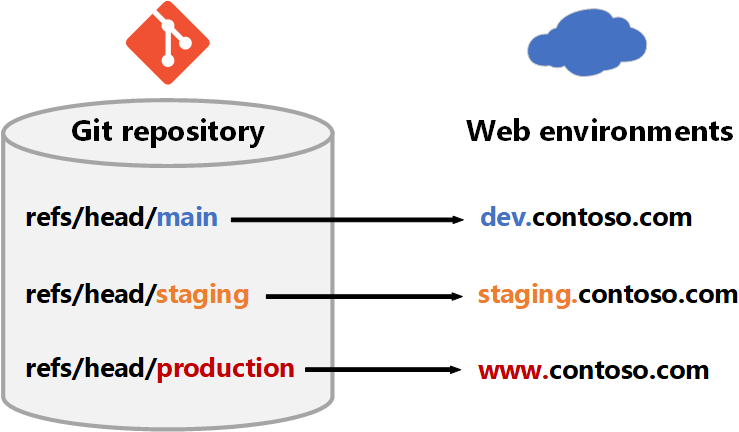
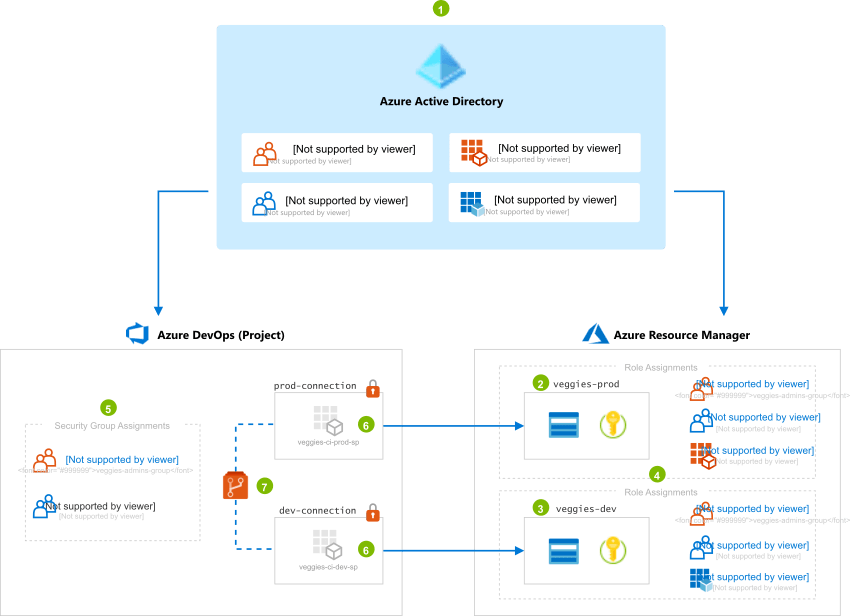
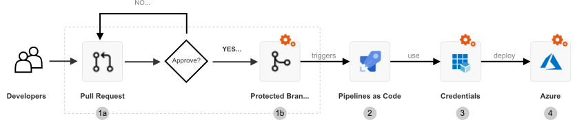

When developing a governance model for your organization, it's important to remember that [Azure Resource Manager](/azure/azure-resource-manager/management/overview) is only one way to manage resources. Azure DevOps and continuous integration and continuous delivery (CI/CD) automation can be an unintentional security back-door if not properly secured. These resources should be protected by mirroring the role-based access control (RBAC) model used for Resource Manager.

The concept of end-to-end governance is vendor agnostic. The implementation described here uses [Azure DevOps](https://azure.microsoft.com/services/devops), but alternatives are also briefly mentioned.

## Potential use cases

This reference implementation and demo is open source and intended to be used as a teaching tool for organizations who are new to DevOps and need to create a governance model for deploying to Azure. Please read this scenario carefully to understand the decisions behind the model used in this sample repository.

Any governance model must be tied to the organization's business rules, which are reflected in any technical implementation of access controls. This example model uses a fictitious company with the following common scenario (with business requirements):

- **Azure Active Directory (AD) groups that align with business domains and permissions models**  
 The organization has many vertical business domains, such as "fruits" and "vegetables," which operate largely independently. In each business domain, there are two levels or privileges, which are mapped to distinct `*-admins` or `*-devs` Azure AD groups. This allows developers to be targeted when configuring permissions in the cloud.

- **Deployment environments**  
 Every team has two environments:
  - Production. Only admins have elevated privileges.
  - Non-production. All developers have elevated privileges (to encourage experimentation and innovation).

- **Automation goals**  
 Every application should implement Azure DevOps not just for continuous integration (CI), but also for continuous deployment (CD). For example, deployments can be automatically triggered by changes to the Git repository.

- **Cloud journey so far**  
 The organization started with an isolated project model to accelerate the journey to the cloud. But now they are exploring options to break silos and encourage collaboration by creating the "collaboration" and "supermarket" projects.

This simplified diagram shows how branches in a Git repository map to development, staging, and production environments:

  
*Download an [SVG of this diagram](media/e2e-governance-repos.svg).*

## Architecture

This diagram shows how linking from Resource Manager and CI/CD to Azure Active Directory (Azure AD) is the key to having an end-to-end governance model.

[](media/e2e-governance-overview-inline.png#lightbox)  
*Download an [SVG of this architecture](media/e2e-governance-overview.svg).*

> [!NOTE]
> To make the concept easier to understand, the diagram only illustrates the **"veggies"** domain. The "fruits" domain would look similar and use the same naming conventions.

### Workflow

The numbering reflects the order in which IT administrators and enterprise architects think about and configure their cloud resources.

1. **Azure Active Directory**

    We integrate Azure DevOps with [Azure AD](https://azure.microsoft.com/services/active-directory) in order to have a single plane for identity. This means a developer uses the same Azure AD account for both Azure DevOps and Resource Manager. Users are not added individually. Instead, membership is assigned by Azure AD groups so that we can remove a developer's access to resources in a single step&#8212;by removing their Azure AD group memberships. For **each domain**, we create:

    - Azure AD groups. Two groups per domain (described further in step 4 and 5 later in this article).
    - Service principals. One explicit service principal **per environment**.

2. **Production environment**

    To simplify deployment, this reference implementation uses a resource group to represent the production environment. In practice, you should use a [different subscription](/azure/cloud-adoption-framework/govern/guides/standard).

    Privileged access to this environment is limited to administrators only.

3. **Development environment**

    To simplify deployment, this reference implementation uses a resource group to represent the development environment. In practice, you should use a [different subscription](/azure/cloud-adoption-framework/govern/guides/standard).

4. **Role assignments in Resource Manager**  

    Although our Azure AD group names imply a role, access controls are not applied until a [role assignment](/azure/role-based-access-control/overview#role-assignments) is configured. This assigns a role to an Azure AD principal for a specific scope. For example, developers have the Contributor role on the production environment.

    | Azure AD principal | Dev environment (Resource Manager) | Production environment (Resource Manager) |
    |:--|:--|:--|
    | `veggies-devs-group` |  *Owner* | Reader |
    | `veggies-admins-group` | Owner | Owner |
    | `veggies-ci-dev-sp` | *Custom Role \** | &#8211; |
    | `veggies-ci-prod-sp` | &#8211; | *Custom Role \** |

    \* To simplify deployment, this reference implementation assigns the `Owner` role to the service principals. However, in production you should create a *custom role* that prevents a service principal from removing any [management locks](/azure/azure-resource-manager/management/lock-resources) that you've placed on your resources. This helps protect resources from accidental damage, such as database deletion.

    To understand the reasoning behind the individual role assignments, see the [considerations section](#considerations) later in this article.

5. **Security group assignments in Azure DevOps**

    Security groups function like roles in Resource Manager. Take advantage of built-in roles and default to [Contributor](/azure/devops/user-guide/roles#contributor-roles) for developers. Admins get assigned to the [Project Administrator](/azure/devops/user-guide/roles#project-administrators) security group for elevated permissions, allowing them to configure security permissions.

    Note that Azure DevOps and Resource Manager have **different** permissions models:

    - Azure Resource Manager uses an [additive permissions](/azure/role-based-access-control/overview#multiple-role-assignments) model.
    - Azure DevOps uses a [least permissions](/azure/devops/organizations/security/about-permissions?tabs=preview-page) model.

    For this reason, membership to the `-admins` and `-devs` groups must be mutually exclusive. Otherwise, the affected persons would have less access than expected in Azure DevOps.

    | Group name | Resource Manager role | Azure DevOps role |
    |:--|:--|:--|
    | `fruits-all` | &#8211; | &#8211; |
    | `fruits-devs` | Contributor | Contributor |
    | `fruits-admins` | Owner | Project Administrators |
    | `veggies-all` | &#8211; | &#8211; |
    | `veggies-devs` | Contributor | Contributor |
    | `veggies-admins` | Owner | Project Administrators |
    | `infra-all` | &#8211; | &#8211; |
    | `infra-devs` | Contributor | Contributor |
    | `infra-admins` | Owner | Project Administrators |

    In a scenario of limited collaboration, such as the fruits team inviting the veggies team to collaborate on a **single** repository, they would use the `veggies-all` group.

    To understand the reasoning behind the individual role assignments, refer to the [considerations section](#considerations) later in this article.

6. **Service connections**

    In Azure DevOps, a [Service Connection](/azure/devops/pipelines/library/service-endpoints?tabs=yaml) is a generic wrapper around a credential. We create a service connection that holds the service principal client ID and client secret. Project Administrators can configure access to this [protected resource](/azure/devops/pipelines/security/resources#protected-resources) when needed, such as when requiring human approval before deploying. This reference architecture has two minimum protections on the service connection:

    - Admins must configure [pipeline permissions](/azure/devops/pipelines/security/resources#pipeline-permissions) to control which pipelines can access the credentials.
    - Admins must also configure a [branch control check](/azure/devops/pipelines/process/approvals?tabs=check-pass#branch-control) so that only pipelines running in the context of the `production` branch might use the `prod-connection`.

7. **Git repositories**  

    Because our service connections are tied to branches via [branch controls](/azure/devops/pipelines/process/approvals?tabs=check-pass#branch-control), it's critical to configure permissions to the Git repositories and apply [branch policies](/azure/devops/repos/git/branch-policies). In addition to requiring CI builds to pass, we also require pull requests to have at least two approvers.

### Components

- [Azure DevOps](https://azure.microsoft.com/solutions/devops)
- [Azure Active Directory](https://azure.microsoft.com/services/active-directory)
- [Azure Resource Manager](https://azure.microsoft.com/features/resource-manager)
- [Azure Repos](https://azure.microsoft.com/services/devops/repos)
- [Azure Pipelines](https://azure.microsoft.com/services/devops/pipelines)

### Alternatives

The concept of end-to-end governance is vendor agnostic. While this article focuses on Azure DevOps, [Azure DevOps Server](https://azure.microsoft.com/services/devops/server) could be used as an on-premises substitute. Alternatively, you could also use a set of technologies for an open-source CI/CD development pipeline using options like [Jenkins](/azure/jenkins) and [GitLab](https://docs.gitlab.com/ee/install/azure).

Both Azure Repos and GitHub are platforms that are built to use the open-source Git version control system. While their feature sets are somewhat different, both can be integrated into global governance models for CI/CD. GitLab is another Git-based platform that provides robust CI/CD capabilities.

This scenario uses Terraform as its infrastructure as code (IaC) tool. Alternatives include Jenkins, [Ansible](/azure/developer/ansible), and [Chef](/azure/chef).

## Considerations

To achieve end-to-end governance in Azure, it's important to understand the security and permissions profile of the path from developer's computer to production. The following diagram illustrates a baseline CI/CD workflow with Azure DevOps. The red lock icon :::image type="icon" source="media/e2e-governance-devsecops-gear.svg"::: indicates security permissions that must be configured by the user. Not configuring or misconfiguring permissions will leave your workloads vulnerable.

[](media/e2e-governance-devsecops-workflow-lrg.png#lightbox)  
*Download an [SVG of this workflow](media/e2e-governance-devsecops-workflow.svg).*

To successfully secure your workloads, you must use a combination of security permission configurations and human checks in your workflow. It's important that any RBAC model must also extend to both pipelines and code. These often run with privileged identities and will destroy your workloads if instructed to do so. To prevent this from happening, you should configure [branch policies](/azure/devops/repos/git/branch-policies) on your repository to require human approval before accepting changes that trigger automation pipelines.

| Deployment stages | Responsibility | Description |
|:--|:--|:--|
| **Pull requests** | User | Engineers should peer review their work, including the Pipeline code itself. |
| **Branch protection** | [Shared](/azure/security/fundamentals/shared-responsibility) | Configure [Azure DevOps](/azure/devops/repos/git/branch-policies) to reject changes that do not meet certain standards, such as CI checks and peer reviews (via pull requests). |
| **Pipeline as code** | User | A build server will delete your entire production environment if the pipeline code instructs it to do so. Help prevent this by using a combination of pull requests and branch protection rules, such as human approval. |
| **[Service connections](/azure/devops/pipelines/library/service-endpoints?tabs=yaml)** | [Shared](/azure/security/fundamentals/shared-responsibility) | Configure Azure DevOps to restrict access to these credentials. |
| **Azure Resources** | [Shared](/azure/security/fundamentals/shared-responsibility) | Configure RBAC in Resource Manager. |

The following concepts and questions are important to consider when designing a governance model. Bear in mind the [potential use cases](#potential-use-cases) of this example organization.

### 1. Safeguard your environments with branch policies

Because your source code defines and triggers deployments, your first line of defense is to secure your source code management (SCM) repository. In practice, this is achieved by using the [Pull Request workflow](/azure/devops/repos/git/about-pull-requests) in combination with [branch policies](/azure/devops/repos/git/branch-policies), which define checks and requirements before code can be accepted.

When planning your end-to-end governance model, privileged users (`veggies-admins`) will be responsible for configuring branch protection. Common branch protection checks used to secure your deployments include:

- **Require CI build to pass.** Useful for establishing baseline code quality, such as code linting, unit tests, and even security checks like virus and credential scans.

- **Require peer review** Have another human double check that code works as intended. Be extra careful when changes are made to pipeline code. Combine with CI builds to make peer reviews less tedious.

#### What happens if a developer tries to push directly to production?

Remember that Git is a distributed SCM system. A developer can commit directly to their local `production` branch. But when Git is properly configured, such a push will be automatically rejected by the Git server. For example:

```powershell
remote: Resolving deltas: 100% (3/3), completed with 3 local objects.
remote: error: GH006: Protected branch update failed for refs/heads/main.
remote: error: Required status check "continuous-integration" is expected.
To https://github.com/Azure/devops-governance
 ! [remote rejected] main -> main (protected branch hook declined)
error: failed to push some refs to 'https://github.com/Azure/devops-governance'
```

Note that the workflow in the example is vendor agnostic. The pull request and branch protection features are available from multiple SCM providers, including [Azure Repos](https://azure.microsoft.com/services/devops/repos), [GitHub](https://github.com), and [GitLab](https://gitlab.com).

Once the code has been accepted into a protected branch, the next layer of access controls will be applied by the build server (such as [Azure Pipelines](https://azure.microsoft.com/services/devops/pipelines)).

### 2. What access do security principals need?

In Azure, a [security principal](/azure/role-based-access-control/overview#security-principal) can be either a *user principal* or a *headless principal*, such as a service principal or managed identity. In all environments, security principals should follow the [principle of least privilege](/azure/role-based-access-control/best-practices#only-grant-the-access-users-need). While security principals might have expanded access in pre-production environments, production Azure environments should minimize standing permissions, favoring just-in-time (JIT) access and Azure AD conditional access. Craft your Azure RBAC role assignments for user principals to align with these least privilege principals.

It's also important to model Azure RBAC distinctly from Azure DevOps RBAC. The purpose of the pipeline is to minimize direct access to Azure. Except for special cases like innovation, learning, and issue resolution, most interactions with Azure should be conducted through purpose-built and gated pipelines.

For Azure Pipeline service principals, consider using a [custom role](/azure/role-based-access-control/custom-roles) that prevents it from removing resource locks and performing other destructive actions out of scope for its purpose.

### 3. Create a custom role for the service principal used to access production

It's a common mistake to give CI/CD build agents Owner roles and permissions. Contributor permissions are not enough if your pipeline also needs to perform identity role assignments or other privileged operations like Key Vault policy management.

But a CI/CD Build Agent will delete your entire production environment if told to do so. To avoid **irreversible destructive changes**, we create a custom role that:

- Removes Key Vault access policies
- Removes [management locks](/azure/azure-resource-manager/management/lock-resources) that by design should prevent resources from being deleted (a common requirement in regulated industries)

To do this, we create a custom role and remove the `Microsoft.Authorization/*/Delete` actions.

```json
{
  "Name": "Headless Owner",
  "Description": "Can manage infrastructure.",
  "actions": [
    "*"
  ],
  "notActions": [
    "Microsoft.Authorization/*/Delete"
  ],
  "AssignableScopes": [
    "/subscriptions/{subscriptionId1}",
    "/subscriptions/{subscriptionId2}",
    "/providers/Microsoft.Management/managementGroups/{groupId1}"
  ]
}
```

If that removes too many permissions for your purposes, refer to the full list in the [official documentation for Azure resource provider operations](/azure/role-based-access-control/resource-provider-operations#management--governance) and adjust your role definition as needed.

## Deploy this scenario

This scenario extends beyond Resource Manager. This is why we use [Terraform](https://terraform.io), which allows us to also create principals in Azure AD and bootstrap Azure DevOps using a single infrastructure as code tool.

For source code and detailed instructions, visit the GitHub repository [Governance on Azure Demo - from DevOps to ARM](https://github.com/azure/devops-governance).

## Pricing

Azure DevOps costs depend on the number of users in your organization that require access, along with other factors like the number of concurrent build/releases required and number of users. Azure Repos and Azure Pipelines are features of the Azure DevOps service. For more information, see [Azure DevOps pricing](https://azure.microsoft.com/pricing/details/devops/azure-devops-services).

In Azure Active Directory, the type of group access management needed for this scenario is provided in the Premium P1 and Premium P2 editions. Pricing for these tiers is calculated on a per-user basis. For more information, see [Azure Active Directory pricing](https://azure.microsoft.com/pricing/details/active-directory).

## Contributors

*This article is maintained by Microsoft. It was originally written by the following contributors.*

Principal author:

- [Julie Ng](https://de.linkedin.com/in/julie-io) | Senior Service Engineer

## Next steps

- Visit the code repository for this scenario at [Governance on Azure Demo - from DevOps to ARM](https://github.com/azure/devops-governance).
- Review the Cloud Adoption Framework's [Cloud governance guides](/azure/cloud-adoption-framework/govern/guides).
- [What is Azure role-based access control (Azure RBAC)?](/azure/role-based-access-control/overview)
- [Cloud Adoption Framework: Resource access management in Azure](/azure/cloud-adoption-framework/govern/resource-consistency/resource-access-management)
- [Azure Resource Manager roles](/azure/role-based-access-control/built-in-roles)
  - [Owner (built-in)](/azure/role-based-access-control/built-in-roles#owner)
  - [Contributor (built-in)](/azure/role-based-access-control/built-in-roles#contributor)
  - [Reader (built-in)](/azure/role-based-access-control/built-in-roles#reader)
  - [Custom Role](/azure/role-based-access-control/custom-roles)
- [Azure DevOps security groups](/azure/devops/organizations/security/permissions?tabs=preview-page#groups)
  - [Project Administrators](/azure/devops/user-guide/roles#project-administrators)
  - [Contributor](/azure/devops/user-guide/roles#contributor-roles)
  - [Reader](/azure/role-based-access-control/built-in-roles#reader)

## Related resources

- [Design a CI/CD pipeline using Azure DevOps](../apps/devops-dotnet-baseline.yml)
- [Computer forensics Chain of Custody in Azure](../forensics/index.yml)
- [Azure Arc hybrid management and deployment for Kubernetes clusters](../../hybrid/arc-hybrid-kubernetes.yml)
- [Azure Automation in a hybrid environment](../../hybrid/azure-automation-hybrid.yml)
- [Azure Automation Update Management](../../hybrid/azure-update-mgmt.yml)
- [Browse Azure Architectures - CI/CD](../../browse/index.yml?terms=ci%2fcd)
