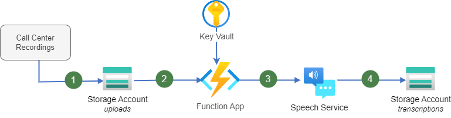
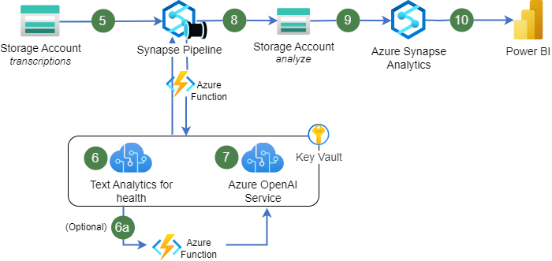

In recent years, many healthcare companies have moved to the cloud, opting to provide online services via Telehealth solutions. This has led to a increase in the amount of healthcare-centric audio data available to companies providing those services. While manual analysis of this data can yield useful insights (e.g., treatments prescribed), the scale of this data makes this a time-consuming task. To ameliorate this problem, it is possible to automate the analysis of this sensitive, healthcare data using Azure. Specifically, the architecture we have proposed enables the automated transcription of audio data, healthcare-specific analysis of that data (including medical terminology linkage), and serving of that data to end-users.

## Architecture

The architecture consists of two pipelines:

* A transcription pipeline to convert audio to text.
* An analysis and visualization pipeline to enrich and analyze the transcripted text.

### Transcription pipeline

### Dataflow

1. Audio files are uploaded to an Azure Storage account via any supported method. You can use a UI-based tool like Azure Storage Explorer or use a storage SDK or API.
2. The upload to Azure Storage triggers an Azure logic app. The logic app accesses any necessary credentials in Azure Key Vault and makes a request to the Speech service's batch transcription API.
3. The logic app submits the audio files call to the Speech service, including optional settings for speaker diarization.
4. The Speech service completes the batch transcription and loads the transcription results to the Storage account.

### Analysis and visualization pipeline for healthcare analysis

### Dataflow

5. An Azure Synapse Analytics pipeline runs to retrieve and process the transcribed audio text.
6. The pipeline sends processed text via an API call to Text Analytics for Health using an Azure Function. The service provides healthcare-centric analysis of the text extracting not only entities (e.g., medications, diagnoses) but also related metadata (e.g. SNOWMED code, ICD-10 code) as well as any identified relationships among those entities.  
<i>6a. (Optional)</i> Depending on the type of data & analysis needed, some of the content extracted by the Text Analytics for Health service can be passed as context information to the Open AI service. This can be done using an Azure Function and allows for the generation of text summaries with specific content.
7. The Synapse Pipeline also calls the Azure OpenAI API (via an Azure Function) to use GPT to generate a human readable summary of the call content. If the call content also needs to be used for machine learning (ML), we can also use GPT to extract a ML-friendly representation of the data using the <i>embeddings</i> API.
8. The processed data is stored in an Azure Storage account.
9. Data is analyzed at scale with Azure Synapse Analytics.
10. The resulting content is served to visualization tools (e.g., Power BI) using a serving layer (e.g., SQL Dedicated Pools).
	
## Components
Key technologies used to implement this architecture:

* **[Azure Blob/Data Lake Storage](https://learn.microsoft.com/azure/storage/blobs/data-lake-storage-introduction)**: Massively scalable cloud-native object storage. Azure Blob/Data Lake Storage enables the cost-effective storage and high-performance serving of data for use in analytics, machine learning, and more.
* **[Azure Functions](https://learn.microsoft.com/azure/azure-functions/functions-overview)**: Azure Functions is an Azure-native serverless solution capable of hosting lightweight code used in analytics pipelines and supports a variety of languages including but not limited to .NET, Java, and Python. Using lightweight virtualization technology, Azure Functions can quickly scale out to support a large number of concurrent requests while maintaining enterprise-grade SLAs.
* **[Azure Key Vault](https://learn.microsoft.com/azure/key-vault/general/basic-concepts)**: Azure Key Vault is a highly scalable secret store capable of securely storing client keys and secrets. Azure Key Vault also provides fine-grained, Azure Active Directory-based authorization and authentication to control access to those keys while supporting native integrations to many Azure services (e.g., Azure Data Factory, Azure SQL DB).
* **[Azure Speech Service](https://learn.microsoft.com/azure/cognitive-services/speech-service/overview)**: The Azure Cognitive Service for Language provides cloud-native, speech processing capabilities via pre-trained and customizable models. Specifically, the Azure Cognitive Service for Language provides speech-to-text, text-to-speech, and translation capabilities.
* **[Azure Text Analytics for Health](https://learn.microsoft.com/azure/cognitive-services/language-service/text-analytics-for-health/overview?tabs=ner)**: Text Analytics for Health is the Azure-native healthcare understanding service. Using Text Analytics for Health users can extract medical entities, medical entity metadata (e.g., SNOWMED code), and medical entity relationships from complex, medical natural language (e.g., medical notes).
* **[Azure OpenAI](https://learn.microsoft.com/azure/cognitive-services/openai/overview)**: Azure OpenAI is a cloud-based service that provides advanced language AI with OpenAI GPT-3, Codex, and DALL-E models with the security and enterprise promise of Azure. Azure OpenAI co-develops the APIs with OpenAI, ensuring compatibility and a smooth transition from one to the other. With Azure OpenAI, customers get the security capabilities of Microsoft Azure while running the same models as OpenAI. Azure OpenAI offers private networking, regional availability, and responsible AI content filtering. The completions endpoint is the core component of the API service. This API provides access to the model's text-in, text-out interface. Users simply need to provide an input prompt containing the English text command, and the model will generate a text completion.
* **[Azure Synapse Analytics](https://learn.microsoft.com/azure/synapse-analytics/overview-what-is)**: Azure Synapse Analytics is a one-stop-shop for analytics on Azure, providing data ingestion, orchestration, processing, and serving capabilities at scale.
* **[Power BI](https://learn.microsoft.com/power-bi/developer/)**: Power BI is a best-in-class business dashboarding and visualization tool with integrated semantic modeling capabilities.

## Scenario Details

In this scenario, based on a real customer use case, users first upload their audio data to an Azure Storage account for analysis. An automated trigger kicks of an Azure Function to transcribe the data using the Azure Speech Service as well as keys stored securely in Azure Key Vault. Once the data has been transcribed, an Azure Synapse Analytics Pipeline-based analysis pipeline uses Text Analytics for Health as well as Azure Open AI to extract key health information (e.g., diagnosis, patient medications) and summarize the overall content. Finally, this data is aggregated and transformed as needed for end-user consumption via PowerBI dashboards using Azure Synapse Analytics.

The above scenario makes several assumptions. As this is highly sensitive data, we assume all storage accounts and services have been securely deployed following widely available best practices for working with sensitive data in the cloud (e.g., all data at rest is encrypted, account keys are securely stored). We also assume appropriate security-centric personnel have been consulted for enterprise-centric security best practices. 

## Alternatives

* [Azure Logic Apps](https://learn.microsoft.com/azure/logic-apps/logic-apps-overview) can be used instead of Azure Functions. This can be used in scenario, where customers would like to schedule the a job and process recordings in a batch instead of processing each recording as they are received.
* [Azure Databricks](https://learn.microsoft.com/azure/databricks/introduction/) can be used instead of Synapse Analytics for the analysis.
* [Azure Data Factory](https://learn.microsoft.com/azure/data-factory/introduction) can be used instead of Synapse Pipeline.
* Azure Data Factory or Synapse pipeline can also be used instead of a trigger-based approach to process as a scheduled batch.
* If EHR (or other data) is needed as part of the analysis (e.g., FHIR data stored in the [Azure API for FHIR](https://learn.microsoft.com/azure/healthcare-apis/azure-api-for-fhir/overview)), that data can be ingested/extracted into the Azure Storage account/container located between steps 8 & 9 in the Dataflow diagram where it can then be used as part of the analysis. 
* Machine learning methods can be applied to the data as part of the analysis at Step 9 in the Dataflow diagram directly using Synapse Analytics or through the use of an external service (e.g., [Azure Machine Learning](https://learn.microsoft.com/azure/machine-learning/overview-what-is-azure-machine-learning?view=azureml-api-2)).

## Potential Use cases

* Smart analysis of telehealth data: This pattern can be used to extract insights from the audio collected from remote/telehealth use cases where patients are interacting with providers remotely to discuss results.
* Smart analysis of healthcare-centric call center data: This pattern can be used to analyze call center data from healthcare providers providing at-home or remote care to patients to extract valuable information (e.g., adverse events) that are resulting from the products each customer is calling about
* Smart analysis of clinical trials data: This pattern can be used to collect valuable insights from external touchpoints that may occur during clinical trials, automatically extracting and correlating medical terminology to desired insights for large-scale analysis.

## Considerations

These considerations implement the pillars of the Azure Well-Architected Framework, which is a set of guiding tenets that can be used to improve the quality of a workload. For more information, see [Microsoft Azure Well-Architected Framework](/azure/architecture/framework).

### Cost optimization

Cost optimization is about looking at ways to reduce unnecessary expenses and improve operational efficiencies. For more information, see [Overview of the cost optimization pillar](/azure/architecture/framework/cost/overview).

This solution can be optimized for cost in several ways. First, while developing analytics or adding new analytic results to the content, pipelines should run the Speech-to-Text transcription of the audio files only once. The stored content can then be processed by other services as part of other pipelines. Second, insights extracted from Text Analytics for Health should only be run once with the results being stored and re-used for development. This will enable OpenAI prompt engineering to be done quickly and cost effectively. Finally, we recommend using ephemeral compute resources (e.g., ephemeral Spark clusters) for analytics as these types of batch-based workloads are typically run periodically. Shutting down the cluster in between runs can significantly reduce the overall cost of the solution.

### Security

Security provides assurances against deliberate attacks and the abuse of your valuable data and systems. For more information, see [Overview of the security pillar](/azure/architecture/framework/security/overview).
As this type of customer call data is highly sensitive, security controls should be enabled throughout the solution to ensure sensitive data remains secure. Similarly, we have included Azure Key Vault in the solution as a scalable service to enable end-users to securely store keys/secrets needed for the solution. Lastly, as this service uses OpenAI to extract insights from the unstructured data, case should be taken to ensure the overall insights derived follow Microsoft’s Responsible AI principles. 

For more information on Responsible AI, please visit https://www.microsoft.com/ai/responsible-ai?activetab=pivot1%3aprimaryr6

### Reliability

Reliability ensures your application can meet the commitments you make to your customers. For more information, see [Overview of the reliability pillar](/azure/architecture/framework/resiliency/overview).
Reliability ensures your application can meet the commitments you make to your customers. For more information, see [Overview of the reliability pillar](https://learn.microsoft.com/azure/well-architected/resiliency/overview).

Here are some considerations if your scenario requires high-avaialbility and disaster recovery: 
* [At least 99.9% of the time client operations executed on a Azure Synapse Analytics will succeed.](https://www.microsoft.com/licensing/docs/view/Service-Level-Agreements-SLA-for-Online-Services?lang=1)
* [Logic Apps running in a customer subscription will be available 99.9% of the time.](https://www.microsoft.com/licensing/docs/view/Service-Level-Agreements-SLA-for-Online-Services?lang=1)
* Depending on the requirement for RTO (recovery time objective), Azure Blob Storage can either be configured as geo-redundant storage (GRS), or read-access geo-redundant storage (RA-GRS) that allows reads directly from the alternate region. To learn more, see the [Azure Storage redundancy](https://learn.microsoft.com/azure/storage/common/storage-redundancy) article.
* Multiple layers of [availability and redundancy](https://learn.microsoft.com/azure/key-vault/general/disaster-recovery-guidance) are built in to the Azure Key Vault service.

## Contributors

*This article is maintained by Microsoft. It was originally written by the following contributors.*

Principal authors:

* [DJ Dean](https://www.linkedin.com/in/deandaniel/) | Principal Cloud Solution Architect
* [Sumit Bhuttan](https://www.linkedin.com/in/sumitbhuttan/) | Senior Cloud Solution Architect

*To see non-public LinkedIn profiles, sign in to LinkedIn.*

## Next steps

* [Azure Cognitive Service Documentation](https://learn.microsoft.com/azure/cognitive-services/)
* [Learn more about Azure OpenAI Service](https://learn.microsoft.com/azure/cognitive-services/openai/overview)
* [Tutorial: Explore OpenAI Service Embeddings](https://learn.microsoft.com/azure/cognitive-services/openai/tutorials/embeddings?tabs=command-line)

## Related resources

  - [Build a telehealth system on Azure](/azure/architecture/example-scenario/apps/telehealth-system)
  - [Clinical insights with Microsoft Cloud for Healthcare](/azure/architecture/example-scenario/mch-health/medical-data-insights)
  - [Precision medicine pipeline with genomics](/azure/architecture/example-scenario/precision-medicine/genomic-analysis-reporting)
  - [Other Healthcare architectures](/azure/architecture/browse/?terms=healthcare)