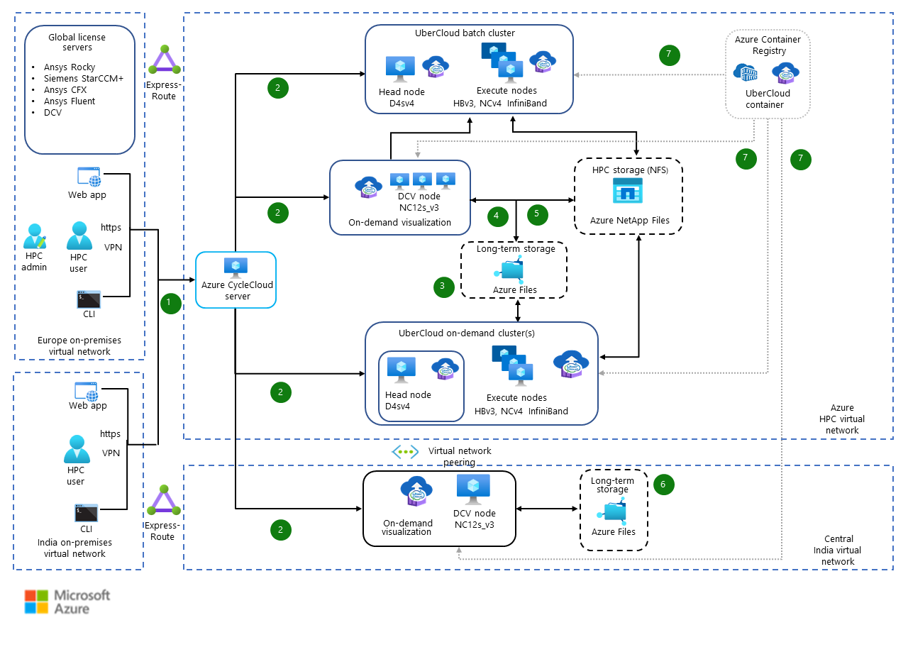

This example workload demonstrates running computer-aided engineering (CAE) simulations by using Azure. Computational fluid dynamics (CFD), finite element analysis (FEA), and discrete element method (DEM) are all examples of CAE simulations.

## Architecture

*Download a [PowerPoint file](https://arch-center.azureedge.net/run-cae-workloads-on-azure.pptx) of this architecture.*

### Workflow

1. The user connects to the Azure CycleCloud server to configure the cluster.
1. They configure and deploy the UberCloud batch cluster or UberCloud on-demand cluster and visualization nodes with the required number and type of virtual machine scale sets. This deployment usually takes 20-40 minutes to deploy the resources. However, if the user deallocates the resources instead of terminating them, the reallocation takes only about 2-5 minutes.

   While the termination of the virtual machine scale sets incurs zero cost, deallocating the virtual machine scale sets incurs minimal cost for associated managed disks. In this solution, each virtual machine (VM) has two disks attached; the first drive is for booting (32 GB), while the second disk is for the docker image (128 GB). The suggested durations for reallocation can vary due to the response times and demand on Azure capacities.

1. The user transfers the job files to long-term storage via [Azure Storage Explorer](https://azure.microsoft.com/products/storage/storage-explorer/) or [AzCopy](/azure/storage/common/storage-ref-azcopy).
1. The user then connects with an on-demand visualization GUI to transfer the input data from long-term storage to HPC storage. The user performs the preprocessing and submits the job to the UberCloud batch cluster or the on-demand cluster.
1. After the run finishes, the results are stored in HPC storage, and the user performs the post processing on the GUI. If the files on HPC storage aren't going to be used actively, the user transfers files from HPC storage to long-term storage.
1. For a smaller iterative workload, the user transfers the data to long-term storage in the Central India virtual network and works with the GUI to perform preprocessing, compute, and post-processing. The heavier precision workload can be transferred to Azure HPC virtual network for subsequent computation.
1. Containerized CFD, FEA, or DEM applications are pulled from the user’s Azure Container Registry by the execute nodes of the UberCloud batch cluster, on-demand cluster, and both of the on-demand visualizations. The user stops the UberCloud on-demand cluster or on-demand visualization, which deallocates the node to minimize the cost. The user can start it up again when required.

### Components

The solution uses these components:

- [Azure CycleCloud](https://azure.microsoft.com/features/azure-cyclecloud) is an orchestration tool for creating, managing, operating, and optimizing HPC and big compute clusters in Azure.
- [Azure Virtual Machines](https://azure.microsoft.com/products/virtual-machines/) creates a static set of compute instances.
- [Virtual Machine Scale Sets](/azure/virtual-machine-scale-sets/overview) provides a group of identical VMs capable of being scaled up or down by Azure CycleCloud.
- [Azure Storage accounts](https://azure.microsoft.com/free/storage) store the cluster configuration data.
- [Azure Virtual Network](https://azure.microsoft.com/products/virtual-network) enables many types of Azure resources, such as VMs, to securely communicate with each other, the Internet, and on-premises networks.
- [Azure Files](https://azure.microsoft.com/products/storage/files/) takes advantage of fully managed file shares in the cloud that are accessible via the industry-standard SMB and NFS protocols.
- [Azure NetApp Files](https://azure.microsoft.com/services/netapp/) helps run performance-intensive and latency-sensitive file workloads in Azure.
- [Azure ExpressRoute](https://azure.microsoft.com/products/expressroute/) creates private connections between Azure datacenters and on-premises infrastructure.
- [Container Registry](https://azure.microsoft.com/products/container-registry/) helps to build, store, secure, scan, replicate, and manage container images and artifacts with a fully managed, geo-replicated instance of OCI distribution.
- [Azure Container Instances](https://azure.microsoft.com/products/container-instances/) lets you run containers in Azure. You can develop apps quickly without managing virtual machines or having to learn new tools.
- [UberCloud](https://www.theubercloud.com/) provides software containers for Cloud HPC environments. These production-ready containers bundle OS, libraries, tools, application codes, and complex engineering and scientific workflows.

## Scenario details

CAE simulations try to solve complex, realistic, and detailed engineering problems. Enterprises must rely on a high-performance computing (HPC) environment to perform these kinds of simulations. This scenario is based on a manufacturing engineering domain solution developed by [UberCloud](https://www.theubercloud.com/) for one of its customers on the Microsoft Azure platform. However, the architecture applies to other industries that require HPC resources, like the automobile, aerospace, energy, and heavy machinery industries.

CAE, such as CFD, FEA, and DEM, utilizes mathematical numerical techniques to simulate physical behavior. The HPC simulation helps enterprises anticipate product failures before the products are built and reduces the time to market for the product launch.

Instead of providing sustainable cutting-edge solutions on-premises, the enterprises invest in the latest, scalable, and cost-effective HPC cloud infrastructure to perform these simulations.

UberCloud presented this architecture as a solution for an engineering company that relies on globally dispersed engineering teams serving cement and mining clients around the world. Due to aging hardware, the engineers at the remote office in India faced latency and performance issues while performing simulations on on-premises servers in Europe. Limited access to a high-performance computing environment with on-premises infrastructure hindered the delivery timelines and the product quality. Simulations require powerful hardware, various types of CAE software, management tools, and support in multiple regions.

UberCloud proposed replacing the old on-premises cluster with a modern HPC environment built on Azure. This solution provides all engineering teams access to cloud HPC, moving all engineering workloads to the cloud, which resolves global access, scalability, and hardware renewal challenges. This approach results in:

- An increase in employee productivity.
- Product improvements.
- Reduction in time to market.
- On-demand access to flexible and scalable HPC resources at a lower TCO as compared to on-premises.
- Increased business agility and established foundation for innovation and growth.

This architecture is a portable solution that provides a virtual desktop interface with the same user experience for public, private, and hybrid cloud environments with one set of tools across regions. The latest hardware is available for running the simulation workloads on GPU and CPU virtual machines and enables the enterprise to handle the burst loads. FDR InfiniBand-based interconnect networking is used in VM sizes that are enabled with remote direct memory access (RDMA). InfiniBand FDR (14 data rate, 14 GB per second data rate per lane) is the next generation InfiniBand technology specified by the InfiniBand Trade Association. InfiniBand lets the VM allow for low latency Message Passing Interface (MPI) communication. Azure NetApp Files delivers an enterprise-grade shared file-storage solution and helps run performance-intensive and latency-sensitive file workloads in the cloud.

The architecture provides the option of scaling either on UberCloud batch cluster services, where GUI isn't needed, or on UberCloud on-demand clusters, for the workloads that also require monitoring and scheduler with GUI. UberCloud batches use Azure CycleCloud for creating the batch computing environment, which provides engineers with a “no learning” advantage. This arrangement is useful for senior engineers who are very good at using CLI for analysis but who prefer to work in an environment that's similar to an on-premises environment. The UberCloud on-demand cluster brings the benefits of third-party schedulers, such as Slurm or PBS, to manipulate the workloads based on the monitoring results. Azure CycleCloud is useful for engineers who rely on a GUI environment for the analysis. The resource orchestrator Azure CycleCloud makes it easy for engineers to optimize HPC clusters regardless of scale. It automatically scales down when the workload is completed, providing a cost-effective solution.

### Potential use cases

This solution is also applicable to the following industries where CFD, FEA, and DEM applications are used:

- Aerospace
- Heavy machinery
- Automotive
- Heating, ventilation, and air conditioning (HVAC)
- Oil and gas 
- Energy
- Electronics manufacturing
- Healthcare

## Considerations

These considerations implement the pillars of the Azure Well-Architected Framework, which is a set of guiding tenets that can be used to improve the quality of a workload. For more information, see [Microsoft Azure Well-Architected Framework](/azure/architecture/framework).

### Security

Security provides assurances against deliberate attacks and the abuse of your valuable data and systems. For more information, see [Overview of the security pillar](/azure/architecture/framework/security/overview).

This solution is deployed as a single tenant server, and sole and exclusive control of the data and simulation under progress remains with the user.

Azure CycleCloud offers role-based access control, which helps ensure that engineers only access information they need to do their jobs. It also helps prevent them from accessing information that doesn't pertain to them.

### Cost optimization

Cost optimization is about looking at ways to reduce unnecessary expenses and improve operational efficiencies. For more information, see [Overview of the cost optimization pillar](/azure/architecture/framework/cost/overview).

This scenario supports the “bring your own license” model, which allows optimizing the software license cost by using the existing license available on-premises. It has Azure NetApp Files for the best performance experience of accessing files during simulation. Azure Files is used for long-term data storage. Since all the data stays in the cloud, the data transfer bandwidth charges are reduced.

The following BOQ shows two use case scenarios:

- **CFD:** A CFD simulation of 100 million cells finished in 1.5 hours. It used 16 nodes of 120 CPU cores per node. It involved a single job on 1,920 CPU core:

  | **Service category** | **Service type** | **Description** |
  | --- | --- | --- |
  | Compute | Virtual machines | 1 D4s v4 (4 vCPUs, 16-GB RAM) |
  | Compute | Virtual machines | 1 D4s v3 (4 vCPUs, 16-GB RAM) |
  | Storage | Azure NetApp Files | 4 TiB Premium Capacity |
  | Networking | Virtual network | Virtual Network 1 |
  | Storage | Storage accounts | File Storage, Hot Performance Tier |
  | Networking | Bandwidth | Internet egress |
  | Networking | Azure Firewall | One Logical firewall unit |
  | Containers | Container Registry | One registry |
  | Networking | ExpressRoute | ExpressRoute, Premium, 100 Mbps |
  | Compute | Virtual Machine Scale Sets | 16 HB120rs v3 (120 Cores, 448-GB RAM) |

- **DEM:** A DEM simulation of 0.1 million particles finished in 1.5 hours for a single job. It used 4 GPUs on a single virtual machine:

  | **Service category** | **Service type** | **Description** |
  | --- | --- | --- |
  | Compute | Virtual machines | 1 D4s v4 (4 vCPUs, 16-GB RAM) |
  | Compute | Virtual machines | 1 D4s v3 (4 vCPUs, 16-GB RAM) |
  | Compute | Virtual machines | 1 NC96ads A100 v4 (96 Cores, 880-GB RAM) |
  | Storage | Azure NetApp Files | 4 TiB Premium Capacity |
  | Networking | Virtual network | Virtual Network 1 |
  | Storage | Storage accounts | File Storage, Hot Performance Tier |
  | Networking | Bandwidth | Internet egress |
  | Networking | Azure Firewall | One Logical firewall unit |
  | Containers | Container Registry | One registry |
  | Networking | ExpressRoute | ExpressRoute, Premium 100 Mbps Circuit |

To estimate the cost of Azure products and configurations, visit the [Azure pricing calculator](https://azure.microsoft.com/pricing/calculator).

For more information about cost optimization, see [Seven Ways to save costs & increase your ROI in the HPC cloud](https://www.linkedin.com/pulse/7-ways-save-costs-increase-your-roi-hpc-cloud-wolfgang-gentzsch/).

### Performance efficiency

Performance efficiency is the ability of your workload to scale to meet the demands placed on it by users in an efficient manner. For more information, see [Performance efficiency pillar overview](/azure/architecture/framework/scalability/overview).

This architecture uses the AMD CPU-based HBv3-series VMs for CFD simulations and Nvidia GPU-based NC series VMs for visualization and DEM simulations on Azure.

[HBv3 series VMs](/azure/virtual-machines/hbv3-series): These VMs are well suited for compute intensive and high-bandwidth simulations that use multi-node cluster setup to achieve scale. This architecture covers applications such as Ansys CFX, Ansys Fluent, and Siemens STAR CCM+, which scale well on HBv3. The application architecture guides [Ansys CFX](/azure/architecture/guide/hpc/ansys-cfx) and [Ansys Fluent](/azure/architecture/guide/hpc/ansys-fluent) show that in single-node configurations, the performance of these applications scales effectively up to 64 or 96 CPU cores. In multi-node configurations, the performance scales linearly as nodes are added.

[NCv4 series VMs](/azure/virtual-machines/nc-a100-v4-series): These VMs are well suited for compute-intensive GPU-accelerated simulations that use multi-GPU capabilities to achieve scalable performance. This architecture covers Ansys Rocky applications which scale well on NCv4 A100 GPUs. The application architecture guide [Ansys Rocky](/azure/architecture/guide/hpc/ansys-rocky) shows that in single-node configurations, the relative performance speed-up increases significantly by utilizing the GPU acceleration.

## Contributors

*This article is maintained by Microsoft. It was originally written by the following contributors.*

Principal authors:
- [Kalaiselvan Balaraman](http://www.linkedin.com/in/kalaiselvan-b-5a153358) | Cloud Solution Architect
- [Wolfgang Gentzsch](https://www.linkedin.com/in/wolfganggentzsch) | President

Other contributors:
- [Hari Bagudu](https://www.linkedin.com/in/hari-bagudu-88732a19) | Senior Manager
- [Gauhar Junnarkar](https://www.linkedin.com/in/gauharjunnarkar) | Principal Program Manager
- [Sachin Rastogi](https://www.linkedin.com/in/sachin-rastogi-907a3b5) | Program Lead

*To see non-public LinkedIn profiles, sign in to LinkedIn.*

## Next steps

Product documentation:

- [What is Azure CycleCloud?](/azure/cyclecloud/overview)
- [Azure Virtual Machines](/azure/virtual-machines/windows/overview)
- [Introduction to Azure Storage](/azure/storage/common/storage-introduction)
- [What is Azure Virtual Network?](/azure/virtual-network/virtual-networks-overview)
- [What are Virtual Machine Scale Sets?](/azure/virtual-machine-scale-sets/overview)

See the following virtual machine articles:

- [RDMA Capable Machine Instances](/azure/virtual-machines/sizes-hpc#rdma-capable-instances)

## Related resources

- [FLSmidth customer story](https://customers.microsoft.com/story/1417831248134599964-flsmidth-manufacturing-azure)
- [Rimac Technology customer story](https://customers.microsoft.com/story/1481507556746562229-rimac-technology-automotive-azure-hpc-ai)
- [Buro Happold customer story](https://customers.microsoft.com/story/1407081285387890777-buro-happold-professional-services-azure)
- [Dehn customer story](https://customers.microsoft.com/story/1430490742181811110-dehn-azure-hpc-en)
- [HPC system and big-compute solutions](/azure/architecture/solution-ideas/articles/big-compute-with-azure-batch)
- [Seven Ways to save costs & increase your ROI in the HPC cloud](https://www.linkedin.com/pulse/7-ways-save-costs-increase-your-roi-hpc-cloud-wolfgang-gentzsch/)
