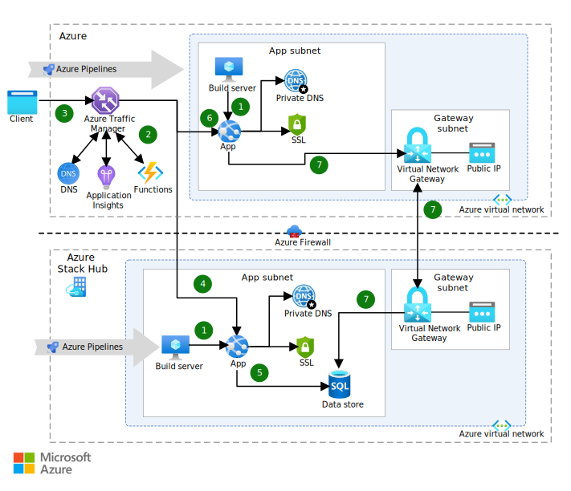

This solution demonstrates how to build a hybrid app that takes advantage of:

- The scalability of the Azure public cloud platform.
- The compliance benefits of the Azure Stack Hub private cloud platform.

## Architecture

*Download a [Visio file](https://arch-center.azureedge.net/hybrid-cross-cloud-scale-onprem-data.vsdx) of this architecture.*

### Dataflow

1. The Azure Pipelines build servers that are in the Azure Stack Hub on-premises environment and in the cloud deploy the same version of the app to their respective environments. The cloud environment doesn't include a data store. Both instances of the app are configured to connect to the same on-premises data store.
1. The web apps are monitored for load. When there's a significant increase in traffic, an application manipulates DNS records to redirect traffic to the public cloud. When the traffic is no longer high, the DNS records are updated to direct traffic back to the private cloud.
1. A client sends a request to the application. Azure Traffic Manager processes the request and routes it to one of the app environments.
1. Under normal load, the client request is routed to the instance of the app that's hosted on-premises in Azure Stack Hub.
1. The on-premises app connects to the local data store, as needed.
1. Under high load, Traffic Manager routes requests to the cloud instance of the app.
1. The cloud app instance processes the requests and connects to the on-premises data store as needed via an improved-security connection.

### Components

- [Azure App Service](https://azure.microsoft.com/products/app-service) makes it possible for  you to build and host web apps, RESTful API apps, and Azure functions.
- [Azure Virtual Network](https://azure.microsoft.com/products/virtual-network) is the fundamental building block for private networks in Azure. Virtual Network makes it possible for multiple Azure resource types, like virtual machines (VM), to communicate with each other, the internet, and on-premises networks, all with improved security. This solution also demonstrates the use of additional networking components:

  - App and gateway subnets.
  - A local on-premises network gateway.
  - A virtual network gateway that acts as a site-to-site VPN gateway connection.
  - A public IP address.
  - A point-to-site VPN connection.
  - Azure DNS to host DNS domains and to provide name resolution.

- [Traffic Manager](https://azure.microsoft.com/products/traffic-manager) is a DNS-based traffic load balancer. You can use it to control the distribution of user traffic to service endpoints in different datacenters.
- [Application Insights](https://azure.microsoft.com/products/monitor) is an extensible application performance management service for web developers who build and manage apps on multiple platforms.
- [Azure Functions](https://azure.microsoft.com/products/functions) makes it possible for you to run code in a serverless environment without having to first create a VM or publish a web app.
- [Azure Stack Hub](https://azure.microsoft.com/products/azure-stack/hub) is an extension of Azure that can run workloads in an on-premises environment by providing Azure services there.
  - You can use Azure Stack Hub to provide the same app model, self-service portal, and APIs that Azure provides. Azure Stack Hub IaaS supports a broad range of open-source technologies for consistent hybrid cloud deployments. This solution uses a Windows Server VM to host SQL Server, for example.
  - The solution uses [Azure App Service on Azure Stack Hub](/azure-stack/operator/azure-stack-app-service-overview) to host the web app in both environments.
  - The Azure Stack Hub virtual network works exactly like the Azure virtual network. It uses many of the same networking components, including custom host names.
- [Azure DevOps](https://azure.microsoft.com/products/devops) is a set of developer services that provides comprehensive application and infrastructure lifecycle management. Azure DevOps includes work tracking, source control, build and CI/CD, package management, and testing solutions.
- [Azure Pipelines](https://azure.microsoft.com/products/devops/pipelines) is a service that provides CI/CD. You can use it to manage hosted build and release agents and definitions. Your development pipeline can use various code repositories, including GitHub, Bitbucket, Dropbox, OneDrive, and [Azure Repos](https://azure.microsoft.com/products/devops/repos).

### Alternatives

- For web applications, you can use [Azure Front Door](https://azure.microsoft.com/products/frontdoor). Azure Front Door works at Layer 7, the HTTP/HTTPS layer. It uses the anycast protocol with split TCP, and the Microsoft global network, to improve global connectivity. Your routing method can ensure that Azure Front Door routes your client requests to the fastest and most available application back end.
- You can use [Azure ExpressRoute](https://azure.microsoft.com/products/expressroute) instead of Azure VPN Gateway. You can use ExpressRoute to connect your local network directly to Azure resources by using a dedicated private network connection.
- If your repo is in GitHub, you can use [GitHub Actions](https://github.com/features/actions) instead of Azure Pipelines.

## Scenario details

This solution demonstrates how to build a hybrid app that spans Azure and Azure Stack Hub. It uses a single on-premises data source, which is a compliance requirement for some organizations.

Many organizations collect and store massive amounts of sensitive customer data.  They're frequently prevented from storing sensitive data in the public cloud because of corporate regulations or government policy, but they might want to take advantage of the scalability of the public cloud. The public cloud can handle seasonal peaks in traffic, allowing organizations to pay for exactly the hardware they need, when they need it.

The solution takes advantage of the compliance benefits of the private cloud and combines them with the scalability of the public cloud. The combination of the Azure cloud and the Azure Stack Hub hybrid cloud provides a consistent experience for developers. This consistency lets them apply their skills to both public cloud and on-premises environments.

This solution allows you to deploy an identical web app to a public and private cloud. You can also access a non-internet routable network that's hosted on the private cloud.

### Potential use cases

This solution is applicable in scenarios like these:

- Your organization uses a DevOps approach or plans to use one soon.
- You want to implement continuous integration and continuous delivery (CI/CD) practices across an Azure Stack Hub implementation and the public cloud.
- You want to consolidate the CI/CD pipeline across cloud and on-premises environments.
- You want to develop apps by using both cloud and on-premises services.
- You want the skills that are required for developers to be the same across cloud and on-premises apps.
- You're using Azure but have developers who are working in an on-premises Azure Stack Hub cloud.
- Your on-premises apps experience spikes in demand during seasonal, cyclical, or unpredictable fluctuations.
- You have on-premises components and want to use the cloud to scale them.
- You want cloud scalability but also want your app to run on-premises as much as possible.

## Considerations

These considerations implement the pillars of the Azure Well-Architected Framework, which is a set of guiding tenets that can be used to improve the quality of a workload. For more information, see [Microsoft Azure Well-Architected Framework](/azure/architecture/framework).

### Reliability

Reliability ensures your application can meet the commitments you make to your customers. For more information, see [Overview of the reliability pillar](/azure/architecture/framework/resiliency/overview).

Global deployment has challenges, like variable connectivity and government regulations that differ by region. Developers can create just one app and deploy it across various regions with different requirements. Deploy your app to the Azure public cloud, and then deploy additional instances or components locally. You can manage traffic among all instances by using Azure.

It's important to think about how to handle networking or power failures. For information about improving resiliency, see [Resiliency and dependencies](/azure/architecture/framework/resiliency/design-resiliency), [Best practices](/azure/architecture/framework/resiliency/design-best-practices), and other [reliability guidance](/azure/architecture/framework/resiliency) from the Microsoft Azure Well-Architected Framework.

### Security

Security provides assurances against deliberate attacks and the abuse of your valuable data and systems. For more information, see [Overview of the security pillar](/azure/architecture/framework/security/overview).

- **Compliance and data sovereignty.** With Azure Stack Hub, you can run the same service across multiple countries/regions as you would when using a public cloud. Deploying the same app in datacenters in each country/region allows you to meet data sovereignty requirements. This capability ensures that personal data is kept within the borders of each country/region. See [Regulatory compliance](/azure/architecture/framework/security/design-governance) in the Well-Architected Framework for more guidance.

- **Azure Stack Hub security posture.** Security requires a solid, continuous servicing process. That's why Microsoft invested in an orchestration engine that applies patches and updates across the entire infrastructure. Thanks to partnerships with Azure Stack Hub original equipment manufacturer (OEM) partners, Microsoft extends the same security posture to OEM-specific components, like the Hardware Lifecycle Host and the software running on it. These partnerships ensure that Azure Stack Hub has a uniform, solid security posture across the entire infrastructure. In turn, you can build and secure your app workloads.

- **Use of service principals via PowerShell, CLI, and the Azure portal.** To provide resource access to a script or app, set up an identity for your app and authenticate the app with its own credentials. This identity is known as a service principal. You can use service principals to:

  - Assign permissions to the app identity that are different from user permissions and that are restricted to the app's needs.
  - Use a certificate for authentication when you run an unattended script.
  For more information about service principal creation and using a certificate for credentials, see [Use an app identity to access resources](/azure/active-directory/develop/howto-create-service-principal-portal).

- **A single, consistent identity management solution.** Azure Stack Hub works with both Azure Active Directory (Azure AD) and Active Directory Federation Services (AD FS). It works with Azure AD in connected scenarios. For environments that don't have connectivity, you can use AD FS as a disconnected solution. Service principals are used to grant access to apps, allowing them to deploy or configure resources through Azure Resource Manager.

### Operational excellence

Operational excellence covers the operations processes that deploy an application and keep it running in production. For more information, see [Overview of the operational excellence pillar](/azure/architecture/framework/devops/overview).

- **A single, consistent development approach.** With Azure and Azure Stack Hub, you can use a consistent set of development tools across your organization. This consistency makes it easier to implement CI/CD. Many apps and services that are deployed in Azure or Azure Stack Hub are interchangeable and can run in either location.

  A hybrid CI/CD pipeline can help you:

  - Initiate a new build based on commits to your code repository.
  - Automatically deploy your newly built code to Azure for user acceptance testing.
  - Automatically deploy to Azure Stack Hub after your code passes testing.

See additional guidance in the [Release engineering](/azure/architecture/framework/devops/release-engineering-ci) section of the Azure Well-Architected Framework.

### Performance efficiency

Performance efficiency is the ability of your workload to scale to meet the demands placed on it by users in an efficient manner. For more information, see [Performance efficiency pillar overview](/azure/architecture/framework/scalability/overview).

Azure and Azure Stack Hub support the needs of globally distributed businesses.

- **Easy-to-manage hybrid cloud.** Microsoft provides integration of on-premises assets with Azure Stack Hub and Azure in one unified solution. This integration eliminates the challenge of managing multiple point solutions and a mix of cloud providers. With cross-cloud scaling, just connect your Azure Stack Hub to Azure with [cloud bursting](https://azure.microsoft.com/overview/what-is-cloud-bursting) to make your data and apps available in Azure.

  - Eliminate the need to build and maintain a secondary disaster recovery (DR) site.
  - Save time and money by eliminating tape backup. Store up to 99 years of backup data in Azure.
  - Migrate running Hyper-V, Physical (in preview), and VMware (in preview) workloads to Azure to benefit from the economics and elasticity of the cloud.
  - Run compute-intensive reports or analytics on a replicated copy of your on-premises asset in Azure without separation from your production workloads.
  - Burst into the cloud and run on-premises workloads in Azure, with larger compute templates when needed.
  - Create multitier development environments. Replicate live production data to your dev/test environment to keep it in near real-time sync.
- **Cross-cloud scaling with Azure Stack Hub.** The key advantage to cloud bursting is that it saves you money. You pay for additional resources only when there's a demand for them. You don't need to spend money on unnecessary extra capacity or try to predict demand peaks and fluctuations.
- **Processing in the cloud.** You can use cross-cloud scaling to reduce processing burdens. Moving basic apps to the public cloud distributes loads, freeing up local resources for business-critical apps. You can deploy an app to the private cloud and burst it to the public cloud as needed to meet demand.

## Contributors

*This article is maintained by Microsoft. It was originally written by the following contributors.*

Principal author:

- [Bryan Lamos](https://www.linkedin.com/in/bryanlamos) | Senior Content Developer

*This article is maintained by Microsoft. It was originally written by the following contributors.*

## Next steps

- Watch [Dynamically scale apps between datacenters and public cloud](https://www.youtube.com/watch?v=2lw8zOpJTn0) for an overview of a similar architecture.
- See [Hybrid app design considerations](/hybrid/app-solutions/overview-app-design-considerations) to learn more about best practices.
- Learn about the entire [Azure Stack portfolio](/azure-stack) of products and solutions.
- [Sign up and sign in to Azure DevOps](/azure/devops/user-guide/sign-up-invite-teammates) to set up continuous integration for build, test, and deployment.
- Learn about [Autoscale](https://azure.microsoft.com/features/autoscale), a built-in feature of cloud services, VMs, and web apps. It allows apps to perform optimally when demand changes. Apps adjust for traffic spikes, notifying you when metrics change and scaling as needed.
- When you're ready to deploy this solution, use the [cross-cloud scaling (on-premises data) solution deployment guide](../../hybrid/deployments/solution-deployment-guide-cross-cloud-scaling-onprem-data.md). It provides step-by-step instructions for deploying and testing the solution.

## Related resources

- [Hybrid architecture design](../../hybrid/hybrid-start-here.md)
- [Connect an on-premises network to Azure](../../reference-architectures/hybrid-networking/index.yml)
- [Extend an on-premises network using VPN](/azure/expressroute/expressroute-howto-coexist-resource-manager)
- [Connect an on-premises network to Azure using ExpressRoute](../../reference-architectures/hybrid-networking/expressroute-vpn-failover.yml)
- [DevOps with Azure Stack Hub](/azure/architecture/solution-ideas/articles/hybrid-continuous-integration)
