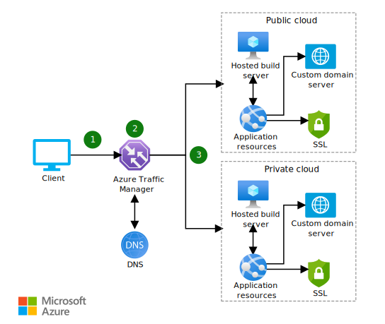

This solution shows how to use Azure Traffic Manager to extend an app that's located in a local cloud by connecting it to public cloud resources.

## Architecture

*Download a [Visio file](https://arch-center.azureedge.net/hybrid-cross-cloud-scaling.vsdx) of this architecture.*

### Dataflow

1. The client sends a request to the cloud application.
1. Traffic Manager uses DNS to direct the client request to the appropriate service endpoint, based on a [traffic-routing method](/azure/traffic-manager/traffic-manager-routing-methods). Traffic Manager also provides health monitoring for every endpoint.
1. The instance of the cloud application that's chosen by Traffic Manager processes the request.

### Components

- [Azure Stack Hub](https://azure.microsoft.com/products/azure-stack/hub) is an extension of Azure. Azure Stack Hub brings the agility of cloud computing to your on-premises environment. In this architecture, it hosts the on-premises version of the app.
- [Traffic Manager](https://azure.microsoft.com/products/traffic-manager) is a DNS-based traffic load balancer. It's used here to direct client requests to the appropriate endpoint.
- [Azure Virtual Machine Scale Sets](https://azure.microsoft.com/products/virtual-machine-scale-sets) enables you to scale virtual machines. In this architecture, you can use it to enable app resources to scale in and out.
- [Azure Container Instances](https://azure.microsoft.com/products/container-instances) enables you to run containers in Azure. In this architecture, it can be used as an alternative to Virtual Machine Scale Sets to provide scaling.
- **Domain Name System (DNS)** translates (or resolves) a website or service name to its IP address.
- **The hosted build server** is an environment for hosting your build pipeline.
- **Public IP addresses** are used to route the incoming traffic through Traffic Manager to the endpoint for the public cloud app resources.
- [Azure DDoS Protection Standard](/azure/ddos-protection/ddos-protection-overview), combined with application-design best practices, provides enhanced DDoS mitigation features to provide more defense against DDoS attacks. You should enable [Azure DDOS Protection Standard](/azure/ddos-protection/ddos-protection-overview) on any perimeter virtual network.

### Alternatives

For web applications, you can use [Azure Front Door](https://azure.microsoft.com/products/frontdoor) instead of Traffic Manager. Azure Front Door works on Layer 7 (the HTTP/HTTPS layer).
It can keep traffic on the best path to your app, improve service scale, reduce latency, and increase throughput for your global users with edge load balancing, SSL offload, and application acceleration.

## Scenario details

This solution shows how to use Azure Traffic Manager to extend an app that's located in a local cloud by connecting it to public cloud resources. A change in routing is triggered by an increase or decrease in demand, and resources are added or removed in the cloud. These resources provide redundancy, rapid availability, and geo-compliant routing.

### Potential use cases

Global enterprises need their apps to be secure, reliable, and available. They need to meet increases in demand and use the right infrastructure to support that demand. It can be difficult to balance costs and maintenance with business-data security, storage, and real-time availability.

When an app can't increase capacity to meet unexpected increases in demand, it can service only a fixed number of users. This lack of scalability can result in users not reaching the app during peak usage times.

However, sometimes it's not economically feasible for a business to maintain the capacity that's required to handle spikes in demand in their on-premises environment. By using this solution, you can use the elasticity of the public cloud to scale your on-premises solution.

Use this solution when:

- You need to increase the capacity of your app to handle unexpected demand or periodic increases in demand.
- You want to pay for certain resources only during peaks.

We don't recommend this solution when:

- Your business is subject to local regulations that require the originating connection to come from an onsite call.
- Your network experiences regular bottlenecks that can restrict the performance of scaling.
- Your environment is disconnected from the internet and can't reach the public cloud.

## Considerations

These considerations implement the pillars of the Azure Well-Architected Framework, which is a set of guiding tenets that can be used to improve the quality of a workload. For more information, see [Microsoft Azure Well-Architected Framework](/azure/architecture/framework).

### Reliability

Reliability ensures that your application can meet the commitments that you make to your customers. For more information, see [Overview of the reliability pillar](/azure/architecture/framework/resiliency/overview).

Use appropriate on-premises hardware configuration and software deployment practices to ensure that locally deployed apps are configured for high availability. To improve resiliency, follow the guidance in [Resiliency and dependencies](/azure/architecture/framework/resiliency/design-resiliency) and [Best practices](/azure/architecture/framework/resiliency/design-best-practices).

### Security

Security provides assurances against deliberate attacks and the abuse of your valuable data and systems. For more information, see [Overview of the security pillar](/azure/architecture/framework/security/overview).

For comprehensive guidance about security principles, see [Security documentation](/azure/architecture/framework/security).

### Operational excellence

Operational excellence covers the operations processes that deploy an application and keep it running in production. For more information, see [Overview of the operational excellence pillar](/azure/architecture/framework/devops/overview).

For guidance about monitoring in hybrid scenarios, see [Run containers in a hybrid environment](../../hybrid/hybrid-containers.yml).

### Performance efficiency

Performance efficiency is the ability of your workload to scale to meet the demands placed on it by users in an efficient manner. For more information, see [Performance efficiency pillar overview](/azure/architecture/framework/scalability/overview).

The key benefit of cross-cloud scaling is the ability to deliver on-demand scaling. Scaling must happen between public and local cloud infrastructure and provide a consistent, reliable service that's based on demand. See [Performance efficiency](/azure/architecture/framework/scalability) to learn more about implementing scalability in Azure.

## Contributors

*This article is maintained by Microsoft. It was originally written by the following contributors.*

Principal author:

- [Bryan Lamos](https://www.linkedin.com/in/bryanlamos) | Senior Content Developer

*To see non-public LinkedIn profiles, sign in to LinkedIn.*

## Next steps

- See the [Azure Traffic Manager documentation](/azure/traffic-manager/traffic-manager-overview) to learn more about how this DNS-based traffic load balancer works.
- See [Hybrid application design considerations](/hybrid/app-solutions/overview-app-design-considerations) to learn more about best practices.
- Learn about the [Azure Stack portfolio of products and solutions](/azure-stack).
- [Extend an on-premises network using VPN](/azure/expressroute/expressroute-howto-coexist-resource-manager)

## Related resources

- When you're ready to deploy this solution, use the [Cross-cloud scaling solution deployment guide](/azure/architecture/hybrid/deployments/solution-deployment-guide-cross-cloud-scaling). It provides step-by-step instructions for deploying and testing the solution's components.

See the following related architectures:

- [Hybrid architecture design](../../hybrid/hybrid-start-here.md)
- [Run containers in a hybrid environment](../../hybrid/hybrid-containers.yml)
- [Hybrid availability and performance monitoring](../../hybrid/hybrid-containers.yml)
