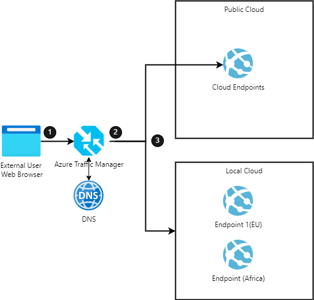

This solution illustrates geographic traffic routing, a process for implementing geo-distributed apps. The solution directs traffic to specific endpoints based on various metrics. It uses Azure Traffic Manager to route traffic to endpoints based on regional requirements, corporate and international regulations, and data needs.

## Potential use cases

Organizations that have wide-reaching geographies strive to distribute data and enable access to that data while ensuring required levels of security, compliance, and performance per user, location, and device across borders.

Use this solution when: 

* Your organization has international branches that require custom regional security and distribution policies.
* Each of your organization's offices pulls employee, business, and facility data, and that necessitates reporting activity per local regulations and time zone.
* You can meet high-scale requirements by horizontally scaling out apps, with multiple app deployments made within a single region and across regions to handle extreme load requirements.
* Your apps must be highly available and responsive to client requests even during single-region outages.

## Architecture

  
_Download an [SVG file](https://arch-center.azureedge.net/geo-distributed.svg) of this architecture._

### Dataflow

1. The client sends a request to the cloud application.
1. Traffic Manager uses DNS to direct the client requests to the appropriate service endpoint, based on a [traffic-routing method](/azure/traffic-manager/traffic-manager-routing-methods). Traffic Manager also provides health monitoring for every endpoint.
1. The instance of the cloud application selected by Traffic Manager processes the request.

### Components
* [Azure Stack Hub](https://azure.microsoft.com/products/azure-stack/hub). Azure Stack Hub is an extension of Azure. It brings the agility of cloud computing to your on-premises environment. In this architecture, it hosts the on-premises version of the app.
* [Traffic Manager](https://azure.microsoft.com/services/traffic-manager). Traffic Manager is a DNS-based traffic load balancer. It's used here to direct client requests to the appropriate endpoint.
* **Domain Name System (DNS)**. DNS translates (or resolves) a website or service name to its IP address.
* **Cloud endpoint**. Public IP addresses route incoming traffic through Traffic Manager to the endpoints for the public cloud app resources.
* **Local endpoint**. Public IP addresses route incoming traffic through Traffic Manager to the endpoints for the local cloud app resources.

### Alternatives

For web applications, you can use [Azure Front Door](https://azure.microsoft.com/services/frontdoor) instead of Traffic Manager. Azure Front Door works on Layer 7 (the HTTP/HTTPS layer). It can keep traffic on the best path to your app, improve service scale, reduce latency, and increase throughput for your global users with edge load balancing, SSL offload, and application acceleration.

## Considerations

### Reliability

Use appropriate on-premises hardware configuration and software deployment practices to ensure that locally deployed apps are configured for high availability. To improve resiliency, follow the guidance in [Resiliency and dependencies](/azure/architecture/framework/resiliency/design-resiliency) and [Best practices](/azure/architecture/framework/resiliency/design-best-practices).

### Security

For comprehensive guidance about security principles, see [Security documentation](/azure/architecture/framework/security) in the Azure Well-Architected Framework.

### Operational excellence

The operational excellence pillar of the Azure Well-Architected Framework covers the operations processes that keep an application running in production. For comprehensive guidance, see [Operational excellence documentation](/azure/architecture/framework/devops). For guidance about monitoring in hybrid scenarios, see [Hybrid availability and performance monitoring](../../hybrid/hybrid-containers.yml).

### Performance efficiency

The key benefit of cross-cloud scaling is the ability to deliver on-demand scaling. Scaling must happen between public and local cloud infrastructure and provide a consistent, reliable service that's based on demand. To learn more about implementing scalability in Azure, see [Performance efficiency](/azure/architecture/framework/scalability).

## Next steps

* See the [Azure Traffic Manager documentation](/azure/traffic-manager/traffic-manager-overview) to learn more about how this DNS-based traffic load balancer works.
* See [Hybrid app design considerations](/hybrid/app-solutions/overview-app-design-considerations) to learn more about best practices.
* Learn about the [Azure Stack portfolio of products and solutions](/azure-stack).
* When you're ready to deploy this solution, use the [Geo-distributed app solution deployment guide](/azure/architecture/hybrid/deployments/solution-deployment-guide-geo-distributed). It provides step-by-step instructions for deploying and testing the solution's components. 

## Related resources

* [Highly available multi-region web application](../../reference-architectures/app-service-web-app/multi-region.yml)
* [Architecting Azure applications for resiliency and availability](/azure/architecture/reliability/architect)
* [Hybrid architecture design](../../hybrid/hybrid-start-here.md)
* [Extend an on-premises network using VPN](../../reference-architectures/hybrid-networking/vpn.yml)
* [Hybrid availability and performance monitoring](../../hybrid/hybrid-containers.yml)
