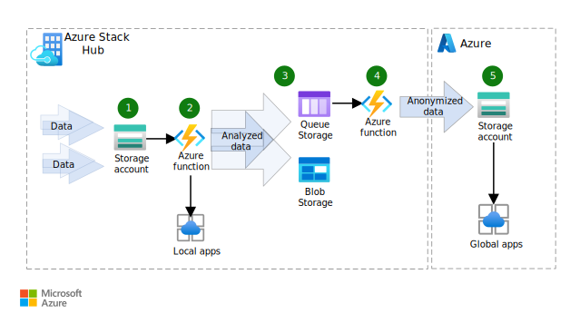

This solution shows how to use Azure Stack Hub and cloud-based Azure to stage, analyze, process, sanitize, and store data across multiple on-premises and cloud locations.

## Architecture

  
_Download a [Visio file](https://arch-center.azureedge.net/hybrid-tiered-data-analytics.vsdx) of this architecture._

### Dataflow

1. Azure Blob Storage in the on-premises Azure Stack Hub environment stores raw data. 
1. As raw data arrives in the storage account, functions hosted on-premises by the Azure App Service on Azure Stack Hub are triggered to support the data intake. The intake functions can communicate with local apps and services to help process the data.
1. The output generated by the intake functions is saved to the on-premises storage account:

   - **Blob Storage** for data archiving. Data tiering is based on attributes like frequency of access and retention period. 
   - **Azure Queue Storage** for processed data storage. Queue Storage provides cloud messaging between app components. When apps are designed for scale, app components are often decoupled so they can scale independently. Queue Storage provides asynchronous messaging.

1. Data saved to Queue Storage triggers functions that are used to sterilize data. Automatically and manually triggered functions can process, clean up, and archive data. Examples include nightly scrubs of customer lists and monthly report processing.

1. An Azure Storage account provides an anonymized data consumption endpoint in the cloud. For example, the anonymized data is used to generate reports.

### Components

- [Azure Storage](https://azure.microsoft.com/product-categories/storage) is the Microsoft cloud storage solution for modern data storage scenarios. It provides a massively scalable object store for data objects and a file system service for the cloud. It also provides a messaging store for reliable messaging and a NoSQL data store.  
- [Azure Stack Hub](https://azure.microsoft.com/products/azure-stack/hub) extends Azure services and capabilities to your environment of choice—from the datacenter to edge locations and remote offices. Build, deploy, and run hybrid and edge computing apps consistently across your IT ecosystem.

  - [Azure Stack Hub storage](/azure-stack/user/azure-stack-storage-overview) is a set of cloud storage services that's consistent with the services provided by Azure Storage. Storage types include blob, table, and queue.
  - [Azure Functions](https://azure.microsoft.com/services/functions) is provided by the [Azure App Service on Azure Stack Hub](/azure-stack/operator/azure-stack-app-service-overview). You can use Azure Functions to run your code in a simple serverless environment in response to a variety of events. Azure functions scale to meet demand, and you don't need to create a virtual machine (VM) or publish a web app.

### Alternatives

- You can use other storage solutions. For example, [Azure SQL Database](https://azure.microsoft.com/products/azure-sql/database) is an intelligent, scalable relational database service that's built for the cloud. You can [use SQL databases on Azure Stack Hub](/azure-stack/operator/azure-stack-sql-resource-provider).
- [Event Hubs on Azure Stack Hub](/azure-stack/operator/event-hubs-rp-overview) can be used instead of Queue Storage for cloud messaging. Streaming and event-based solutions are supported for both on-premises and Azure cloud processing.

## Scenario details

When you design a solution for secure data storage, processing, and analysis, you need to take these considerations into account:

- Data content
- Location
- Security and privacy requirements
- Access permissions
- Maintenance
- Storage warehousing

Azure, together with Azure Stack Hub, addresses data concerns and provides low-cost solutions.

The architecture described here is best exemplified by a distributed manufacturing or logistics company. Using both on-premises and public cloud environments meets the demands of multi-facility enterprises. Azure Stack Hub offers a rapid, highly secure, and flexible solution for collecting, processing, storing, and distributing local and remote data.

This solution is especially useful when security, confidentiality, corporate policy, and regulatory requirements differ among locations and users.

### Potential use cases

This solution applies to large multi-branch manufacturing and logistics organizations that require:

- Rapid and secure data storage, processing, and distribution between global remote locations and central headquarters.
- Security of employee and machinery activity, facility information, and business reporting data. The data must be distributed appropriately and meet regional compliance policies and industry regulations.

## Considerations

These considerations implement the pillars of the Azure Well-Architected Framework, which is a set of guiding tenets that can be used to improve the quality of a workload. For more information, see [Microsoft Azure Well-Architected Framework](/azure/architecture/framework).

### Storage

Blob Storage can hold any type of text or binary data, like documents, media files, and app installers. Every blob is organized in a container. Containers provide a useful way to assign security policies to groups of objects. A storage account can have any number of containers. A container can contain any number of blobs, up to the 500-TB capacity limit of the storage account.

You can use low-cost Blob Storage to archive cool data. Examples of cool data include backups, media content, scientific data, compliance data, and archival data. In general, any data that you access infrequently is considered cool storage. Data tiering is based on attributes like frequency of access and retention period. Customer data is infrequently accessed, but it requires latency and performance that's similar to what's required for hot data.

### Reliability

Reliability ensures your application can meet the commitments you make to your customers. For more information, see [Overview of the reliability pillar](/azure/architecture/framework/resiliency/overview).

Storage is the primary availability consideration for this solution. For large data volume processing and distribution, connection via fast links is required. Azure Storage always stores multiple copies of your data so that it's protected from planned and unplanned events, including transient hardware failures, network or power outages, and massive natural disasters. Redundancy ensures that your storage account meets its availability and durability targets even if there's a failure. For more information, see [Azure Storage redundancy](/azure/storage/common/storage-redundancy).

### Security

Security provides assurances against deliberate attacks and the abuse of your valuable data and systems. For more information, see [Overview of the security pillar](/azure/architecture/framework/security/overview).

Because this solution captures customer data, security is an important consideration. Use [data protection](/azure/architecture/framework/security/design-storage) guidance from the Azure Well-Architected Framework to secure the storage accounts. Recommendations include configuring proper access policies and rotating keys regularly. Ensure that storage accounts and event hubs have retention policies that meet corporate and government privacy regulations.

Provide security via [identity and access management](/azure/architecture/framework/security/design-identity), and be sure to tier the user access levels. Tiering ensures that users have access to only the data they need.

For guidance about security for serverless applications with functions, see [Serverless Functions security](../../serverless-quest/functions-app-security.md).

### Operational excellence

Operational excellence covers the operations processes that deploy an application and keep it running in production. For more information, see [Overview of the operational excellence pillar](/azure/architecture/framework/devops/overview).

The manageability of this solution depends on the authoring tools that you're using and the use of source control.

[Azure Arc](/azure/azure-arc/overview) simplifies governance and management by providing a consistent multicloud and on-premises management platform. Manage your entire environment, with a single pane of glass, by projecting your non-Azure and on-premises resources into Azure Resource Manager.

### Performance efficiency

Performance efficiency is the ability of your workload to scale to meet the demands placed on it by users in an efficient manner. For more information, see [Performance efficiency pillar overview](/azure/architecture/framework/scalability/overview).

Azure functions and storage solutions scale to meet data volume and processing demands. For Azure Storage scalability information and targets, see the [Azure Storage scalability documentation](/azure/storage/common/scalability-targets-standard-account).

## Deploy this scenario

When you're ready to deploy this solution, use the [Deploy a Staged Data Analytics Solution](https://aka.ms/tiereddatadeploy) repo, on Azure Samples. It provides step-by-step instructions for deploying and testing the solution's components.

## Contributors

*This article is maintained by Microsoft. It was originally written by the following contributors.*

Principal author:

* [Bryan Lamos](https://www.linkedin.com/in/bryanlamos) | Senior Content Developer

## Next steps

To learn more about the topics introduced in this article:

- See the [Azure Storage](/azure/storage) and [Azure Functions](/azure/azure-functions) documentation. 
- See [Hybrid application design considerations](/hybrid/app-solutions/overview-app-design-considerations) to learn more about best practices.
- Learn about the entire [Azure Stack portfolio](/azure-stack) of products and solutions.
- See the [Azure Stack Development Kit (ASDK)](/azure-stack/asdk) documentation. The ASDK is a single-node deployment of Azure Stack Hub that you can use for free. The ASDK provides an environment in which you can evaluate Azure Stack Hub.

## Related resources

- [Extend on-premises data solutions to the cloud](../../data-guide/scenarios/hybrid-on-premises-and-cloud.md)
- [Serverless web application](../../web-apps/serverless/architectures/web-app.yml)
- [Azure Data Architecture Guide](../../data-guide/index.md)
- [Overview of a hybrid workload](/azure/architecture/framework/hybrid/hybrid-overview)
- [Hybrid Security Monitoring using Microsoft Defender for Cloud and Microsoft Sentinel](../../hybrid/hybrid-security-monitoring.yml)
- [Hybrid identity](/azure/architecture/solution-ideas/articles/hybrid-identity)
