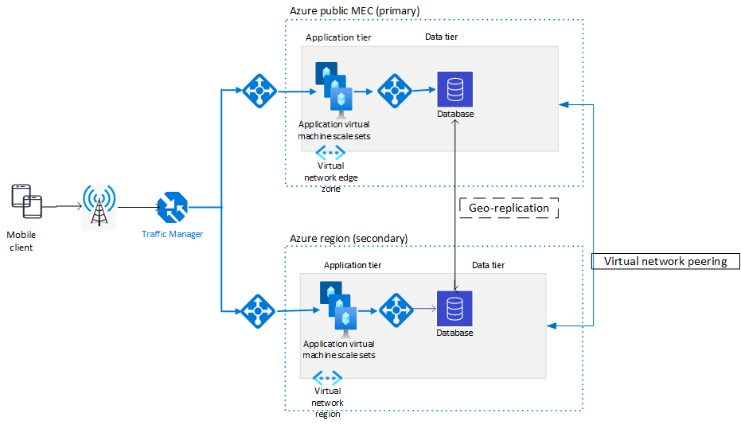

Azure public multi-access edge compute (MEC) is a great platform for hosting low latency applications that can use the 5G network, but it currently doesn't support availability zones, availability sets, or other availability options that are available in Azure regions. It doesn't provide an automatic method for failover if the resources in the Azure public MEC fail. This article describes how to deploy workloads in active/standby mode to achieve high availability and disaster recovery. 

*Apache®, Apache Ignite, Ignite, and the flame logo are either registered trademarks or trademarks of the Apache Software Foundation in the United States and/or other countries. No endorsement by The Apache Software Foundation is implied by the use of these marks.*

## Potential use cases

Use this architecture when you want to deploy workloads in active/standby mode to achieve high availability and disaster recovery. 

## Architecture 

 

*Download a [Visio file](https://arch-center.azureedge.net/edgezones-DR-architecture.vsdx) of this architecture.*

### Workflow

- **Azure Traffic Manager.** Traffic Manager is configured to use priority routing. The load balancer IP in *Azure public MEC (primary)* is set to Priority 1. The one in the secondary region is set to Priority 2. This configuration sends all traffic in the non-failover case to the Azure public MEC. 

   > [!NOTE] 
   > Traffic Manager for Azure public MEC doesn't currently support performance routing, which could dynamically determine the previously described routing based on the lowest latency to the endpoint.  
   - In this architecture, failback is automatically achieved after the virtual machines (VMs) and/or standard load balancer is back online. Traffic Manager determines that the workloads are up and reroutes traffic back to the primary Azure public MEC region. 

- **Load balancers.** 

   - Public load balancer. This load balancer fronts the application tier and balances traffic to the pool of VMs in the virtual machine scale set. 
   - Internal load balancer. This load balancer is used to access the database layer. Depending on the type of database you use for your application, you might not need a load balancer here, assuming other platform as a service (PaaS) services have their own load balancer. 

- **Azure Virtual Machine Scale Sets.** Most production deployments use Virtual Machine Scale Sets to dynamically scale their workloads based on traffic load. Azure public MEC also supports [Azure Kubernetes Service](/services/kubernetes-service) for cloud-native and container-based applications. 

- **Database tier.**

   - Azure public MEC doesn't currently support SQL database PaaS services like SQL Server on Azure Virtual Machines and Azure SQL Managed Instance. It also doesn't currently support NoSQL PaaS services like Azure Cosmos DB and Azure Managed Instance for Apache Cassandra. You can deploy third-party solutions that support SQL or NoSQL services and replication of data across their geo-distributed clusters. 

### Components

- [Azure public MEC](https://azure.microsoft.com/solutions/public-multi-access-edge-compute-mec) is an edge computing solution that brings together a portfolio of Microsoft compute, networking, and application services that are managed from the cloud. 
- [Azure Traffic Manager](https://azure.microsoft.com/services/traffic-manager) is a DNS-based traffic load balancer. You can use it to direct incoming DNS requests based on a routing method that you choose.
- [Azure Load Balancer](https://azure.microsoft.com/services/load-balancer) provides high availability and high performance for your apps.
- [Azure Virtual Machine Scale Sets](https://azure.microsoft.com/services/virtual-machine-scale-sets) enables you to manage and scale up to thousands of VMs.

### Alternatives 

[Azure Site Recovery](https://azure.microsoft.com/services/site-recovery) provides another way to support active/standby. The workloads are deployed only if there's a failure. This approach costs less than the one described previously because there are no idle resources. This alternative is suitable only for applications that allow for higher RTOs. 

## Considerations

### Performance 

Because Azure public MEC is designed to host latency-critical applications, failover to a secondary region increases the latency of the workloads and might not provide the same level of performance. Depending on the application and its sensitivity to this increased latency, you need to decide which of the services, if any, should fail over to the region. 

### Databases 

Data replication and backup are important when you rely on database failovers. Most Azure PaaS services have built-in support for geo-replication and creating read replicas across regions and geographies.  

> [!NOTE]
> Azure public MEC doesn't currently support PaaS services like SQL Managed Instance, SQL Server on Azure Virtual Machines, Azure Database for MySQL, or Azure Database for PostgreSQL. Third-party ISVs like Couchbase, MongoDB, and Apache can provide infrastructure as a service (IaaS) services that support geo-replication.

### Traffic Manager 

#### Failover options 

Traffic Manager supports multiple routing methods: performance, geographic, priority, and more. To best support low latency applications, dynamically send data to the region / Azure public MEC that's closest to the user. Performance routing isn't currently supported on Azure public MEC. The next best option is to statically prioritize the best location for an application. 

For a globally distributed application that has workloads distributed across multiple Azure public MECs and regions, use a nested routing method. Use geographic routing to split traffic to the correct region and then use priority routing to further split the traffic. 

#### Failback 

After the workloads in Azure public MEC are back up, Traffic Manager probes detect that it can take requests and automatically reroute traffic back to Azure public MEC. 

## Pricing

Azure public MEC is primarily used for low latency and real-time computation scenarios. Data is processed by the compute instances running in Azure public MEC. This architecture uses active/standby with a hot standby. That is, workloads in the secondary region won't be used unless there's a failover. 

This approach to deploying workloads as a standby incurs Azure deployment costs even though the workloads aren't used.

For more information about pricing:
- See [Azure pricing](https://azure.microsoft.com/pricing).
- Use the [Azure pricing calculator](https://azure.microsoft.com/pricing/calculator) to estimate the cost of implementing this solution.

For information about creating a cost-effective workload, see [Overview of the cost optimization pillar](/azure/architecture/framework/cost/overview) in the Azure Well-Architected Framework documentation.

## Next steps

- [Azure public MEC](https://azure.microsoft.com/solutions/public-multi-access-edge-compute-mec) 
- [Azure private MEC](https://azure.microsoft.com/solutions/private-multi-access-edge-compute-mec)
- [What is Traffic Manager?](/azure/traffic-manager/traffic-manager-overview)
- [What is Azure Load Balancer?](/azure/load-balancer/load-balancer-overview)
- [What are virtual machine scale sets?](/azure/virtual-machine-scale-sets/overview)
 
## Related resources
- [Azure public multi-access edge compute deployment](./public-multi-access-edge-compute-deployment.yml)
- [Hybrid architecture design](../../hybrid/hybrid-start-here.md)
- [Low-latency network connections for industry](../../solution-ideas/articles/low-latency-network.yml)
- [Video capture and analytics for retail](../../solution-ideas/articles/video-analytics.yml)
- [IoT device connectivity for healthcare facilities](../../solution-ideas/articles/healthcare-network.yml)
