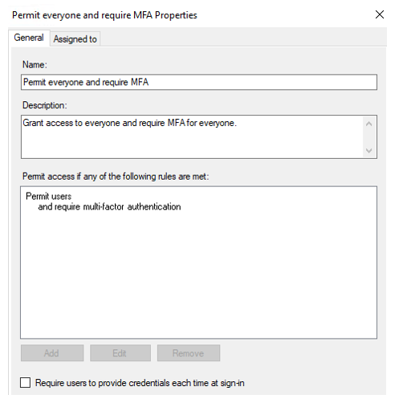
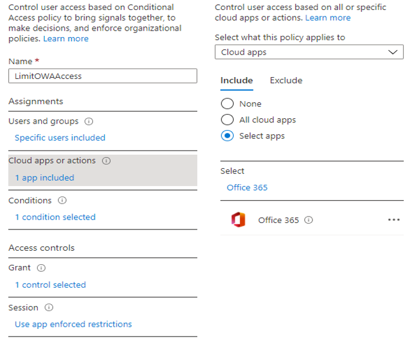
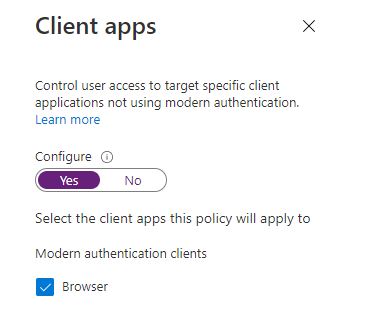
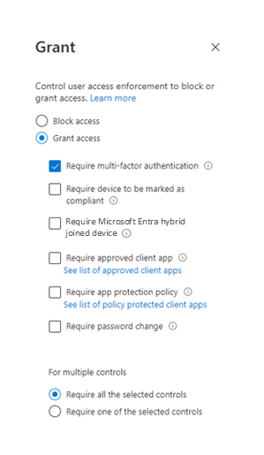

Enterprise messaging infrastructure (EMI) is a key service to organizations. Moving from older, less secure methods of authentication and authorization to modern authentication is a critical challenge in a world where remote work is common. Implementing multifactor authentication requirements for messaging service access is one of the most effective ways to meet that challenge. 

This article describes an architecture to help you enhance your security in a web access scenario by using Azure AD Multi-Factor Authentication.

## Potential use cases

This architecture is relevant for the following scenarios and industries:
- Enhance EMI security 
- Adopt a [Zero Trust](https://www.microsoft.com/security/business/zero-trust) security strategy 
- Apply your standard high level of protection for your on-premises messaging service during transition to or co-existence with Exchange Online
- Enforce strict security or compliance requirements in closed or highly secured organizations, like those in the finance sector

## Architecture 

In this discussion, we divide the solution into two areas, describing security for:
- Exchange Online. 
- Exchange on-premises in a hybrid or non-hybrid scenario. 

This article describes a web access scenario to help you protect your messaging service (Outlook on the web / Exchange Control Panel) when mailboxes are hosted in Exchange Online or Exchange on-premises.

For information about applying multifactor authentication in other hybrid messaging scenarios, see these articles:
- [Protecting a hybrid messaging infrastructure in a desktop-client access scenario](secure-hybrid-messaging-client.yml)
- [Protecting a hybrid messaging infrastructure in a mobile access scenario](secure-hybrid-messaging-mobile.yml)

This article doesn't discuss other protocols, like IMAP or POP, because we don't recommend that you use them to provide user access.

**General suggestions:**
- This architecture uses the [federated](/microsoft-365/enterprise/plan-for-directory-synchronization?view=o365-worldwide#federated-authentication) Azure Active Directory (Azure AD) Identity model. For the password hash syncronization and Pass-through Authentication models, the logic and the flow is the same. The only difference is related to the fact that Azure AD won't redirect the authentication request to on-premises Active Directory Federation Services (AD FS).
- Basic interactions between local Active Directory, Azure AD Connect, Azure AD, AD FS, and Web Application Proxy components are as described in [Hybrid identity required ports and protocols](/azure/active-directory/hybrid/reference-connect-ports).
- By *Exchange on-premises*, we mean Exchange 2019 with the latest updates, Mailbox role. 
- You can use Edge Transport server in these scenarios. It's not involved in the work with client protocols that's discussed here.
- In a real environment, you won't have just one server. You'll have a load-balanced array of Exchange servers for high availability. The scenarios described here are suited for that configuration.

**Exchange Online user's flow:**
1.	A user tries to access Outlook on the web service via https:\//outlook.office.com/owa. 
2.	Exchange Online redirects the user to Azure AD for authentication. 
    
    If the domain is federated, Azure AD redirects the user to the local AD FS instance for authentication. If authentication succeeds, the user is redirected back to Azure AD.
3.	To enforce multifactor authentication, Azure AD applies an Azure Conditional Access policy with a multifactor authentication requirement for the browser client application. See the [deployment section](#set-up-conditional-access-policy) of this article for information about setting up that policy.  
1. The Conditional Access policy calls Azure AD Multi-Factor Authentication. The user gets a request to complete multifactor authentication.
1.	The user completes multifactor authentication.
1.	Azure AD redirects the authenticated web session to Exchange Online, and the user can access Outlook.

**Exchange on-premises user's flow:**

1.	A user tries to access Outlook on the web service via a https:\//mail.contoso.com/owa URL that points to an Exchange server internally or a Web Application Proxy server externally. 
1.	Exchange on-premises (for internal access) or Web Application Proxy (for external access) redirects the user to AD FS for authentication.
1.	AD FS uses Integrated Windows authentication for internal access or provides a web form where the user can enter credentials for external access.
1.	Responding to an AF DS Access Control policy, AD FS calls Azure AD Multi-Factor Authentication to complete authentication. The user gets a request to complete multifactor authentication. Here's an example of that type of AD FS Access Control policy:

     

1.	The user completes multifactor authentication. AD FS redirects the authenticated web session to Exchange on-premises.
1.	The user can access Outlook. 

To implement this scenario for an on-premises user, you need to complete some additional configuration on Exchange and AD FS to configure AD FS usage for pre-authentication of web access requests. For more information, see [Use AD FS claims-based authentication with Outlook on the web](/exchange/clients/outlook-on-the-web/ad-fs-claims-based-auth?view=exchserver-2019). 

You also need to enable integration of AD FS and Azure AD Multi-Factor Authentication. For more information, see [Configure Azure MFA as authentication provider with AD FS](/windows-server/identity/ad-fs/operations/configure-ad-fs-and-azure-mfa). (This integration requires AD FS 2016 or 2019.) Finally, you need to synchronize users to Azure AD and assign them licenses for Azure AD Multi-Factor Authentication.

### Components

[Azure Active Directory]. Azure Active Directory (Azure AD) is Microsoft’s cloud-based identity and access management service. Modern authentication essentially based on EvoSTS (a Security Token Service used by Azure AD) and used as Auth Server for Skype for Business and Exchange server on-premises.

[Azure AD Multi-Factor Authentication]. Multi-factor authentication is a process where a user is prompted during the sign-in process for an additional form of identification, such as to enter a code on their cellphone or to provide a fingerprint scan.

[Azure Active Directory Conditional Access Conditional Access] is the tool used by Azure Active Directory to bring signals together, to make decisions, and enforce organizational policies such as MFA.

[Active Directory Federation Services]  Active Directory Federation Service (AD FS) enables Federated Identity and Access Management by securely sharing digital identity and entitlements rights across security and enterprise boundaries. In this architecture it is used to facilitate logon for users with federated identity. 

[Web Application Proxy] Web Application Proxy pre-authenticates access to web applications by using Active Directory Federation Services (AD FS), and also functions as an AD FS proxy.

[Microsoft Exchange Server]. Microsoft Exchange server hosts user mailboxes on premises. In this architecture, it will use tokens issued to the user by Azure Active Directory to authorize access to the mailbox.

[Active Directory services]. Active directory services stores information about members of the domain, including devices and users. In this architecture, user accounts belong to Active Directory Services and synchronized to Azure Active Directory.

### Alternatives

Azure Web Application Proxy [Application Proxy documentation] can be used as an alternative for ADFS and Web Application Proxy for Exchange On-premises web access services publishing, but there are following disadvantages:
- Lack of documentation for publishing Exchange
- Lack of Exchange specific scalability figures
- Uncomfortable naming (owa-company.msappproxy.net)

## Considerations

### Availability

Availability in each scenario will depend on the availability of the components involved.

For [Azure Active Directory Advancing Azure Active Directory availability | Azure Blog and Updates | Microsoft Azure]

For O365 availability [Cloud services you can trust: Office 365 availability].

For Azure Active Directory services [Architecture overview - Azure Active Directory | Microsoft Docs]

Availability of on-premises solution components will depend on implemented design, hardware availability and operations/maintenance routines performed by IT. 

ADFS availability is described [Setting up an AD FS Deployment with AlwaysOn Availability Groups | Microsoft Docs]

For Exchange server availability [Deploying high availability and site resilience in Exchange Server].

Web Application proxy  [Web Application Proxy in Windows Server | Microsoft Docs] 

### Performance

Performance will depend on the performance of the components involved and the company’s network performance. [Office 365 performance tuning using baselines and performance history - Microsoft 365 Enterprise | Microsoft Docs]

For on-premises factors influencing performance for scenarios including ADFS services

[Configure Performance Monitoring | Microsoft Docs]

[Fine Tuning SQL and Addressing Latency Issues with AD FS | Microsoft Docs]

### Scalability

For scenarios using AFDS addressing sizing and scalability [Planning for AD FS Server Capacity | Microsoft Docs].

Exchange on premises server scalability see [Exchange 2019 preferred architecture | Microsoft Docs]

### Security

Azure Active Directory Security [Azure Active Directory security operations guide | Microsoft Docs]

For scenarios using ADFS security the following topics should be addressed:

[Best Practices for securing AD FS and Web Application Proxy | Microsoft Docs]

[Configure AD FS Extranet Smart Lockout Protection | Microsoft Docs]

### Resiliency

For Azure Active Directory [Advancing Azure Active Directory availability | Azure Blog and Updates | Microsoft Azure]

For scenarios using ADFS [High availability cross-geographic AD FS deployment in Azure with Azure Traffic Manager | Microsoft Docs]

For Exchange on-premises solution [Exchange high availability].

## Deploy this scenario

Here are the high-level steps:
1.	Start from web access service and protect it with Azure Conditional Access policy for Exchange Online as described [here].
2.	Protect web access for On-premises EMI using ADFS claim-based authentication as described [here].

### Set up Conditional Access policy
To set up an Azure AD Conditional Access policy that enforces multifactor authentication, as described in step 3 of the online user's flow earlier in this article:
1.	Put “Office 365 Exchange Online” or “Office 365” as Cloud application:
    
    
1. Use “Browser” as a client application:
       
    
1. Apply MFA requirement in “Grant” control:
    
      

## Pricing

The cost of implementation will depend on Azure Active Directory Identity Management and Microsoft M365 license cost. Total implementation cost will also include software/hardware costs for on premises components, IT operations costs for the company, training and user education costs, and implementation project cost.

The solution will require at least Azure Active Directory Premium P1 

[Azure Active Directory Identity Management Pricing]

 [Exchange server pricing] 

For features ADFS and WAP see more on Windows Server pricing 

[Pricing and licensing for Windows Server 2022]

## Next steps

## Related resources

- Announcing Hybrid Modern Authentication for Exchange On-Premises - Microsoft Tech Community
- Hybrid Modern Authentication overview and prerequisites for use with on-premises Skype for Business and Exchange servers - Microsoft 365 Enterprise | Microsoft Docs
- Use AD FS claims-based authentication with Outlook on the web
- Exchange 2019 preferred architecture | Microsoft Docs
- High availability cross-geographic AD FS deployment in Azure with Azure Traffic Manager | Microsoft Docs
