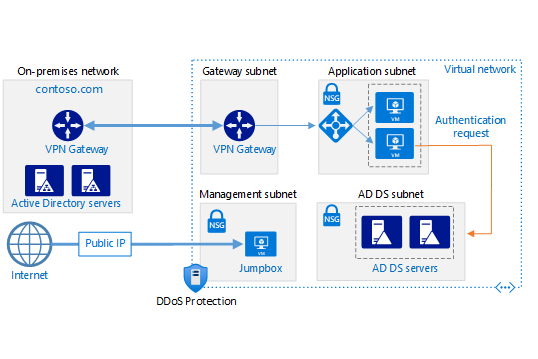

<!-- cSpell:ignore UDRs sysvol jumpbox -->

This architecture shows how to extend an on-premises Active Directory domain to Azure to provide distributed authentication services.

## Architecture

*Download a [Visio file][visio-download] of this architecture.*

This architecture extends the hybrid network architecture shown in [Connect an on-premises network to Azure using a VPN gateway](/azure/expressroute/expressroute-howto-coexist-resource-manager). 

### Workflow

- **On-premises network**. The on-premises network includes local Active Directory servers that can perform authentication and authorization for components located on-premises.
- **Active Directory servers**. These servers are domain controllers implementing directory services (AD DS) running as VMs in the cloud. They can provide authentication of components running in your Azure virtual network.
- **Active Directory subnet**. The Active Directory Domain Services (AD DS) servers are hosted in a separate subnet. Network security group (NSG) rules protect the AD DS servers and provide a firewall against traffic from unexpected sources.
- **Azure VPN Gateway and Active Directory synchronization**. VPN Gateway provides a connection between the on-premises network and Azure Virtual Network. This connection can be a [VPN connection][azure-vpn-gateway] or via [Azure ExpressRoute][azure-expressroute]. All synchronization requests between the Active Directory servers in the cloud and on-premises pass through the gateway. User-defined routes (UDRs) handle routing for on-premises traffic that passes to Azure.

### Components

- [Azure Active Directory (Azure AD)](https://azure.microsoft.com/products/active-directory) is an enterprise identity service that provides single sign-on, multifactor authentication, and conditional access.
- [VPN Gateway](https://azure.microsoft.com/products/vpn-gateway) is a service that uses a virtual network gateway to send encrypted traffic between an Azure virtual network and on-premises locations over the public internet. 
- [ExpressRoute](https://azure.microsoft.com/products/expressroute) enables you to extend your on-premises networks into the Microsoft cloud over a private connection with the help of a connectivity provider.
- [Virtual Network](https://azure.microsoft.com/products/virtual-network) is the fundamental building block for private networks on Azure. You can use it to enable Azure resources, like virtual machines, to communicate with each other, the internet, and on-premises networks.

## Scenario details 

If your application is hosted partly on-premises and partly in Azure, it might be more efficient to replicate AD DS in Azure. This replication can reduce the latency caused by sending authentication requests from the cloud back to AD DS running on-premises.

For more considerations, see [Choose a solution for integrating on-premises Active Directory with Azure][considerations].

### Potential use cases

This architecture is commonly used when the on-premises network and the Azure virtual network are connected by a VPN or ExpressRoute connection. This architecture also supports bidirectional replication, meaning changes can be made either on-premises or in the cloud, and both sources will be kept consistent. Typical uses for this architecture include hybrid applications in which functionality is distributed between on-premises and Azure, and applications and services that perform authentication using Active Directory.

## Recommendations

The following recommendations apply for most scenarios. Follow these recommendations unless you have a specific requirement that overrides them.

### VM recommendations

Determine your [VM size][vm-windows-sizes] requirements based on the expected volume of authentication requests. Use the specifications of the machines hosting AD DS on premises as a starting point, and match them with the Azure VM sizes. Once deployed, monitor utilization and scale up or down based on the actual load on the VMs. For more information about sizing AD DS domain controllers, see [Capacity Planning for Active Directory Domain Services][capacity-planning-for-adds].

Create a separate virtual data disk for storing the database, logs, and sysvol folder for Active Directory. Don't store these items on the same disk as the operating system. By default, data disks that are attached to a VM use write-through caching. However, this form of caching can conflict with the requirements of AD DS. For this reason, set the *Host Cache Preference* setting on the data disk to *None*.

Deploy at least two VMs running AD DS as domain controllers and add them to different [availability zones](/azure/availability-zones/az-overview). If not available in the region, deploy in an [availability set][availability-set].

### Networking recommendations

Configure the VM network interface (NIC) for each AD DS server with a static private IP address for full domain name service (DNS) support. For more information, see [How to set a static private IP address in the Azure portal][set-a-static-ip-address].

> [!NOTE]
> Don't configure the VM NIC for any AD DS with a public IP address. See [Security considerations][security-considerations] for more details.
>

The Active Directory subnet NSG requires rules to permit incoming traffic from on-premises and outgoing traffic to on-premises. For detailed information on the ports used by AD DS, see [Active Directory and Active Directory Domain Services Port Requirements][ad-ds-ports].

If the new domain controller VMs also have the role of DNS servers, we recommend that you configure them as custom DNS servers at the virtual network level, as explained in [Change DNS servers](/azure/virtual-network/manage-virtual-network#change-dns-servers). This should be done for the virtual network hosting the new domain controllers and peered networks where other VMs will need to resolve Active Directory domain names. For more information on how to configure hybrid DNS name resolution, see [Name resolution for resources in Azure virtual networks](/azure/virtual-network/virtual-networks-name-resolution-for-vms-and-role-instances).

### Active Directory site

In AD DS, a site represents a physical location, network, or collection of devices. AD DS sites are used to manage AD DS database replication by grouping together AD DS objects that are located close to one another and are connected by a high-speed network. AD DS includes logic to select the best strategy for replicating the AD DS database between sites.

We recommend that you create an AD DS site including the subnets defined for your application in Azure. Then, configure a site link between your on-premises AD DS sites, and AD DS will automatically perform the most efficient database replication possible. This database replication requires little beyond the initial configuration.

### Active Directory operations master

The operations master role can be assigned to AD DS domain controllers to support consistency checking between instances of replicated AD DS databases. There are five operations master roles (FSMO): schema master, domain naming master, relative identifier master, primary domain controller master emulator, and infrastructure master. For more information about these roles, see [Planning operations master role placement][ad-ds-operations-masters]. It's also recommended to give at least two of the new Azure DCs the Global Catalog (GC) role. More details on GC placement can be found [here](/windows-server/identity/ad-ds/plan/planning-global-catalog-server-placement).

### Monitoring

Monitor the resources of the domain controller VMs as well as the AD DS Services and create a plan to quickly correct any problems. For more information, see [Monitoring Active Directory][monitoring_ad]. You can also install tools such as [Microsoft Systems Center][microsoft_systems_center] on the monitoring server (see the architecture diagram) to help perform these tasks.

## Considerations

These considerations implement the pillars of the Azure Well-Architected Framework, which is a set of guiding tenets that you can use to improve the quality of a workload. For more information, see [Microsoft Azure Well-Architected Framework](/azure/architecture/framework).

### Reliability 

Reliability ensures that your application can meet the commitments you make to your customers. For more information, see [Overview of the reliability pillar](/azure/architecture/framework/resiliency/overview).

Deploy the VMs running AD DS into at least two [availability zones](/azure/availability-zones/az-overview). If availability zones aren't available in the region, use [availability sets][availability-set]. Also, consider assigning the role of [standby operations master][ad-ds-operations-masters] to at least one server, and possibly more, depending on your requirements. A standby operations master is an active copy of the operations master that can be used in place of the primary operations masters server during failover.

### Security 

Security provides assurances against deliberate attacks and the abuse of your valuable data and systems. For more information, see [Overview of the security pillar](/azure/architecture/framework/security/overview).

AD DS servers provide authentication services and are an attractive target for attacks. To secure them, prevent direct Internet connectivity by placing the AD DS servers in a separate subnet with an NSG acting as a firewall. Close all ports on the AD DS servers except those necessary for authentication, authorization, and server synchronization. For more information, see [Active Directory and Active Directory Domain Services Port Requirements][ad-ds-ports].

Use either BitLocker or Azure disk encryption to encrypt the disk hosting the AD DS database.

[Azure DDoS Protection Standard](/azure/ddos-protection/ddos-protection-overview), combined with application-design best practices, provides enhanced DDoS mitigation features to provide more defense against DDoS attacks. You should enable [Azure DDOS Protection Standard](/azure/ddos-protection/ddos-protection-overview) on any perimeter virtual network.

### Operational excellence 

Operational excellence covers the operations processes that deploy an application and keep it running in production. For more information, see [Overview of the operational excellence pillar](/azure/architecture/framework/devops/overview).

- Use Infrastructure as Code (IaC) practice, to provision and configure the network and security infrastructure. One option is [Azure Resource Manager templates][arm-template].

- Isolate workloads to enable DevOps to do continuous integration and continuous delivery (CI/CD), because every workload is associated and managed by its corresponding DevOps team.

In this architecture the entire virtual network that includes the different application tiers, management jumpbox, and Azure AD Domain Services is identified as a single isolated workload.

Virtual machines are configured by using Virtual Machine Extensions and other tools such as [Desired State Configuration (DSC)][dsc-overview], used to configure AD DS on the virtual machines.

- Consider using [Azure DevOps][az-devops] or any other CI/CD solutions to automate your deployments. [Azure Pipelines][az-pipelines] is the recommended component of Azure DevOps Services that brings automation for solution builds and deployments, it's also highly integrated in the Azure ecosystem.

- Use [Azure Monitor][azure-monitor] to analyze the performance of your infrastructure. It also allows you to monitor and diagnose networking issues without logging into your virtual machines. Application Insights provides rich metrics and logs to verify the state of your infrastructure.

For more information, see the DevOps section in [Microsoft Azure Well-Architected Framework][AAF-devops].

### Performance efficiency 

Performance efficiency is the ability of your workload to scale to meet the demands placed on it by users in an efficient manner. For more information, see [Performance efficiency pillar overview](/azure/architecture/framework/scalability/overview).

AD DS is designed for scalability. You don't need to configure a load balancer or traffic controller to direct requests to AD DS domain controllers. The only scalability consideration is to configure the VMs running AD DS with the correct size for your network load requirements, monitor the load on the VMs, and scale up or down as necessary.

### Manageability 

Perform regular AD DS backups. Don't copy the VHD files of domain controllers instead of performing regular backups, because the AD DS database file on the VHD might not be in a consistent state when it's copied, making it impossible to restart the database.

We don't recommend that you shut down a domain controller VM using the Azure portal. Instead, shut down and restart from the guest operating system. Shutting down through the Azure portal causes the VM to be deallocated, which results in the following effects when the domain controller VM is restarted:

1. Resets the `VM-GenerationID` and the `invocationID` of the Active Directory repository
2. Discards the current Active Directory relative identifier (RID) pool
3. Marks the sysvol folder as nonauthoritative

The first issue is relatively benign. Repeated resetting of the `invocationID` will cause minor additional bandwidth usage during replication, but this is usually not significant.

The second issue can contribute to RID pool exhaustion in the domain, especially if the RID pool size has been configured to be larger than the default. Consider that if the domain has been around for a very long time, or is used for workflows requiring repetitive creation and deletion of accounts, the domain might already be nearing RID pool exhaustion. It's a good practice to monitor the domain for RID pool exhaustion warning events – see the [Managing RID Issuance](/windows-server/identity/ad-ds/manage/managing-rid-issuance) article.

The third issue is relatively benign as long as an authoritative domain controller is available when a domain controller VM in Azure is restarted. If all domain controllers in a domain are running in Azure, and they are all simultaneously shut down and deallocated, on restart each domain controller will fail to find an authoritative replica. Fixing this condition requires manual intervention – see the [How to force authoritative and non-authoritative synchronization for DFSR-replicated sysvol replication](/troubleshoot/windows-server/group-policy/force-authoritative-non-authoritative-synchronization) article.

### Cost optimization

Cost optimization is about reducing unnecessary expenses and improving operational efficiencies. For more information, see [Overview of the cost optimization pillar](/azure/architecture/framework/cost/overview).

Use the [Azure pricing calculator][azure-pricing-calculator] to estimate costs. Other considerations are described in the Cost section in [Microsoft Azure Well-Architected Framework][aaf-cost].

Here are cost considerations for the services used in this architecture.

#### AD Domain Services

Consider having Active Directory Domain Services as a shared service that is consumed by multiple workloads to lower costs. For more information, see [Active Directory Domain Services pricing][ADDS-pricing].

#### VPN Gateway

The main component of this architecture is the VPN gateway service. You are charged based on the amount of time that the gateway is provisioned and available.

All inbound traffic is free, all outbound traffic is charged. Internet bandwidth costs are applied to VPN outbound traffic.

For more information, see [VPN Gateway pricing][azure-gateway-charges].

#### Virtual Network

Virtual Network is free. Every subscription is allowed to create up to 50 virtual networks across all regions. All traffic that occurs within the boundaries of a virtual network is free, so communication between two VMs in the same virtual network is free.

## Next steps

- [What is Azure Active Directory?](/azure/active-directory/fundamentals/active-directory-whatis)
- [Azure DevOps][az-devops]
- [Azure Pipelines][az-pipelines]
- [Azure Monitor][azure-monitor]
- [Active Directory and Active Directory Domain Services Port Requirements][ad-ds-ports]
- [Desired State Configuration (DSC)][dsc-overview]
- [Connect an on-premises network to Azure using a VPN gateway](/azure/expressroute/expressroute-howto-coexist-resource-manager)

## Related resources

- [Choose a solution for integrating on-premises Active Directory with Azure][considerations]
- [Create an AD DS resource forest in Azure][adds-resource-forest] 
- [Extend on-premises AD FS to Azure][adfs] 

<!-- links -->

[aaf-cost]: /azure/architecture/framework/cost/overview
[AAF-devops]: /azure/architecture/framework/devops/overview
[adds-resource-forest]: ../../reference-architectures/identity/adds-forest.yml
[adfs]: ../../reference-architectures/identity/adfs.yml
[dsc-overview]: /powershell/scripting/dsc/overview
[ad-ds-operations-masters]: /windows-server/identity/ad-ds/plan/planning-operations-master-role-placement
[ad-ds-ports]: /troubleshoot/windows-server/identity/config-firewall-for-ad-domains-and-trusts  
[arm-template]: /azure/azure-resource-manager/resource-group-overview#resource-groups
[availability-set]: /azure/virtual-machines/windows/tutorial-availability-sets
[azure-expressroute]: /azure/expressroute/expressroute-introduction
[azure-monitor]: https://azure.microsoft.com/services/monitor
[az-devops]: /azure/virtual-machines/windows/infrastructure-automation#azure-devops-services
[az-pipelines]: /azure/devops/pipelines/
[ADDS-pricing]: https://azure.microsoft.com/pricing/details/active-directory-ds
[availability-set]: /azure/virtual-machines/windows/tutorial-availability-sets
[azure-expressroute]: /azure/expressroute/expressroute-introduction
[azure-gateway-charges]: https://azure.microsoft.com/pricing/details/vpn-gateway
[azure-vpn-gateway]: /azure/vpn-gateway/vpn-gateway-about-vpngateways
[capacity-planning-for-adds]: https://social.technet.microsoft.com/wiki/contents/articles/14355.capacity-planning-for-active-directory-domain-services.aspx
[considerations]: ../../index.yml
[azure-pricing-calculator]: https://azure.microsoft.com/pricing/calculator
[microsoft_systems_center]: https://www.microsoft.com/download/details.aspx?id=50013
[monitoring_ad]: /windows-server/identity/ad-ds/plan/security-best-practices/monitoring-active-directory-for-signs-of-compromise
[security-considerations]: #security
[set-a-static-ip-address]: /azure/virtual-network/virtual-networks-static-private-ip-arm-pportal
[visio-download]: https://arch-center.azureedge.net/identity-architectures.vsdx
[vm-windows-sizes]: /azure/virtual-machines/sizes
