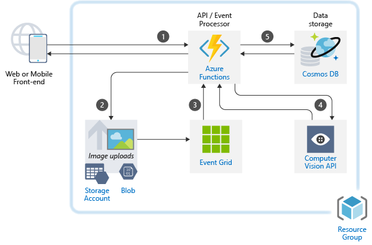
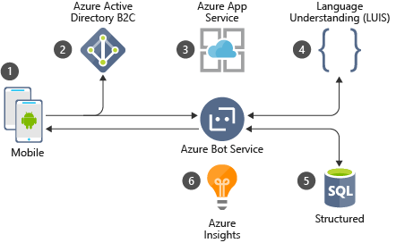
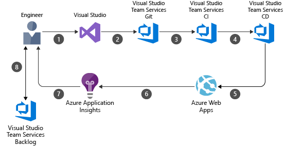
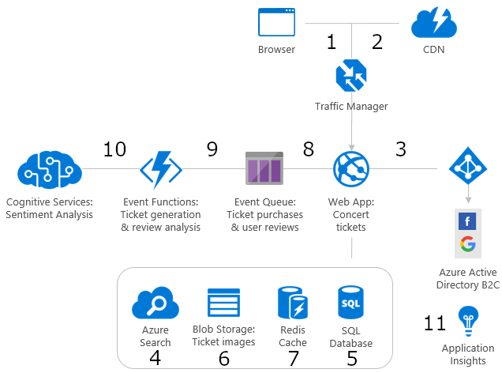
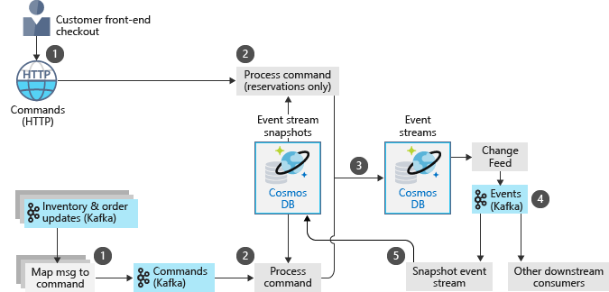
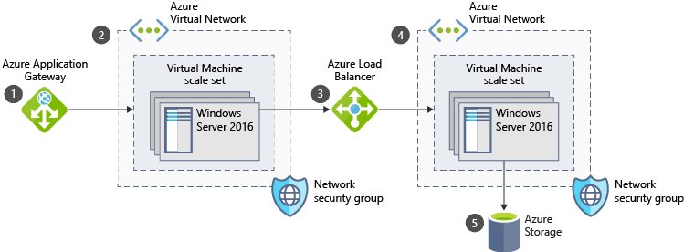
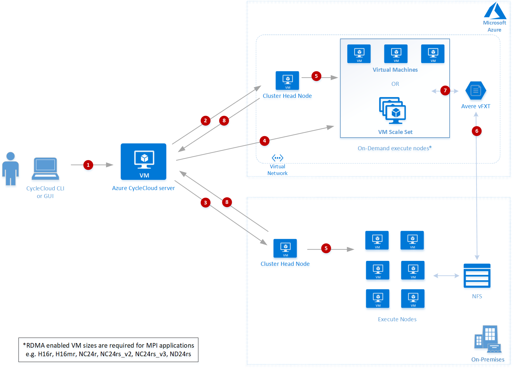

# Azure Example Scenarios

These example scenarios are based on real-world customer examples. They are intended to accelerate and facilitate building out your own use case. Each solution contains: a diagram of the architecture, explores some of the alternatives that you can substitute in to satisfy your own business need, rough pricing of the solution.  Most will also contain a method to easily deploy the solution in your own Azure account.

Jump to: [AI scenarios](#ai-scenarios) | [Application scenarios](#application-scenarios) | [Data scenarios](#data-scenarios) | [Infrastructure scenarios](#infrastructure-scenarios) 

<ul class="panelContent cardsL">
    <li>
        

            

                

                    

                        <h3>Featured landing pages</h3>
                        <a class="barLink" href="/en-us/azure/virtual-machines/linux/index" data-linktype="absolute-path">Donec ullamcorper non justo at tempor.</a>
                        <a class="barLink" href="/en-us/azure/virtual-machines/windows/index" data-linktype="absolute-path">Donec ornare augue ut fermentum porta.</a>
                    

                

            

        

    </li>
    <li>
        

            

                

                    

                        <h3>Quickstarts</h3>
                        

                            <a href="http://microsoft.com" data-linktype="external">
                                
                                Tech label
                            </a>
                        

                        

                            <a href="http://microsoft.com" data-linktype="external">
                                
                                Tech label
                            </a>
                        

                        

                            <a href="http://microsoft.com" data-linktype="external">
                                
                                Tech label
                            </a>
                        

                        

                            <a href="http://microsoft.com" data-linktype="external">
                                
                                Tech label
                            </a>
                        

                        

                            <a href="http://microsoft.com" data-linktype="external">
                                
                                Tech label
                            </a>
                        

                    

                

            

        

    </li>
    <li>
        

            

                

                    

                        <h3>More features</h3>
                        <a class="barLink" href="/en-us/azure/sql-database/index" data-linktype="absolute-path">Another landing page</a>
                    

                

            

        

    </li>
</ul>

## AI scenarios

<ul  class="panelContent cardsC">
<!-- SQL Data Warehouse -->
<li style="display: flex; flex-direction: column;">
    <a href="./ai/intelligent-apps-image-processing.md" style="display: flex; flex-direction: column; flex: 1 0 auto;">
        

            

                

                    

                        

                            
                        

                    

                    

                        <h3>Image processing</h3>
                        
Analyze images using cognitive services focused on the insurance industry.

                    

                

            

        

    </a>
</li>
</ul>

## Application scenarios

<ul  class="panelContent cardsC">
<li style="display: flex; flex-direction: column;">
    <a href="./apps/commerce-chatbot.md" style="display: flex; flex-direction: column; flex: 1 0 auto;">
        

            

                

                    

                        

                            
                        

                    

                    

                        <h3>Commerce chatbot</h3>
                        
Conversational chatbot that functions as a concierge for a hotel.

                    

                

            

        

    </a>
</li>
<li style="display: flex; flex-direction: column;">
    <a href="./apps/devops-dotnet-webapp.md" style="display: flex; flex-direction: column; flex: 1 0 auto;">
        

            

                

                    

                        

                            
                        

                    

                    

                        <h3>DevOps with VSTS</h3>
                        
DevOps pipeline that leverages VSTS. 

                    

                

            

        

    </a>
</li>
<li style="display: flex; flex-direction: column;">
    <a href="./apps/devops-with-aks.md" style="display: flex; flex-direction: column; flex: 1 0 auto;">
        

            

                

                    

                        

                            
                        

                    

                    

                        <h3>DevOps with AKS</h3>
                        
DevOps pipeline that leverages containers and jenkins.

                    

                

            

        

    </a>
</li>
<li style="display: flex; flex-direction: column;">
    <a href="./apps/ecommerce-scenario.md" style="display: flex; flex-direction: column; flex: 1 0 auto;">
        

            

                

                    

                        

                            
                        

                    

                    

                        <h3>E-commerce frontend</h3>
                        
E-commerce frontend to purchase tickets.

                    

                

            

        

    </a>
</li>
<li style="display: flex; flex-direction: column;">
    <a href="./apps/sap-dev-test.md" style="display: flex; flex-direction: column; flex: 1 0 auto;">
        

            

                

                    

                        

                            
                        

                    

                    

                        <h3>SAP for a dev/test environment</h3>
                        
SAP deployment for a dev/test environment.

                    

                

            

        

    </a>
</li>
</ul>

## Data scenarios

<ul  class="panelContent cardsC">
<li style="display: flex; flex-direction: column;">
    <a href="./data/ecommerce-order-processing.md" style="display: flex; flex-direction: column; flex: 1 0 auto;">
        

            

                

                    

                        

                            
                        

                    

                    

                        <h3>E-commerce order processing</h3>
                        
Scalable order processing pipeline.

                    

                

            

        

    </a>
</li>
<!-- ExpressRoute -->
<li style="display: flex; flex-direction: column;">
    <a href="./data/fraud-detection.md" style="display: flex; flex-direction: column; flex: 1 0 auto;">
        

            

                

                    

                        

                            
                        

                    

                    

                        <h3>Fraud detection</h3>
                        
Real-time fraud detection that analyzes mobile phone metadata.

                    

                

            

        

    </a>
</li>
</ul>

## Infrastructure scenarios

<ul class="panelContent cardsC">
<!-- Azure AD -->
<li style="display: flex; flex-direction: column;">
    <a href="./infrastructure/regulated-multitier-app.md" style="display: flex; flex-direction: column; flex: 1 0 auto;">
        

            

                

                    

                        

                            
                        

                    

                    

                        <h3>Regulated multi-tier app</h3>
                        
Securing multi-tier applications for regulated industries.

                    

                

            

        

    </a>
</li>
<li style="display: flex; flex-direction: column;">
    <a href="./infrastructure/video-rendering.md" style="display: flex; flex-direction: column; flex: 1 0 auto;">
        

            

                

                    

                        

                            
                        

                    

                    

                        <h3>HPC video rendering</h3>
                        
3d rendering using an HPC solution.

                    

                

            

        

    </a>
</li>
</ul>