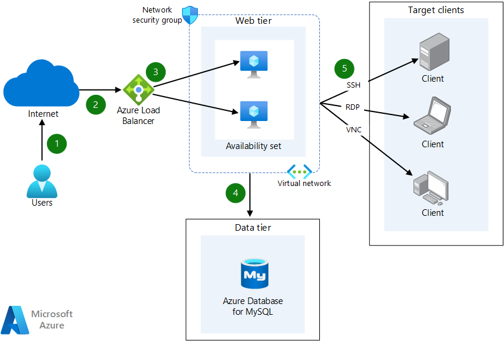

This example scenario describes a [high-availability](/azure/architecture/framework/resiliency/overview) solution for a jump server that runs on Azure. It uses an open-source tool called Apache Guacamole, which has functionality that's like that of [Azure Bastion](https://azure.microsoft.com/services/azure-bastion).

*Apache®, Apache Guacamole, and the flame logo are either registered trademarks or trademarks of the Apache Software Foundation in the United States and/or other countries. No endorsement by The Apache Software Foundation is implied by the use of these marks.*

## Architecture

The architecture includes a public load balancer that receives external access requests and directs them to two virtual machines (VMs) in the web layer. The web layer communicates with the data layer, where a MySQL database stores sign-in information, access events, and connections.

*Download a [Visio file](https://arch-center.azureedge.net/azure-architecture-guacamole.vsdx) of this architecture.*

### Dataflow

1. A user initiates a connection over the internet.
2. The connection from the user is established with the Azure public load balancer.
3. The Azure public load balancer receives external access and directs the traffic for the two VMs in the web tier.
4. The web tier communicates with Azure Database for MySQL in the data tier. This database stores sign-in information, access events, and connections.
5. The connection is established with the target clients via Secure Shell (SSH), Virtual Network Computing (VNC), or  Remote Desktop Protocol (RDP) protocol.

### Components

- [Azure Load Balancer](https://azure.microsoft.com/services/load-balancer): A service for distributing load (incoming network traffic) across a group of back-end resources or servers.
- [Azure Virtual Network](https://azure.microsoft.com/services/virtual-network): The fundamental building block for your private network on Azure.
- [Public IP addresses](/azure/virtual-network/ip-services/public-ip-addresses): A service that allows internet resources to communicate inbound to Azure resources.
- [Azure DDoS Protection Standard](/azure/ddos-protection/ddos-protection-overview), combined with application-design best practices, provides enhanced DDoS mitigation features to provide more defense against DDoS attacks. You should enable [Azure DDOS Protection Standard](/azure/ddos-protection/ddos-protection-overview) on any perimeter virtual network.
- [Network security groups](/azure/virtual-network/network-security-groups-overview): A service that filters network traffic traveling to and from Azure resources in an Azure virtual network.
- [Availability set](/azure/virtual-machines/availability-set-overview): A logical grouping of VMs that allows Azure to provide redundancy and availability.
- [Azure Database for MySQL](https://azure.microsoft.com/services/mysql): A fully managed MySQL database as a service.

### Alternatives

If you don't need as much control as the solution described here provides, you can use [Azure Bastion](https://azure.microsoft.com/services/azure-bastion), a fully managed service that offers high-security RDP and SSH access to VMs without any exposure through public IP addresses.

## Scenario details

Apache Guacamole is a clientless remote desktop gateway that supports standard protocols like VNC, RDP, and SSH. Because it's clientless, your users don't need to install anything. They just use a web browser to remotely access your VMs.

For more information about Guacamole and its internal components, see [Implementation and architecture](https://guacamole.apache.org/doc/gug/guacamole-architecture.html).

To provide high availability, this solution:

* Uses [availability sets](/azure/virtual-machines/availability#availability-sets) for VMs. For service-level agreements (SLAs), see [SLAs for Virtual Machines](https://azure.microsoft.com/support/legal/sla/virtual-machines/v1_9).
* Uses Azure Database for MySQL, a high-availability, scalable, managed database. For SLAs, see [SLAs for Azure Database for MySQL](https://azure.microsoft.com/support/legal/sla/mysql/v1_2).

The solution also uses:
- Load Balancer.
- VMs with [NGINX as a reverse proxy](https://docs.nginx.com/nginx/admin-guide/web-server/reverse-proxy).
- [Tomcat as an application service](https://tomcat.apache.org).
- [Certbot](https://certbot.eff.org) to get free Secure Sockets Layer (SSL) certificates from [Let's Encrypt](https://letsencrypt.org/).

### Potential use cases

* Access your computers from any device. Because Guacamole requires only a reasonably fast standards-compliant browser, it runs on many devices, including mobile phones and tablets.
* Host a computer in the cloud. Computers hosted on virtualized hardware are more resilient to failures. With the current availability of on-demand computing resources, Guacamole is a perfect way to access machines that are accessible only over the internet.
* Provide easy access to a group of people. You can use Guacamole to centralize access to a large group of machines and specify on a per-user basis which machines can be accessed. Rather than remember a list of machines and credentials, users only need to  sign in to a central server and select one of the listed connections.
* Add HTML5 remote access to your existing infrastructure. Because Guacamole is an API and not just a web application, you can use the core components and libraries provided by the Guacamole project to add HTML5 remote access features to an existing application. You don't need to use the main Guacamole web application. You can write or integrate with your own applications fairly easily.

## Considerations

These considerations implement the pillars of the Azure Well-Architected Framework, which is a set of guiding tenets that you can use to improve the quality of a workload. For more information, see [Microsoft Azure Well-Architected Framework](/azure/architecture/framework).

### Reliability

Reliability ensures your application can meet the commitments you make to your customers. For more information, see [Overview of the reliability pillar](/azure/architecture/framework/resiliency/overview).

This solution's resiliency depends on the failure modes of individual services like Azure Virtual Machines, Azure Database for MySQL, and Azure Load Balancer. For more information, see these articles:
- [Design for reliability](/azure/architecture/framework/resiliency/design-checklist) 
- [Resiliency in Azure](/azure/availability-zones/overview)
- [Resiliency checklist for specific Azure services](/azure/architecture/checklist/resiliency-per-service)

For information about disaster recovery, see
[Business continuity and disaster recovery](/azure/cloud-adoption-framework/ready/landing-zone/design-area/management-business-continuity-disaster-recovery).

For Azure VMs in the web tier, you can use [availability sets](/azure/virtual-machines/availability-set-overview#what-is-an-availability-set) to create a logical grouping of VMs that provides redundancy and availability. We recommend at least two VMs per availability set to create a high-availability application and meet the [Azure SLA](https://azure.microsoft.com/support/legal/sla/virtual-machines).

Because Azure Database for MySQL is a managed database as a service, its architecture is optimized for built-in high availability. For information about SLAs, see [SLAs for Azure Database for MySQL](/azure/mysql/concepts-high-availability).

### Security

Security provides assurances against deliberate attacks and the abuse of your valuable data and systems. For more information, see [Overview of the security pillar](/azure/architecture/framework/security/overview).

You might want to add [Azure Web Application Firewall](/azure/web-application-firewall/overview) to this solution. It helps protect your application from common vulnerabilities. This Azure Application Gateway option uses Open Web Application Security Project (OWASP) rules to help prevent attacks like cross-site scripting, session hijacking, and other exploits.

As an added layer of protection, be sure to use [Azure network security groups](/azure/virtual-network/network-security-groups-overview) to filter network traffic traveling to and from Azure resources in the Azure virtual network.

You should also consider [Private Link for Azure Database for MySQL](/azure/mysql/single-server/concepts-data-access-security-private-link). You can use Private Link to connect to platform as a service (PaaS) services in Azure via a private endpoint. Private Link essentially brings Azure services inside your private virtual network. PaaS resources can be accessed via the private IP address just like any other resource in the virtual network.

Finally, follow [these security guidelines](/azure/security/fundamentals/overview) when you implement this solution.

### Cost optimization

Cost optimization is about finding ways to reduce unnecessary expenses and improve operational efficiencies. For more information, see [Overview of the cost optimization pillar](/azure/architecture/framework/cost/overview).

To better understand the cost of running this scenario on Azure, use the [pricing calculator](https://azure.microsoft.com/pricing/calculator).

For more information about the cost of this solution, see:

* [Linux Virtual Machines pricing](https://azure.microsoft.com/pricing/details/virtual-machines/linux)
* [Azure Database for MySQL pricing](https://azure.microsoft.com/pricing/details/mysql/server)
* [Load Balancer pricing](https://azure.microsoft.com/pricing/details/load-balancer)
* [Azure Reserved Virtual Machine Instances](https://azure.microsoft.com/pricing/reserved-vm-instances)

### Operational excellence

Operational excellence covers the operations processes that deploy an application and keep it running in production. For more information, see [Overview of the operational excellence pillar](/azure/architecture/framework/devops/overview).

Operational excellence applies reliability, predictability, and automated operations to your architecture to keep your application running in production. Deployments must be reliable and predictable. Automated deployments reduce the chance of human error.

Implement software engineering disciplines across your entire environment, including these practices:
- Implement [Infrastructure as Code](/devops/deliver/what-is-infrastructure-as-code).
- Build and release with [continuous integration](/devops/develop/what-is-continuous-integration) and [continuous delivery](/devops/deliver/what-is-continuous-delivery) (CI/CD) pipelines.
- Use automated testing.

For more information, see [Operational excellence design principles](/azure/architecture/framework/devops/principles).

### Performance efficiency

Performance efficiency is the ability of your workload to scale to meet the demands placed on it by users in an efficient manner. For more information, see [Performance efficiency pillar overview](/azure/architecture/framework/scalability/overview).

To accomplish this goal, consider using [Azure Virtual Machine Scale Sets](/azure/virtual-machine-scale-sets/overview), which you can use to create and manage a group of load-balanced VMs. The number of VM instances can automatically increase or decrease in response to demand or according to a defined schedule.

## Deploy this scenario

We recommend that you use the Bash environment in [Azure Cloud Shell](/azure/cloud-shell/quickstart) to deploy this solution. If you'd rather run commands in your own Windows, Linux, or macOS environment, [install the Azure CLI](/cli/azure/install-azure-cli).

For deployment steps, see [Deploying Apache Guacamole on Azure](https://github.com/Azure/Deploying-Apache-Guacamole-on-Azure).

## Contributors

*This article is maintained by Microsoft. It was originally written by the following contributors.*

Principal author:

 - [Ricardo Macedo Martins](https://www.linkedin.com/in/ricmmartins) | Sr. Customer Engineer
 
 Other contributor:
- [Mick Alberts](https://www.linkedin.com/in/mick-alberts-a24a1414) | Technical Writer 

*To see non-public LinkedIn profiles, sign in to LinkedIn.*

## Next steps

* [Apache Guacamole documentation](https://guacamole.apache.org/doc/gug/administration.html)
* [Azure Bastion documentation](/azure/bastion/bastion-overview)
* [What is Azure Load Balancer?](/azure/load-balancer/load-balancer-overview)
* [Azure Database for MySQL](/azure/mysql)
* [Learn module: Introduction to Azure Bastion](/training/modules/intro-to-azure-bastion)
* [Learn module: Introduction to Azure Load Balancer](/training/modules/intro-to-azure-load-balancer)
 
## Related resources

- [Build solutions for high availability using availability zones](../../high-availability/building-solutions-for-high-availability.yml)
- [Build high availability into your BCDR strategy](../../solution-ideas/articles/build-high-availability-into-your-bcdr-strategy.yml)
- [Baseline zone-redundant web application](/azure/architecture/web-apps/app-services/architectures/baseline-zone-redundant)
- [Highly available multi-region web application](/azure/architecture/web-apps/app-services/architectures/multi-region)
