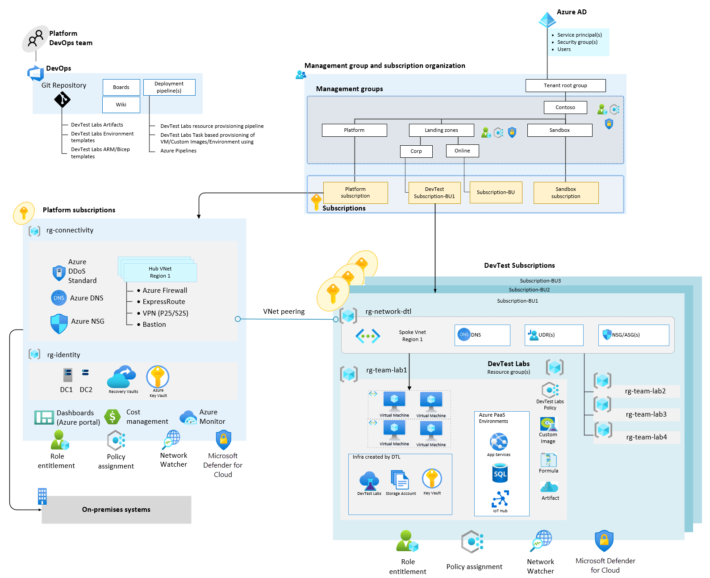

This article provides an architecture approach to prepare your [Azure DevTest Labs](/azure/devtest-labs/devtest-lab-overview) (DTL or Lab) in an Enterprise Scale Landing Zone (ESLZ) with a focus on its [design guidelines](/azure/cloud-adoption-framework/ready/enterprise-scale/design-guidelines).

## Architecture

In the architecture for DTL in an enterprise, the platform foundation is typically set up by the platform administrator per the guidelines provided in ESLZ for centralized networking, identity, and governance. For information about the setup of ESLZ platform, see [Implement enterprise-scale landing zones in Azure](/azure/cloud-adoption-framework/ready/enterprise-scale/implementation).

The application team’s responsibility lies with provisioning the core DTL resources in the **DevTest subscriptions**, shown in the bottom-right of the following diagram. Doing so uses the already set up foundation. The policies applied to **Management groups** trickle down to the DevTest subscription and resources.

Although DTL alone doesn't have built-in limits, other Azure resources used in the lab might extend beyond the Azure subscription limits. In these cases, multiple Azure subscriptions might be needed to cover large deployments of DTL.

[Download a Visio file of this architecture.](https://arch-center.azureedge.net/devtest-labs-reference-architecture-enterprise.vsdx)

### Dataflow

- The Network Administrator creates a spoke virtual network and other network resources like NSG, UDR in the network resource group that is peered with the hub virtual network. The peering is created by Azure policies assigned to the Corp management group per the ESLZ automation. This peering lets corporate users access the lab VMs over VPN/ExpressRoute with a private IP.
- The lab Owner configures built-in lab policies per project requirements. You can review all available policies at [Manage all policies for a lab in Azure DevTest Labs](/azure/devtest-labs/devtest-lab-set-lab-policy). Here are a few policies relevant to this article:
   - Configure the virtual network setting so that all lab VMs are created in the spoke virtual network.
   - Configure lab settings so that all lab VMs are created in the designated lab resource group. In this way, they won't be distributed across multiple resource groups.
   - Enable Browser Connect to use the Bastion host deployed in hub virtual network to secure RDP/SSH access to lab VMs over Internet without public IP.
   - Configure lab users and assign appropriate roles based on least privilege. DTL provides three built-in roles: Owner, Contributor, and User.
   - Configure the domain join artifact as a mandatory artifact in the lab if there's a requirement to domain join the Lab virtual machine.
   - Configure a private Github/ADO repository in the lab for artifacts and environment templates. The repository can be used to store application codebase as well.
- The Application Team can spin up the lab resources (VMs and PaaS environments) manually or they can set up Azure Pipelines to deploy resources using DTL tasks.

### Resource topology

Within the DevTest subscription, streamlining the resource group organization for labs improves the maintainability of the resources. Traditionally in an enterprise, the network-related resources are controlled by network administrators and are isolated from the application resources using separate resource groups.

Lab resources can be distributed within two resource groups within the DevTest subscription, as shown in the above diagram:

- Network resource group (rg-network-dtl) containing the virtual network, NSG, Routes. The network resources can be shared across multiple labs within the same Subscription.
- Lab resource group (rg-team-lab1) containing the core lab resources. By default, DTL creates a resource group for every new virtual machine and is good if you want this isolation. If not, you can change this configuration to deploy all VMs in the same resource group. Multiple teams might share a DTL or spin up a separate DTL based on the team or project requirement.

On provisioning a DTL, the following infra resources get created automatically:

- **Key Vault:** DTL users can use KeyVault to store a password for Windows VM, a public SSH key for Linux VM, or a personal access token to clone a Git repo through an artifact.
- **Storage Account:** DTL uses storage accounts for the following purposes:
  - Storing formula documents that can be used to create virtual machines
  - Storing artifact results, including deployment and extension logs generated from applying artifacts
  - Uploading virtual hard disks (VHDs) to create custom images in the lab
  - Caching frequently used artifacts and Azure Resource Manager templates for faster retrieval during virtual machine and environment creation
- **Virtual network:** DTL creates a default virtual network unless an existing virtual network is provided. In this architecture, an existing spoke virtual network peered with the hub virtual network is recommended.

### Components

- [Enterprise-scale landing zone (ESLZ)](/azure/cloud-adoption-framework/ready/enterprise-scale/implementation) is an architectural approach and a reference implementation that enables effective construction and operationalization of landing zones on Azure, at scale. Azure Landing Zones are the output of a multi-subscription Azure environment that accounts for scale, security, governance, networking, and identity. DTL can be deployed in the DevTest landing zone or sandbox subscription as discussed in [Management group and subscription topology](#management-group-and-subscription-topology).
- [Azure DevTest Labs (DTL)](/azure/devtest-labs/devtest-lab-overview) is a fully managed service that developers and testers use to quickly provision development and test environments. DTL lets users create virtual machines and PaaS resources. While VM creation is supported natively, creation of PaaS resources can be achieved using environment templates.
- [DTL policies](/azure/devtest-labs/devtest-lab-set-lab-policy) let you control costs and minimize waste in your labs by managing policies (settings) for each lab. Using DTL policy, you can minimize lab waste by specifying which VM sizes are allowed in the lab. If this policy is active, only VM sizes from the list can be used to create VMs.
- [Hub and spoke](/azure/architecture/reference-architectures/hybrid-networking/hub-spoke) configurations provide benefits that include cost savings, overcoming subscription limits, and workload isolation. The hub virtual network acts as a central point of connectivity to many spoke virtual networks and to on-premises networks. The spoke virtual networks peer with the hub and can be used to isolate workloads. DTL can be placed in the spoke network so that Enterprises can have a central control over security features, such as a firewall in the hub as a DMZ, Express Route/VPN connectivity, and segregated management for the workload. Traditionally, the virtual networks, including the spoke virtual network, is provided by the platform administrator. The app team can provision the DTL in the specified subnet. More details are provided in [Networking Topology](#networking-topology).
- [Azure Bastion](https://azure.microsoft.com/services/azure-bastion) is a fully managed service that provides more secure and seamless Remote Desktop Protocol (RDP) and Secure Shell Protocol (SSH) access to VMs without any exposure through public IP addresses. DTL can use the Bastion host to securely RDP/SSH to VMs without exposing them directly over the Internet as discussed in [Networking Topology](#networking-topology). By default, DTL allows connectivity to VM through Public IP or [Shared Public IP](/azure/devtest-labs/devtest-lab-shared-ip).
- [DTL artifacts](/azure/devtest-labs/add-artifact-vm) let you specify actions that are performed when the virtual machine is provisioned, such as running Windows PowerShell scripts, running Bash commands, and installing software. Artifact parameters let you customize the artifact for your scenario. The public artifact repository, maintained by DevTest Labs, provides many common tools for both Windows and Linux. A link to this repository is automatically added to your lab.
- A [formula](/azure/devtest-labs/devtest-lab-manage-formulas) in Azure DevTest Labs is a list of default property values used to create a virtual machine.
- [DTL environments](/azure/devtest-labs/devtest-lab-create-environment-from-arm) let users deploy complex infrastructures in a consistent way within the confines of the lab. You can use Azure Resource Manager templates to create environments with sets of resources in DevTest Labs. These environments can contain any Azure resources that Resource Manager templates can create.

### Alternatives

Customers can build a solution similar to DevTest Labs by putting together multiple services with Azure native features like Policies, RBAC Groups, VM Extensions, and Automation.

The primary advantage of using DevTest Labs is its out-of-the-box integrated features and intuitive interface, which makes it easy for new users (Admins and Developers) who don't have deep skills on Azure. In this way, DTL saves time and effort in implementation and maintenance.

## Scenario details

DTL helps developers within teams to efficiently self-manage virtual machines (VMs) and PaaS resources without waiting for approvals, providing a worry-free self-service environment. It adds great value for key scenarios, especially when you're getting started on Azure, such as developer desktops, test environments, training sessions and sandboxed investigations. The built-in lab policies and thresholds help to effortlessly reduce costs. To learn more about the core concepts of DTL, see [DevTest Labs concepts](/azure/devtest-labs/devtest-lab-concepts).

This article includes recommendations across Management group and Subscription topology, Networking, Identity, Enterprise Agreement offers, Application automation, and Security for DevTest workloads in the context of DTL.

Enterprises migrating DevTest workloads at large scale can benefit from setting up this enterprise-scale architecture and can achieve:

- Reduced operational overhead for application teams as they can focus on their application development/testing with DTL and leave all the platform management, networking, security, and identity setup with a Central IT team.
- Centralized enforcement of organizational compliance across DevTest workloads.

## Potential use cases

This architecture is useful for organizations who require:

- A fully integrated operations control plane for DevTest workloads from the start.
- A clear separation of concerns between platform and application workloads.

Traditionally, this architecture would serve as a starting point for large-scale deployments of DevTest workloads across subscriptions.

## Considerations

These considerations implement the pillars of the Azure Well-Architected Framework, which is a set of guiding tenets that can be used to improve the quality of a workload. For more information, see [Microsoft Azure Well-Architected Framework](/azure/architecture/framework).

### Security

Security provides assurances against deliberate attacks and the abuse of your valuable data and systems. For more information, see [Overview of the security pillar](/azure/architecture/framework/security/overview).

This [security baseline](/security/benchmark/azure/baselines/devtest-labs-security-baseline) applies guidance from the Azure Security Benchmark version 2.0 to DTL.

#### Governance and compliance

The following links address governance and compliance for DTL:

- Addresses the [governance and management](/azure/devtest-labs/devtest-lab-guidance-governance-resources) of resources in DTL
- Provides guidance on governing company [policy and compliance](/azure/devtest-labs/devtest-lab-guidance-governance-policy-compliance) for DTL infrastructure
- Provides information that helps you [align ownership](/azure/devtest-labs/devtest-lab-guidance-governance-cost-ownership#define-role-based-access-across-your-organization) across your DTL environment
- Discusses governance related to [application migration and integration](/azure/devtest-labs/devtest-lab-guidance-governance-application-migration-integration) for DTL

#### Identity and Access Management

Enterprise organizations typically follow a least-privileged approach to operational access designed through Azure AD, [Azure role-based access control](/azure/role-based-access-control/overview) (RBAC), and custom role definitions. The RBAC roles enable management of DTL resources, such as create virtual machines, create environments, and start, stop, restart, delete, and apply artifacts.

- Access to labs can be configured to segregate duties within your team into different [roles](/azure/devtest-labs/devtest-lab-add-devtest-user). Three of these RBAC roles are Owner, DevTest Labs User, and Contributor. The DTL resource should be owned by those who understand the project and team requirements for budget, machines, and required software. A common model is the project-lead or the app-admin as the lab owner and the team members as lab users. The Contributor role can be assigned to app-infra members who need permissions to manage lab resources. Lab owner is responsible for configuring the policies and adding the required users to the lab.
- For enterprises that require users to connect with domain-based identities, a domain controller added to the Platform subscription can be used to domain-join DTL VMs. [DTL artifacts](/azure/devtest-labs/devtest-lab-concepts#artifacts) provide a way to domain-join VMs automatically. By default, DTL virtual machines use a local admin account.
- DTL supports [managed identities](/azure/devtest-labs/configure-lab-identity) for its Azure resources. Use managed identities with DTL to access Key Vault, Storage, and to deploy VMs and PaaS resources. Assign [user-assigned managed identities](/azure/devtest-labs/enable-managed-identities-lab-vms) on your lab VMs in DTL to let lab VM users access Azure resources.

#### Networking topology

Organizations often operate with regional [hub-spoke network topology](/azure/cloud-adoption-framework/ready/azure-best-practices/define-an-azure-network-topology#traditional-azure-networking-topology) where the hub and spokes are deployed into separate virtual networks and subscriptions are connected through [peering](/azure/virtual-network/virtual-network-peering-overview).

As seen in the preceding architecture diagram, DTL resources use the existing spoke virtual networks that are peered with the hub virtual network. The hub virtual network, which is part of the Platform subscription, enables secure connectivity through RDP/SSH access to:

- DTL virtual machines using private IP for internal users through VPN/ER. Connectivity to on-premises environments is also required in hybrid application scenarios where some of the required components are still on-premises, such as database and Active Directory domain.
- DTL virtual machines using private IP for external users through [Bastion Host over the internet](/azure/bastion/vnet-peering). Organizations can also configure [remote desktop gateway](/windows-server/remote/remote-desktop-services/desktop-hosting-logical-architecture) in DTL instead of using traditional RDP connection over Internet if they don't prefer to browser-connect through Bastion.

The hub-spoke design helps minimize direct exposure of DTL resources to the public internet, provides workload isolation, and makes the architecture extensible. Certain resources, such as a firewall and DNS, can be shared across spoke networks.

DTL also provides the capability of directly connecting with VMs through Public IP or [Shared IP](/azure/devtest-labs/devtest-lab-shared-ip) if permitted by organizational compliance.

### Cost optimization

Cost optimization is about looking at ways to reduce unnecessary expenses and improve operational efficiencies. For more information, see [Overview of the cost optimization pillar](/azure/architecture/framework/cost/overview).

- The Azure DevTest Labs service by itself is free. However, costs are attributed to other Azure resources that are created in the lab, such as Storage, Key Vault, and VMs. Pricing details are provided at [Azure DevTest Labs pricing](https://azure.microsoft.com/pricing/details/devtest-lab). You can also use the Azure [cost calculator](https://azure.microsoft.com/pricing/calculator) to estimate your cost.
- The link provides information on how the built-in features of DevTest Labs help you optimize, track, and control cost.
  - [Use policies to optimize cost](/azure/devtest-labs/devtest-lab-set-lab-policy)
  - [Track and control cost](/azure/devtest-labs/devtest-lab-configure-cost-management)
  - Further optimize cost with [DevTest Benefits](/azure/devtest-labs/devtest-lab-guidance-governance-cost-ownership#optimize-for-cost)
  - Azure [Well-architected framework](/azure/devtest-labs/devtest-lab-guidance-governance-cost-ownership#optimize-for-cost) provided guidance on managing costs to maximize the value delivered

#### Enterprise Agreement for DevTest

Enterprise Agreement customers have a great way to run their development and testing workloads on Azure by signing up for lower rates on dev/test workloads as described at [Enterprise Dev/Test](https://azure.microsoft.com/offers/ms-azr-0148p). Enabling the DevTest subscription within the Azure Enterprise portal lets an organization:

- Run client operating systems that aren't typically available in an Azure enterprise subscription
- Use enterprise software in which they pay only for the compute
- Feel confident about licensing

### Operational excellence

Operational excellence covers the operations processes that deploy an application and keep it running in production. For more information, see [Overview of the operational excellence pillar](/azure/architecture/framework/devops/overview).

#### Application Automation and DevOps

In the context of DTL, automation involves:

- Provisioning of DTL instance. Consistent and repeatable deployment of DTL with policies using [ARM/Bicep templates](/azure/templates/microsoft.devtestlab/labs?tabs=bicep) stored in GIT repository. Automation can be achieved through any CI/CD framework.
- Provisioning of resources within DTL using Azure DevOps. Automation with the Azure Pipelines Marketplace extension, [Azure DevTest Labs Tasks](https://marketplace.visualstudio.com/items?itemName=ms-azuredevtestlabs.tasks) to create and delete lab VMs, custom images, and environments.
- Provisioning of Artifacts and PaaS [Environments](/azure/devtest-labs/devtest-lab-create-environment-from-arm) with DTL built-in automation. Configure [private custom repository](/azure/devtest-labs/devtest-lab-add-artifact-repo) (ADO or GitHub) in the lab or use the [public repository](https://github.com/Azure/azure-devtestlab) available for storing and automating artifacts and environment templates deployment.

There are many other ways to automate Azure and DevTest Labs, including REST APIs, PowerShell, Azure CLI, and Azure SDK.

Integration of DTL with Azure DevOps for development and operations is described at [Integrate Azure DevTest Labs and Azure DevOps](/azure/devtest-labs/devtest-lab-dev-ops). Also, Azure Architecture Center provides an article for [DevTest and DevOps for IaaS](/azure/architecture/solution-ideas/articles/dev-test-iaas).

#### Management group and subscription topology

A well-designed topology for [Management Groups](/azure/cloud-adoption-framework/ready/enterprise-scale/management-group-and-subscription-organization) & [Subscriptions](/azure/cloud-adoption-framework/decision-guides/subscriptions), along with organizational structure and compliance requirements, ensures proper isolation and maximum flexibility for future growth. The management group and subscription setup are the responsibility of the Platform owner who provides the required access to the Application administrator or lab Owner to provision the lab.

As shown in the preceding architecture diagram, application teams can deploy DTL in a subscription under a landing zone management group or sandbox management group, based on these few decision points:

- If the global organizational compliance defined in the landing zone management group is valid for DevTest workloads, then the DTL can be deployed in a non-production landing zone subscription under a Corp or Online management group based on the requirement for connectivity with an on-premises environment. In this case, all Azure policies applied to the landing zone management groups for compliance will be inherited by all the subscriptions under it. This includes DTL Resources along with its admin configured policies.
- DTL can also be configured in a sandbox environment for exploration, training, and investigation. In this case, DTL can be deployed in a subscription under a sandbox management group, which has minimal restrictions and lets users have the freedom to explore.

## Contributors

*This article is maintained by Microsoft. It was originally written by the following contributors.*

Principal author:

- [Vidya Narasimhan](https://in.linkedin.com/in/vidya-narasimhan-124ba393) | Senior Cloud Solution Architect

*To see non-public LinkedIn profiles, sign in to LinkedIn.*

## Next steps

- For guidance on Enterprise Scale Landing Zone setup, see [Implement enterprise-scale landing zones](/azure/cloud-adoption-framework/ready/enterprise-scale/implementation).
- [Establish initial network topology and design](/azure/devtest-labs/devtest-lab-guidance-orchestrate-implementation#milestone-1-establish-initial-network-topology-and-design) shows you how to rapidly implement Azure DevTest Labs.

## Related resources

- [Azure DevTest Labs reference architecture for enterprises](/azure/devtest-labs/devtest-lab-reference-architecture)
- [DevTest Labs in the enterprise](/azure/devtest-labs/devtest-lab-guidance-prescriptive-adoption)
- [Migrate a dev/test environment to Azure DevTest Labs](/azure/cloud-adoption-framework/migrate/azure-best-practices/contoso-migration-devtest-to-labs)
- [DevTest and DevOps for IaaS solutions](/../../solution-ideas/articles/dev-test-iaas)
