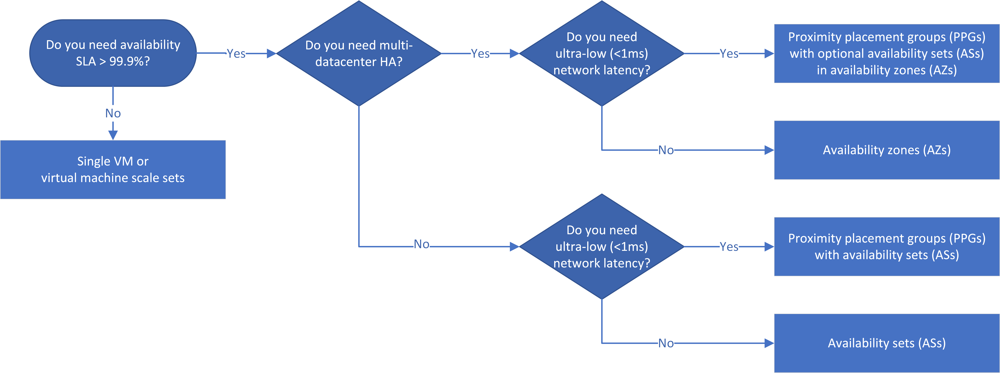

This article presents a decision tree and examples of high-availability (HA) and disaster recovery (DR) options when deploying multitier infrastructure-as-a-service (IaaS) apps to Azure.

## Architecture

### Workflow

[Availability sets](/azure/virtual-machines/windows/manage-availability) (ASs) provide VM redundancy and availability within a datacenter by distributing VMs across multiple isolated hardware nodes. A subset of VMs keeps running during planned or unplanned downtime, so the entire app remains available and operational.

[Availability zones](/azure/availability-zones/az-overview) (AZs) are unique physical locations that span datacenters within an Azure region. Each AZ accesses one or more datacenters that have independent power, cooling, and networking, and each AZ-enabled Azure region has a minimum of three separate AZs. The physical separation of AZs within a region protects deployed VMs from datacenter failure.

The decision flowchart reflects the principle that HA apps should use AZs if possible. Cross-zone, and therefore cross-datacenter, HA provides > 99.99% SLA because of resilience to datacenter failure.

ASs and AZs for different app tiers aren't guaranteed to be within the same datacenters. If app latency is a primary concern, you should colocate services in a single datacenter by using [proximity placement groups](https://azure.microsoft.com/blog/introducing-proximity-placement-groups) (PPGs) with AZs and ASs.

### Components

- [Azure Site Recovery](https://azure.microsoft.com/services/site-recovery)
- [Azure Virtual Machines](https://azure.microsoft.com/services/virtual-machines)
- [Azure Disk Storage](https://azure.microsoft.com/services/storage/disks)

### Alternatives

- As an alternative to regional DR using Azure Site Recovery, if the app can replicate data natively, you can implement *multi-region DR* using hot/cold standby servers, such as a stretched cluster for DR only. This alternative isn't specifically detailed in the examples, but could be added to any of the solutions. Note that replication between regions is asynchronous, and some data loss is expected.

  Alternatively, if you have your own data replication technology, you can use it to create a secondary in-region zone for DR. Depending on the region of your workloads, it might also be possible to use Azure Site Recovery to replicate items to an alternative zone, you can check regional availability and read more about this feature at [Enable Zone to Zone Disaster Recovery for Azure virtual machines](/azure/site-recovery/azure-to-azure-how-to-enable-zone-to-zone-disaster-recovery).

- Multi-region HA is possible, but requires a global load balancer such as Front Door or Traffic Manager. For more information, see [Run an N-tier application in multiple Azure regions for high availability](../../reference-architectures/n-tier/multi-region-sql-server.yml).

## Scenario details

Multitier or [n-tier](../../guide/architecture-styles/n-tier.yml) architectures are common in traditional on-premises apps, so they're a natural choice for migrating on-premises apps to the cloud, or when developing apps for both on-premises and the cloud. N-tier architectures are typically implemented as IaaS apps divided into logical layers and physical tiers, with a top web or presentation tier, a middle business tier, and a data tier.

In an IaaS n-tier app, each tier runs on a separate set of VMs. The web and business tiers are stateless, meaning any VM in the tier can handle any request for that tier. The data tier is a replicated database, object storage, or file storage. Multiple VMs in each tier provide resiliency if one VM fails, and load balancers distribute requests across the VMs.

You can scale out tiers by adding more VMs to the pools, and use [virtual machine scale sets](/azure/virtual-machine-scale-sets/overview) to automatically scale out identical VMs. Because you use load balancers, you can scale out tiers without affecting app uptime.

If the service-level agreement (SLA) for an IaaS app requires > 99% availability, you can place VMs in *availability sets*, *availability zones*, and *proximity placement groups* to configure high availability for the app. The HA and DR solutions you choose depend on the required SLA, latency considerations, and regional DR requirements.

### Potential use cases

- Migrate an n-tier app from on-premises to the cloud.
- Deploy an n-tier app both on-premises and to the cloud.
- Configure high availability and disaster recovery for an IaaS app.

This solution can be used for any industry, including the following scenarios:

- Public sector applications
- Banking (finance industry)
- Healthcare

## Considerations

- AZs aren't available in all [Azure regions](https://azure.microsoft.com/global-infrastructure/regions).

- Decide which deployment option you want to use before you build the solution. Although possible, it's not easy to move from one option to another post-deployment. You would have to delete the VMs and recreate them from the underlying managed disks, which is an involved process.

- Make sure you can map your application against the selected solution. Many app layer resiliency patterns and designs are outside the scope of this decision tree.

- Three scenarios can lead to Azure VM reboots: unplanned hardware maintenance, unexpected downtime, and planned maintenance. For more information about these events and HA best practices to reduce their impact, see [Understand VM reboots, maintenance vs. downtime](/azure/virtual-machines/windows/manage-availability#understand-vm-reboots---maintenance-vs-downtime).

### Single VMs

If an app doesn't require > 99.9% availability, you don't need to configure it for HA, and can deploy single VMs. You can use virtual machine scale sets to automatically scale out identical VMs. Deploy single VMs without specifying a zone, so they're distributed throughout a region. These apps have an SLA of 99.9% if you use Azure Premium SSD disks.

Single VMs use the default service healing functionality built into all Azure datacenters. For predictable failures, this functionality typically uses live migration, but during unpredictable events, VMs might be rebooted or made unavailable.

### High availability

If the app requires an SLA of > 99.9%, design the app for HA. Use AZs if possible, because they provide datacenter fault tolerance. You can use ASs instead of AZs, but using ASs reduces availability from 99.99% to 99.95%, because ASs can't tolerate datacenter failure.

AZs are suitable for many clustered app scenarios, including [AlwaysOn SQL clusters](/sql/database-engine/availability-groups/windows/overview-of-always-on-availability-groups-sql-server), using *active-active*, *active-passive*, or a combination of both HA levels at each tier with fast failover. Synchronous replication is possible between any Database Management System (DBMS) nodes, because of the low latency of the cross-zonal network. You can also run a *stretched-cluster* configuration across zones, which has higher latency and supports asynchronous replication.

If you want to use a VM-based *cluster arbiter*, for example a *file-share witness*, place it in the third AZ, to ensure quorum isn't lost if any one zone fails. Alternatively, you might be able to use a cloud-based witness in another region.

All VMs in an AZ are in a single *fault domain* (FD) and *update domain* (UD), meaning they share a common power source and network switch, and can all be rebooted at the same time. If you create VMs across different AZs, your VMs are effectively distributed across different FDs and UDs, so they won't all fail or be rebooted at the same time. If you want to have redundant in-zone VMs as well as cross-zone VMs, you should place the in-zone VMs in ASs in PPGs to ensure they won't all be rebooted at once. Even for single-instance VM workloads that aren't redundant today, you can still optionally use ASs in the PPGs to allow for future growth and flexibility.

For deploying virtual machine scale sets across AZs, consider using [Orchestration mode](/azure/virtual-machine-scale-sets/orchestration-modes-api-comparison), currently in public preview, which allows combining FDs and AZs.

AZs with in-zone PPGs allow for one of the lowest network latencies in Azure, and an SLA of at least 99.99% because of multi-datacenter resiliency. Use [accelerated networking](/azure/virtual-network/create-vm-accelerated-networking-powershell) on the VMs where possible.

This solution might present a scenario where a service running on a VM in one zone needs to interact with a service in another zone. For example, there might be an active-active web tier and an active-passive database tier across zones. Some requests will cross zones, which introduces latency. While cross-zone latency is still very low, if you need to ensure the lowest possible latency, keep all network communications between app tiers within a zone.

### Latency considerations

Network latency depends, among other things, on the physical distance between deployed VMs. If an app requires very low latency between tiers, you can deploy it in a single datacenter, using a PPG with ASs for each tier. If possible, use accelerated networking on the VMs. This scenario allows for one of the lowest network latencies in Azure, and an SLA of 99.95%.

You can use the following tools to gain better insight into latency conditions for a variety of scenarios:

- To test the latency between VMs, see [Test VM network latency](/azure/virtual-network/virtual-network-test-latency).
- To test latency between zones, use the [AvZone-Latency-Test](https://github.com/Azure/SAP-on-Azure-Scripts-and-Utilities/tree/master/AvZone-Latency-Test). This test can help you determine which logical zones have the lowest latency for your subscription.
- To test latency between Azure regions, use [http://www.azurespeed.com/](http://www.azurespeed.com). This regularly updated tool can be useful when considering asynchronous replication between regions.

### Disaster recovery

DR considerations include *availability*, the ability of the app to keep running in a healthy state, and *data durability*, the preservation of data if a disaster happens.

HA failover should be fast, with no data loss, and have a very limited effect on service. In contrast, a traditional DR failover might have a longer associated *Recovery Time Objective (RTO)* and *Recovery Point Objective (RPO)*, and is asynchronous, with potential data loss.

You can take advantage of AZs for both HA and DR by using a different AZ for your DR solution. However, using a different AZ doesn't guarantee that the datacenters in each AZ will be located physically far apart.

[Azure Site Recovery](/azure/site-recovery/azure-to-azure-quickstart) lets you replicate VMs to another Azure region for regional disaster recovery and business continuity. You can use Azure Site Recovery to recover your apps in the event of source region outages, or to conduct periodic disaster recovery drills to ensure you meet compliance requirements.

If your app supports Azure Site Recovery, you can provide a regional DR solution for increased protection, if the criticality of the app demands it. However, cross-zone, cross-datacenter HA alone might be sufficient protection, because if an app is fully resilient to datacenter failure, there should be no downtime or data loss.

### Cost optimization

There's no additional cost for VMs deployed in AZs. There might be additional inter-AZ VM-to-VM data transfer charges. For more information, see the [Bandwidth pricing page](https://azure.microsoft.com/pricing/details/bandwidth).

## Contributors

*This article is maintained by Microsoft. It was originally written by the following contributors.*

Principal author:

* [Shaun Croucher](https://uk.linkedin.com/in/shaun-croucher-64b251185) | Senior Consultant

## Next steps

- [Availability sets](/azure/virtual-machines/windows/manage-availability)
- [Availability zones](/azure/availability-zones/az-overview)
- [Virtual machine scale sets](/azure/virtual-machine-scale-sets/overview)
- [Enable Zone to Zone Disaster Recovery for Azure virtual machines](/azure/site-recovery/azure-to-azure-how-to-enable-zone-to-zone-disaster-recovery)

## Related resources

- [N-tier architecture style](../../guide/architecture-styles/n-tier.yml)
- [Multitier web application built for high availability and disaster recovery on Azure](../../example-scenario/infrastructure/multi-tier-app-disaster-recovery.yml)
- [Run a zone-redundant web application for high availability](../../web-apps/app-services/architectures/baseline-zone-redundant.yml)
- [Run a web application in multiple Azure regions for high availability](../../web-apps/app-services/architectures/multi-region.yml)
- [Run an N-tier application in multiple Azure regions for high availability](../../reference-architectures/n-tier/multi-region-sql-server.yml)
