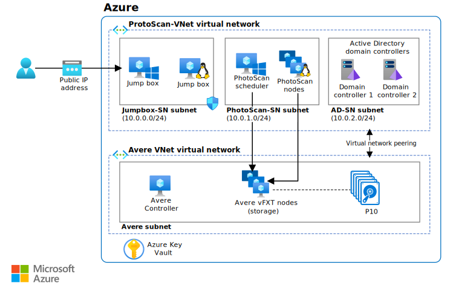

This example scenario provides architecture and design guidance for any organization that wants to perform image-based modeling on Azure infrastructure-as-a-service (IaaS). The scenario is designed for running photogrammetry software on Azure Virtual Machines (VMs) using high-performance storage that accelerates processing time. The environment can be scaled up and down as needed and supports terabytes of storage without sacrificing performance.

## Architecture

*Download a [Visio file](https://arch-center.azureedge.net/architecture-image-modeling.vsdx) of this architecture.*

### Workflow

1. User submits a number of images to PhotoScan.
2. The PhotoScan Scheduler runs on a Windows VM that serves as the head node and directs processing of the user's images.
3. PhotoScan searches for common points on the photographs and constructs the geometry (mesh) using the PhotoScan processing nodes running on VMs with graphics processing units (GPUs).
4. [Avere vFXT for Azure](/azure/avere-vfxt) provides a high-performance storage solution on Azure based on Network File System version 3 (NFSv3) and comprised of at least four VMs.
5. PhotoScan renders the model.

### Components

- [Agisoft PhotoScan](http://www.agisoft.com): The PhotoScan Scheduler runs on a Windows 2016 Server VM, and the processing nodes use five VMs with GPUs that run CentOS Linux 7.5.
- [Avere vFXT for Azure](https://azure.microsoft.com/services/storage/avere-vfxt) is a file caching solution that uses object storage and traditional network-attached storage (NAS) to optimize storage of large datasets. It includes:
  - Avere Controller. This VM executes the script that installs the Avere vFXT cluster and runs Ubuntu 18.04 LTS. The VM can be used later to add or remove cluster nodes and to destroy the cluster as well.
  - vFXT cluster. At least three VMs are used, one for each of the Avere vFXT nodes based on Avere OS 5.0.2.1. These VMs form the vFXT cluster, which is attached to Azure Blob storage.
- [Microsoft Active Directory domain controllers](/windows/desktop/ad/active-directory-domain-services) allow the host access to domain resources and provide DNS name resolution. Avere vFXT adds a number of A records &mdash; for example, each A record in a vFXT cluster points to the IP address of each Avere vFXT node. In this setup, all VMs use the round-robin pattern to access vFXT exports.
- [Other VMs](/azure/virtual-machines) serve as jump boxes used by the administrator to access the scheduler and processing nodes. The Windows jumpbox is mandatory to allow the administrator to access the head node via remote desktop protocol. The second jumpbox is optional and runs Linux for administration of the worker nodes.
- [Network security groups](/azure/virtual-network/manage-network-security-group)  limit access to the public IP address (PIP) and allow ports 3389 and 22 for access to the VMs attached to the Jumpbox subnet.
- [Virtual network peering](/azure/virtual-network/virtual-network-peering-overview) connects a PhotoScan virtual network to an Avere virtual network.
- [Azure Blob storage](https://azure.microsoft.com/services/storage/blobs) works with Avere vFXT as the core filer to store the committed data being processed. Avere vFXT identifies the active data stored in Azure Blob and tiers it into solid-state drives (SSD) used for caching in its compute nodes while a PhotoScan job is running. If changes are made, the data is asynchronously committed back to the core filer.
- [Azure Key Vault](https://azure.microsoft.com/services/key-vault) is used to store the administrator passwords and PhotoScan activation code.

### Alternatives

- To take advantage of Azure services for managing an HPC cluster, use tools such as Azure CycleCloud or Azure Batch instead of managing the resources through templates or scripts.
- Deploy the BeeGFS parallel virtual file system as the back-end storage on Azure instead of Avere vFXT. Use the [BeeGFS template](https://github.com/paulomarquesc/beegfs-template) to deploy this end-to-end solution on Azure.
- Deploy the storage solution of your choice, such as GlusterFS, Lustre, or Windows Storage Spaces Direct. To do this, edit the [PhotoScan template](https://github.com/paulomarquesc/photoscan-template) to work with the storage solution you want.
- Deploy the worker nodes with the Windows operating system instead of Linux, the default option. When choosing Windows nodes, storage integration options are not executed by the deployment templates. You must manually integrate the environment with an existing storage solution, or customize the PhotoScan template to provide such automation, as described in the [repository](https://github.com/paulomarquesc/photoscan-template/blob/master/docs/AverePostDeploymentSteps.md).

## Scenario details

This example describes the use of Agisoft PhotoScan photogrammetry software backed by Avere vFXT storage. PhotoScan was chosen for its popularity in geographic information system (GIS) applications, cultural heritage documentation, game development, and visual effects production. It is suitable for both close-range photogrammetry and aerial photogrammetry.

The concepts in this article apply to any high-performance computing (HPC) workload based on a scheduler and worker nodes managed as infrastructure.  For this workload, Avere vFXT was selected for its superior performance during benchmark tests.  However, the scenario decouples the storage from the processing so that other storage solutions can be used (see [alternatives](#alternatives) later in this document).

This architecture also includes Active Directory domain controllers to control access to Azure resources and provide internal name resolution through the Domain Name System (DNS). Jump boxes provide administrator access to the Windows and Linux VMs that run the solution.

### Potential use cases

Relevant use cases include:

- Modeling and measuring buildings, engineering structures, and forensic accident scenes.
- Creating visual effects for computer games and movies.
- Using digital images to indirectly generate measurements of objects of various scales as in urban planning and other applications.

## Considerations

These considerations implement the pillars of the Azure Well-Architected Framework, which is a set of guiding tenets that can be used to improve the quality of a workload. For more information, see [Microsoft Azure Well-Architected Framework](/azure/architecture/framework).

This scenario is designed specifically to provide high-performance storage for an HPC workload, whether it is deployed on Windows or Linux. In general, the storage configuration of the HPC workload should match the appropriate best practices used for on-premises deployments.

Deployment considerations depend on the applications and services used, but a few notes apply:

- When building high-performance applications, use Azure Premium Storage and [optimize the application layer](/azure/virtual-machines/windows/premium-storage-performance). Optimize storage for frequent access using Azure Blob [hot tier access](/azure/storage/blobs/access-tiers-overview).
- Use a storage [replication option](/azure/storage/common/storage-redundancy) that meets your availability and performance requirements. In this example, Avere vFXT is configured for high availability by default, with locally redundant storage (LRS). For load balancing, all VMs in this setup use the round-robin pattern to access vFXT exports.
- If the backend storage will be consumed by both Windows clients and Linux clients, use Samba servers to support the Windows nodes. A [version](https://github.com/paulomarquesc/beegfs-template) of this example scenario based on BeeGFS uses Samba to support the scheduler node of the HPC workload (PhotoScan) running on Windows. A load balancer is deployed to act like a smart replacement for DNS round robin.
- Run HPC applications using the VM type best suited for your [Windows](/azure/virtual-machines/windows/sizes-hpc) or [Linux](/azure/virtual-machines/linux/sizes) workload.
- To isolate the HPC workload from the storage resources, deploy each in its own virtual network, then use virtual network [peering](/azure/virtual-network/virtual-network-peering-overview) to connect the two. Peering creates a low-latency, high-bandwidth connection between resources in different virtual networks and routes traffic through the Microsoft backbone infrastructure through private IP addresses only.

### Security

Security provides assurances against deliberate attacks and the abuse of your valuable data and systems. For more information, see [Overview of the security pillar](/azure/architecture/framework/security/overview).

This example focuses on deploying a high-performance storage solution for an HPC workload and is not a security solution. Make sure to involve your security team for any changes.

For added security, this example infrastructure enables all the Windows VMs to be domain-joined and uses Active Directory for central authentication. It also provides custom DNS services for all VMs. To help protect the environment, this template relies on [network security groups](/azure/virtual-network/security-overview). Network security group offer basic traffic filters and security rules.

Consider the following options to further improve security in this scenario:

- Use network virtual appliances such as Fortinet, Checkpoint, and Juniper.
- Apply [Azure role-based access control (Azure RBAC)](/azure/role-based-access-control/overview) to the resource groups.
- Enable VM [JIT](/azure/security-center/security-center-just-in-time) access if jump boxes are accessed via the Internet.
- Use [Azure Key Vault](/azure/key-vault/quick-create-portal) to store the passwords used by administrator accounts.

### Cost optimization

Cost optimization is about looking at ways to reduce unnecessary expenses and improve operational efficiencies. For more information, see [Overview of the cost optimization pillar](/azure/architecture/framework/cost/overview).

The cost of running this scenario can vary greatly depending on multiple factors.  The number and size of VMs, how much storage is required, and the amount of time to complete a job will determine your cost.

The following sample cost profile in the [Azure pricing calculator](https://azure.com/e/42362ddfd2e245a28a8e78bc609c80f3) is based on a typical configuration for Avere vFXT and PhotoScan:

- 1 A1\_v2 Ubuntu VM to run the Avere controller.
- 3 D16s\_v3 Avere OS VMs, one for each of the Avere vFXT nodes that form the vFXT cluster.
- 5 NC24\_v2 Linux VMs to provide the GPUs needed by the PhotoScan processing nodes.
- 1 D8s\_v3 CentOS VM for the PhotoScan scheduler node.
- 1 DS2\_v2 CentOS used as administrator jumpbox.
- 2 DS2\_v2 VMs for the Active Directory domain controllers.
- Premium managed disks.
- General purpose v2 (GPv2) Blob storage with LRS and hot tier access (only GPv2 storage accounts expose the Access Tier attribute).
- Virtual network with support for 10 TB data transfer.

For details about this architecture, see the [e-book](https://azure.microsoft.com/resources/deploy-agisoft-photoscan-on-azure-with-azere-vfxt-for-azure-or-beegfs). To see how the pricing would change for your particular use case, choose different VM sizes in the pricing calculator to match your expected deployment.

## Deploy this scenario

For step-by-step instructions for deploying this architecture, including all the prerequisites for using either Avere FxT or BeeGFS, download the e-book [Deploy Agisoft PhotoScan on Azure With Avere vFXT for Azure or BeeGFS](https://azure.microsoft.com/resources/deploy-agisoft-photoscan-on-azure-with-azere-vfxt-for-azure-or-beegfs).

## Next steps

The following resources will provide more information on the components used in this scenario, along with alternative approaches for batch computing on Azure.

- Overview of [Avere vFXT for Azure](/azure/avere-vfxt/avere-vfxt-overview)
- [Agisoft PhotoScan](https://www.agisoft.com) home page
- [Azure Storage Performance and Scalability Checklist](/azure/storage/common/storage-performance-checklist)
- [Parallel Virtual File Systems on Microsoft Azure: Performance tests of Lustre, GlusterFS, and BeeGFS](https://azure.microsoft.com/mediahandler/files/resourcefiles/parallel-virtual-file-systems-on-microsoft-azure/Parallel_Virtual_File_Systems_on_Microsoft_Azure.pdf) (PDF)
- [HPC on Azure](https://azure.microsoft.com/solutions/high-performance-computing) home page
- Overview of [Big Compute: HPC &amp; Microsoft Batch](https://azure.microsoft.com/solutions/big-compute)
- [What is Azure Blob Storage?](/azure/storage/blobs/storage-blobs-overview)
- [About Azure Key Vault](/azure/key-vault/general/overview)

## Related resources

- An example scenario for [computer-aided engineering (CAE) on Azure](../../example-scenario/apps/hpc-saas.yml)
- [HPC media rendering](../../solution-ideas/articles/azure-batch-rendering.yml)
- [Image classification with convolutional neural networks (CNNs)](../../solution-ideas/articles/image-classification-with-convolutional-neural-networks.yml)
- [Gaming using Azure Database for MySQL](../../solution-ideas/articles/gaming-using-azure-database-for-mysql.yml)
