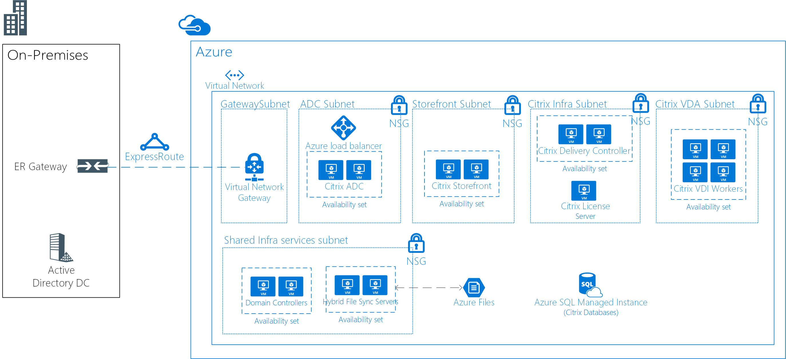

# Linux Virtual Desktops with Citrix

This example scenario is applicable to any industry that needs a Virtual Desktop Infrastructure (VDI) for Linux Desktops. VDI refers to the process of running a user desktop inside a virtual machine that lives on a server in the datacenter. The customer in this scenario chose to use a Citrix-based solution for their VDI needs.

Organizations often have heterogeneous environments with multiple devices and operating systems being used by employees. It can be challenging to provide consistent access to applications while maintaining a secure environment. A VDI solution for Linux desktops will allow your organization to provide access irrespective of the device or OS used by the end user.

Some benefits of this scenario include the following:

- Return on investment will be higher with shared Linux virtual desktops by giving more users access to the same infrastructure. By consolidating resources on a centralized VDI environment, the end user devices don't need to be as powerful.
- Performance will be consistent regardless of the end user device.
- Users can access Linux applications from any device (including non-Linux devices).
- Sensitive data can be secured in the Azure datacenter for all distributed employees.

## Relevant use cases

Consider this scenario for the following use case:

- Providing secure access to mission-critical, specialized Linux VDI desktops from Linux or non-Linux devices

## Architecture

This example scenario demonstrates allowing the corporate network to access the Linux Virtual Desktops:

- An ExpressRoute is established between the on-premises environment and Azure, for fast and reliable connectivity to the cloud.
- Citrix XenDeskop solution deployed for VDI.
- The CitrixVDA run on Ubuntu (or another supported distro).
- Azure network security groups will apply the correct network ACLs.
- Citrix ADC (NetScaler) will publish and load balance all the Citrix services.
- Active Directory Domain Services will be used to domain join the Citrix servers. VDA servers will not be domain joined.
- Azure Hybrid File Sync will enable shared storage across the solution. For example, it can be used in remote/home solutions.

For this scenario, the following SKUs are used:

- Citrix ADC (NetScaler): 2 x D4sv3 with [NetScaler 12.0 VPX Standard Edition 200 MBPS PAYG image](https://azuremarketplace.microsoft.com/pt-br/marketplace/apps/citrix.netscalervpx-120?tab=PlansAndPrice)
- Citrix License Server: 1 x D2s v3
- Citrix VDA: 4 x D8s v3
- Citrix Storefront: 2 x D2s v3
- Citrix Delivery Controller: 2 x D2s v3
- Domain Controllers: 2 x D2sv3
- Azure File Servers: 2 x D2sv3

> [!NOTE]
> All the licenses (other than NetScaler) are bring-your-own-license (BYOL)

### Components

- [Azure Virtual Network](/azure/virtual-network/virtual-networks-overview) allows resources such as VMs to securely communicate with each other, the internet, and on-premises networks. Virtual networks provide isolation and segmentation, filter and route traffic, and allow connection between locations. One virtual network will be used for all resources in this scenario.
- [Network security groups](/azure/virtual-network/security-overview) contain a list of security rules that allow or deny inbound or outbound network traffic based on source or destination IP address, port, and protocol. The virtual networks in this scenario are secured with network security group rules that restrict the flow of traffic between the application components.
- [Azure Load Balancer](/azure/application-gateway/overview) distributes inbound traffic according to rules and health probes. A load balancer provides low latency and high throughput, and scales up to millions of flows for all TCP and UDP applications. An internal load balancer is used in this scenario to distribute traffic on the Citrix NetScaler.
- [Azure Hybrid File Sync](https://github.com/MicrosoftDocs/azure-docs/edit/master/articles/storage/files/storage-sync-files-planning.md) will be used for all shared storage. The storage will replicate to two file servers using Hybrid File Sync.
- [Azure SQL Database](/azure/sql-database/sql-database-technical-overview) is a managed relational database service based on the latest stable version of the Microsoft SQL Server Database Engine. In this example, it is used to host Citrix databases.
- [ExpressRoute](/azure/expressroute/expressroute-introduction) lets you extend your on-premises networks into the Microsoft cloud over a private connection facilitated by a connectivity provider.
- [Active Directory Domain Services is used for Directory Services and user authentication
- [Azure Availability Sets](/azure/virtual-machines/windows/tutorial-availability-sets) will ensure that the VMs you deploy on Azure are distributed across multiple isolated hardware nodes in a cluster. Doing this ensures that if a hardware or software failure within Azure happens, only a subset of your VMs are affected and that your overall solution remains available and operational.
- [Citrix ADC (NetScaler)](https://www.citrix.com/products/citrix-adc) is an application delivery controller that performs application-specific traffic analysis to intelligently distribute, optimize, and secure Layer 4-Layer 7 (L4–L7) network traffic for web applications.
- [Citrix Storefront](https://www.citrix.com/products/citrix-virtual-apps-and-desktops/citrix-storefront.html) is an enterprise app store that improves security and simplifies deployments, delivering a modern, unmatched near-native user experience across Citrix Receiver on any platform. StoreFront makes it easy to manage multi-site and multi-version Citrix Virtual Apps and Desktops environments.
- [Citrix License Server](https://www.citrix.com/buy/licensing/overview.html) will manage the licenses for Citrix products.
- [Citrix XenDesktops VDA](https://docs.citrix.com/en-us/citrix-virtual-apps-desktops-service) enables connections to applications and desktops. The VDA is installed on the machine that runs the applications or virtual desktops for the user. It enables the machines to register with Delivery Controllers and manage the High Definition eXperience (HDX) connection to a user device.
- [Citrix Delivery Controller](https://docs.citrix.com/en-us/xenapp-and-xendesktop/7-15-ltsr/manage-deployment/delivery-controllers) is the server-side component responsible for managing user access, plus brokering and optimizing connections. Controllers also provide the Machine Creation Services that create desktop and server images.

### Alternatives

- There are multiple partners with VDI solutions that supported in Azure such as VMware, Workspot, and others. This specific sample architecture is based on a deployed project that used Citrix.
- Citrix provides a cloud service that abstracts part of this architecture. It could be an alternative for this solution. For more information, see [Citrix Cloud](https://www.citrix.com/products/citrix-cloud).

## Considerations

- Check the [Citrix Linux Requirements](https://docs.citrix.com/en-us/linux-virtual-delivery-agent/current-release/system-requirements).
- Latency can have impact on the overall solution. For a production environment, test accordingly.
- Depending on the scenario, the solution may need VMs with GPUs for VDA. For this solution, it is assumed that GPU is not a requirement.

### Availability, Scalability, and Security

- This example is designed for high availability for all roles other than the licensing server. Because the environment continues to function during a 30-day grace period if the license server is offline, no additional redundancy is required on that server.
- All servers providing similar roles should be deployed in [Availability Sets](/azure/virtual-machines/windows/manage-availability#configure-multiple-virtual-machines-in-an-availability-set-for-redundancy).
- This example scenario does not include Disaster Recovery capabilities. [Azure Site Recovery](/azure/site-recovery/site-recovery-overview) could be a good add-on to this design.
- Consider deploying the VM instances in this scenario across [Availability Zones](/azure/availability-zones/az-overview). Each availability zone is made up of one or more datacenters equipped with independent power, cooling, and networking. Each enabled region has a minimum of three availability zones. This distribution of VM instances across zones provides high availability to the application tiers. For more information, see [What are Availability Zones in Azure?](/azure/availability-zones/az-overview). You can also [deploy VPN and ExpressRoute gateways in Azure Availability Zones](/azure/vpn-gateway/about-zone-redundant-vnet-gateways).
- For a production deployment management solution should be implemented such as [backup](/azure/backup/backup-introduction-to-azure-backup), [monitoring](/azure/monitoring-and-diagnostics/monitoring-overview) and [update management](/azure/automation/automation-update-management).
- This example should work for about 250 concurrent (about 50-60 per VDA server) users with a mixed usage. But that will greatly depended on the type of applications being used. For production use, rigorous load testing should be performed.

## Deployment

For deployment information, see the official [Citrix documentation](https://docs.citrix.com/en-us/citrix-virtual-apps-desktops/install-configure.html).

## Pricing

- The Citrix XenDesktop licenses are not included in Azure service charges.
- The Citrix NetScaler license is included in a pay-as-you-go model.
- Using reserved instances will greatly reduce the compute cost for the solution.
- The ExpressRoute cost is not included.

## Next Steps

- Check Citrix documentation for planning and deployment [here](https://docs.citrix.com/en-us/citrix-virtual-apps-desktops/install-configure).
- To deploy Citrix ADC (NetScaler) in Azure, review the Resource Manager templates provided by Citrix [here](https://github.com/citrix/netscaler-azure-templates).
