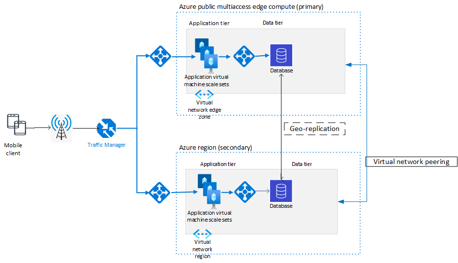

Azure public multiaccess edge compute is a great platform for hosting low latency applications that can use the 5G network, but it currently doesn't support availability zones, availability sets, or other availability options that are available in Azure regions. It doesn't provide an automatic method for failover if the resources in the public multiaccess edge compute fail. This article describes how to deploy workloads in active/standby mode to achieve high availability and disaster recovery. 

## Potential use cases

## Architecture 

 

*Download a [Visio file](https://arch-center.azureedge.net/edgezones-DR-architecture.vsdx) of this architecture.*

### Workflow

- **Azure Traffic Manager.** Traffic Manager is configured to use Priority routing. The Azure public multiaccess edge compute (primary) region load balancer IP is set to Priority 1. The one in the region is set to Priority 2. This configuration ensures that all traffic in the non-failover case is sent to the public multiaccess edge compute. 

   > [!NOTE] 
   > Traffic Manager for public multiaccess edge compute currently doesn't support Performance routing, which could have dynamically determined the previous routing based on the lowest latency to the endpoint.  
   - In this architecture, failback is automatically achieved after the virtual machines (VMs) and/or standard load balancer is back online. Traffic Manager determines that the workloads are up and reroutes traffic back to the primary public multiaccess edge compute region. 

- **Load balancers.** 

   - Public load balancer. This load balancer fronts the application tier and balances traffic to the pool of VMs in the virtual machine scale set. 

   - Internal load balancer. This load balancer is used to access the database layer. Depending on the type of database you use for your application, you might not need a load balancer, assuming other platform as a service (PaaS) services have their own load balancer. 

- **Azure Virtual Machine Scale Sets.** Most production deployments use Virtual Machine Scale Sets to dynamically scale their workloads based on traffic load. Azure public MEC also support Azure Kubernetes Service for cloud native and container-based applications. 

- **Database tier.**

   - Currently, Azure public MEC does not support Database SQL PaaS offerings (SQL Server, Managed Instance etc.) or NoSQL PaaS offerings (Cosmos DB, Cassandra etc.). 

   - You can deploy 3rd party ISVs that support SQL or NoSQL offerings and support replication of data across their geo distributed clusters. 

## Considerations

### Deployment 

Azure public MEC are primarily used for low latency and real time computation scenarios, and data would be processed by the compute instances running in the Azure public MEC. The above architecture highlights Active/Standby with a hot standby, i.e., all the workloads in the secondary region will not to be used unless in the case of failover. 

This approach of deploying workloads as a standby would incur Azure deployment costs even though they aren’t being used. 

### Performance 

Since Azure public MEC is designed to host latency critical applications, failover to a secondary region will increase the latency to their workloads and might not provide the same level of performance. Depending on the application and its sensitivity to this increased latency, customers would need to decide which or any of the services should failover to the region. 

### Databases 

Data Replication and backup is extremely important when it comes to Database failovers. Most of the Azure PaaS offerings have built-in support for Geo Replication and creating Read Replicas across regions and geographies.  

*Currently, there is not support for any PaaS offerings in Azure public MEC, but we are working to support Azure SQL Managed Instance, SQL Server, Azure MySQL, and Azure Postgres. 3rd party ISVs (Couchbase, MongoDB, Cassandra, SQL Server etc.) can provide IaaS (infrastructure as a service) offerings that support geo replication.*

 

### Traffic Manager 

#### Failover options 

Traffic Manager supports multiple routing methods: performance, geographic, priority and more. To best support low latency applications, it would be ideal to dynamically make the decision to send the data to the region/Azure public MEC which is closest to the user. Currently, Performance based routing is not supported on Azure public MEC and the best next option is to statically prioritize the location that would be ideal for an application. 

If we have a globally distributed application, with workloads distributed across multiple Azure public MEC and regions, using a nested routing method with geographic routing to split traffic to the corresponding region and then using Priority based routing to further split traffic. 

#### Failback 

After the workloads in the Azure public MEC are back up, ATM probes will detect that it can take requests and will automatically reroute traffic back to the Azure public MEC. 

## Alternatives 

[Azure  Site Recovery] provides another way to support Active/Standby and the workloads are deployed only in case of failure. This approach costs less to run as there would not be resources sitting idle as is the case for Active/Standby but will only be suitable for applications that allow for higher RTOs. 

## Related resources 

You can learn more about Azure Public MEC [here]. see note in source 

Links to other Azure Public MEC Architectures. 