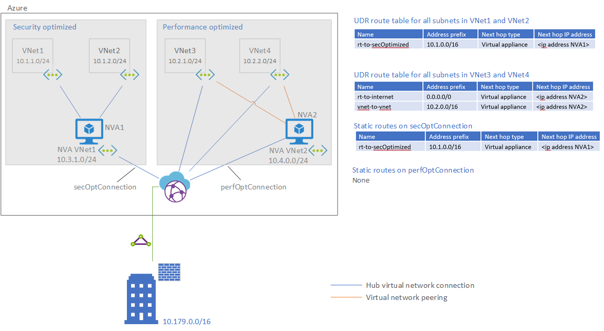
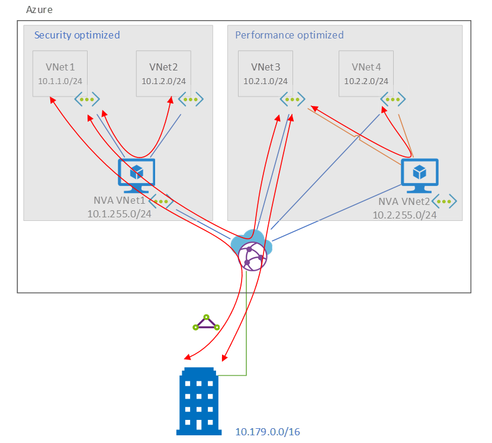
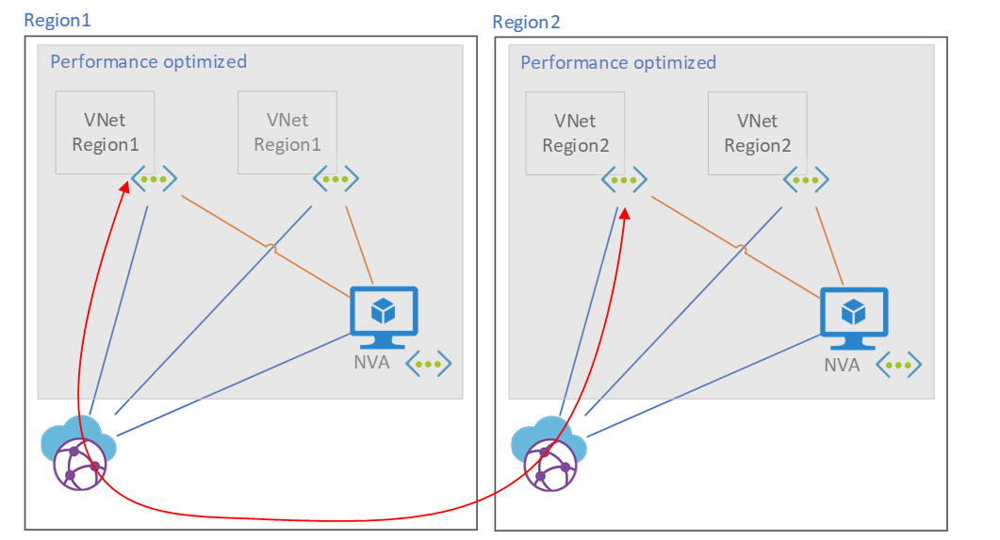

This architecture was provided by a global manufacturing company. The company's operational technology and information technology departments are highly integrated, demanding a single internal network. But the environments have drastically different security and performance requirements. Because of the sensitive nature of the company's operations, all traffic needs to be firewall protected, and an Intrusion Detection and Protection System (IDPS) solution needs to be in place. The information technology department has less demanding security requirements for the network, but that department wants to optimize for performance so users have low-latency access to IT applications. 

Decision makers at the company turned to Azure Virtual WAN to meet global needs for a single network with varying security and performance requirements. They also got a solution that's easy to manage, deploy, and scale, so as they add regions they can continue to grow seamlessly with a network that's highly optimized for their needs. 

## Potential use cases
Typical use cases for this architecture include:
- A global organization that requires a centralized file solution for business-critical work.
- High-performing file workloads that require localized cached files.
- A flexible remote workforce for users both in and out of the office.

## Architecture 

The architecture consists of:
- **Azure ExpressRoute**. ExpressRoute lets you extend your on-premises networks into the Microsoft cloud over a private connection, with the help of a connectivity provider.
- **Virtual WAN**. Virtual WAN is a networking service that brings networking, security, and routing functionalities together to provide a single operational interface.
- **Virtual WAN hub**. A virtual hub is a virtual network that's managed by Microsoft. The hub contains various service endpoints to enable connectivity.
- **Hub virtual network connections**. The hub virtual network connection resource connects the hub seamlessly to your virtual networks.
- **Static routes**. Static routes provide a mechanism for steering traffic through a next hop IP.
- **Hub route tables**. You can create a virtual hub route and apply the route to the virtual hub route table. 
- **Virtual network peering**. By using Virtual network peering, you can seamlessly connect two or more [virtual networks](/azure/virtual-network/virtual-networks-overview) in Azure.
- **Virtual networks**. Azure Virtual Network is the fundamental building block for your private network in Azure. Virtual Network enables many types of Azure resources, like Azure virtual machines (VMs), to communicate with each other, the internet, and on-premises networks with improved security. 
- **User-defined routes**. User-defined routes override the default Azure system routes or add more routes to a subnet's route table.

The company has multiple regions and continues to deploy regions to the model. The company deploys a security-optimized or performance-optimized environment only when needed. The environments route the following traffic through the network virtual appliance (NVA):

### Traffic pathways
| |||         |        | Destinations|      |        |           |
|--|--|--|--|--|--|--|--|--|
| ||**VNet1**        |**VNet2**   |**VNet3**   |**VNet4**   |**Branch**   |**Internet**   |
|**Security-optimized source**|**VNet1**|Intra VNet|NVA1-VNet2 |NVA1-hub-VNet3|NVA1-hub-VNet4|NVA1-hub-branch|NVA1-internet|
**Performance-optimized source**|	**VNet3**|	hub-NVA1-VNet1	|hub-NVA1-VNet2|Intra VNet|	NVA2-VNet4	|hub-branch|	NVA2-internet|
**Branch source**	|**Branch**|	hub-NVA1-VNet1|	hub-NVA1-VNet2|	hub-VNet3	|hub-VNet4|	Not applicable	|Not applicable|

As you can see in the preceding diagram, the company has provisioned and NVA and routing architecture that forces all traffic pathways in the security-optimized environment to use the NVA between the virtual networks and the hub in a common layered architecture. 

The performance-optimized environment has a more customized routing schema. This schema provides a firewall and traffic inspection where it's needed but doesn't provide a firewall where it's not needed. VNet-to-VNet traffic in the performance-optimized space is forced through NVA2, but branch-to-VNet traffic is able to go directly across the hub. Likewise, anything headed to the secure environment doesn't need to go to NVA VNet2 because it will be inspected at the edge of the secure environment by the NVA in NVA VNet1. The result is high speed access to the branch! It is also notable that this still provides Vnet to vnet inspection in the performance optimized environment. This is not necessary for all customers but can be accomplished through the peerings seen in the architecture. 

### Associations and propagations of the VWAN hub
Routes for the VNET Hub should be configured as follows:

|Name|	Associated to	|Propagating to|
|--|-|-|
|NVAVnet1	|defaultRouteTable|	defaultRouteTable|
|NVAVnet2	|PerfOptimizedRouteTable|	defaultRouteTable|
|Vnet3	|PerfOptimizedRouteTable	|defaultRouteTable|
|Vnet4	|PerfOptimizedRouteTable	|defaultRouteTable|

### Routing requirements  
1. Custom Route on the default Route Table in the vWan Hub to route all traffic for Vnet1 and Vnet2 to the secOptConnection

   |  Route Name	|Destination Type|	Destination Prefix	|Next Hop|	Next Hop IP|
   |-|-|-|-|-|
   |Security Optimized Route|	CIDR|	10.1.0.0/16	|secOptConnection|	\<ip address NVA1>|

1. A Static Route on the secOptConnection forwarding the traffic for Vnet1 and Vnet2 to the ip of NVA1

   |Name|	Address prefix|	Next hop type|	Next hop IP address|
   |-|-|-|-|
   |rt-to-secOptimized	|10.1.0.0/16	|Virtual Appliance|	\<ip address NVA1>|

1. A Custom Route Table on the vWAN Hub named “perfOptimizedRouteTable”. This is used to ensure that the perf optimized vnets cannot speak to one another over the hub and must use the peering to NVAVnet2
1. A UDR associated to all subnets in vnets 1 and 2 to route all traffic back to NVA1

   |Name|	Address prefix|	Next hop type|	Next hop IP address|
   |-|-|-|-|
   rt-all	|0.0.0.0/0|	Virtual Appliance|	\<ip address NVA1>|
1. A UDR associated to all subnets in vnets 3 and 4 to route vnet-vnet traffic and internet traffic to NVA2

   Name	|Address prefix|	Next hop type|	Next hop IP address
   |-|-|-|-|
   rt-to-internet	|0.0.0.0/0	|Virtual Appliance	|\<ip address NVA2>
   vnet-to-vnet	|10.2.0.0/16	|Virtual Appliance	|\<ip address NVA2>

*** NVA ip addresses can be replaced with load balancer ip addresses in the routing if the user is deploying a high availability architecture with multiple NVA’s behind the load balancer

### Components
- [Azure Virtual WAN](https://docs.microsoft.com/azure/virtual-wan/virtual-wan-about):  networking service that brings many networking, security, and routing functionalities together to provide a single operational interface. In this case it is used to simplify and scale routing to the attached virtual networks and branches
- [User Defined Routes](https://docs.microsoft.com/azure/virtual-network/virtual-networks-udr-overview#user-defined): are static routes that routes in Azure to override Azure's default system routes. In this case they are used to force traffic to the NVA’s when necessary
- [Network Virtual Appliances](https://azure.microsoft.com/solutions/network-appliances): NVA’s are marketplace offered network appliances. In this case the customer deployed Palo Alto’s but any NVA Firewall would fit this model. 

### Alternatives
In order to deploy only a high security NVA environment this model can be followed [Scenario: Route traffic through a Network Virtual Appliance (NVA) - Azure Virtual WAN | Microsoft Docs](/azure/virtual-wan/scenario-route-through-nva)

In order to deploy a custom NVA model that supports Routing traffic to a dedicated firewall for internet AND routing branch traffic over an NVA please see here: [Route traffic through NVAs by using custom settings - Azure Virtual WAN | Microsoft Docs](/azure/virtual-wan/scenario-route-through-nvas-custom) 

While the above show the capability to deploy a high security environment behind an NVA and some capability to deploy a custom environment it deviates from our use case in two ways. The first is that it shows these models in isolation instead of in combination. The second is that it does not support vnet to vnet traffic in the “Custom” or what we call the *Performance Optimized Environment*

## Considerations 
When deploying this environment it becomes clear that what we have effectively accomplished in the performance optimized environment is that all routes across the VWAN Hub to that environment do not pass through the NVA enmeshed in that environment. This presents an issue with cross regional traffic that is illustrated below. 

Traffic across regions between performance optimized environments in this design does not cross the NVA. This is a limitation of directly routing hub traffic to the Vnets. 

### Availability
Virtual WAN is a highly available networking service provided by Azure. Additional connectivity or paths from the branch can be set up for multiple pathways to the VWAN service but nothing additional is needed within the VWAN service. 

NVA’s should be set up in a highly available architecture similar to what is seen here: [Deploy highly available NVAs](../../reference-architectures/dmz/nva-ha.yml)
### Performance
This solution is designed to optimize performance of the network where necessary. It is possible to tweak the routing per the customer requirements enabling the traffic to the branch to cross the NVA and the traffic between Vnets to flow freely or to use a single firewall for internet egress if necessary.
### Scalability
This architecture is scalable across regions. Consideration will need to be taken with routing labels to group routes and branch traffic forwarding between the vhubs per customer requirements. 
### Security
NVAs provide the ability to enable features such as IDPS with Virtual WAN!
### Resiliency
Consider the commentary in the availability section to cover environment resiliency in this case
## Pricing
Pricing for this environment is heavily dependent on the NVA’s deployed. A pricing estimate for a 2Gbps ER connection and a VWAN hub processing 10TB per month can be found [here](https://azure.com/e/0bf78de2bf3b45aa961e0dc2f57eb2fe)

## Next steps
[How to configure virtual hub routing - Azure Virtual WAN](/azure/virtual-wan/how-to-virtual-hub-routing)

